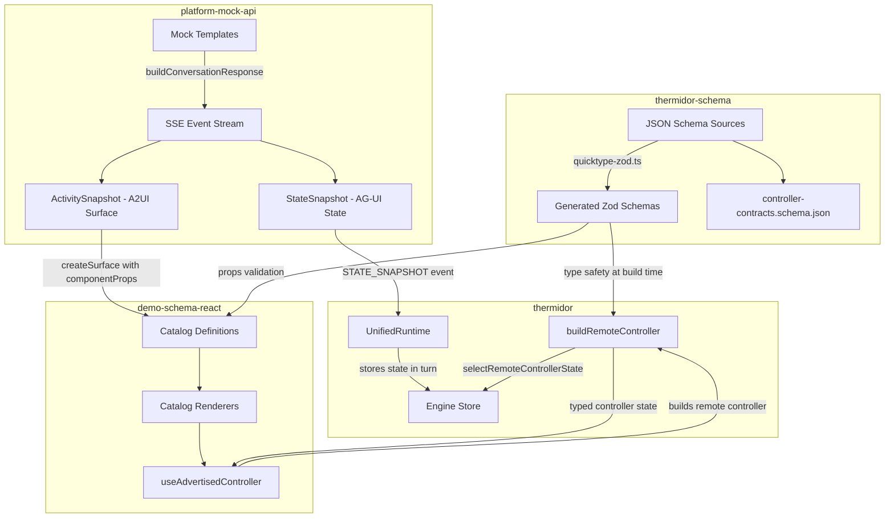

# Design Document: A2-UI Contract-Driven Mock

## Overview

This feature extends the contract-driven A2-UI architecture established by the existing ProductCarousel and Cart components to three new conversational scenarios: **NextActionsBar**, **BundleDisplay**, and **ComparisonTable**. The work spans three packages within the ui-kit monorepo:

1. **`@coveo/thermidor-schema`** — New JSON Schema definitions for controllers, components, and supporting types, with Zod code generation producing typed contracts.
2. **`@coveo/platform-mock-api`** — Rewritten mock templates emitting well-formed AG-UI `StateSnapshot` events alongside A2-UI surface advertisements in v1.0 format.
3. **`demo-schema-react` sample** — New catalog renderer registrations consuming the advertised controllers via the existing `useAdvertisedController` hook.

The end result is that all three scenarios render end-to-end in local development using the same typed, contract-driven flow as the existing components.

## Architecture



### Data Flow (per scenario)

1. Mock template emits `ACTIVITY_SNAPSHOT` with `activityType: 'a2ui-surface'` containing a `createSurface` message in v1.0 format. The component entry declares `controllerId` and `controllerSchema` in `componentProps.controllers`.
2. Mock template emits a `STATE_SNAPSHOT` event with `snapshot.controllers[controllerId]` containing state conforming to the controller schema.
3. The A2-UI renderer matches the component name to a registered catalog renderer.
4. The catalog renderer calls `useAdvertisedController` with the advertised props, which internally calls `buildRemoteController` selecting state from the AG-UI snapshot.
5. The renderer displays UI driven by the typed controller state.

### Key Design Decisions

| Decision | Rationale |
|----------|-----------|
| BundleDisplay and ComparisonTable are read-only; NextActionsBar has a `selectAction` | BundleDisplay and ComparisonTable are display-only. NextActionsBar has user interaction (clicking a suggestion) which per ADR-001 must be dispatched as a typed Action to the backend. |
| Definition schemas extracted to `schema/definitions/` | Keeps controller schemas focused on the contract; definitions are reusable across components. |
| Mock templates use v1.0 `messages` format (not `operations`) | Thermidor's `extractA2uiOperations` expects `content.messages[{version, createSurface}]`; this matches the working response4 pattern. |
| Rewrite existing templates (response1, response5, response8) rather than creating new ones | Preserves the existing prompt-to-template mapping unchanged. The old template content used legacy v0.9 format or placeholder structures. |
| BundleDisplay slots reference product-list surfaces | Enables composition: the BundleDisplay controller describes tier structure while separate ProductCarousel surfaces render the actual products per slot. |

## Components and Interfaces

### New Controller Schemas

#### NextActionsControllerContract

```json
{
  "$id": "https://schema.thermidor.coveo.com/controllers/next-actions.schema.json",
  "allOf": [{"$ref": ".../base/controller.schema.json"}],
  "properties": {
    "controllerSchema": {"const": "https://schema.thermidor.coveo.com/controllers/next-actions.schema.json"},
    "state": {"$ref": "#/$defs/NextActionsState"},
    "actions": {
      "type": "object",
      "required": ["selectAction"],
      "properties": {
        "selectAction": {"$ref": "#/$defs/SelectActionAction"}
      },
      "additionalProperties": false
    }
  }
}
```

- **State**: `{ actions: ActionItem[] }` where `ActionItem = { text: string, type: "followup" | "search" }`
- **Actions**: `{ selectAction: { payload: { text: string, type: "followup" | "search" } } }` — dispatched when the user clicks an action button

#### BundleDisplayControllerContract

```json
{
  "$id": "https://schema.thermidor.coveo.com/controllers/bundle-display.schema.json",
  "allOf": [{"$ref": ".../base/controller.schema.json"}],
  "properties": {
    "controllerSchema": {"const": "https://schema.thermidor.coveo.com/controllers/bundle-display.schema.json"},
    "state": {"$ref": "#/$defs/BundleDisplayState"},
    "actions": {"type": "object", "properties": {}, "additionalProperties": false}
  }
}
```

- **State**: `{ tiers: BundleTier[] }` where `BundleTier = { label: string, description: string, slots: BundleSlot[] }` and `BundleSlot = { categoryLabel: string, surfaceRef: string }`
- **Actions**: None (read-only)

#### ComparisonTableControllerContract

```json
{
  "$id": "https://schema.thermidor.coveo.com/controllers/comparison-table.schema.json",
  "allOf": [{"$ref": ".../base/controller.schema.json"}],
  "properties": {
    "controllerSchema": {"const": "https://schema.thermidor.coveo.com/controllers/comparison-table.schema.json"},
    "state": {"$ref": "#/$defs/ComparisonTableState"},
    "actions": {"type": "object", "properties": {}, "additionalProperties": false}
  }
}
```

- **State**: `{ products: ComparisonProduct[], attributes: ComparisonAttribute[] }`
- **ComparisonProduct**: `{ productId: string, name: string, values: Record<string, string>, imageUrl?: string, price?: number, rating?: number }`
- **ComparisonAttribute**: `{ key: string, label: string }`
- **Actions**: None (read-only)

### New Component Schemas

Each follows the `product-carousel.schema.json` pattern — extends `base/component.schema.json` and declares a `controllers` object with one required controller field.

| Component | File | Required Controller Field |
|-----------|------|--------------------------|
| NextActionsBar | `components/next-actions-bar.schema.json` | `nextActionsController` |
| BundleDisplay | `components/bundle-display.schema.json` | `bundleDisplayController` |
| ComparisonTable | `components/comparison-table.schema.json` | `comparisonTableController` |

### New Definition Schemas

| Definition | File | Purpose |
|-----------|------|---------|
| ActionItem | `definitions/action-item.schema.json` | Items in NextActionsBar state |
| BundleTier | `definitions/bundle-tier.schema.json` | Tier objects in BundleDisplay state |
| ComparisonProduct | `definitions/comparison-product.schema.json` | Product entries in ComparisonTable |
| ComparisonAttribute | `definitions/comparison-attribute.schema.json` | Attribute descriptors in ComparisonTable |

### Mock Template Interfaces

Each rewritten template follows the `response4` reference pattern:

```typescript
// Template structure
import {buildConversationResponse} from './shared.js';
import {ActivitySnapshot, StateSnapshot, textMessage, type ConverseEvent} from '../events.js';

const middleEvents: ConverseEvent[] = [
  // 1. Optional text message (TEXT_MESSAGE_START/CONTENT/END)
  // 2. ActivitySnapshot — A2-UI surface with createSurface in v1.0 format
  // 3. StateSnapshot — AG-UI state with controllers map
];

export const responseXEvents = buildConversationResponse({
  runId: '...',
  middleEvents,
  includeInitialStateSnapshot: false,
  includeFinalStateSnapshot: false,
});
```

### Catalog Renderer Interface

New renderers follow the existing `ProductCarousel` and `Cart` pattern:

```typescript
// Props schema (Zod)
const nextActionsBarPropsSchema = z.strictObject({
  controllers: z.strictObject({
    nextActionsController: z.strictObject({
      controllerId: z.string(),
      controllerSchema: z.literal(NEXT_ACTIONS_SCHEMA_ID),
    }),
  }),
});

// Renderer component
const NextActionsBar = ({props}: {props: NextActionsBarProps}) => {
  const controller = useAdvertisedController(stateSource, props.controllers.nextActionsController);
  const actions = controller.state?.actions ?? [];
  return (/* render actions */);
};
```

## Data Models

### ActionItem (NextActionsBar)

```json
{
  "$id": "https://schema.thermidor.coveo.com/definitions/action-item.schema.json",
  "title": "ActionItem",
  "type": "object",
  "required": ["text", "type"],
  "properties": {
    "text": { "type": "string", "description": "Display text for the action button." },
    "type": { "type": "string", "enum": ["followup", "search"], "description": "Action kind: followup triggers a follow-up prompt, search triggers a product search." }
  },
  "additionalProperties": false
}
```

### BundleTier (BundleDisplay)

```json
{
  "$id": "https://schema.thermidor.coveo.com/definitions/bundle-tier.schema.json",
  "title": "BundleTier",
  "type": "object",
  "required": ["label", "description", "slots"],
  "properties": {
    "label": { "type": "string", "description": "Display label for the tier (e.g. 'Budget')." },
    "description": { "type": "string", "description": "Brief description of what the tier includes." },
    "slots": {
      "type": "array",
      "description": "Product category slots within this tier.",
      "items": { "$ref": "#/$defs/BundleSlot" }
    }
  },
  "additionalProperties": false,
  "$defs": {
    "BundleSlot": {
      "title": "BundleSlot",
      "type": "object",
      "required": ["categoryLabel", "surfaceRef"],
      "properties": {
        "categoryLabel": { "type": "string", "description": "Display name of the product category for this slot." },
        "surfaceRef": { "type": "string", "description": "Surface ID where this slot's products are rendered via a ProductCarousel." }
      },
      "additionalProperties": false
    }
  }
}
```

### ComparisonProduct (ComparisonTable)

```json
{
  "$id": "https://schema.thermidor.coveo.com/definitions/comparison-product.schema.json",
  "title": "ComparisonProduct",
  "type": "object",
  "required": ["productId", "name", "values"],
  "properties": {
    "productId": { "type": "string", "description": "Unique product identifier." },
    "name": { "type": "string", "description": "Display name of the product." },
    "values": {
      "type": "object",
      "description": "Attribute values keyed by attribute key.",
      "additionalProperties": { "type": "string" }
    },
    "imageUrl": { "type": "string", "format": "uri", "description": "Product image URL." },
    "price": { "type": "number", "description": "Product price." },
    "rating": { "type": "number", "minimum": 0, "maximum": 5, "description": "Product rating on a 0-5 scale." }
  },
  "additionalProperties": false
}
```

### ComparisonAttribute (ComparisonTable)

```json
{
  "$id": "https://schema.thermidor.coveo.com/definitions/comparison-attribute.schema.json",
  "title": "ComparisonAttribute",
  "type": "object",
  "required": ["key", "label"],
  "properties": {
    "key": { "type": "string", "description": "Machine-readable attribute key, matching keys in ComparisonProduct.values." },
    "label": { "type": "string", "description": "Human-readable display label for this attribute column." }
  },
  "additionalProperties": false
}
```

### Generated Type Exports

After `pnpm run generate`, the package entry point (`src/index.ts`) will export:

**Schemas:**
- `NextActionsControllerContractSchema`
- `BundleDisplayControllerContractSchema`
- `ComparisonTableControllerContractSchema`
- `ActionItemSchema`
- `BundleTierSchema`
- `ComparisonProductSchema`
- `ComparisonAttributeSchema`

**Types:**
- `NextActionsState`
- `BundleDisplayState`
- `ComparisonTableState`
- `ActionItem`
- `BundleTier`
- `ComparisonProduct`
- `ComparisonAttribute`

The existing `ControllerContractsSchema` discriminated union will expand from 2 to 5 variants.

## Correctness Properties

*A property is a characteristic or behavior that should hold true across all valid executions of a system — essentially, a formal statement about what the system should do. Properties serve as the bridge between human-readable specifications and machine-verifiable correctness guarantees.*

### Property 1: Controller state round-trip (serialization)

*For any* valid state object conforming to one of the three new controller state schemas (NextActionsState, BundleDisplayState, ComparisonTableState), serializing it to JSON via `JSON.stringify` and parsing the result back through the corresponding Zod schema SHALL produce a deeply-equal object.

**Validates: Requirements 1.2, 1.3, 2.2, 2.3, 2.4, 3.2, 3.3, 3.4, 8.5**

### Property 2: Controller contract discriminated union accepts all variants

*For any* valid controller contract object (across all 5 schemas: product-list, cart, next-actions, bundle-display, comparison-table), parsing it through `ControllerContractsSchema` SHALL succeed and produce an object whose `controllerSchema` field matches the input's discriminator.

**Validates: Requirements 1.6, 2.7, 3.7, 8.4**

### Property 3: Invalid controller schema discriminator rejects parse

*For any* object with a `controllerSchema` string value that does not match any of the 5 registered schema IDs, parsing through `ControllerContractsSchema` SHALL fail.

**Validates: Requirements 8.4**

## Error Handling

### Schema Validation Errors

- **Invalid state in StateSnapshot**: `buildRemoteController` uses `safeParse` on controller state. If the mock state does not conform to the schema, `controller.state` returns `undefined` and the renderer gracefully displays an empty/fallback state.
- **Unknown controllerSchema**: `findControllerContract` throws a descriptive error if a `controllerSchema` value is not in the discriminated union. This is a developer error caught at build/test time.

### Mock Template Errors

- **Missing controllerId alignment**: If the `controllerId` in the surface advertisement doesn't match any key in the `StateSnapshot.controllers` map, the `selectRemoteControllerState` function returns an empty object, and the renderer shows fallback UI.
- **Format mismatch**: Using the wrong surface format (e.g., `operations` instead of `messages`) would cause `extractA2uiOperations` to not find the surface. Testing verifies the templates produce well-formed events.

### Catalog Renderer Errors

- **Unregistered component**: If a surface advertises a component name not in the catalog, the A2-UI renderer silently skips it. No crash occurs.
- **Controller state loading**: Renderers default to empty arrays (`??  []`) when controller state is `undefined`, avoiding render errors during the brief window between surface creation and state arrival.

## Testing Strategy

### Unit Tests (Vitest)

1. **Schema validation tests** — Verify each new controller schema accepts valid state and rejects malformed state.
2. **Controller contracts union test** — Verify the discriminated union accepts all 5 controller variants and rejects unknown discriminators.
3. **Mock template structure tests** — Verify each rewritten template produces:
   - At least one `ACTIVITY_SNAPSHOT` event with `activityType: 'a2ui-surface'`
   - At least one `STATE_SNAPSHOT` event
   - Matching `controllerId` between surface advertisement and state snapshot
   - State that parses against the corresponding controller schema
4. **Catalog definition tests** — Verify props schemas accept valid controller advertisements.

### Property-Based Tests (Vitest + fast-check)

Property-based testing is appropriate here because:
- The schemas define pure validation functions over structured input
- Universal properties (round-trip, structural validity) hold across all valid inputs
- The input space (arbitrary valid state objects) is large and benefits from randomized exploration

**Library**: [fast-check](https://github.com/dubzzz/fast-check) (already available in the monorepo testing infrastructure)

**Configuration**:
- Minimum 100 iterations per property test
- Each test tagged with: `Feature: a2ui-contract-driven-mock, Property {number}: {property_text}`

**Properties to implement**:
- Property 1: Round-trip serialization for each of the 3 new state schemas
- Property 2: Discriminated union acceptance for all 5 controller contracts
- Property 3: Rejection of invalid discriminators from the union

### Integration Tests

- **End-to-end rendering test** (manual): Run `demo-schema-react` sample, trigger each prompt, verify the component renders with correct data.
- **Mock server response validation**: Automated test hitting the mock converse endpoint with each prompt and verifying the SSE stream structure.
