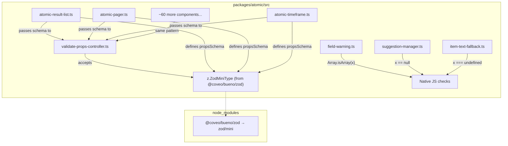

# Design Document: atomic-bueno-zod-migration

## Overview

This design covers the migration of `packages/atomic/` from the class-based `@coveo/bueno` validation API to Zod 4 mini schemas imported through `@coveo/bueno/zod`. The migration follows the patterns established in the headless migration but adapted for Lit component prop validation via the `ValidatePropsController` reactive controller.

The key design decisions are:

1. **ValidatePropsController rewrite** — The central reactive controller switches from `Schema.validate()` to Zod `safeParse()`, accepting a `z.ZodMiniType` instead of a Bueno `Schema<T>`. The controller's lifecycle behavior (skip on unchanged props, external error detection, `throwOnError` mode) is preserved.
2. **Direct Zod schemas on components** — Each component's static `propsSchema` becomes a `z.object({...})` definition. No adapter layer, no compatibility shims.
3. **Inline type guards** — `isNullOrUndefined`, `isArray`, `isString`, `isUndefined` are replaced with native JS checks (`x == null`, `Array.isArray(x)`, `typeof x === 'string'`, `x === undefined`).
4. **Behavioral equivalence** — The new Zod schemas must produce the same accept/reject behavior as the original Bueno schemas for all prop values consumers pass.

The migration affects ~60+ component files across search, commerce, insight, recommendations, ipx, and common directories, plus 3 utility files using type guards and 3 test files.

## Architecture



The architecture stays flat. The `ValidatePropsController` remains the single validation hub for all components. Components import `z` from `@coveo/bueno/zod` directly and define their schemas inline as static properties.

## Components and Interfaces

### 1. Rewritten `ValidatePropsController`

The controller is rewritten to accept a Zod schema instead of a Bueno `Schema`. The lifecycle behavior is preserved exactly.

**Before:**

```typescript
import type {Schema} from '@coveo/bueno';
import type {ReactiveController, ReactiveControllerHost} from 'lit';
import {deepEqual} from '@/src/utils/compare-utils';

export class ValidatePropsController<TProps extends Record<string, unknown>>
  implements ReactiveController {
  constructor(
    private host: ReactiveControllerHost & HTMLElement & {error: Error},
    private getProps: () => TProps,
    private schema: Schema<TProps>,
    private throwOnError: boolean = true
  ) { ... }

  private validateProps() {
    try {
      this.schema.validate(this.currentProps);
    } catch (error) { ... }
  }
}
```

**After:**

```typescript
import * as z from '@coveo/bueno/zod';
import type {ReactiveController, ReactiveControllerHost} from 'lit';
import {deepEqual} from '@/src/utils/compare-utils';

// eslint-disable-next-line @typescript-eslint/no-explicit-any
type AnyZodSchema = z.ZodMiniType<any>;

export class ValidatePropsController<
  TProps extends Record<string, unknown>,
> implements ReactiveController {
  private currentProps?: TProps;
  private previousProps?: TProps;
  private lastValidationError?: Error;

  constructor(
    private host: ReactiveControllerHost & HTMLElement & {error: Error},
    private getProps: () => TProps,
    private schema: AnyZodSchema,
    private throwOnError: boolean = true
  ) {
    host.addController(this);
  }

  hostConnected() {
    if (this.host.error === null) {
      // @ts-expect-error: we need to set the error to undefined if it was null.
      this.host.error = undefined;
    }
  }

  hostUpdate() {
    if (this.host.error && this.host.error !== this.lastValidationError) {
      return;
    }
    this.currentProps = this.getProps();

    if (deepEqual(this.currentProps, this.previousProps)) {
      return;
    }

    // @ts-expect-error: we need to clear the error.
    this.host.error = undefined;
    this.validateProps();
  }

  private validateProps() {
    const result = this.schema.safeParse(this.currentProps);
    if (!result.success) {
      const message = result.error.issues
        .map((issue) => {
          const path = issue.path.length > 0 ? issue.path.join('.') : '';
          return path ? `${path}: ${issue.message}` : issue.message;
        })
        .join('; ');

      if (this.throwOnError) {
        const error = new Error(message);
        this.host.error = error;
        this.lastValidationError = error;
      } else {
        const warnMsg = `Prop validation failed for component ${this.host.tagName?.toLowerCase()}: ${message}`;
        console.warn(warnMsg, this.host);
      }
    }
    this.previousProps = this.currentProps;
  }
}
```

**Design rationale:**

- Uses `safeParse` instead of `parse` + try/catch. This avoids exception overhead in the common case (props are usually valid).
- Error messages include the property path and specific violation from Zod's issue list, making debugging straightforward.
- The `AnyZodSchema` type alias (`z.ZodMiniType<any>`) avoids complex generic constraints while remaining type-safe at call sites.
- All existing lifecycle hooks (`hostConnected`, `hostUpdate`) and behavior (deep equality skip, external error detection, `throwOnError` toggle) are preserved identically.

### 2. Component Schema Migration Pattern

**Before (e.g., `atomic-result-list`):**

```typescript
import {ArrayValue, Schema, StringValue} from '@coveo/bueno';

private static readonly propsSchema = new Schema({
  density: new StringValue({constrainTo: ['normal', 'comfortable', 'compact']}),
  display: new StringValue({constrainTo: ['grid', 'list', 'table']}),
  imageSize: new StringValue({constrainTo: ['small', 'large', 'icon', 'none']}),
  tabsIncluded: new ArrayValue({each: new StringValue({}), required: false}),
  tabsExcluded: new ArrayValue({each: new StringValue({}), required: false}),
});
```

**After:**

```typescript
import * as z from '@coveo/bueno/zod';

private static readonly propsSchema = z.object({
  density: z.optional(z.enum(['normal', 'comfortable', 'compact'])),
  display: z.optional(z.enum(['grid', 'list', 'table'])),
  imageSize: z.optional(z.enum(['small', 'large', 'icon', 'none'])),
  tabsIncluded: z.optional(z.array(z.string())),
  tabsExcluded: z.optional(z.array(z.string())),
});
```

**Before (e.g., `atomic-timeframe` — mixed required/optional with constraints):**

```typescript
import {NumberValue, Schema, StringValue} from '@coveo/bueno';

private static readonly propsSchema = new Schema({
  period: new StringValue({constrainTo: ['past', 'next'], required: false}),
  unit: new StringValue({
    constrainTo: ['minute', 'hour', 'day', 'week', 'month', 'quarter', 'year'],
    required: true,
    emptyAllowed: false,
  }),
  amount: new NumberValue({min: 1, required: false}),
});
```

**After:**

```typescript
import * as z from '@coveo/bueno/zod';

private static readonly propsSchema = z.object({
  period: z.optional(z.enum(['past', 'next'])),
  unit: z.enum(['minute', 'hour', 'day', 'week', 'month', 'quarter', 'year']),
  amount: z.optional(z.number().check(z.minimum(1))),
});
```

**Before (e.g., `atomic-rating-facet` — RecordValue + required fields):**

```typescript
import {NumberValue, RecordValue, Schema, StringValue} from '@coveo/bueno';

private static readonly propsSchema = new Schema({
  field: new StringValue({required: true, emptyAllowed: false}),
  numberOfIntervals: new NumberValue({min: 1}),
  maxValueInIndex: new NumberValue({min: 0, required: false}),
  minValueInIndex: new NumberValue({min: 0}),
  displayValuesAs: new StringValue({constrainTo: ['checkbox', 'link']}),
  injectionDepth: new NumberValue({min: 0, required: false}),
  dependsOn: new RecordValue({options: {required: false}}),
  headingLevel: new NumberValue({min: 0, max: 6, required: false}),
});
```

**After:**

```typescript
import * as z from '@coveo/bueno/zod';

private static readonly propsSchema = z.object({
  field: z.string().check(z.minLength(1)),
  numberOfIntervals: z.optional(z.number().check(z.minimum(1))),
  maxValueInIndex: z.optional(z.number().check(z.minimum(0))),
  minValueInIndex: z.optional(z.number().check(z.minimum(0))),
  displayValuesAs: z.optional(z.enum(['checkbox', 'link'])),
  injectionDepth: z.optional(z.number().check(z.minimum(0))),
  dependsOn: z.optional(z.record(z.string())),
  headingLevel: z.optional(z.number().check(z.minimum(0), z.maximum(6))),
});
```

### 3. Bueno → Zod Mapping Reference (Atomic Context)

| Bueno                                                          | Zod Mini Equivalent                                        |
| -------------------------------------------------------------- | ---------------------------------------------------------- |
| `new StringValue()`                                            | `z.optional(z.string())`                                   |
| `new StringValue({required: true, emptyAllowed: false})`       | `z.string().check(z.minLength(1))`                         |
| `new StringValue({constrainTo: values})`                       | `z.optional(z.enum(values))`                               |
| `new StringValue({required: true, constrainTo: values})`       | `z.enum(values)`                                           |
| `new NumberValue({min: N})`                                    | `z.optional(z.number().check(z.minimum(N)))`               |
| `new NumberValue({min: N, max: M})`                            | `z.optional(z.number().check(z.minimum(N), z.maximum(M)))` |
| `new NumberValue({min: N, required: false})`                   | `z.optional(z.number().check(z.minimum(N)))`               |
| `new BooleanValue()`                                           | `z.optional(z.boolean())`                                  |
| `new ArrayValue({each: new StringValue({})})`                  | `z.optional(z.array(z.string()))`                          |
| `new ArrayValue({each: new StringValue({}), required: false})` | `z.optional(z.array(z.string()))`                          |
| `new RecordValue({options: {required: false}})`                | `z.optional(z.record(z.string()))`                         |
| `new Schema(definition)`                                       | `z.object({...})`                                          |

### 4. Type Guard Replacement

All type guard imports from `@coveo/bueno` are replaced with native JavaScript equivalents:

**`field-warning.ts`:**

```typescript
// Before
import {isArray} from '@coveo/bueno';
if (isArray(itemValueRaw)) { ... }

// After — no import needed
if (Array.isArray(itemValueRaw)) { ... }
```

**`suggestion-manager.ts`:**

```typescript
// Before
import {isNullOrUndefined} from '@coveo/bueno';
if (isNullOrUndefined(this.panelInFocus) || isNullOrUndefined(this.rightPanel)) { ... }
if (isNullOrUndefined(suggestionElement.query)) { ... }

// After — no import needed
if (this.panelInFocus == null || this.rightPanel == null) { ... }
if (suggestionElement.query == null) { ... }
```

**`item-text-fallback.ts`:**

```typescript
// Before
import {isUndefined} from '@coveo/bueno';
if (isUndefined(defaultValue)) { ... }

// After — no import needed
if (defaultValue === undefined) { ... }
```

**`atomic-result-link.ts`:**

```typescript
// Before
import {isUndefined} from '@coveo/bueno';

// After — no import needed, use `=== undefined` inline
```

### 5. Test File Migration

**`validate-props-controller.spec.ts`:**

The test creates Zod schemas as fixtures and spies on `safeParse` instead of `validate`:

```typescript
// Before
import {Schema, StringValue} from '@coveo/bueno';
let mockSchema: Schema<{name: string}>;
mockSchema = new Schema({
  name: new StringValue({constrainTo: ['valid', 'also-valid']}),
});
schemaSpy = vi.spyOn(mockSchema, 'validate');

// After
import * as z from '@coveo/bueno/zod';
const mockSchema = z.object({
  name: z.optional(z.enum(['valid', 'also-valid'])),
});
schemaSpy = vi.spyOn(mockSchema, 'safeParse');
```

All assertions checking `schemaSpy` calls remain valid — only the method name changes from `validate` to `safeParse`.

**`field-warning.spec.ts`:**

Remove `vi.mock('@coveo/bueno', {spy: true})` and assertions on `isArray` being called. Test the actual behavior directly:

```typescript
// Before
vi.mock('@coveo/bueno', {spy: true});
vi.mocked(isArray).mockReturnValue(true);
expect(isArray).toHaveBeenCalledWith(itemValueRaw);

// After — test behavior directly, no mock needed
it('should log an error when item value is an array', () => {
  possiblyWarnOnBadFieldType(
    'multiValueField',
    ['value1', 'value2'],
    mockHost,
    mockLogger
  );
  expect(mockLogger.error).toHaveBeenCalledWith(
    expect.stringContaining('cannot be used with multi value field'),
    mockHost
  );
});
```

**`item-text-fallback.spec.ts`:**

Remove `vi.mock('@coveo/bueno', {spy: true})` and `vi.mocked(isUndefined)` usage. Test behavior by passing `undefined` directly:

```typescript
// Before
mockIsUndefined.mockReturnValue(true);

// After — set props.defaultValue = undefined and test behavior directly
```

## Data Models

No new data models are introduced. All existing TypeScript interfaces for component properties remain unchanged. The migration only changes the runtime validation implementation — the type system sees the same shapes.

Key preserved patterns:

- Component `@property()` declarations remain identical
- The `error` state property on each component host remains typed as `Error`
- The `ValidatePropsController` constructor signature changes its third parameter type but not its overall call pattern

## Correctness Properties

_A property is a characteristic or behavior that should hold true across all valid executions of a system — essentially, a formal statement about what the system should do. Properties serve as the bridge between human-readable specifications and machine-verifiable correctness guarantees._

### Property 1: Schema Mapping Equivalence

_For any_ Bueno schema definition (using StringValue with constrainTo, NumberValue with min/max, BooleanValue, ArrayValue, or RecordValue) and _for any_ input value, the translated Zod schema SHALL produce the same accept/reject verdict as the original Bueno schema.

**Validates: Requirements 3.1, 3.2, 3.3, 3.4, 3.5, 3.6, 3.7, 3.8**

### Property 2: ValidatePropsController safeParse Contract

_For any_ Zod schema and _for any_ props object, when props change (not deep-equal to previous), the `ValidatePropsController` SHALL call `safeParse` and: set `host.error` to an Error when validation fails and `throwOnError` is true, log a warning when validation fails and `throwOnError` is false, or leave `host.error` as `undefined` when validation succeeds.

**Validates: Requirements 2.2, 2.3, 2.4, 2.5, 5.1, 5.2, 5.3, 5.5**

### Property 3: Error Message Content

_For any_ invalid prop value that violates a schema constraint, the error message produced by the `ValidatePropsController` SHALL contain the property path (field name) that failed validation, enabling developers to identify the failing prop without source inspection.

**Validates: Requirements 5.2, 5.4**

### Property 4: Validation Skip on Unchanged Props

_For any_ sequence of `hostUpdate` calls where the props returned by `getProps()` are deep-equal to the previous props, the `ValidatePropsController` SHALL NOT invoke `safeParse` on the schema, preserving the existing optimization.

**Validates: Requirements 2.8**

### Property 5: External Error Preservation

_For any_ component host where `error` has been set by an external source (not by the controller itself), the `ValidatePropsController` SHALL skip validation and preserve the existing error, regardless of prop changes.

**Validates: Requirements 2.6**

## Error Handling

| Scenario                                          | Handling                                                                                                                                                                                     |
| ------------------------------------------------- | -------------------------------------------------------------------------------------------------------------------------------------------------------------------------------------------- |
| Invalid prop value, `throwOnError=true` (default) | `ValidatePropsController` sets `host.error` to an `Error` with a message listing the invalid field(s) and constraint violation(s). The component renders an error state via `@errorGuard()`. |
| Invalid prop value, `throwOnError=false`          | `ValidatePropsController` logs via `console.warn` with the component tag name and violation details. No `host.error` is set. The component renders normally.                                 |
| Props change from invalid to valid                | `ValidatePropsController` clears `host.error` to `undefined`, restoring normal rendering.                                                                                                    |
| External error already set on host                | `ValidatePropsController` skips validation entirely, preserving the external error.                                                                                                          |
| `@coveo/bueno/zod` import resolution failure      | Build fails at compile time (`tsc`). No runtime handling needed.                                                                                                                             |

## Testing Strategy

### Property-Based Tests (Vitest + fast-check)

Property-based testing is applicable to this migration because the core requirement is **behavioral equivalence** — for all possible prop values, new Zod schemas must accept/reject identically to the original Bueno schemas. This is a classic property that benefits from randomized input generation.

**Library**: `fast-check` (generates arbitrary strings, numbers, arrays, objects)

**Configuration**: Minimum 100 iterations per property test.

**Tag format**: `Feature: atomic-bueno-zod-migration, Property {number}: {property_text}`

| Property Test                                                                                                                     | Validates  |
| --------------------------------------------------------------------------------------------------------------------------------- | ---------- |
| Schema mapping equivalence for `StringValue({constrainTo: [...]})` vs `z.enum([...])` across arbitrary string inputs              | Property 1 |
| Schema mapping equivalence for `NumberValue({min, max})` vs `z.number().check(z.minimum(), z.maximum())` across arbitrary numbers | Property 1 |
| Schema mapping equivalence for `ArrayValue({each: StringValue})` vs `z.array(z.string())` across arbitrary arrays                 | Property 1 |
| ValidatePropsController sets/clears error correctly for arbitrary valid/invalid prop combinations                                 | Property 2 |
| Error messages contain the property path for arbitrary failing field names                                                        | Property 3 |

### Unit Tests (Vitest)

Unit tests cover specific examples, integration points, and edge cases:

- `ValidatePropsController` registers as a Lit controller
- `ValidatePropsController` normalizes `null` error to `undefined` on connect
- `ValidatePropsController` skips validation when props unchanged (deep equality)
- `ValidatePropsController` preserves external errors
- `ValidatePropsController` warning mode logs but doesn't set error
- `BooleanValue()` → `z.optional(z.boolean())` accepts `true`/`false`/`undefined`, rejects strings
- `RecordValue({options: {required: false}})` → `z.optional(z.record(z.string()))` accepts object/undefined
- Type guard replacements: `Array.isArray` handles cross-frame arrays, `== null` covers both null and undefined

### Smoke Tests

- Zero `import ... from '@coveo/bueno'` statements in `packages/atomic/src/**/*.ts` (source + test)
- All schema-using component files import `z` from `@coveo/bueno/zod`
- No remaining `isNullOrUndefined`, `isArray`, `isString`, `isUndefined` imports from bueno
- TypeScript compilation succeeds (`tsc --noEmit`)
- Full test suite passes (`pnpm run test` in atomic package)
- Build succeeds (`pnpm run build` in atomic package)
- Lint passes (`pnpm run lint:check` in atomic package)

### Integration Tests

- Existing Playwright e2e tests verify components render correctly with valid props
- Components with invalid props display error states (covered by existing e2e tests)
- No new integration tests are needed — behavioral equivalence ensures existing tests pass
