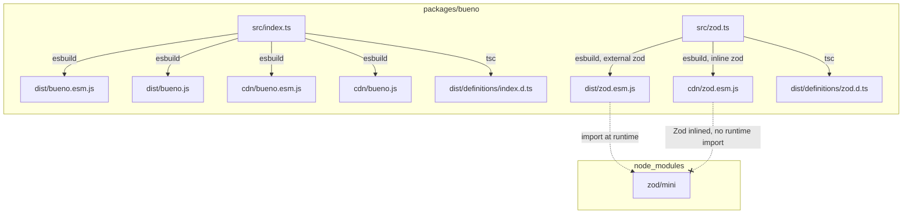

# Design Document: bueno-zod-entrypoint

## Overview

This design adds a `@coveo/bueno/zod` export path to the existing Bueno package. The new entrypoint is a thin facade that re-exports the entire public API of `zod/mini` (Zod 4's tree-shakeable variant). It ships two ESM bundles:

- **Node bundle** (`dist/zod.esm.js`) — marks `zod` as external, producing a lightweight file that simply re-exports from the installed `zod/mini` module. Consumers using a bundler (Headless, build-time Atomic) resolve Zod through normal `node_modules` resolution.
- **Browser/CDN bundle** (`cdn/zod.esm.js`) — bundles Zod **inline** so that browser consumers (e.g., Atomic loaded from a CDN `<script type="module">`) get a self-contained file with no external import to resolve. This bundle is deployed exclusively to the Coveo CDN and is **not** included in the npm package.

The key design decisions are:

1. **Pure re-export facade** — The source file is a single `export * from "zod/mini"` statement. No wrapping, no adaptation layer. This keeps the surface area minimal and guarantees type-level compatibility with `zod/mini`.
2. **ESM-only output** — Unlike the root entrypoint which ships both CJS and ESM, the Zod entrypoint is ESM-only because tree-shaking (its primary value prop) only works with ESM.
3. **Dual bundle strategy** — The node bundle keeps Zod external (deduplication via bundler); the browser bundle inline Zod (self-contained for CDN delivery). The browser bundle is deployed exclusively to the Coveo CDN and is not packaged in npm. This mirrors the existing `bueno.esm.js` / `cdn/bueno.esm.js` split.
4. **Additive build step** — The new bundles are produced by two additional esbuild calls alongside the existing four. The existing calls are untouched, guaranteeing byte-for-byte identical output for existing bundles.

## Architecture



The build graph shows how the two entrypoints are fully independent. `src/zod.ts` has no imports from `src/index.ts` or any Bueno source file. The node bundle (`dist/zod.esm.js`) keeps Zod external while the browser bundle (`cdn/zod.esm.js`) inline it for self-contained CDN delivery.

## Components and Interfaces

### 1. Source File: `src/zod.ts`

```typescript
export * from "zod/mini";
```

A single barrel re-export. This ensures:
- All public APIs from `zod/mini` are available at `@coveo/bueno/zod`
- TypeScript generates a `.d.ts` that re-exports all types
- No custom code to maintain or drift from upstream

### 2. Build Configuration: `esbuild.mjs` (modified)

Two new build functions are added alongside the existing ones:

#### `nodeZodEsm()` — Node bundle (Zod external)

```typescript
function nodeZodEsm() {
  return build({
    entryPoints: ['src/zod.ts'],
    bundle: true,
    banner: {js: apacheLicense()},
    platform: 'node',
    external: ['zod', 'zod/*'],
    outfile: 'dist/zod.esm.js',
    format: 'esm',
  });
}
```

Key points:
- `external: ['zod', 'zod/*']` prevents esbuild from bundling any `zod` import. The output contains `import ... from "zod/mini"` verbatim.
- `platform: 'node'` aligns with how the existing node-targeted ESM build works.

#### `browserZodEsm()` — Browser/CDN bundle (Zod inlined)

```typescript
function browserZodEsm() {
  return build({
    entryPoints: ['src/zod.ts'],
    bundle: true,
    banner: {js: apacheLicense()},
    platform: 'browser',
    // No `external` — Zod is bundled inline
    outfile: 'cdn/zod.esm.js',
    format: 'esm',
  });
}
```

Key points:
- **No `external` declaration** — esbuild resolves and inline all `zod/mini` code into the output bundle. This produces a self-contained file that browser/CDN consumers can load without a bundler.
- `platform: 'browser'` ensures browser-appropriate defaults (no Node.js built-in polyfills, `globalThis` assumptions).
- Output goes to `cdn/` to match the existing CDN bundle pattern (`cdn/bueno.esm.js`).

Both functions run in `Promise.all` alongside the existing four builds. Existing build functions are **not modified**.

### 3. Package.json `exports` Field (modified)

```json
{
  "exports": {
    ".": {
      "types": "./dist/definitions/index.d.ts",
      "import": "./dist/bueno.esm.js",
      "require": "./dist/bueno.js",
      "default": "./dist/bueno.esm.js"
    },
    "./zod": {
      "types": "./dist/definitions/zod.d.ts",
      "import": "./dist/zod.esm.js",
      "default": "./dist/zod.esm.js"
    }
  }
}
```

The `"./zod"` entry:
- Lists `types` first for correct TypeScript resolution under `node16`/`nodenext`/`bundler` moduleResolution.
- Lists `import` second for ESM consumers.
- Lists `default` last as a fallback (same file as `import` since there is no CJS variant).
- Does **not** include a `require` condition because this entrypoint is ESM-only.
- Does **not** include a `browser` condition because the CDN bundle (`cdn/zod.esm.js`) is deployed exclusively to the Coveo CDN and is not part of the npm package.

### 4. Package.json `dependencies` Field (modified)

```json
{
  "dependencies": {
    "zod": "^4.0.0"
  }
}
```

Zod is a production `dependency` (not `peerDependency`) so that consumers get it transitively when installing `@coveo/bueno`. This follows the facade pattern — consumers import from `@coveo/bueno/zod`, never directly from `zod`.

### 5. Package.json `files` Field (unchanged)

The `files` field does not need modification. The CDN bundle (`cdn/zod.esm.js`) is deployed exclusively to the Coveo CDN via the existing `ui-kit-cd` pipeline and is not included in the npm package. Only `dist/` needs to be in `files`, which is already the case.

### 6. TypeScript Configuration: `tsconfig.build.json` (unchanged)

The existing `tsconfig.build.json` already includes all files under `src/` and emits declarations to `dist/definitions/`. Adding `src/zod.ts` means `tsc` will automatically produce `dist/definitions/zod.d.ts` with re-exported types from `zod/mini`.

No changes needed to the TypeScript configuration.

## Data Models

This feature does not introduce any new data models. The entrypoint is a pass-through re-export with no custom types, classes, or state.

## Error Handling

| Scenario | Handling |
|----------|----------|
| `zod` not installed | `pnpm install` will resolve it since it's in `dependencies`; if somehow missing at build time, esbuild resolves the import and errors |
| Consumer uses `require("@coveo/bueno/zod")` | Node.js throws `ERR_REQUIRE_ESM` because no `require` condition is exported. This is intentional — ESM-only entrypoint |
| TypeScript can't resolve `@coveo/bueno/zod` types | Consumer must use `moduleResolution: "node16"`, `"nodenext"`, or `"bundler"` (standard for packages with `exports`) |
| Browser bundle becomes stale vs Zod version | Both bundles are built from the same source and same `node_modules` in a single `pnpm run build` invocation, so they always ship in sync |

## Correctness Properties

### Property 1: Export Completeness

The set of named exports provided by `@coveo/bueno/zod` must be equal to the set of named exports provided by `zod/mini`. Any addition or removal in `zod/mini` must be reflected in the Bueno facade.

**Validates: Requirements 1.2, 3.2**

### Property 2: Export Isolation

The set of named exports provided by `@coveo/bueno` (the root entrypoint) must remain unchanged after adding the Zod entrypoint. No Zod symbols leak into the root entrypoint, and no Bueno symbols leak into the Zod entrypoint.

**Validates: Requirements 2.1, 4.5**

### Property 3: Bundle Independence

The node Zod entrypoint bundle (`dist/zod.esm.js`) must contain zero references to Bueno source modules and zero inlined Zod library code (Zod is external). The browser Zod entrypoint bundle (`cdn/zod.esm.js`) must contain zero references to Bueno source modules but **intentionally contains inlined Zod code** (Zod is bundled for self-contained CDN delivery). The existing Bueno bundles (`dist/bueno.js`, `dist/bueno.esm.js`, `cdn/bueno.esm.js`, `cdn/bueno.js`) must contain zero inlined Zod library code. The node and browser Zod bundles are fully tree-shakeable independently of the root entrypoint.

**Validates: Requirements 4.3, 4.5, 4.6**

### Property 4: Browser Bundle Self-Containment

The browser Zod bundle (`cdn/zod.esm.js`) must contain no unresolved external `import` statements referencing `zod` or `zod/*` paths. All Zod code is inlined so the file is loadable in a browser via `<script type="module">` without any bundler or `node_modules` resolution.

**Validates: Requirements 1.3, 4.3**

## Testing Strategy

### Why Property-Based Testing Does Not Apply

This feature is a **package configuration + build tooling + re-export facade**. It does not contain pure functions with meaningful input variation, algorithms, parsers, serializers, or business logic. The acceptance criteria are all verifiable through:
- Static assertions on JSON/file structure (SMOKE)
- Import/export comparisons (EXAMPLE)  
- Build/TypeScript compilation checks (INTEGRATION)

None of these benefit from 100+ randomized iterations. Property-based testing is not appropriate here.

### Unit Tests (Vitest)

| Test | Validates |
|------|-----------|
| `@coveo/bueno/zod` exports match `zod/mini` exports | Req 1.2, 3.2 |
| Existing `@coveo/bueno` exports remain unchanged | Req 2.1 |
| Node bundle output file `dist/zod.esm.js` uses ESM syntax | Req 1.3 |
| Node bundle output does not contain inlined Zod code | Req 4.3 |
| Browser bundle output file `cdn/zod.esm.js` uses ESM syntax | Req 1.3 |
| Browser bundle output contains inlined Zod code (no external `zod` imports) | Req 4.3 (browser) |
| Browser bundle is self-contained (no unresolved bare specifiers) | Req 1.3 |
| Neither Zod bundle references Bueno source | Req 4.5 |

### Integration Tests

| Test | Validates |
|------|-----------|
| `tsc --noEmit` succeeds with a file importing `@coveo/bueno/zod` | Req 5.1, 5.3 |
| Cross-assignment between `@coveo/bueno/zod` and `zod/mini` types compiles | Req 5.4 |
| Existing bundles are byte-identical after adding zod entrypoint | Req 4.4 |
| CJS `require("@coveo/bueno")` still works | Req 2.2 |
| ESM `import from "@coveo/bueno"` still works | Req 2.2 |
| Existing bundles don't contain zod code | Req 4.6 |
| Browser bundle loads in a simulated browser environment (no Node.js APIs) | Req 1.3 |

### Smoke Tests

| Test | Validates |
|------|-----------|
| `publint` passes with zero errors/warnings | Req 6.1 |
| `"./zod"` export conditions are in correct order (`types` → `import` → `default`) | Req 6.2 |
| `npm pack --dry-run` includes `dist/zod.esm.js` and `dist/definitions/zod.d.ts` | Req 6.3 |
| `package.json` declares `"./zod"` in exports | Req 1.1 |
| `package.json` has `zod: "^4.x"` in dependencies | Req 3.1 |
