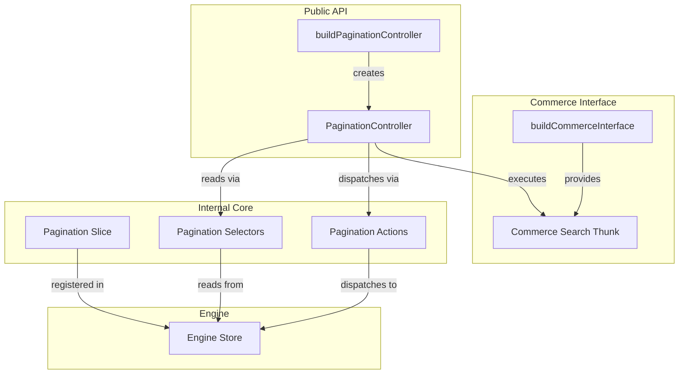

# Design Document: Commerce Pagination Controller

## Overview

This feature introduces a `PaginationController` for commerce search interfaces in `packages/thermidor`. The controller follows the established controller pattern (adopt slice → selectors → expose state + subscribe + methods) used by the existing `ProductListController`. It reads from the existing pagination slice, derives user-friendly page state, and provides a `selectPage(page)` method that updates pagination state and re-executes the commerce search thunk.

The controller is additionally integrated into the `conversation-react` sample app's `RoutedCommerceResults` component to demonstrate per-sub-interface pagination with proper state isolation.

## Architecture



The architecture leverages the existing internal pagination infrastructure. The controller is a thin public-facing layer that:

1. Adopts the pagination slice into the engine (scoped by interface state ID)
2. Composes selectors to derive `page` and `totalPages` from raw slice state
3. Exposes a `selectPage` method that validates the target page, dispatches `setFirstResult`, and triggers the search thunk

### Design Decisions

- **Single navigation method (`selectPage`) instead of `nextPage`/`previousPage`**: The requirements specify only `selectPage`. Higher-level helpers (next/previous) are trivially composed at the UI layer as `selectPage(currentPage + 1)` and `selectPage(currentPage - 1)`. This keeps the controller surface minimal and avoids duplicating guard logic.
- **Zero-indexed pages**: Consistent with the existing request selector which computes `page: Math.floor(firstResult / pageSize)`. The UI can display `page + 1` for human-readable numbering.
- **Guard clauses in `selectPage`**: Out-of-bounds, negative, and same-page calls are silently ignored (no dispatch, no thunk). This prevents unnecessary API calls and matches the pattern of defensive controllers.

## Components and Interfaces

### PaginationControllerState

```typescript
export interface PaginationControllerState {
  /** Zero-indexed current page number: Math.floor(firstResult / pageSize) */
  page: number;
  /** Number of results per page */
  pageSize: number;
  /** Total number of results available */
  totalCount: number;
  /** Total number of pages: Math.ceil(totalCount / pageSize) */
  totalPages: number;
}
```

### PaginationController

```typescript
export interface PaginationController extends Controller {
  readonly state: PaginationControllerState;
  /** Navigate to a specific zero-indexed page. No-op if page is out of bounds or same as current. */
  selectPage(page: number): void;
}
```

### PaginationControllerOptions

```typescript
export interface PaginationControllerOptions {
  interface: Interface & Requires<'search'>;
}
```

### buildPaginationController

```typescript
export function buildPaginationController(
  options: PaginationControllerOptions
): PaginationController;
```

**Implementation pattern** (mirrors `buildProductListController`):

1. Extract `engine` and `stateId` from the interface via symbols (`ENGINE`, `STATE_ID`)
2. Call `engine.adoptSlice(getOrCreatePaginationSlice(stateId))`
3. Create pagination selectors via `getOrCreatePaginationSelectors(stateId)`
4. Compose a memoized `controllerState` selector deriving `page` and `totalPages`
5. Return controller object with `state` getter, `subscribe`, and `selectPage`

### selectPage Implementation

```typescript
selectPage(page: number): void {
  const { pageSize, totalCount } = currentRawState();
  const totalPages = pageSize > 0 ? Math.ceil(totalCount / pageSize) : 0;
  const currentPage = pageSize > 0 ? Math.floor(firstResult / pageSize) : 0;

  if (page < 0 || page >= totalPages || page === currentPage) {
    return;
  }

  engine.mutate(paginationActions.setFirstResult(page * pageSize));

  for (const thunk of options.interface[THUNKS].search) {
    engine.mutate(thunk({ engine }) as Dispatchable);
  }
}
```

### Sample Integration (RoutedCommerceResults)

The existing `RoutedCommerceResults` component gains:

- A second controller instance: `buildPaginationController({ interface: props.interface })`
- A `PaginationControllerState` in local React state
- Previous / Next buttons with disabled states
- A page indicator (`Page X of Y`)

## Data Models

### Pagination Slice State (existing, no changes)

```typescript
interface PaginationState {
  firstResult: number; // default: 0
  pageSize: number; // default: 10
  totalCount: number; // default: 0
}
```

### Derived State (computed by controller selector)

| Field        | Derivation                                              |
| ------------ | ------------------------------------------------------- |
| `page`       | `pageSize > 0 ? Math.floor(firstResult / pageSize) : 0` |
| `totalPages` | `pageSize > 0 ? Math.ceil(totalCount / pageSize) : 0`   |

### Request Flow

When `selectPage` dispatches `setFirstResult`, the commerce search endpoint request selector (already wired) picks up the new `firstResult` and `pageSize` values and includes them as `page` and `perPage` in the API request. No changes to the request selector are needed.

## Correctness Properties

_A property is a characteristic or behavior that should hold true across all valid executions of a system — essentially, a formal statement about what the system should do. Properties serve as the bridge between human-readable specifications and machine-verifiable correctness guarantees._

### Property 1: Derived state correctness

_For any_ valid pagination slice state where `pageSize > 0`, the controller's `state.page` SHALL equal `Math.floor(firstResult / pageSize)` and `state.totalPages` SHALL equal `Math.ceil(totalCount / pageSize)`.

**Validates: Requirements 2.1, 2.4**

### Property 2: Valid selectPage dispatches correct firstResult

_For any_ pagination state and any page number `p` where `0 <= p < totalPages` and `p !== currentPage`, calling `selectPage(p)` SHALL dispatch `setFirstResult(p * pageSize)` and execute the commerce search thunk exactly once.

**Validates: Requirements 3.1**

### Property 3: selectPage is a no-op for invalid or redundant input

_For any_ pagination state and any page number `p` where `p < 0` OR `p >= totalPages` OR `p === currentPage`, calling `selectPage(p)` SHALL not dispatch any action or execute any thunk.

**Validates: Requirements 3.2, 3.3, 3.4**

### Property 4: Subscribe invokes callback on state change

_For any_ sequence of pagination state mutations that produce distinct derived states, the subscription callback SHALL be invoked exactly once per distinct state transition.

**Validates: Requirements 4.1**

### Property 5: Context isolation across interfaces

_For any_ two distinct commerce interfaces sharing the same engine, paginating one interface (calling `selectPage` on its controller) SHALL not change the pagination state of the other interface's controller.

**Validates: Requirements 5.7**

## Error Handling

| Scenario                                        | Behavior                                                                                             |
| ----------------------------------------------- | ---------------------------------------------------------------------------------------------------- |
| `selectPage` with negative number               | Silent no-op (no dispatch, no thunk)                                                                 |
| `selectPage` with page >= totalPages            | Silent no-op                                                                                         |
| `selectPage` with current page                  | Silent no-op                                                                                         |
| `pageSize` is 0 (edge case before any response) | Derived `page` and `totalPages` default to 0; `selectPage` is always a no-op since `totalPages` is 0 |
| `totalCount` is 0 (no results)                  | `totalPages` is 0; `selectPage` is always a no-op                                                    |

No exceptions are thrown by the controller. Invalid inputs are handled defensively with guard clauses.

## Testing Strategy

### Unit Tests (example-based)

- Controller conforms to `Controller` interface (has `state`, `subscribe`)
- Initial state values are correct (page=0, pageSize=10, totalCount=0, totalPages=0)
- `subscribe` returns an unsubscribe function that stops callbacks
- Sample component renders Previous/Next buttons and page indicator
- Previous button disabled on first page
- Next button disabled on last page
- Next click calls `selectPage(currentPage + 1)`
- Previous click calls `selectPage(currentPage - 1)`

### Property-Based Tests

Using **fast-check** (already available in the project's test infrastructure via Vitest).

Each property test runs a minimum of 100 iterations and is tagged with a comment referencing its design property.

| Property                                | Generators                                                                                                             | Assertion                                                                                                   |
| --------------------------------------- | ---------------------------------------------------------------------------------------------------------------------- | ----------------------------------------------------------------------------------------------------------- |
| Property 1: Derived state correctness   | `firstResult: fc.nat()`, `pageSize: fc.integer({min:1, max:100})`, `totalCount: fc.nat()`                              | `state.page === Math.floor(firstResult/pageSize)` and `state.totalPages === Math.ceil(totalCount/pageSize)` |
| Property 2: Valid selectPage dispatches | Same as above + `page: fc.integer({min:0, max:totalPages-1})` filtered to `page !== currentPage`                       | `setFirstResult` dispatched with `page * pageSize`; thunk executed once                                     |
| Property 3: No-op for invalid input     | Same state generators + `page: fc.oneof(fc.integer({max:-1}), fc.integer({min:totalPages}), fc.constant(currentPage))` | No dispatch, no thunk execution                                                                             |
| Property 4: Subscribe fires on change   | Sequence of `firstResult` mutations (distinct values)                                                                  | Callback count equals number of distinct derived states                                                     |
| Property 5: Context isolation           | Two random interface IDs + random page navigation on one                                                               | Other controller's state unchanged                                                                          |

**Tag format:** `Feature: commerce-pagination-controller, Property {N}: {title}`

### Integration Tests

- End-to-end rendering of `RoutedCommerceResults` with a mocked commerce interface
- Multiple sub-interfaces rendered simultaneously with independent pagination
