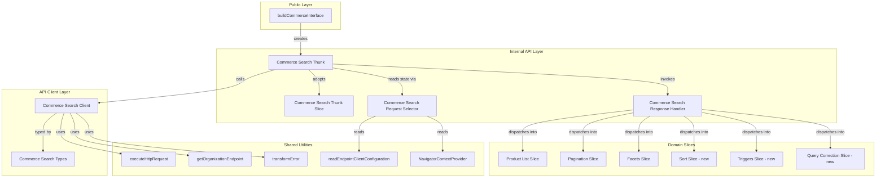
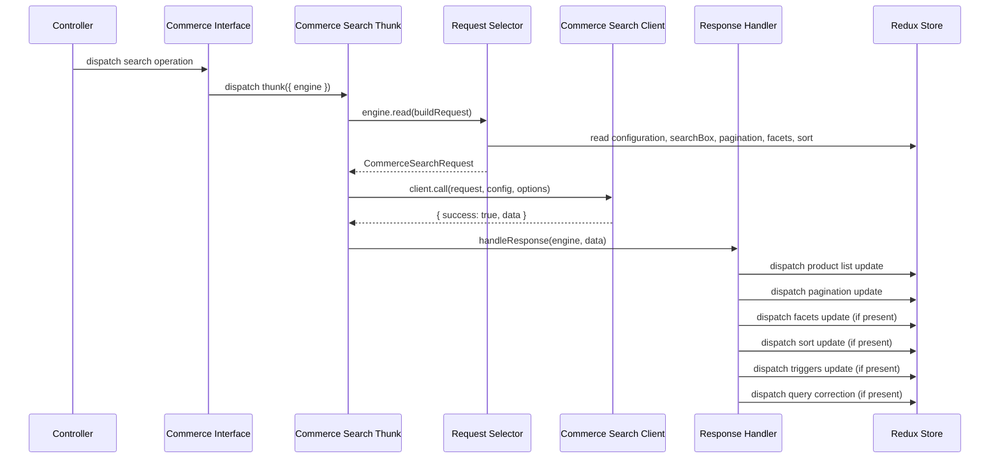

# Design Document: Commerce Search Endpoint

## Overview

This feature adds a production-ready Commerce Search API client layer to `packages/thermidor`, replacing the existing stub thunks in `src/public/interfaces/commerce.ts`. The implementation mirrors the proven search endpoint architecture already in place for the generic search use case:

**Client → Types → Request Selector → Response Handler → Thunk Slice → Thunk → Interface Wiring**

The target API is the Commerce Search v2 endpoint at `/rest/organizations/{organizationId}/commerce/v2/search`. The architecture uses per-interface state isolation via factory/cache patterns, memoized state selectors, and a discriminated union result type for error handling.

### Design Rationale

- **Mirror existing patterns**: Reusing the same layered architecture reduces cognitive overhead and ensures consistency across the codebase.
- **Per-interface isolation**: The factory/cache pattern (`getOrCreate*`) ensures multiple commerce interfaces can coexist without state collision.
- **Memoized selectors**: Prevent unnecessary recomputations and re-renders when unrelated state changes.
- **Discriminated union results**: Provide type-safe error handling without exceptions crossing layer boundaries.

## Architecture



### File Layout

```
packages/thermidor/src/
├── api/interface/commerce-search-endpoint/
│   ├── commerce-search-endpoint-client.ts       # HTTP client
│   └── commerce-search-endpoint-types.ts        # Request/Response interfaces
├── core/internal/api/commerce-search-endpoint/
│   ├── commerce-search-endpoint-request-selector.ts
│   ├── commerce-search-endpoint-response-handler.ts
│   ├── commerce-search-endpoint-thunk-slice.ts
│   └── commerce-search-endpoint-thunk.ts
├── core/internal/sort/                          # New domain slice
│   ├── sort-actions.ts
│   ├── sort-selectors.ts
│   └── sort-slice.ts
├── core/internal/triggers/                      # New domain slice
│   ├── triggers-actions.ts
│   └── triggers-slice.ts
├── core/internal/query-correction/              # New domain slice
│   ├── query-correction-actions.ts
│   └── query-correction-slice.ts
└── public/interfaces/commerce.ts                # Updated interface wiring
```

## Components and Interfaces

### 1. Commerce Search Types (`commerce-search-endpoint-types.ts`)

Defines the request and response TypeScript interfaces for the Commerce Search v2 API.

```typescript
// Request
export interface CommerceSearchRequest {
  // Required
  trackingId: string;
  language: string;
  country: string;
  currency: string;
  query: string;
  context: CommerceSearchContext;
  // Optional
  clientId?: string;
  facets?: CommerceSearchFacetRequest[];
  page?: number;
  perPage?: number;
  sort?: CommerceSearchSortCriterion[];
  debug?: boolean;
  enableResults?: boolean;
  legacyFacetOptions?: {freezeFacetOrder?: boolean};
}

export interface CommerceSearchContext {
  view: {url: string};
  user?: {userAgent?: string};
  cart?: Array<{productId: string; quantity: number}>;
  source?: string[];
  capture?: boolean;
  labels?: Record<string, string>;
  custom?: Record<string, unknown>;
}

// Response
export interface CommerceSearchResponse {
  responseId: string;
  products: CommerceProduct[];
  results: CommerceResult[];
  facets: CommerceSearchFacetResponse[];
  pagination: CommerceSearchPagination;
  sort: CommerceSearchSort;
  triggers: CommerceSearchTrigger[];
  queryCorrection?: CommerceSearchQueryCorrection;
}
```

### 2. Commerce Search Client (`commerce-search-endpoint-client.ts`)

HTTP client that encapsulates communication with the Commerce Search v2 endpoint. Follows the exact same pattern as `SearchEndpointClient`.

```typescript
export interface CommerceSearchEndpointClient {
  call: (
    request: CommerceSearchRequest,
    configuration: CommerceSearchEndpointClientConfiguration,
    options?: CommerceSearchEndpointCallOptions
  ) => Promise<CommerceSearchEndpointClientResult>;
}

export interface CommerceSearchEndpointClientConfiguration {
  organizationId?: string;
  accessToken?: string;
  endpoint?: string;
}

export type CommerceSearchEndpointClientResult =
  | {success: true; data?: CommerceSearchResponse}
  | {success: false; error: string};

export interface CommerceSearchEndpointCallOptions {
  signal?: AbortSignal;
}
```

**Key difference from search client**: The URL path is `/rest/organizations/{organizationId}/commerce/v2/search` instead of `/rest/search/v2`.

### 3. Commerce Search Request Selector (`commerce-search-endpoint-request-selector.ts`)

A memoized selector that composes Redux state into the `CommerceSearchRequest` shape. Uses `createMemoizedStateSelector` with input selectors from:

- **Configuration slice**: `trackingId`, `language`, `country`, `currency`
- **Search box selectors** (scoped to sharable interface ID): `query`
- **Pagination selectors** (scoped to interface ID): `page`, `perPage`
- **Facets selectors** (scoped to interface ID): `facets` array
- **Sort selectors** (scoped to interface ID): `sort` array
- **NavigatorContextProvider** (from engine): `context.view.url`

The selector needs up to 7 input selectors plus a projector, which is supported by the existing `createMemoizedStateSelector` overloads.

### 4. Commerce Search Response Handler (`commerce-search-endpoint-response-handler.ts`)

Dispatches response data into the appropriate domain slices:

| Response Field    | Target Slice     | Action                    | Condition                   |
| ----------------- | ---------------- | ------------------------- | --------------------------- |
| `products`        | Product List     | `setProductsFromResponse` | Always (empty array clears) |
| `pagination`      | Pagination       | `setPagination`           | Always                      |
| `facets`          | Facets           | `updateFromResponse`      | Non-empty array only        |
| `sort`            | Sort             | `updateFromResponse`      | Present only                |
| `triggers`        | Triggers         | `setTriggers`             | Non-empty array only        |
| `queryCorrection` | Query Correction | `setQueryCorrection`      | Present only                |

### 5. Commerce Search Thunk Slice (`commerce-search-endpoint-thunk-slice.ts`)

Tracks async request status. State shape:

```typescript
interface CommerceSearchEndpointThunkState {
  status: 'idle' | 'pending';
  error: string | null;
}
```

Slice name: `{interfaceId}/commerceSearchEndpoint`

Uses the `getOrCreate` cache pattern for both the slice and its selectors.

### 6. Commerce Search Thunk (`commerce-search-endpoint-thunk.ts`)

Factory function wiring:

```typescript
export function createCommerceSearchEndpointThunk(
  engine: FullEngine,
  scope: EndpointStateScope
): EndpointThunk;
```

Action type: `{sharableInterfaceId}/commerceSearchEndpoint/execute`

### 7. Commerce Interface Update (`commerce.ts`)

Replaces the stub `createCommerceSearchThunk` with an import of `createCommerceSearchEndpointThunk` from the internal API module. The `createAsyncThunk` import can be removed if only the suggestions stub remains (or kept if suggestions also needs it).

## Data Models

### State Shape (per interface instance)

```
{interfaceId}/commerceSearchEndpoint: { status: 'idle'|'pending', error: string|null }
{interfaceId}/products: { products: Product[] }
{interfaceId}/pagination: { firstResult: number, pageSize: number, totalCount: number }
{interfaceId}/facets: Record<string, { selectedValues: string[] }>
{interfaceId}/sort: { appliedSort: SortCriterion, availableSorts: SortCriterion[] }
{interfaceId}/triggers: { triggers: Trigger[] }
{interfaceId}/queryCorrection: { correction: QueryCorrection | null }
```

### New Domain Slice Types

```typescript
// Sort
interface SortState {
  appliedSort: CommerceSearchSortCriterion | null;
  availableSorts: CommerceSearchSortCriterion[];
}

// Triggers
interface TriggersState {
  triggers: CommerceSearchTrigger[];
}

// Query Correction
interface QueryCorrectionState {
  correction: CommerceSearchQueryCorrection | null;
}
```

### Data Flow



## Correctness Properties

_A property is a characteristic or behavior that should hold true across all valid executions of a system — essentially, a formal statement about what the system should do. Properties serve as the bridge between human-readable specifications and machine-verifiable correctness guarantees._

### Property 1: Request Formation Correctness

_For any_ valid organizationId, accessToken, and optional endpoint override, the Commerce Search Client SHALL construct a POST request to the URL `{organizationEndpoint}/rest/organizations/{organizationId}/commerce/v2/search` with headers `Authorization: Bearer {accessToken}`, `Content-Type: application/json`, and `Coveo-Organization-Id: {organizationId}`.

**Validates: Requirements 2.1, 2.2**

### Property 2: Client Response Mapping

_For any_ HTTP outcome (success with data, success without data, or failure with error string), the Commerce Search Client SHALL return the correct discriminated union result: `{ success: true, data }` for successful responses, or `{ success: false, error }` for failures with the HTTP error string or a fallback message.

**Validates: Requirements 2.3, 2.4**

### Property 3: Client Exception Safety

_For any_ exception thrown by the underlying HTTP call, the Commerce Search Client SHALL catch the exception and return `{ success: false, error: transformError(exception) }` without propagating the exception.

**Validates: Requirements 2.8**

### Property 4: Request Selector State Mapping

_For any_ valid Redux state containing configuration (trackingId, language, country, currency), search box (query), pagination (page, perPage), facets (selected values), sort (criteria), and navigator context (URL or null), the Commerce Search Request Selector SHALL produce a `CommerceSearchRequest` where each field is correctly mapped from its source state, with `context.view.url` defaulting to empty string when the navigator context is unavailable.

**Validates: Requirements 3.1, 3.2, 3.3, 3.4, 3.5, 3.6**

### Property 5: Request Selector Memoization

_For any_ Redux state, calling the Commerce Search Request Selector twice with the same state (by reference) SHALL return the same result object (by reference), and calling it with a state where at least one input selector returns a different value SHALL trigger recomputation.

**Validates: Requirements 3.7**

### Property 6: Response Handler Dispatch Correctness

_For any_ valid `CommerceSearchResponse`, the Commerce Search Response Handler SHALL dispatch products and pagination data into their respective slices unconditionally, and SHALL dispatch facets, sort, triggers, and query correction data only when those fields are present and non-empty, preserving existing slice state for absent fields.

**Validates: Requirements 4.1, 4.2, 4.3, 4.4, 4.5, 4.6, 4.7, 4.8**

### Property 7: Thunk Slice State Transitions

_For any_ previous thunk slice state, the Commerce Search Thunk Slice SHALL transition to `{ status: 'pending', error: null }` on pending, to `{ status: 'idle' }` (error unchanged) on fulfilled, and to `{ status: 'idle', error: message }` on rejected (with fallback default message when undefined).

**Validates: Requirements 5.3, 5.4, 5.5**

### Property 8: Cache Pattern Idempotence

_For any_ interfaceId string, calling `getOrCreate` factory functions (for the thunk slice or its selectors) multiple times with the same interfaceId SHALL return the exact same instance (reference equality).

**Validates: Requirements 5.7, 5.8**

### Property 9: Naming Convention Consistency

_For any_ interfaceId and optional composedInterfaceId, the thunk slice SHALL use the name `{interfaceId}/commerceSearchEndpoint` and the thunk SHALL use the action type prefix `{sharableInterfaceId}/commerceSearchEndpoint/execute`, where sharableInterfaceId is `composedInterfaceId ?? interfaceId`.

**Validates: Requirements 5.6, 6.9**

### Property 10: Thunk Error Propagation

_For any_ error string returned by the Commerce Search Client in a failure result, the Commerce Search Thunk SHALL throw an Error whose `message` property equals that error string.

**Validates: Requirements 6.6**

## Error Handling

| Layer            | Error Source            | Handling Strategy                                                    |
| ---------------- | ----------------------- | -------------------------------------------------------------------- |
| Client           | Missing organizationId  | Return `{ success: false, error: '...' }` immediately, no HTTP call  |
| Client           | Missing accessToken     | Return `{ success: false, error: '...' }` immediately, no HTTP call  |
| Client           | HTTP non-success status | Return `{ success: false, error }` from response or fallback message |
| Client           | Network/fetch exception | Catch, `transformError`, return `{ success: false, error }`          |
| Client           | AbortSignal abort       | Propagated via signal to fetch; results in caught exception          |
| Thunk            | Client returns failure  | Throw `new Error(response.error)` → triggers `rejected` case         |
| Thunk Slice      | Thunk rejected          | Store `action.error.message` in `error` field, set `status: 'idle'`  |
| Response Handler | Missing optional fields | Skip dispatch for absent fields, preserve existing state             |

## Testing Strategy

### Unit Tests (Example-Based)

- **Type safety**: Compile-time tests verifying required/optional properties of `CommerceSearchRequest` and `CommerceSearchResponse`
- **Guard clauses**: Missing organizationId and accessToken return errors without HTTP calls
- **AbortSignal forwarding**: Signal is passed to the underlying HTTP request
- **Thunk initial state**: Status is `'idle'`, error is `null`
- **Interface wiring**: `buildCommerceInterface` assigns the correct factory and produces valid thunks
- **Successful result with no data**: Thunk completes without invoking response handler

### Property-Based Tests (Universal Properties)

- **Library**: fast-check (already available in the monorepo via vitest ecosystem)
- **Minimum iterations**: 100 per property
- **Tag format**: `Feature: commerce-search-endpoint, Property {N}: {title}`

Each correctness property above maps to a single property-based test:

1. **Request formation** — Generate random (orgId, accessToken, endpoint?) tuples, verify URL and headers
2. **Response mapping** — Generate random HTTP outcomes, verify discriminated union output
3. **Exception safety** — Generate random exception types, verify catch-and-transform behavior
4. **State mapping** — Generate random Redux state shapes, verify selector output matches expected request
5. **Memoization** — Generate random states, call twice, assert reference equality
6. **Response dispatch** — Generate random responses with optional fields, verify dispatch calls
7. **State transitions** — Generate random previous states and thunk lifecycle events, verify transitions
8. **Cache idempotence** — Generate random interfaceId strings, call factory twice, assert same reference
9. **Naming convention** — Generate random (interfaceId, composedInterfaceId?) pairs, verify names
10. **Error propagation** — Generate random error strings, verify thunk throws matching Error

### Integration Tests

- **Thunk wiring**: Dispatch thunk with mocked HTTP, verify full flow (selector → client → handler)
- **Engine slice adoption**: Verify thunk factory calls `engine.adoptSlice`
- **End-to-end interface**: Build commerce interface, dispatch search, verify state updates
