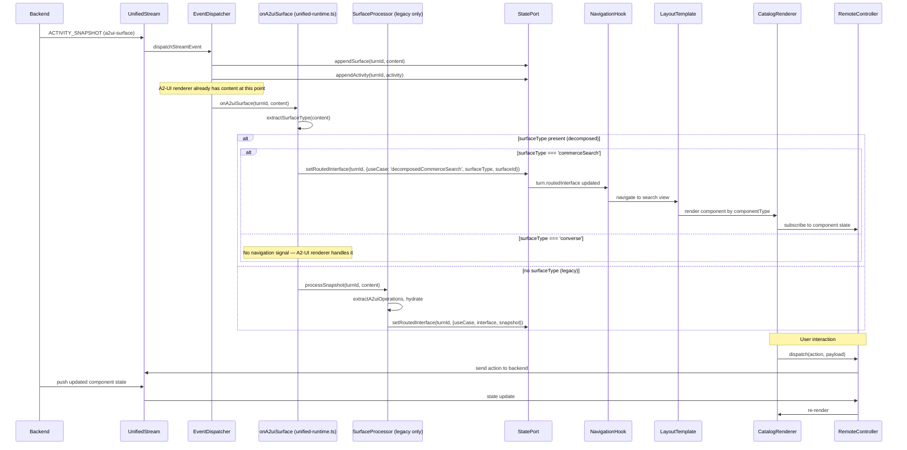
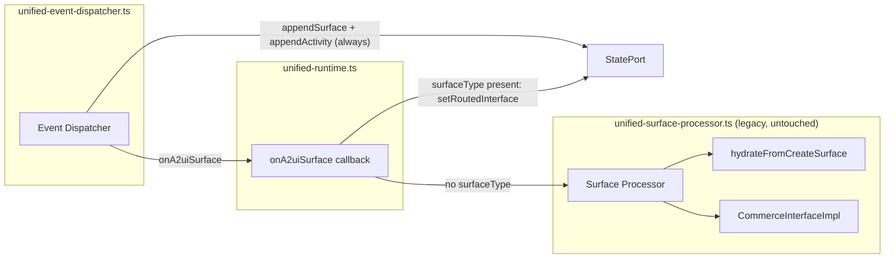

# Design Document: Commerce Surface Decomposition

## Overview

This design decomposes the monolithic `ProductSearchSurface`/`ProductListingSurface` A2-UI root component into individually-stateful components (`productList`, `pagination`, `sort`, `searchBox`) that render through the existing A2-UI catalog/renderer pipeline. A new `surfaceType` field on the `createSurface` payload replaces root-component inspection for navigation decisions. The legacy hydration path (`CommerceInterfaceImpl`, Redux store, headless controllers) remains untouched in `unified-surface-processor.ts` and can be removed in a single deletion when the backend fully migrates.

### Key Design Decisions

1. **`surfaceType` as top-level discriminant** — Navigation routing uses an explicit field rather than inspecting component names. This decouples routing from component structure.
2. **SurfaceProcessor is bypassed entirely for decomposed surfaces** — The routing decision lives in the `onA2uiSurface` callback in `unified-runtime.ts`. Because `appendSurface` and `appendActivity` are always called before `onA2uiSurface` in the event dispatcher, the A2-UI renderer already receives the content regardless. The SurfaceProcessor was only needed for hydration + navigation signal — for decomposed surfaces, hydration is eliminated and the navigation signal is trivial.
3. **Legacy path is the existing SurfaceProcessor (untouched)** — No extraction to a separate file. The SurfaceProcessor continues to handle surfaces without `surfaceType`. To delete legacy later: remove the else-branch in the callback and the SurfaceProcessor entirely.
4. **Reuse of existing `RemoteController` + A2-UI renderer pipeline** — Decomposed commerce components use the same `buildRemoteController` / `useRemoteController` / catalog-renderer pattern already proven for converse surfaces (ProductCarousel, BundleDisplay, etc.).
5. **Backend remains source of truth** — User interactions dispatch actions through the unified stream; the backend pushes updated component state. No client-side shared state slices.
6. **Layout is a renderer concern** — `surfaceType` selects a layout template in the demo app. The backend does not describe spatial placement.

## Architecture

### High-Level Data Flow



### Module Boundary Diagram



### Package Responsibilities

| Package | Change |
|---------|--------|
| `thermidor-schema` | Add `surfaceType` field to `CreateSurfacePayload` schema; add props schemas for `productList`, `pagination`, `sort`, `searchBox` |
| `thermidor` (`unified-runtime.ts`) | Modify `onA2uiSurface` callback to route by `surfaceType` presence: extract surfaceType, emit navigation signal for `commerceSearch`, fall through to SurfaceProcessor for legacy |
| `thermidor` (`unified-surface-processor.ts`) | **No changes** — continues to handle legacy surfaces exactly as today |
| `platform-mock-api` | Emit decomposed `commerceSearch` surfaces with `surfaceType` and individual component entries |
| `demo-schema-react` | Add commerce catalog renderers, layout template, update `SearchResultsPage` to render via A2-UI pipeline |

## Components and Interfaces

### 1. Schema Additions (`thermidor-schema`)

#### `surfaceType` on CreateSurface

```typescript
// Addition to createSurface payload schema
export const SurfaceTypeSchema = z.enum(['commerceSearch', 'converse']);
export type SurfaceType = z.infer<typeof SurfaceTypeSchema>;

// createSurface payload gains:
surfaceType: SurfaceTypeSchema.optional()
```

#### Commerce Component Props Schemas

```typescript
export const ProductListPropsSchema = z.object({
  componentId: z.string(),
  componentType: z.literal('product-list'),
});

export const PaginationPropsSchema = z.object({
  componentId: z.string(),
  componentType: z.literal('pagination'),
});

export const SortPropsSchema = z.object({
  componentId: z.string(),
  componentType: z.literal('sort'),
});

export const SearchBoxPropsSchema = z.object({
  componentId: z.string(),
  componentType: z.literal('search-box'),
});
```

#### Commerce Component Contract Schemas

```typescript
export const ProductListContractSchema = z.strictObject({
  componentType: z.literal('product-list'),
  state: z.strictObject({
    products: z.array(ProductSchema),
  }),
  actions: z.strictObject({}),
});

export const PaginationContractSchema = z.strictObject({
  componentType: z.literal('pagination'),
  state: z.strictObject({
    page: z.number().int().min(0),
    pageSize: z.number().int().min(1),
    totalEntries: z.number().int().min(0),
    totalPages: z.number().int().min(0),
  }),
  actions: z.strictObject({
    selectPage: z.strictObject({
      payload: z.strictObject({ page: z.number().int().min(0) }),
    }),
  }),
});

export const SortContractSchema = z.strictObject({
  componentType: z.literal('sort'),
  state: z.strictObject({
    appliedSort: z.object({ sortCriteria: z.string(), fields: z.array(z.unknown()) }),
    availableSorts: z.array(z.object({ sortCriteria: z.string(), fields: z.array(z.unknown()) })),
  }),
  actions: z.strictObject({
    setSort: z.strictObject({
      payload: z.strictObject({ sortCriteria: z.string(), fields: z.array(z.unknown()) }),
    }),
  }),
});

export const SearchBoxContractSchema = z.strictObject({
  componentType: z.literal('search-box'),
  state: z.strictObject({
    query: z.string(),
  }),
  actions: z.strictObject({
    submitQuery: z.strictObject({
      payload: z.strictObject({ query: z.string() }),
    }),
  }),
});
```

The `ComponentContractsSchema` discriminated union is extended to include these four new component types.

### 2. Runtime Routing (`unified-runtime.ts`)

The `onA2uiSurface` callback in `consumeStream` is the sole routing point for the decomposed vs legacy decision:

```typescript
onA2uiSurface: (tid: string, content: Record<string, unknown>) => {
  const surfaceType = extractSurfaceType(content);

  if (surfaceType) {
    // New path: no SurfaceProcessor involved.
    // appendSurface + appendActivity were already called by the event dispatcher,
    // so the A2-UI renderer pipeline already has the content.
    // We only need to emit a navigation signal for commerceSearch.
    if (surfaceType === 'commerceSearch') {
      const surfaceId = extractSurfaceId(content);
      this.statePort.setRoutedInterface(tid, {
        useCase: 'decomposedCommerceSearch',
        surfaceType,
        surfaceId,
      });
    }
    // For 'converse' or other surfaceTypes: no navigation signal needed.
  } else {
    // Legacy path: SurfaceProcessor hydrates as before (untouched).
    this.surfaceProcessor.processSnapshot(tid, content);
  }
}
```

**Why this works**: In the event dispatcher (`ACTIVITY_SNAPSHOT` case), `appendSurface` and `appendActivity` are always called **before** `onA2uiSurface`. This means:
- The A2-UI renderer already has the full surface content regardless of which path executes.
- The SurfaceProcessor was only needed for two things: (1) hydrating a `CommerceInterfaceImpl` and (2) emitting a navigation signal. For decomposed surfaces, hydration is eliminated and the navigation signal is a single `setRoutedInterface` call.

**Helper functions** (added to `unified-runtime.ts` or a small utility):

```typescript
function extractSurfaceType(content: Record<string, unknown>): string | undefined {
  const ops = content.operations as unknown[];
  if (!Array.isArray(ops)) return undefined;
  for (const op of ops) {
    if (isRecord(op) && 'createSurface' in op) {
      const cs = (op as Record<string, unknown>).createSurface;
      if (isRecord(cs) && typeof cs.surfaceType === 'string') {
        return cs.surfaceType;
      }
    }
  }
  return undefined;
}

function extractSurfaceId(content: Record<string, unknown>): string {
  const ops = content.operations as unknown[];
  for (const op of ops) {
    if (isRecord(op) && 'createSurface' in op) {
      const cs = (op as Record<string, unknown>).createSurface;
      if (isRecord(cs) && typeof cs.surfaceId === 'string') {
        return cs.surfaceId;
      }
    }
  }
  return '';
}
```

### 3. Legacy Path (`unified-surface-processor.ts` — unchanged)

The existing `SurfaceProcessor` remains exactly as-is. It handles surfaces that lack a `surfaceType` field via the else-branch above. Its responsibilities are unchanged:
- `extractA2uiOperations` → `processOperations`
- `maybeHydrate` → `hydrateFromCreateSurface` → `setRoutedInterface` with a `CommerceInterfaceImpl`
- `getStatefulCommerceRootKind` check for `ProductSearchSurface`/`ProductListingSurface`
- `updateComponents`, `updateDataModel`, `deleteSurface` lifecycle handling

When the backend fully migrates and no longer sends surfaces without `surfaceType`, the cleanup is:
1. Remove the else-branch in the `onA2uiSurface` callback.
2. Delete `unified-surface-processor.ts` and its import.
3. Delete `unified-surface-hydration.ts`.

No changes to the decomposed path or any other module.

### 4. Navigation Signal Adaptation

The current `setRoutedInterface` carries a `CommerceInterfaceImpl` instance. For decomposed surfaces, the signal carries surface metadata without an interface instance:

```typescript
export type RoutedInterface =
  | { useCase: 'commerceSearch'; interface: CommerceInterface; snapshot: unknown; query: string; surfaceId: string }  // legacy
  | { useCase: 'decomposedCommerceSearch'; surfaceType: 'commerceSearch'; surfaceId: string };  // new
```

The navigation hook (`use-navigation.ts`) already dispatches `NAVIGATE_SEARCH` when `turn.routedInterface` is truthy — this continues to work. `SearchResultsPage` checks `routedInterface.useCase` to decide which rendering path to use.

### 5. Demo App Layout Template

`SearchResultsPage` is refactored to act as a layout shell when receiving a decomposed interface:

```typescript
function SearchResultsPage({ routedInterface, ... }) {
  if (routedInterface.useCase === 'decomposedCommerceSearch') {
    return <CommerceSearchLayout surfaceId={routedInterface.surfaceId} surfaceType={routedInterface.surfaceType} />;
  }
  // Legacy path (existing code)
  return <SearchResultsPageLegacy routedInterface={routedInterface} ... />;
}
```

The `CommerceSearchLayout` component:
- Finds components from A2-UI surface state by `componentType`
- Places them into spatial slots (header: searchBox; main: sort, productList, pagination)
- Each slot renders its catalog renderer, which uses `useRemoteController` for state

### 6. Commerce Catalog Renderers (Demo App)

Four new catalog renderers following the same pattern as `ProductCarouselRenderer`:

| Renderer | `componentType` | State subscription | Actions |
|----------|----------------|-------------------|---------|
| `ProductListRenderer` | `product-list` | `products[]` | — |
| `PaginationRenderer` | `pagination` | `page`, `pageSize`, `totalEntries`, `totalPages` | `selectPage` |
| `SortRenderer` | `sort` | `appliedSort`, `availableSorts` | `setSort` |
| `SearchBoxRenderer` | `search-box` | `query` | `submitQuery` |

Each renderer:
1. Receives `props` with `componentId` and `componentType`
2. Calls `useRemoteController(stateSource, props.componentId, props.componentType)`
3. Renders UI from `controller.state`
4. Dispatches actions via `controller.dispatch(actionName, payload)`

### 7. Mock API Changes

`schema-response-search.ts` is updated to emit decomposed surfaces:

```typescript
createSurface: {
  surfaceId: 'ui-commerce-search',
  surfaceType: 'commerceSearch',
  catalogId: CATALOG_ID,
  components: [
    { id: 'search-box-1', component: 'search-box', props: { componentId: 'search-box-1', componentType: 'search-box' } },
    { id: 'product-list-1', component: 'product-list', props: { componentId: 'product-list-1', componentType: 'product-list' } },
    { id: 'pagination-1', component: 'pagination', props: { componentId: 'pagination-1', componentType: 'pagination' } },
    { id: 'sort-1', component: 'sort', props: { componentId: 'sort-1', componentType: 'sort' } },
  ],
}
```

Component state is delivered through the A2-UI renderer's `updateComponents` pipeline (state on `props` or through the `RemoteController` state source).

## Data Models

### CreateSurface Payload (extended)

```typescript
interface CreateSurfacePayload {
  surfaceId: string;
  surfaceType?: 'commerceSearch' | 'converse';  // NEW
  catalogId?: string;
  sendDataModel?: boolean;
  components?: ComponentNode[];
  dataModel?: Record<string, unknown>;
}
```

### Decomposed Component State Shapes

```typescript
// productList state
interface ProductListState {
  products: Product[];
}

// pagination state
interface PaginationState {
  page: number;       // 0-indexed
  pageSize: number;
  totalEntries: number;
  totalPages: number;
}

// sort state
interface SortState {
  appliedSort: { sortCriteria: string; fields: unknown[] };
  availableSorts: Array<{ sortCriteria: string; fields: unknown[] }>;
}

// searchBox state
interface SearchBoxState {
  query: string;
}
```

### Action Payloads

```typescript
// pagination action
interface SelectPagePayload { page: number; }

// sort action
interface SetSortPayload { sortCriteria: string; fields: unknown[]; }

// searchBox action
interface SubmitQueryPayload { query: string; }
```

### Routing Decision Table

| `surfaceType` field | Root component | Route to |
|---------------------|---------------|----------|
| Present (any value) | Any/none | New path in `onA2uiSurface` (navigation signal only, no hydration) |
| Absent | `ProductSearchSurface` or `ProductListingSurface` | SurfaceProcessor (legacy hydration) |
| Absent | Other/none | SurfaceProcessor (no commerce routing — existing behavior) |

### Navigation Signal (extended)

```typescript
// Extended RoutedInterface for decomposed surfaces
type RoutedInterface =
  | { useCase: 'commerceSearch'; interface: CommerceInterface; snapshot: unknown; query: string; surfaceId: string }  // legacy
  | { useCase: 'decomposedCommerceSearch'; surfaceType: 'commerceSearch'; surfaceId: string };  // new
```

## Correctness Properties

*A property is a characteristic or behavior that should hold true across all valid executions of a system — essentially, a formal statement about what the system should do. Properties serve as the bridge between human-readable specifications and machine-verifiable correctness guarantees.*

### Property 1: surfaceType routing exclusivity

*For any* `createSurface` A2-UI snapshot, if the payload contains a `surfaceType` field, the `onA2uiSurface` callback SHALL NOT invoke the SurfaceProcessor, regardless of any root component present in the components array.

**Validates: Requirements 1.2, 2.1, 10.1, 10.4**

### Property 2: Legacy routing by absence of surfaceType

*For any* `createSurface` A2-UI snapshot that omits the `surfaceType` field, the `onA2uiSurface` callback SHALL delegate to the SurfaceProcessor, which routes to hydration if and only if the components array contains a root component named `ProductSearchSurface` or `ProductListingSurface`.

**Validates: Requirements 2.3, 10.5**

### Property 3: Decomposed surfaces never trigger hydration

*For any* A2-UI snapshot processed through the new path in `onA2uiSurface` (surfaceType present), the system SHALL NOT instantiate a `CommerceInterfaceImpl`, call `hydrateFromCreateSurface`, call `createCommerceSearchEndpointResponseHandler`, or store a hydration snapshot in the engine.

**Validates: Requirements 4.1, 4.2, 4.3**

### Property 4: Schema round-trip for decomposed component props

*For any* valid props object conforming to a decomposed commerce component schema (`productList`, `pagination`, `sort`, `searchBox`), parsing then serializing then parsing again SHALL produce an equivalent object.

**Validates: Requirements 8.5**

### Property 5: Navigation signal for commerceSearch surfaceType

*For any* A2-UI snapshot with `surfaceType` equal to `commerceSearch`, the `onA2uiSurface` callback SHALL emit a routed navigation signal via `setRoutedInterface`. For `surfaceType` equal to `converse`, no navigation signal SHALL be emitted.

**Validates: Requirements 2.1, 2.2**

### Property 6: Partial component set handling

*For any* `commerceSearch` surface that includes only a subset of the four decomposed components, the layout template SHALL render the available components without error, rendering absent slots as empty.

**Validates: Requirements 3.7, 6.3**

### Property 7: A2-UI content is always delivered regardless of path

*For any* `ACTIVITY_SNAPSHOT` event with `activityType === 'a2ui-surface'`, `appendSurface` and `appendActivity` SHALL be called before `onA2uiSurface`, ensuring the A2-UI renderer receives content independently of which routing path executes.

**Validates: Requirements 5.3, 5.4**

### Property 8: Data model patch application (existing, preserved)

*For any* valid JSON Pointer path and value, `applyDataModelPatch` applied to a record SHALL produce a record where the value at the given path equals the provided value (set) or is absent (delete with null).

**Validates: Requirements 9.4 (state updates flow correctly)**

## Error Handling

### Runtime Routing

- **Unknown `surfaceType` value**: If `surfaceType` is present but not `'commerceSearch'` or `'converse'`, the new path takes over but does NOT emit a navigation signal. The surface content still reaches the A2-UI renderer via `appendSurface`/`appendActivity`. This is forward-compatible with future surface types.
- **Missing `surfaceId` in decomposed surface**: `extractSurfaceId` returns empty string. The navigation signal is emitted with an empty surfaceId, which the layout template handles gracefully (renders nothing).
- **Non-`createSurface` operations in decomposed flow**: The `onA2uiSurface` callback only intercepts the initial snapshot. Subsequent `updateComponents` operations for decomposed surfaces flow through the standard A2-UI activity pipeline (which already handles them via `appendSurface`/`appendActivity`). No SurfaceProcessor involvement needed since there's no client-side hydration state to maintain.

### Catalog Renderer Errors

- **Component state undefined**: `useRemoteController` returns `undefined` state when the component's state has not yet been pushed. Renderers display loading/skeleton UI.
- **Invalid action payload**: The `RemoteController` validates action payloads against the component contract schema before dispatching. Invalid payloads are rejected with a promise rejection (existing behavior).
- **Backend does not respond to action**: No client-side timeout is enforced. The component remains in its current state until the backend pushes an update.

### Legacy Path Preservation

- **Deprecation**: The legacy path (SurfaceProcessor) remains functional and untouched. No deprecation warning is added at this stage since the code is not being modified.
- **Future deletion**: When the backend fully migrates, cleanup is:
  1. Remove the else-branch in `onA2uiSurface`.
  2. Delete `unified-surface-processor.ts` and `unified-surface-hydration.ts`.
  3. Remove the `surfaceProcessor` field and `createSurfaceProcessor` import from `UnifiedRuntime`.

## Testing Strategy

### Unit Tests (Vitest)

| Area | What to test | Approach |
|------|-------------|----------|
| `onA2uiSurface` routing | surfaceType presence → does not call SurfaceProcessor | Mock surfaceProcessor.processSnapshot, verify it's not called |
| `onA2uiSurface` routing | surfaceType absent → calls SurfaceProcessor | Mock surfaceProcessor.processSnapshot, verify it IS called |
| `onA2uiSurface` navigation | commerceSearch → setRoutedInterface called | Mock statePort, verify call with correct args |
| `onA2uiSurface` navigation | converse → setRoutedInterface NOT called | Mock statePort, verify no navigation call |
| `extractSurfaceType` | Extracts from valid payload, returns undefined for missing | Unit test helper function |
| `extractSurfaceId` | Extracts surfaceId from createSurface operation | Unit test helper function |
| Schema validation | Props schemas accept valid, reject invalid | Example-based with edge cases |
| Layout template | Partial components render without error | Render with subsets, no throw |
| Catalog renderers | State subscription and action dispatch | Mock RemoteController |
| `applyDataModelPatch` | Path-based patching | Existing tests preserved |
| Event dispatcher ordering | appendSurface/appendActivity called before onA2uiSurface | Verify call order in mock |

### Property-Based Tests (Vitest + fast-check)

The feature is suitable for property-based testing because:
- The routing logic is a pure decision function over payload structure
- Schema validation has clear round-trip properties
- The data model patching is a pure transformation with algebraic properties

**Configuration**: Minimum 100 iterations per property test.

| Property | Library | Tag |
|----------|---------|-----|
| Property 1: Routing exclusivity | fast-check | `Feature: commerce-surface-decomposition, Property 1: surfaceType routing exclusivity` |
| Property 2: Legacy routing | fast-check | `Feature: commerce-surface-decomposition, Property 2: Legacy routing by absence of surfaceType` |
| Property 3: No hydration | fast-check | `Feature: commerce-surface-decomposition, Property 3: Decomposed surfaces never trigger hydration` |
| Property 4: Schema round-trip | fast-check | `Feature: commerce-surface-decomposition, Property 4: Schema round-trip for decomposed component props` |
| Property 5: Navigation signals | fast-check | `Feature: commerce-surface-decomposition, Property 5: Navigation signal for commerceSearch surfaceType` |
| Property 6: Partial components | fast-check | `Feature: commerce-surface-decomposition, Property 6: Partial component set handling` |
| Property 7: Content delivery ordering | fast-check | `Feature: commerce-surface-decomposition, Property 7: A2-UI content is always delivered regardless of path` |
| Property 8: Data model patch | fast-check | `Feature: commerce-surface-decomposition, Property 8: Data model patch application` |

### Integration Tests

- **Mock API → Event Dispatcher → Runtime Callback → Navigation**: End-to-end flow using the mock API's decomposed search response through the unified runtime to verify navigation signals arrive at the hook level without SurfaceProcessor involvement.
- **Full render cycle**: Demo app renders decomposed commerce surface from mock API data, verifying layout placement and component state.

### Import Boundary / Module Isolation

Module isolation is inherently guaranteed by the architecture: the new path is a few lines in `onA2uiSurface` that don't import anything from the surface processor. The legacy path is the existing `SurfaceProcessor` which has no knowledge of the new `surfaceType` routing. A static analysis test can verify that `extractSurfaceType` and the navigation-signal branch have no imports from `unified-surface-hydration.ts`.
