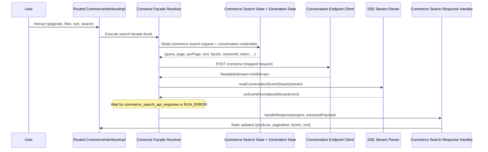

# Design Document: Converse Endpoint for Routed Interfaces

## Overview

This feature changes how routed commerce interfaces (created from `/converse` stream events) handle subsequent user interactions. Currently, when a `commerce_search_api_response` event hydrates a `CommerceInterfaceImpl`, that interface uses the standard `createCommerceSearchFacadeResolver` which calls CAPI directly. This feature introduces a new `createConverseSearchFacadeResolver` that routes all subsequent search interactions (pagination, filtering, sorting, re-querying) back through the `/converse` endpoint, preserving conversational context.

The change is non-breaking: the public API surface remains unchanged. Only the internal wiring of routed interfaces is modified.

## Architecture



### Key Design Decisions

1. **Resolver injection at hydration time**: Rather than modifying `CommerceInterfaceImpl`'s constructor (which would break existing non-routed interfaces), the hydration logic passes custom `resolverFactories` when constructing the routed interface. This requires the `CommerceInterfaceImpl` constructor to accept an optional `resolverFactories` parameter.

2. **Deferred credential resolution**: The converse facade resolver reads `conversationSessionId` and `conversationToken` from generative state at request time, not at construction time. This avoids stale closures if credentials are refreshed mid-conversation.

3. **Reuse of existing infrastructure**: The new resolver reuses `createConversationEndpointClient`, `readConversationEventStream`, and `createCommerceSearchEndpointResponseHandler` — only the orchestration (building the request, extracting the right event from the stream) is new.

4. **Single event extraction**: The resolver processes the SSE stream looking for the first `commerce_search_api_response` event and resolves with that. It also watches for `RUN_ERROR` to propagate failures. All other event types are ignored since the routed interface only needs the search response.

## Components and Interfaces

### New Components

#### `createConverseSearchFacadeResolver` (FacadeResolverFactory)

**Location**: `packages/thermidor/src/internal/api/converse-search/converse-search-facade.ts`

A `FacadeResolverFactory` that produces an `EndpointThunk` routing commerce search requests through the `/converse` endpoint.

```typescript
export function createConverseSearchFacadeResolver(
  generativeInterface: InterfaceHandle
): FacadeResolverFactory;
```

The factory is parameterized with the `generativeInterface` handle so the resulting thunk can read `conversationSessionId` and `conversationToken` from the generative state slice at execution time.

#### `createConverseSearchEndpointThunk`

**Location**: `packages/thermidor/src/internal/api/converse-search/converse-search-thunk.ts`

The async thunk created by the facade resolver. It:
1. Reads commerce search state (query, page, perPage, facets, sort, trackingId, language, country, currency)
2. Reads generative state (conversationSessionId, conversationToken)
3. Reads navigator context (clientId, userAgent, url, referrer)
4. Builds a `CoveoConversationEndpointRequest` with proper field mapping
5. Calls `createConversationEndpointClient().call(...)`
6. Parses the SSE stream via `extractCommerceSearchResponseFromStream`, extracting the first `commerce_search_api_response` event
7. Passes the extracted payload to `createCommerceSearchEndpointResponseHandler`

#### `extractCommerceSearchResponseFromStream`

**Location**: `packages/thermidor/src/internal/api/converse-search/converse-commerce-search-stream-extractor.ts`

A utility function that wraps `readConversationEventStream` and returns a `Promise<CommerceSearchResponse>`. It resolves on the first `commerce_search_api_response` event or rejects on `RUN_ERROR` / stream failure.

```typescript
export function extractCommerceSearchResponseFromStream(
  stream: ReadableStream<Uint8Array>
): Promise<CommerceSearchResponse>;
```

### Modified Components

#### `CommerceInterfaceImpl`

**Location**: `packages/thermidor/src/internal/interfaces/commerce.ts`

The constructor gains an optional third parameter to accept custom `resolverFactories`. When not provided, it falls back to the existing hardcoded resolvers.

```typescript
export class CommerceInterfaceImpl extends BaseInterface<'commerce'> implements CommerceInterface {
  constructor(
    engine: FullEngine,
    stateId: string,
    customResolvers?: Partial<Record<Facades['commerce'], FacadeResolverFactory>>
  );
}
```

When `customResolvers` is provided, it is merged with the default resolvers via spread (`{...resolverFactories, ...customResolvers}`). This means callers can override a single facade without providing all of them — non-overridden facades fall back to defaults.

#### `createHydrateSubInterface`

**Location**: `packages/thermidor/src/internal/features/generative/generative-hydration.ts`

Modified to accept the `generativeInterface` handle and pass converse-aware resolver factories when creating `CommerceInterfaceImpl` for `commerceSearch` routed interfaces.

The shared post-creation logic (snapshot storage, hydration dispatch, and query initialization) is extracted into a private `hydrateAndReturn` helper to eliminate duplication between the `commerceSearch` and `search` branches.

## Data Models

### Converse Request Mapping (Commerce Search → Converse)

| Commerce Search Field | Converse Request Field | Notes |
|---|---|---|
| `query` | `message` | Direct mapping, including empty string |
| `trackingId` | `trackingId` | Passed through |
| `language` | `language` | Passed through |
| `country` | `country` | Passed through |
| `currency` | `currency` | Passed through |
| `page` | `page` | Included in request body |
| `perPage` | `perPage` | Included in request body |
| `sort` | `sort` | Omitted if empty array |
| `facets` | `facets` | Omitted if empty array |
| (navigator) `clientId` | `clientId` | From navigator context provider; `undefined` if unavailable |
| (navigator) `userAgent` | `context.user.userAgent` | From navigator context provider |
| (navigator) `location` | `context.view.url` | From navigator context provider |
| (navigator) `referrer` | `context.view.referrer` | From navigator context provider |
| (cart state) | `context.cart` | Array of cart items |
| (generative state) | `conversationSessionId` | Omitted if undefined |
| (generative state) | `conversationToken` | Omitted if undefined |
| (constant) | `targetEngine` | Always `'AGENT_CORE'` |

### Extended `CoveoConversationEndpointRequest`

The existing `CoveoConversationEndpointRequest` type needs to be extended with the commerce search parameters that are forwarded:

```typescript
export interface CoveoConversationEndpointRequest {
  // ... existing fields ...
  page?: number;
  perPage?: number;
  sort?: CommerceSearchSortCriterion[];
  facets?: Array<{facetId: string; selectedValues: string[]}>;
}
```

### Stream Event Types Used

| Event Type | Action |
|---|---|
| `commerce_search_api_response` | Extract payload (minus `type`), resolve promise |
| `RUN_ERROR` | Reject promise with error message |
| All others | Ignore |

## Correctness Properties

*A property is a characteristic or behavior that should hold true across all valid executions of a system — essentially, a formal statement about what the system should do. Properties serve as the bridge between human-readable specifications and machine-verifiable correctness guarantees.*

### Property 1: Request field mapping preserves all commerce search parameters

*For any* valid commerce search state (with arbitrary query, page, perPage, sort criteria, and facets), the converse request built by the resolver SHALL contain all of those parameters with their values unchanged, with `query` mapped to `message`.

**Validates: Requirements 1.2, 1.4, 3.1, 3.2, 3.3**

### Property 2: Empty sort array omission

*For any* commerce search state where `sort` is an empty array, the resulting converse request body SHALL NOT contain a `sort` field.

**Validates: Requirements 3.7**

### Property 3: Conversation credentials are read at request time

*For any* sequence of converse facade resolver executions on the same routed interface, the `conversationSessionId` and `conversationToken` included in each request SHALL reflect the generative state at the moment of that specific execution, not a stale value captured at construction time.

**Validates: Requirements 1.3, 2.2**

### Property 4: Stream extraction resolves with first matching event

*For any* SSE stream containing one or more `commerce_search_api_response` events (possibly interleaved with other event types), the resolver SHALL resolve its promise with the payload of the first `commerce_search_api_response` event encountered, excluding the `type` field.

**Validates: Requirements 4.1, 4.2**

### Property 5: RUN_ERROR causes rejection before search response

*For any* SSE stream that emits a `RUN_ERROR` event before any `commerce_search_api_response` event, the resolver SHALL reject its promise with an error containing the `message` from that event (or a default message if absent/empty).

**Validates: Requirements 4.4**

### Property 6: Missing credentials are omitted, not sent as empty

*For any* generative state where `conversationSessionId` is undefined or `conversationToken` is undefined, the converse request SHALL omit those fields entirely rather than including them with null/empty values.

**Validates: Requirements 1.7, 2.3**

### Property 7: Stream without matching event causes rejection

*For any* SSE stream that completes without emitting either a `commerce_search_api_response` or a `RUN_ERROR` event, the resolver SHALL reject its promise with an error indicating no search response was received.

**Validates: Requirements 4.3**

### Property 8: Empty facets array omission

*For any* commerce search state where `facets` is an empty array, the resulting converse request body SHALL NOT contain a `facets` field.

**Validates: Requirements 3.8**

## Error Handling

| Scenario | Behavior |
|---|---|
| Converse endpoint returns HTTP error | `createConversationEndpointClient` returns `{success: false, error}` → thunk throws, handled by Redux async thunk rejection |
| SSE stream emits `RUN_ERROR` | `extractCommerceSearchResponseFromStream` rejects → thunk throws |
| SSE stream ends without `commerce_search_api_response` | `extractCommerceSearchResponseFromStream` rejects with "no search response received" |
| Network failure / abort signal during stream | Error propagates from `readConversationEventStream`'s `onError` → promise rejects |
| Missing `conversationSessionId` or `conversationToken` | Fields omitted from request; request proceeds normally |
| Navigator context unavailable | `clientId` omitted; `context.user.userAgent`, `context.view.url`, `context.view.referrer` set to null (matching existing conversation request behavior) |

All error paths result in the async thunk rejecting, which is handled by the existing `commerce-search-thunk-slice` pending/fulfilled/rejected lifecycle (no new error UI needed).

## Testing Strategy

### Unit Tests

- **Converse search thunk**: Verify request construction with various state combinations (with/without sort, facets, credentials, navigator context).
- **Stream extractor**: Verify correct event extraction logic — resolves on `commerce_search_api_response`, rejects on `RUN_ERROR`, rejects on empty stream.
- **Hydration injection**: Verify `createHydrateSubInterface` constructs `CommerceInterfaceImpl` with converse resolvers for `commerceSearch` use case and default resolvers for `search` use case.
- **CommerceInterfaceImpl constructor**: Verify custom resolvers are used when provided, defaults when not.
- **Deferred credential resolution**: Verify that two consecutive executions with state changes between them use the updated credentials (validates Property 3).

The correctness properties defined above serve as design invariants that unit tests should validate through concrete examples covering representative and edge-case inputs.

### Integration Tests

- End-to-end flow: hydrate a routed interface from a converse stream event, then trigger a search interaction, verify the request goes to `/converse` and the response hydrates state correctly.
