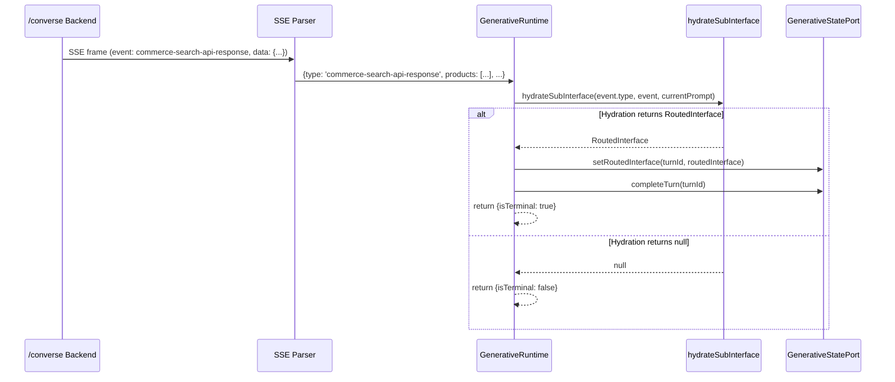

# Design Document: Converse Routed Commerce Search

## Overview

This design adds `case 'commerce-search-api-response':` and `case 'search-api-response':` handlers to `GenerativeRuntime.dispatchEvent` so that when the `/converse` backend routes a non-ambiguous query directly to a search API, the resulting named SSE event is processed through the existing `hydrateSubInterface` pipeline. Additionally, the hydration logic is removed from the `ACTIVITY_SNAPSHOT` case, which now only handles A2UI surface rendering.

The backend sends these as **named SSE events** — the wire format is:

```
event: commerce-search-api-response
data: {"products": [...], "pagination": {...}, ...}
```

The SSE parser's `normalizeNamedEvent` function promotes the event name into the `type` field and spreads the parsed payload, producing `{type: 'commerce-search-api-response', products: [...], ...}`. This is the same mechanism used for `turn_started` and `turn_complete`.

The existing `ACTIVITY_TYPE_TO_ROUTED_USE_CASE` map in `generative-hydration.ts` already recognizes `'commerce-search-api-response'` and `'search-api-response'`, so no changes are needed in the hydration layer.

## Architecture



### Design Decisions

1. **Named SSE events, not AG-UI CUSTOM**: The backend sends routed search results as named SSE events (`event: commerce-search-api-response`) rather than as AG-UI `CUSTOM` events. This follows the same pattern as `turn_started` and `turn_complete` — Coveo-specific wire format events that don't have AG-UI equivalents.

2. **Reuse existing hydration path**: The named event handlers funnel through `hydrateSubInterface` using `event.type` as the activity type and the entire event object as the content. The `ACTIVITY_TYPE_TO_ROUTED_USE_CASE` map handles the lookup.

3. **ACTIVITY_SNAPSHOT simplified**: The `ACTIVITY_SNAPSHOT` case no longer calls `hydrateSubInterface`. Since the backend exclusively emits named SSE events for routed queries going forward, the hydration logic in `ACTIVITY_SNAPSHOT` was dead code. It now only handles `appendSurface` for A2UI rendering.

4. **Type system extended**: `NormalizedStreamEvent` union includes `CommerceSearchApiResponseEvent` and `SearchApiResponseEvent` types so TypeScript narrowing works correctly in the switch.

## Components and Interfaces

### Modified: `GenerativeRuntime.dispatchEvent`

**Location**: `packages/thermidor/src/internal/api/generative/generative-runtime.ts`

Added `case 'commerce-search-api-response':` and `case 'search-api-response':` branches:

```typescript
case 'commerce-search-api-response':
case 'search-api-response': {
  const routedInterface = this.hydrateSubInterface(
    event.type,
    event,
    this.currentPrompt
  );

  if (routedInterface) {
    this.statePort.setRoutedInterface(turnId, routedInterface);
    this.statePort.completeTurn(turnId);
    return {turnId, isTerminal: true};
  }

  return {turnId, isTerminal: false};
}
```

Simplified `ACTIVITY_SNAPSHOT` to only append surfaces:

```typescript
case 'ACTIVITY_SNAPSHOT': {
  this.ensureAgentResponse(turnId);
  this.statePort.appendSurface(
    turnId,
    event.content as Record<string, unknown>
  );
  return {turnId, isTerminal: false};
}
```

### Modified: `NormalizedStreamEvent` / `ConversationStreamEvent`

**Location**: `packages/thermidor/src/internal/api/protocol/stream-types.ts`

Added two new event types to the union:

```typescript
export type CommerceSearchApiResponseEvent = {
  type: 'commerce-search-api-response';
  [key: string]: unknown;
};

export type SearchApiResponseEvent = {
  type: 'search-api-response';
  [key: string]: unknown;
};
```

### Unchanged: `createHydrateSubInterface`

**Location**: `packages/thermidor/src/internal/features/generative/generative-hydration.ts`

No modifications needed. The `ACTIVITY_TYPE_TO_ROUTED_USE_CASE` map already contains `'commerce-search-api-response': 'commerceSearch'` and `'search-api-response': 'search'`. The `extractEffectiveQuery` function already handles `queryCorrection.correctedQuery` logic.

### Unchanged: SSE Parser

**Location**: `packages/thermidor/src/internal/api/protocol/sse-parser.ts`

No modifications needed. The `normalizeNamedEvent` function already handles named SSE events by promoting the event name into the `type` field and spreading object payloads.

## Data Models

### `CommerceSearchApiResponseEvent`

After SSE parsing, the event arrives as:

```typescript
{
  type: 'commerce-search-api-response';
  products: Array<{
    permanentid: string;
    ec_name: string;
    ec_price: number;
    clickUri: string;
    [key: string]: unknown;
  }>;
  pagination: {
    totalEntries: number;
    [key: string]: unknown;
  };
  facets: Array<Record<string, unknown>>;
  queryCorrection?: {
    correctedQuery?: string | null;
  };
  [key: string]: unknown;
}
```

### `dispatchEvent` Return Shape

```typescript
{ turnId: string; isTerminal: boolean }
```

- `isTerminal: true` — turn is completed, no further events should be processed
- `isTerminal: false` — continue processing stream events

## Correctness Properties

### Property 1: Recognized routed event produces terminal dispatch with routed interface

*For any* event whose `type` is `'commerce-search-api-response'` or `'search-api-response'`, and for any payload that causes `hydrateSubInterface` to return a non-null `RoutedInterface`, `dispatchEvent` SHALL:
- call `hydrateSubInterface(event.type, event, currentPrompt)`,
- call `statePort.setRoutedInterface(turnId, routedInterface)`,
- call `statePort.completeTurn(turnId)`,
- and return `{ isTerminal: true }`.

**Validates: Requirements 1.1, 1.2, 1.3, 1.4, 2.1**

### Property 2: Unrecognized event type falls through default with no state mutation

*For any* event whose `type` does NOT match any case in the `dispatchEvent` switch, the default branch SHALL return `{ isTerminal: false }` and SHALL NOT invoke any method on the `GenerativeStatePort`.

**Validates: Requirements 1.5**

### Property 3: Effective query resolution uses correctedQuery when non-empty, otherwise falls back to user prompt

*For any* commerce search payload, if `payload.queryCorrection.correctedQuery` is a non-empty string, the routed sub-interface search box SHALL be set to that `correctedQuery`. Otherwise, if a user prompt is provided, the search box SHALL be set to the user prompt. If neither is available, no query SHALL be set.

**Validates: Requirements 2.2, 2.3, 2.4**

## Error Handling

| Scenario | Behavior |
|----------|----------|
| `hydrateSubInterface` returns `null` for a routed event | Not an error — may occur if the routing table is extended in the future with partial support. Returns non-terminal. |
| Routed event is the only event before stream closes with null hydration | `consumeStream`'s `onDone` handler fires with `terminalEventReceived === false`, which calls `statePort.failTurn(turnId, 'Stream ended without a terminal event.')`. |
| Event payload is not a valid commerce search structure | `hydrateSubInterface` will still attempt hydration. If the content cannot be cast to `Record<string, unknown>`, the sub-interface will be created with an empty/malformed state. This is acceptable — the backend is trusted to send well-formed payloads. |

## Testing Strategy

### Unit Tests (Vitest)

- **`generative-runtime.test.ts`** (new file): Test `dispatchEvent` with mocked `statePort` and `hydrateSubInterface`.
  - `commerce-search-api-response` event with successful hydration → verifies setRoutedInterface + completeTurn + isTerminal
  - `search-api-response` event with successful hydration → same verification
  - Routed event when hydration returns null → verifies no state port mutation + non-terminal
  - Prompt forwarding → verifies prompt passed to hydration
  - Routed event as only event before stream closes with null hydration → verifies failTurn

- **`generative-hydration.test.ts`** (extend existing): Test `extractEffectiveQuery` behavior via `createHydrateSubInterface`.
  - Payload with `queryCorrection.correctedQuery` → search box uses corrected query
  - Payload without `queryCorrection` → search box uses fallback prompt
  - No query provided (undefined) → search box not set

### Property-Based Tests (fast-check + Vitest)

**Library**: `fast-check` (devDependency of `@coveo/thermidor`)

**Configuration**: Minimum 100 iterations per property test.

- **Property 1 test**: Generate random payloads with recognized event types. Mock `hydrateSubInterface` to return a generated `RoutedInterface`. Assert terminal result and state port calls.
- **Property 2 test**: Generate random event types NOT in the switch. Assert non-terminal result and zero state port interactions.
- **Property 3 test**: Generate random commerce payloads with/without `queryCorrection.correctedQuery` and random prompt strings. Invoke `createHydrateSubInterface` and verify the search box state matches the expected effective query.
