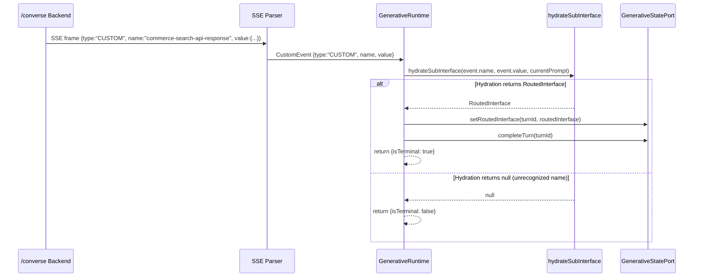

# Design Document: Converse Routed Commerce Search

## Overview

This design adds a `CUSTOM` event handler to `GenerativeRuntime.dispatchEvent` so that when the `/converse` backend routes a non-ambiguous commerce query directly to the commerce search API, the resulting `CustomEvent` (with name `commerce-search-api-response`) is processed through the existing `hydrateSubInterface` pipeline. The change is minimal and leverages the already-established hydration path used by `ACTIVITY_SNAPSHOT`, with no backward-compatibility concern.

The key insight is that `CustomEvent` from AG-UI (`type: 'CUSTOM'`, `name: string`, `value: unknown`) maps directly onto the `hydrateSubInterface(activityType, content, query)` signature — `name` becomes the activity type, `value` becomes the content payload. The existing `ACTIVITY_TYPE_TO_ROUTED_USE_CASE` map in `generative-hydration.ts` already recognizes `commerce-search-api-response` and `search-api-response`, so no changes are needed in the hydration layer.

## Architecture



### Design Decisions

1. **Reuse existing hydration path**: Rather than introducing a separate handler for custom events, we funnel them through `hydrateSubInterface`. This means any future custom event whose name matches a key in `ACTIVITY_TYPE_TO_ROUTED_USE_CASE` will automatically be supported.

2. **No `appendSurface` fallback for CUSTOM**: Unlike `ACTIVITY_SNAPSHOT` which falls back to `appendSurface` when hydration returns null, unrecognized `CUSTOM` events are silently ignored (return non-terminal). This is intentional — custom events with unknown names are future extensions and should not corrupt the agent response surface.

3. **No backward compatibility with ACTIVITY_SNAPSHOT**: Per the requirements, we do not need to preserve the `ACTIVITY_SNAPSHOT` path for commerce search routing. The backend exclusively emits `CUSTOM` events for routed queries going forward. The `ACTIVITY_SNAPSHOT` case remains for other A2UI surface rendering.

## Components and Interfaces

### Modified: `GenerativeRuntime.dispatchEvent`

**Location**: `packages/thermidor/src/internal/api/generative/generative-runtime.ts`

Add a `case 'CUSTOM':` branch in the `switch (event.type)` statement:

```typescript
case 'CUSTOM': {
  const routedInterface = this.hydrateSubInterface(
    event.name,
    event.value,
    this.currentPrompt
  );

  if (routedInterface) {
    this.statePort.setRoutedInterface(turnId, routedInterface);
    this.statePort.completeTurn(turnId);
    return {turnId, isTerminal: true};
  }

  return {turnId, isTerminal: false};
}
```

### Unchanged: `createHydrateSubInterface`

**Location**: `packages/thermidor/src/internal/features/generative/generative-hydration.ts`

No modifications needed. The `ACTIVITY_TYPE_TO_ROUTED_USE_CASE` map already contains `'commerce-search-api-response': 'commerceSearch'` and `'search-api-response': 'search'`. The `extractEffectiveQuery` function already handles `queryCorrection.correctedQuery` logic.

### Unchanged: SSE Parser

**Location**: `packages/thermidor/src/internal/api/protocol/sse-parser.ts`

No modifications needed. The parser already handles `CUSTOM` events:
- Via AG-UI `EventSchemas.safeParse` for well-formed events
- Via the fallback block for events that fail Zod validation (extracts `name` and `value` with defaults)

### Unchanged: `NormalizedStreamEvent` / `ConversationStreamEvent`

**Location**: `packages/thermidor/src/internal/api/protocol/stream-types.ts`

`CustomEvent` from `@ag-ui/core` is already in the `NormalizedStreamEvent` union.

## Data Models

### `CustomEvent` (from `@ag-ui/core`)

```typescript
interface CustomEvent {
  type: 'CUSTOM';
  name: string;
  value: unknown;
}
```

### Commerce Search API Response Payload (event.value)

The `value` field for `commerce-search-api-response` events contains the full commerce search API response body:

```typescript
interface CommerceSearchPayload {
  products: Array<{
    permanentid: string;
    ec_name: string;
    ec_price: number;
    clickUri: string;
    [key: string]: unknown;
  }>;
  pagination: {
    totalEntries: number;
    [key: string]: unknown;
  };
  facets: Array<Record<string, unknown>>;
  queryCorrection?: {
    correctedQuery?: string | null;
  };
  [key: string]: unknown;
}
```

### `dispatchEvent` Return Shape

```typescript
{ turnId: string; isTerminal: boolean }
```

- `isTerminal: true` — turn is completed, no further events should be processed
- `isTerminal: false` — continue processing stream events


## Correctness Properties

*A property is a characteristic or behavior that should hold true across all valid executions of a system — essentially, a formal statement about what the system should do. Properties serve as the bridge between human-readable specifications and machine-verifiable correctness guarantees.*

### Property 1: Recognized CUSTOM event produces terminal dispatch with routed interface

*For any* `CustomEvent` whose `name` matches an entry in the routing table (e.g., `"commerce-search-api-response"` or `"search-api-response"`), and for any `value` payload that causes `hydrateSubInterface` to return a non-null `RoutedInterface`, `dispatchEvent` SHALL:
- call `hydrateSubInterface(event.name, event.value, currentPrompt)`,
- call `statePort.setRoutedInterface(turnId, routedInterface)`,
- call `statePort.completeTurn(turnId)`,
- and return `{ isTerminal: true }`.

**Validates: Requirements 1.1, 1.2, 1.3, 1.4, 2.1**

### Property 2: Unrecognized CUSTOM event produces non-terminal dispatch with no state mutation

*For any* `CustomEvent` whose `name` does NOT match any entry in the routing table (i.e., `hydrateSubInterface` returns null), `dispatchEvent` SHALL return `{ isTerminal: false }` and SHALL NOT invoke any method on the `GenerativeStatePort`.

**Validates: Requirements 1.5, 3.1, 3.2**

### Property 3: Effective query resolution uses correctedQuery when non-empty, otherwise falls back to user prompt

*For any* commerce search payload, if `payload.queryCorrection.correctedQuery` is a non-empty string, the routed sub-interface search box SHALL be set to that `correctedQuery`. Otherwise, if a user prompt is provided, the search box SHALL be set to the user prompt. If neither is available, no query SHALL be set.

**Validates: Requirements 2.2, 2.3, 2.4**

### Property 4: SSE parser preserves CUSTOM event name (trimmed) and value (exact)

*For any* well-formed SSE frame with `type: "CUSTOM"`, a non-empty `name` string (possibly padded with whitespace), and a `value` of any JSON-deserializable type, `parseSSEEvent` SHALL produce a `NormalizedStreamEvent` with `type === 'CUSTOM'`, `name` equal to the input name trimmed of leading/trailing whitespace, and `value` deeply equal to the original JSON-deserialized payload.

**Validates: Requirements 4.1, 4.4**

### Property 5: SSE parser fallback always produces a valid CustomEvent (never UnknownEvent)

*For any* SSE frame with a JSON payload containing `type: "CUSTOM"` — regardless of whether the `name` is missing/null/whitespace-only, the `value` field is absent, or the payload fails AG-UI schema validation — `parseSSEEvent` SHALL produce a `NormalizedStreamEvent` with `type === 'CUSTOM'`. When `name` is missing or whitespace-only, it SHALL default to `"custom"`. When `value` is absent, it SHALL fall back to `payload` or the entire parsed object.

**Validates: Requirements 4.2, 4.3, 4.5**

## Error Handling

| Scenario | Behavior |
|----------|----------|
| `hydrateSubInterface` returns `null` for a recognized name | Not an error — may occur if the routing table is extended in the future with partial support. Returns non-terminal. |
| Unrecognized CUSTOM event is the only event before stream closes | `consumeStream`'s `onDone` handler fires with `terminalEventReceived === false`, which calls `statePort.failTurn(turnId, 'Stream ended without a terminal event.')`. |
| `event.value` is not a valid commerce search payload | `hydrateSubInterface` will still attempt hydration. If the content cannot be cast to `Record<string, unknown>`, the sub-interface will be created with an empty/malformed state. This is acceptable — the backend is trusted to send well-formed payloads. |
| SSE frame with `type: "CUSTOM"` but malformed JSON | `parseSSEEvent` catches the JSON.parse failure and treats the raw string as the payload. Since it won't have `type` in the record, it falls through to the named-event or UnknownEvent path. |

## Testing Strategy

### Unit Tests (Vitest)

- **`generative-runtime.test.ts`** (new file): Test `dispatchEvent` with mocked `statePort` and `hydrateSubInterface`.
  - Recognized CUSTOM event with successful hydration → verifies setRoutedInterface + completeTurn + isTerminal
  - Unrecognized CUSTOM event → verifies no state port calls + non-terminal
  - CUSTOM event when `currentPrompt` is set → verifies prompt forwarded to hydration
  - Stream containing only an unrecognized CUSTOM event → verifies failTurn on stream end

- **`generative-hydration.test.ts`** (extend existing): Test `extractEffectiveQuery` behavior via `createHydrateSubInterface`.
  - Payload with `queryCorrection.correctedQuery` → search box uses corrected query
  - Payload without `queryCorrection` → search box uses fallback prompt
  - No query provided (undefined) → search box not set

- **`sse-parser.test.ts`** (extend or create): Test `parseSSEEvent` for CUSTOM event variations.
  - Well-formed CUSTOM → name trimmed, value preserved
  - Name missing/whitespace → defaults to `"custom"`
  - Value missing, payload present → uses payload
  - Schema validation failure → still produces CustomEvent

### Property-Based Tests (fast-check + Vitest)

**Library**: `fast-check` (already available in the workspace; to be added as a devDependency to `@coveo/thermidor`)

**Configuration**: Minimum 100 iterations per property test.

Each property test references its design property with the tag format:
`Feature: converse-routed-commerce-search, Property {N}: {title}`

- **Property 1 test**: Generate random `CustomEvent` payloads with names from the routing table. Mock `hydrateSubInterface` to return a generated `RoutedInterface`. Assert terminal result and state port calls.
- **Property 2 test**: Generate random `CustomEvent` payloads with names NOT in the routing table. Assert non-terminal result and zero state port interactions.
- **Property 3 test**: Generate random commerce payloads with/without `queryCorrection.correctedQuery` and random prompt strings. Invoke `createHydrateSubInterface` and verify the search box state matches the expected effective query.
- **Property 4 test**: Generate random non-empty strings (with whitespace padding) and random JSON-serializable values. Construct SSE frames and parse them. Assert name is trimmed and value is preserved.
- **Property 5 test**: Generate CUSTOM SSE frames with missing/null/whitespace names, missing value fields, and extra fields that break schema validation. Assert the result is always `type: 'CUSTOM'` with appropriate defaults.
