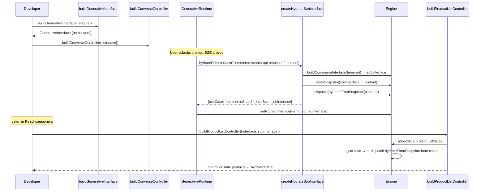
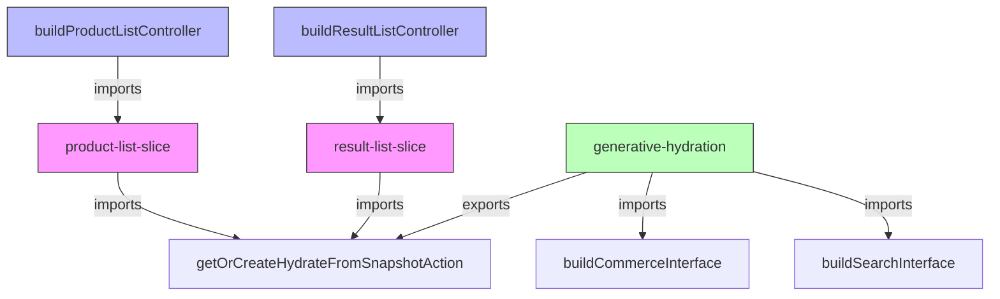

# Design Document: Generative Interface DX Improvement

## Overview

This design simplifies the `buildGenerativeInterface` public API to match the pattern established by `buildSearchInterface` and `buildCommerceInterface` — accepting only `{engine, id?}` — while preserving tree-shaking guarantees and hydration correctness for late-adopted slices.

The core technical challenge is that Redux Toolkit's `combineSlices` with lazy injection (`rootReducer.inject(slice)`) does not replay past actions for newly-injected slices. When the hydration flow dispatches `hydrateFromSnapshot` before a controller builder adopts its slice, the slice's `extraReducers` handler never fires. This design introduces a **snapshot cache + re-dispatch** mechanism on the Engine that ensures late-adopted slices receive hydrated state regardless of adoption order.

### Design Goals

1. **API simplification** — Remove `GenerativeInterfaceOptions`, `ControllerBuilder`, and `BuilderRegistry` from the public surface
2. **Order-independent hydration** — Controllers built after `hydrateFromSnapshot` still produce correct state
3. **Tree-shaking preservation** — Dependency direction remains slice → hydration module (never the reverse)
4. **Minimal blast radius** — Changes are confined to the generative interface, engine adoption path, and hydration module
5. **No internal type leakage** — `FullEngine`, `Operations`, and `EndpointStateScope` must not appear in the public API surface

## Architecture



### Key Architectural Change

**Before**: `hydrateFromSnapshot` is dispatched AFTER builders adopt slices (builders run first).
**After**: `hydrateFromSnapshot` is dispatched BEFORE any controller builder runs. The Engine stores snapshot payloads per sub-interface ID. When `adoptSlice` is called for a slice scoped to that sub-interface, the Engine re-dispatches the stored `hydrateFromSnapshot` action so the newly-adopted slice's `extraReducers` handler fires.

### Dependency Graph (preserves tree-shaking)



The hydration module never imports feature slices. Feature slices import `getOrCreateHydrateFromSnapshotAction` from the hydration module. Controller builders import their respective slices. If the developer never imports a controller builder, the bundler eliminates both the controller and its slice.

## Components and Interfaces

### 1. Simplified `buildGenerativeInterface`

```typescript
// New public API — matches buildSearchInterface / buildCommerceInterface
export interface BuildGenerativeInterfaceOptions {
  engine: Engine;
  id?: string;
}

export type GenerativeInterface = Interface<'generative'> & {
  readonly [SOURCE_ENGINE]: Engine;
};

export function buildGenerativeInterface(
  options: BuildGenerativeInterfaceOptions
): GenerativeInterface;
```

**Changes:**

- Remove `options: GenerativeInterfaceOptions` parameter
- Remove `BUILDER_REGISTRY` symbol property from returned object
- Remove validation requiring at least one controller builder
- Type signature becomes `{engine, id?}` only

### 2. Engine Snapshot Cache (new capability)

```typescript
// Added to FullEngine
interface FullEngine {
  // ... existing methods ...

  /**
   * Stores a hydration snapshot for a given sub-interface ID.
   * When a slice scoped to this ID is later adopted, the engine
   * re-dispatches the hydrateFromSnapshot action automatically.
   */
  storeHydrationSnapshot(
    interfaceId: string,
    content: Record<string, unknown>
  ): void;
}
```

**Implementation in Engine class:**

```typescript
class Engine {
  #hydrationSnapshots = new Map<string, Record<string, unknown>>();

  async #adoptSlice(slice: Slice) {
    if (this.#adoptedSlices.has(slice)) {
      return;
    }

    this.#adoptedSlices.add(slice);
    this.#rootReducer.inject(slice);
    this.#mutate({type: '@@engine/ADOPT_SLICE'});

    // Re-dispatch hydration snapshot if one exists for this slice's scope
    const sliceInterfaceId = this.#extractInterfaceIdFromSliceName(slice.name);
    if (sliceInterfaceId && this.#hydrationSnapshots.has(sliceInterfaceId)) {
      const content = this.#hydrationSnapshots.get(sliceInterfaceId)!;
      const hydrateAction =
        getOrCreateHydrateFromSnapshotAction(sliceInterfaceId);
      this.#mutate(hydrateAction(content));
    }
  }

  #storeHydrationSnapshot(
    interfaceId: string,
    content: Record<string, unknown>
  ) {
    this.#hydrationSnapshots.set(interfaceId, content);
  }

  #extractInterfaceIdFromSliceName(sliceName: string): string | null {
    // Slice names follow pattern: "{interfaceId}/products", "{interfaceId}/results"
    const separatorIndex = sliceName.lastIndexOf('/');
    if (separatorIndex > 0) {
      return sliceName.substring(0, separatorIndex);
    }
    return null;
  }
}
```

**Design rationale**: The slice naming convention `{interfaceId}/{feature}` is already established in the codebase. By extracting the interface ID prefix from the slice name, we can match late-adopted slices to their stored snapshot without introducing new coupling.

### 3. Updated `createHydrateSubInterface`

```typescript
export function createHydrateSubInterface(engine: Engine): HydrateSubInterface {
  const fullEngine = getFullEngine(engine);

  return (activityType: string, content: unknown): RoutedInterface | null => {
    const routedUseCase = ACTIVITY_TYPE_TO_ROUTED_USE_CASE[activityType];
    if (!routedUseCase) {
      return null;
    }

    const contentRecord = content as Record<string, unknown>;

    // Build the correctly-typed sub-interface and construct the discriminated variant
    if (routedUseCase === 'commerceSearch') {
      const subInterface = buildCommerceInterface({engine});
      const subId = subInterface[STATE_ID];
      fullEngine.storeHydrationSnapshot(subId, contentRecord);
      const hydrateAction = getOrCreateHydrateFromSnapshotAction(subId);
      fullEngine.mutate(hydrateAction(contentRecord));
      return {useCase: 'commerceSearch' as const, interface: subInterface};
    }

    const subInterface = buildSearchInterface({engine});
    const subId = subInterface[STATE_ID];
    fullEngine.storeHydrationSnapshot(subId, contentRecord);
    const hydrateAction = getOrCreateHydrateFromSnapshotAction(subId);
    fullEngine.mutate(hydrateAction(contentRecord));
    return {useCase: 'search' as const, interface: subInterface};
  };
}
```

**Changes:**

- Remove `builderRegistry` parameter entirely
- Remove the loop that invokes builders
- Add `storeHydrationSnapshot` call before dispatch
- Simplify use-case mapping (no longer need `ACTIVITY_TYPE_TO_USE_CASE` keyed by builder registry field)

### 4. Updated `buildConverseController`

```typescript
export const buildConverseController = (
  options: ConverseControllerOptions
): ConverseController => {
  const fullEngine = options.interface[ENGINE];
  const stateId = options.interface[STATE_ID];
  const sourceEngine = options.interface[SOURCE_ENGINE];

  // No longer reads BUILDER_REGISTRY
  loadGenerative(fullEngine, stateId);

  const runtime = GenerativeRuntime.getInstance(fullEngine, stateId, {
    statePort: {
      /* unchanged */
    },
    hydrateSubInterface: createHydrateSubInterface(sourceEngine), // no registry param
  });

  // ... rest unchanged
};
```

### 5. Updated Sample App

```typescript
// Before:
const generativeInterface = buildGenerativeInterface({
  engine,
  options: {
    commerceSearchControllers: [buildProductListController],
    searchControllers: [buildResultListController],
  },
});

// After:
const generativeInterface = buildGenerativeInterface({engine});
```

Controllers are now built lazily in React components when the routed interface becomes available — the pattern already shown in `RoutedSearchResults.tsx`.

### 6. Removed Types and Symbols

| Removed                             | Location                  |
| ----------------------------------- | ------------------------- |
| `BUILDER_REGISTRY` symbol           | `symbols.ts`              |
| `BuilderRegistry` interface         | `generative.ts`           |
| `GenerativeInterfaceOptions`        | `generative-types.ts`     |
| `ControllerBuilder` type            | `generative-types.ts`     |
| `ACTIVITY_TYPE_TO_USE_CASE`         | `generative-hydration.ts` |
| `Operations` (from exports)         | `index.ts`                |
| `EndpointStateScope` (from exports) | `index.ts`                |

### 7. FullEngine Encapsulation (public type surface fix)

Currently, `FullEngine` leaks into the public type surface through two paths:

1. **`Interface[ENGINE]`** — The `Interface` type declares `readonly [ENGINE]: FullEngine`
2. **`Requires<T>`** — Uses `readonly [ENGINE]: FullEngine`
3. **`EndpointThunk`** — Typed as `AsyncThunk<void, {engine: FullEngine}, {}>`, exposed through `THUNKS` on interface objects

Since these are all accessed via private symbols, consumers never construct or read these values directly. The fix is to replace `FullEngine` with an opaque branded type in the public-facing type definitions:

```typescript
// Public-facing opaque engine handle — consumers cannot access internal methods
declare const OPAQUE_ENGINE: unique symbol;
export type OpaqueEngine = {readonly [OPAQUE_ENGINE]: never};
```

Then the public `Interface` type becomes:

```typescript
export interface Interface<T extends keyof Operations = keyof Operations> {
  readonly [KIND]: 'interface';
  readonly [STATE_ID]: string;
  readonly [ENGINE]: OpaqueEngine;
  readonly [THUNK_FACTORIES]: Record<Operations[T], EndpointThunkFactory[]>;
  readonly [THUNKS]: Record<Operations[T], EndpointThunk[]>;
}
```

Internally, the actual runtime value stored at `[ENGINE]` remains a `FullEngine` instance. Controller builders and internal code cast through `OpaqueEngine` back to `FullEngine` at their internal module boundary — this is safe because those modules are never imported by consumers.

**Alternative (simpler for PoC):** Since all symbol-keyed properties are already inaccessible to consumers at runtime, we could simply change the public type declaration to use `unknown`:

```typescript
export interface Interface<T extends keyof Operations = keyof Operations> {
  readonly [KIND]: 'interface';
  readonly [STATE_ID]: string;
  readonly [ENGINE]: unknown; // internal — not consumer-facing
  readonly [THUNK_FACTORIES]: unknown;
  readonly [THUNKS]: unknown;
}
```

And internally, modules that need `FullEngine` access use a narrower internal type alias. This is simpler but less self-documenting.

**Chosen approach for PoC:** Use `unknown` for the symbol-keyed properties on the public `Interface` type. Internal modules use a separate `InternalInterface` type that extends `Interface` with proper `FullEngine` typing. This keeps the public `.d.ts` clean while preserving type safety internally.

### 8. Public Export Cleanup

Remove `Operations` and `EndpointStateScope` from `index.ts` public exports. These are internal implementation details that consumers don't need:

```typescript
// Before (in index.ts):
export type {
  Interface,
  ComposedInterface,
  Requires,
  Operations, // ← remove
  EndpointStateScope, // ← remove
} from './core/interface/utils/interface-types.js';

// After:
export type {
  Interface,
  ComposedInterface,
  Requires,
} from './core/interface/utils/interface-types.js';
```

The `Operations` type is only needed internally (for the generic constraint on `Interface<T>`). Consumers interact with concrete interface types like `Interface<'commerce'>` — they never need to reference the `Operations` map directly.

`EndpointStateScope` is purely an internal concept used by thunk factories during interface construction. No consumer code should reference it.

## Data Models

### Snapshot Cache Structure

```typescript
// Internal to Engine — not exposed publicly
type HydrationSnapshotCache = Map<string, Record<string, unknown>>;
```

The cache is a simple `Map<interfaceId, snapshotContent>` stored as a private field on the Engine class. Each entry represents the raw payload from an `ACTIVITY_SNAPSHOT` event, keyed by the sub-interface's `STATE_ID`.

**Lifecycle:**

- **Created**: When `storeHydrationSnapshot(subId, content)` is called during hydration
- **Read**: When `adoptSlice` detects the slice belongs to a cached interface ID
- **Never deleted**: Snapshots remain for the lifetime of the Engine instance. This is intentional — a sub-interface ID is unique per turn, and the data is small (a single API response payload). Clearing would require tracking which slices have been adopted, adding complexity for negligible memory savings.

### State Shape (unchanged)

The Redux state shape remains the same:

```typescript
{
  "configuration": { organizationId, accessToken, ... },
  "{generativeInterfaceId}/generative": { turns: Turn[], activeTurnId: string },
  "{subInterfaceId}/products": { products: Product[] },
  "{subInterfaceId}/results": { results: Result[] }
}
```

### RoutedInterface Type (discriminated union with mapped types)

The `RoutedInterface` type is redesigned as a discriminated union using mapped types. Narrowing on `useCase` also narrows the `interface` field to the concrete interface type, giving developers compile-time safety when building controllers.

```typescript
// Map use-case keys to their concrete interface types
type UseCaseInterfaceMap = {
  commerceSearch: Interface<'commerce'>;
  search: Interface<'search'>;
};

// Discriminated union via mapped type distribution
type RoutedInterface = {
  [K in RoutedUseCase]: {
    useCase: K;
    interface: UseCaseInterfaceMap[K];
  };
}[RoutedUseCase];
```

This expands to the following discriminated union:

```typescript
type RoutedInterface =
  | {useCase: 'commerceSearch'; interface: Interface<'commerce'>}
  | {useCase: 'search'; interface: Interface<'search'>};
```

**Developer usage with narrowing:**

```tsx
if (turn.routedInterface?.useCase === 'commerceSearch') {
  // turn.routedInterface.interface is narrowed to Interface<'commerce'>
  buildProductListController({interface: turn.routedInterface.interface}); // ✓ type-safe
}

if (turn.routedInterface?.useCase === 'search') {
  // turn.routedInterface.interface is narrowed to Interface<'search'>
  buildResultListController({interface: turn.routedInterface.interface}); // ✓ type-safe
}
```

**Key benefits:**

- No type casts needed at the call site
- Passing the wrong controller builder for the wrong use case is a compile error
- The hydration function returns `RoutedInterface | null` (full union) since `activityType` is a runtime string — TypeScript handles the discrimination at the consumer side

**Impact on `createHydrateSubInterface`:**

The hydration function constructs each variant explicitly, allowing TypeScript to verify correctness:

```typescript
if (routedUseCase === 'commerceSearch') {
  return {
    useCase: 'commerceSearch' as const,
    interface: buildCommerceInterface({engine}), // Interface<'commerce'>
  };
} else {
  return {
    useCase: 'search' as const,
    interface: buildSearchInterface({engine}), // Interface<'search'>
  };
}
```

### GenerativeInterface Type (simplified)

```typescript
// Before
type GenerativeInterface = Interface<'generative'> & {
  readonly [BUILDER_REGISTRY]: BuilderRegistry;
  readonly [SOURCE_ENGINE]: Engine;
};

// After
type GenerativeInterface = Interface<'generative'> & {
  readonly [SOURCE_ENGINE]: Engine;
};
```

## Correctness Properties

_A property is a characteristic or behavior that should hold true across all valid executions of a system — essentially, a formal statement about what the system should do. Properties serve as the bridge between human-readable specifications and machine-verifiable correctness guarantees._

### Property 1: Construction succeeds for all valid inputs

_For any_ valid Engine instance and _for any_ optional string `id` (including undefined, empty string, or strings up to 128 characters), `buildGenerativeInterface({engine, id})` SHALL return a frozen GenerativeInterface object with a valid `STATE_ID` and `ENGINE` without throwing an error.

**Validates: Requirements 1.1, 1.2, 6.1**

### Property 2: Hydration produces valid RoutedInterface for recognized activity types

_For any_ recognized activity type (`'commerce-search-api-response'` or `'search-api-response'`) and _for any_ valid content payload (an arbitrary `Record<string, unknown>`), calling the hydration function SHALL return a non-null `RoutedInterface` where:

- `useCase` is `'commerceSearch'` or `'search'` (matching the activity type)
- `interface` is a valid sub-interface with a unique `STATE_ID`
- The snapshot content is stored in the Engine's hydration cache keyed by that `STATE_ID`

**Validates: Requirements 1.4, 2.1, 2.4, 8.1**

### Property 3: Hydration returns null for unrecognized activity types

_For any_ activity type string that is NOT present in the `ACTIVITY_TYPE_TO_ROUTED_USE_CASE` mapping, calling the hydration function SHALL return `null` without dispatching any action or creating any sub-interface.

**Validates: Requirements 2.2**

### Property 4: Late-adoption state equivalence (order independence)

_For any_ valid snapshot content payload, a slice adopted AFTER `hydrateFromSnapshot` has been dispatched SHALL produce identical state to the same slice adopted BEFORE dispatch. Specifically: if we compute `expectedState = slice.reducer(initialState, hydrateAction(content))`, then after late adoption the Engine's state for that slice SHALL equal `expectedState` within the same synchronous frame.

**Validates: Requirements 4.1, 4.2, 4.3, 4.4, 2.3**

### Property 5: Idempotent slice adoption

_For any_ slice instance, calling `engine.adoptSlice(slice)` a second time SHALL be a no-op — the Engine state for that slice SHALL remain identical before and after the duplicate adoption call.

**Validates: Requirements 2.5**

## Error Handling

| Scenario                                                       | Behavior                                                                                                                                                                     | Recovery                                        |
| -------------------------------------------------------------- | ---------------------------------------------------------------------------------------------------------------------------------------------------------------------------- | ----------------------------------------------- |
| `buildGenerativeInterface` called with invalid engine          | Throw immediately (developer error)                                                                                                                                          | Fix call site                                   |
| `hydrateSubInterface` receives null/undefined content          | Store empty object `{}` as snapshot, dispatch with empty payload. Slices that check for their fields gracefully return initial state.                                        | No action needed — slices are defensive         |
| `adoptSlice` called after Engine is disposed                   | Throw "Cannot adopt slice before store is initialized" (existing behavior)                                                                                                   | Ensure Engine lifecycle is correct              |
| Snapshot cache grows unbounded                                 | Acceptable — each entry is one API response payload per unique sub-interface (one per conversational turn). In practice, bounded by session length.                          | No explicit cleanup needed for typical sessions |
| Re-dispatch of `hydrateFromSnapshot` on already-hydrated slice | No-op — the slice reducer produces the same state it already has (idempotent). Redux won't trigger subscriber callbacks since state reference is unchanged.                  | No action needed                                |
| Concurrent slice adoptions for same sub-interface              | Safe — `adoptSlice` is synchronous within the Engine's `#adoptSlice` method. Each adoption re-dispatches independently. Already-adopted slices are guarded by WeakSet check. | No action needed                                |

### Error Handling Design Decisions

1. **No snapshot expiration**: Snapshots are not evicted from the cache. A conversational session typically has < 50 turns, each with one snapshot payload (< 100KB). Total memory overhead is negligible compared to the Redux store itself.

2. **Defensive slice reducers**: Each slice's `extraReducers` handler for `hydrateFromSnapshot` already guards against missing fields (e.g., `if (!payload || !Array.isArray(payload.products)) return;`). This makes irrelevant re-dispatches harmless.

3. **No partial failure rollback**: If a controller builder throws during `adoptSlice`, the slice injection has already occurred (RTK's `inject` is not transactional). This is acceptable per Requirement 2.3 which explicitly allows partial adoption.

## Testing Strategy

### Unit Tests (example-based)

| Test                                                                                   | Validates    |
| -------------------------------------------------------------------------------------- | ------------ |
| `buildGenerativeInterface({engine})` returns frozen interface without BUILDER_REGISTRY | Req 7.1, 7.5 |
| `buildGenerativeInterface({engine, id: 'custom'})` uses provided ID                    | Req 1.1      |
| Passing legacy `options` field is silently ignored                                     | Req 1.3      |
| `createHydrateSubInterface(engine)` accepts single param (no registry)                 | Req 7.2      |
| `buildConverseController` works without BUILDER_REGISTRY on interface                  | Req 7.4      |
| Activity type `'commerce-search-api-response'` maps to useCase `'commerceSearch'`      | Req 8.2      |
| Activity type `'search-api-response'` maps to useCase `'search'`                       | Req 8.3      |
| Turn with routedInterface exposes it via controller state                              | Req 5.3      |

### Integration Tests

| Test                                                                               | Validates    |
| ---------------------------------------------------------------------------------- | ------------ |
| Full SSE stream with ACTIVITY_SNAPSHOT → turn marked complete with routedInterface | Req 5.1, 5.2 |
| Unrecognized ACTIVITY_SNAPSHOT appended as A2UI surface                            | Req 5.4      |
| End-to-end: hydrate → build controller later → read correct state                  | Req 2.3, 4.1 |

### Static Analysis / Smoke Tests

| Test                                                                                       | Validates         |
| ------------------------------------------------------------------------------------------ | ----------------- |
| `generative-hydration.ts` has no imports from `product-list-slice` or `result-list-slice`  | Req 3.3           |
| Feature slices import from `generative-hydration` (not reverse)                            | Req 3.4           |
| `GenerativeInterfaceOptions`, `ControllerBuilder`, `BuilderRegistry` not in public exports | Req 7.3           |
| `Operations`, `EndpointStateScope` not in public exports                                   | Req 9.2           |
| `FullEngine` does not appear in public `.d.ts` output                                      | Req 9.1           |
| TypeScript compilation succeeds with simplified API                                        | Req 6.2, 6.3      |
| TypeScript reports error for excess properties                                             | Req 6.4           |
| Bundle size check: unused controller → zero bytes for its slice                            | Req 3.1, 3.2, 3.5 |

### Property-Based Tests

Property-based tests use **fast-check** (already available in the Vitest ecosystem) with minimum 100 iterations per property.

| Property                              | Tag                                                                                                                                | Generator Strategy                                                                                                                       |
| ------------------------------------- | ---------------------------------------------------------------------------------------------------------------------------------- | ---------------------------------------------------------------------------------------------------------------------------------------- |
| Property 1: Construction              | `Feature: generative-interface-dx-improvement, Property 1: Construction succeeds for all valid inputs`                             | Generate arbitrary strings for `id` (including unicode, empty, max-length). Engine is constructed with minimal valid config.             |
| Property 2: Hydration valid           | `Feature: generative-interface-dx-improvement, Property 2: Hydration produces valid RoutedInterface for recognized activity types` | Pick from recognized activity types × generate arbitrary `Record<string, unknown>` payloads.                                             |
| Property 3: Hydration null            | `Feature: generative-interface-dx-improvement, Property 3: Hydration returns null for unrecognized activity types`                 | Generate arbitrary strings excluding the two recognized types.                                                                           |
| Property 4: Late-adoption equivalence | `Feature: generative-interface-dx-improvement, Property 4: Late-adoption state equivalence`                                        | Generate random product/result payloads with varying array sizes, field presence/absence. Compare early-adoption vs late-adoption state. |
| Property 5: Idempotent adoption       | `Feature: generative-interface-dx-improvement, Property 5: Idempotent slice adoption`                                              | Generate random slices (via getOrCreateProductListSlice with random IDs), adopt twice, compare state snapshots.                          |
