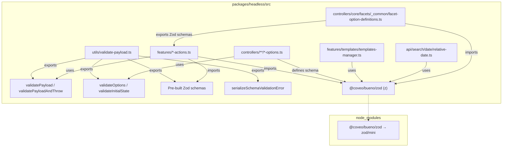

# Design Document: headless-bueno-zod-migration

## Overview

This design covers the big-bang migration of `@coveo/headless` from the class-based `@coveo/bueno` validation API to Zod 4 mini schemas imported through `@coveo/bueno/zod`. The migration touches ~60+ files across action creators, controller options, template validation, date parsing, and type guard utilities.

The key design decisions are:

1. **Central utility rewrite** — `validate-payload.ts` is rewritten to accept Zod schemas instead of Bueno `SchemaDefinition`/`SchemaValue` objects. All call sites pass Zod schemas to the same function signatures, keeping the Redux Toolkit integration pattern unchanged.
2. **Behavioral equivalence over structural equivalence** — The new Zod schemas must accept and reject the exact same inputs as the old Bueno schemas. The internal representation changes, but the observable behavior (action dispatching, error formatting, controller initialization) is preserved.
3. **Inline type guards** — Trivial utilities like `isNullOrUndefined`, `isArray`, `isString` are replaced with native JS checks (`x == null`, `Array.isArray(x)`, `typeof x === 'string'`) rather than introducing a new utility module.
4. **No adapter layer** — There is no Bueno-to-Zod wrapper or compatibility shim. Each file is converted directly to Zod idioms. This avoids runtime overhead and makes the codebase fully Zod-native.

## Architecture



The architecture stays flat — there are no new abstraction layers. The `validate-payload.ts` module remains the central hub for validation utilities, and all downstream files import `z` from `@coveo/bueno/zod` directly.

## Components and Interfaces

### 1. Rewritten `validate-payload.ts`

The central utility module is rewritten to use Zod internally while preserving the public function signatures for Redux Toolkit integration.

```typescript
import * as z from '@coveo/bueno/zod';
import type {SerializedError} from '@reduxjs/toolkit';
import type {CoreEngine, CoreEngineNext} from '../app/engine.js';

// --- Pre-built schemas ---

export const requiredNonEmptyString = z.string().check(z.minLength(1));
export const nonEmptyString = z.optional(z.string().check(z.minLength(1)));
export const requiredEmptyAllowedString = z.string();
export const nonRequiredEmptyAllowedString = z.optional(z.string());

export const nonEmptyStringArray = z.array(z.string().check(z.minLength(1)));

export const optionalNonEmptyVersionString = z.optional(
  z.string().check(z.regex(/^\d+\.\d+\.\d+$/))
);
export const optionalTrackingId = z.optional(
  z.string().check(z.minLength(1), z.regex(/^[a-zA-Z0-9_\-.]{1,100}$/))
);
export const requiredTrackingId = z
  .string()
  .check(z.minLength(1), z.regex(/^[a-zA-Z0-9_\-.]{1,100}$/));

// --- Error serialization ---

export const serializeSchemaValidationError = (
  error: z.ZodError | Error
): SerializedError => ({
  message: error.message,
  name: error.name,
  stack: error.stack,
});

// --- Payload validation ---

export const validatePayloadAndThrow = <P>(
  payload: P,
  schema: z.ZodType<P>
): {payload: P} => {
  schema.parse(payload); // throws ZodError on failure
  return {payload};
};

export const validatePayload = <P>(
  payload: P,
  schema: z.ZodType<P>
): {payload: P; error?: SerializedError} => {
  const result = schema.safeParse(payload);
  if (result.success) {
    return {payload};
  }
  return {
    payload,
    error: serializeSchemaValidationError(result.error),
  };
};

// --- Controller option/state validation ---

export const validateInitialState = <T extends object>(
  engine: CoreEngine | CoreEngineNext,
  schema: z.ZodType<T>,
  obj: T | undefined,
  functionName: string
): T | undefined => {
  const message = `Check the initialState of ${functionName}`;
  return validateObject(engine, schema, obj, message, 'Controller initialization error');
};

export const validateOptions = <T extends object>(
  engine: CoreEngine<object> | CoreEngineNext<object>,
  schema: z.ZodType<T>,
  obj: Partial<T> | undefined,
  functionName: string
): T | undefined => {
  const message = `Check the options of ${functionName}`;
  return validateObject(engine, schema, obj, message, 'Controller initialization error');
};

const validateObject = <T extends object>(
  engine: CoreEngine<object> | CoreEngineNext<object>,
  schema: z.ZodType<T>,
  obj: T | undefined,
  validationMessage: string,
  errorMessage: string
): T | undefined => {
  if (obj === undefined) {
    return undefined;
  }
  try {
    return schema.parse(obj);
  } catch (error) {
    const wrappedError = new Error(
      `${validationMessage}: ${(error as z.ZodError).message}`
    );
    engine.logger.error(wrappedError, errorMessage);
    throw wrappedError;
  }
};
```

**Design rationale:**
- `validatePayload` uses `safeParse` to avoid try/catch overhead in the common case (Redux action creators call this on every dispatch).
- `validatePayloadAndThrow` uses `parse` directly since it's designed to throw.
- `validateOptions`/`validateInitialState` wrap errors with a contextual message (`"Check the options of buildFacet"`) before logging and re-throwing — matching current behavior.
- Pre-built schemas are plain Zod schema instances rather than class instances. This is a breaking change in the internal implementation but not in the public API (callers pass them to `validatePayload` the same way).

### 2. Action Creator Migration Pattern

**Before (Bueno):**
```typescript
import {BooleanValue, StringValue} from '@coveo/bueno';
import {validatePayload} from '../../utils/validate-payload.js';

export const updateQuery = createAction(
  'query/updateQuery',
  (payload: UpdateQueryActionCreatorPayload) =>
    validatePayload(payload, {
      q: new StringValue(),
      enableQuerySyntax: new BooleanValue(),
    })
);
```

**After (Zod):**
```typescript
import * as z from '@coveo/bueno/zod';
import {validatePayload} from '../../utils/validate-payload.js';

export const updateQuery = createAction(
  'query/updateQuery',
  (payload: UpdateQueryActionCreatorPayload) =>
    validatePayload(payload, z.object({
      q: z.optional(z.string()),
      enableQuerySyntax: z.optional(z.boolean()),
    }))
);
```

The call site structure is identical — only the second argument to `validatePayload` changes from a Bueno definition record to a Zod schema.

### 3. Controller Options Migration Pattern

**Before (Bueno):**
```typescript
import {NumberValue, Schema} from '@coveo/bueno';

const optionsSchema = new Schema<Required<PagerOptions>>({
  numberOfPages: new NumberValue({min: 1}),
});

validateOptions(engine, optionsSchema, props.options, 'buildPager');
```

**After (Zod):**
```typescript
import * as z from '@coveo/bueno/zod';

const optionsSchema = z.object({
  numberOfPages: z.optional(z.number().check(z.minimum(1))),
});

validateOptions(engine, optionsSchema, props.options, 'buildPager');
```

### 4. Bueno → Zod Mapping Reference

| Bueno | Zod Mini Equivalent |
|-------|-------------------|
| `new StringValue()` | `z.optional(z.string())` |
| `new StringValue({required: true})` | `z.string()` |
| `new StringValue({required: true, emptyAllowed: false})` | `z.string().check(z.minLength(1))` |
| `new StringValue({required: false, emptyAllowed: false})` | `z.optional(z.string().check(z.minLength(1)))` |
| `new StringValue({constrainTo: values})` | `z.optional(z.enum(values))` |
| `new StringValue({required: true, constrainTo: values})` | `z.enum(values)` |
| `new StringValue({regex: pattern})` | `z.optional(z.string().check(z.regex(pattern)))` |
| `new StringValue({required: true, regex: pattern, emptyAllowed: false})` | `z.string().check(z.minLength(1), z.regex(pattern))` |
| `new NumberValue({min: N})` | `z.optional(z.number().check(z.minimum(N)))` |
| `new NumberValue({required: true, min: N})` | `z.number().check(z.minimum(N))` |
| `new BooleanValue()` | `z.optional(z.boolean())` |
| `new BooleanValue({required: true})` | `z.boolean()` |
| `new ArrayValue({each: X})` | `z.optional(z.array(zodEquivalent(X)))` |
| `new ArrayValue({required: true, each: X})` | `z.array(zodEquivalent(X))` |
| `new ArrayValue({min: M, max: N, each: X})` | `z.array(zodEquivalent(X)).check(z.minLength(M), z.maxLength(N))` |
| `new RecordValue({values: def})` | `z.optional(z.object({...}))` |
| `new RecordValue({options: {required: true}, values: def})` | `z.object({...})` |
| `new Value({required: false})` | `z.optional(z.unknown())` |
| `new Value({required: true})` | `z.unknown()` |
| `new Schema(definition)` | `z.object({...})` |

### 5. Template Manager Migration

**Before:**
```typescript
import {ArrayValue, NumberValue, Schema, Value} from '@coveo/bueno';

const templateSchema = new Schema({
  content: new Value({required: true}),
  conditions: new Value({required: true}),
  priority: new NumberValue({required: false, default: 0, min: 0}),
  fields: new ArrayValue({required: false, each: requiredNonEmptyString}),
});
```

**After:**
```typescript
import * as z from '@coveo/bueno/zod';
import {requiredNonEmptyString} from '../../utils/validate-payload.js';

const templateSchema = z.object({
  content: z.unknown(),
  conditions: z.unknown(),
  priority: z.optional(z.number().check(z.minimum(0))),
  fields: z.optional(z.array(requiredNonEmptyString)),
});
```

Note: The `default: 0` from NumberValue is handled at the application level (the existing code already applies the default via `template.priority ?? 0` logic in the manager), not in the schema.

### 6. Relative Date Migration

**Before:**
```typescript
const buildRelativeDateDefinition = (period: RelativeDatePeriod) => {
  const isNow = period === 'now';
  return {
    amount: new NumberValue({required: !isNow, min: 1}),
    unit: new StringValue({required: !isNow, constrainTo: validRelativeDateUnits}),
    period: new StringValue({required: true, constrainTo: validRelativeDatePeriods}),
  };
};
```

**After:**
```typescript
const nowSchema = z.object({
  period: z.enum(['now']),
  amount: z.optional(z.number().check(z.minimum(1))),
  unit: z.optional(z.enum(validRelativeDateUnits as [string, ...string[]])),
});

const pastOrNextSchema = z.object({
  period: z.enum(['past', 'next']),
  amount: z.number().check(z.minimum(1)),
  unit: z.enum(validRelativeDateUnits as [string, ...string[]]),
});

const relativeDateSchema = z.union([nowSchema, pastOrNextSchema]);
```

Using a discriminated union (`z.union`) makes the conditional validation explicit and type-safe, replacing the dynamic `buildRelativeDateDefinition` function pattern.

### 7. Type Guard Replacement

All `isNullOrUndefined(x)` calls become `x == null` (loose equality covers both `null` and `undefined`). Other type guards:

```typescript
// Before
import {isNullOrUndefined, isArray, isString} from '@coveo/bueno';

// After — inline checks, no import needed
x == null           // replaces isNullOrUndefined(x)
Array.isArray(x)    // replaces isArray(x)
typeof x === 'string'  // replaces isString(x)
typeof x === 'number'  // replaces isNumber(x)
```

### 8. Facet Option Definitions Migration

**Before (`facet-option-definitions.ts`):**
```typescript
import {ArrayValue, BooleanValue, NumberValue, RecordValue, StringValue} from '@coveo/bueno';

export const facetId = new StringValue({regex: /^[a-zA-Z0-9-_]+$/});
export const field = new StringValue({required: true});
export const numberOfValues = new NumberValue({min: 1});
// ...
```

**After:**
```typescript
import * as z from '@coveo/bueno/zod';

export const facetId = z.optional(z.string().check(z.regex(/^[a-zA-Z0-9-_]+$/)));
export const field = z.string();
export const numberOfValues = z.optional(z.number().check(z.minimum(1)));
export const filterFacetCount = z.optional(z.boolean());
export const injectionDepth = z.optional(z.number().check(z.minimum(0)));
// ...

export const allowedValues = z.optional(z.object({
  type: z.enum(['simple']),
  values: z.array(z.string().check(z.minLength(1))).check(z.maxLength(25)),
}));

export const customSort = z.optional(
  z.array(z.string().check(z.minLength(1))).check(z.minLength(1), z.maxLength(25))
);
```

## Data Models

No new data models are introduced. All existing TypeScript interfaces (action payload types, controller option types) remain unchanged. The migration only changes the runtime validation implementation — the type system sees the same shapes.

Key preserved interfaces:
- `UpdateQueryActionCreatorPayload`, `RegisterFacetActionCreatorPayload`, etc.
- `PagerOptions`, `SearchBoxOptions`, `FacetOptions`, etc.
- `RelativeDate`, `Template<ItemType>`

## Correctness Properties

*A property is a characteristic or behavior that should hold true across all valid executions of a system — essentially, a formal statement about what the system should do. Properties serve as the bridge between human-readable specifications and machine-verifiable correctness guarantees.*

### Property 1: Schema Mapping Equivalence

*For any* Bueno schema definition (using StringValue, NumberValue, BooleanValue, ArrayValue, RecordValue, or Value) and *for any* input value, the translated Zod schema SHALL produce the same accept/reject verdict as the original Bueno schema.

**Validates: Requirements 3.1, 3.2, 3.3, 3.4, 3.5, 3.6, 3.7, 3.10, 3.11, 4.1, 5.1, 6.1, 9.1, 9.3**

### Property 2: validatePayload Contract

*For any* Zod schema and *for any* payload, `validatePayload(payload, schema)` SHALL return `{payload}` with no `error` field when the payload satisfies the schema, and SHALL return `{payload, error}` where `error` is a valid `SerializedError` (with `message`, `name`, and `stack` properties) when the payload does not satisfy the schema. The `payload` in the return is always the original input unchanged.

**Validates: Requirements 2.1, 2.2, 8.1, 8.2**

### Property 3: Pre-built Schema Equivalence

*For any* string value (including empty string, whitespace-only strings, and strings matching/not-matching version/tracking-id patterns), the pre-built Zod schemas (`requiredNonEmptyString`, `nonEmptyString`, `requiredEmptyAllowedString`, `nonRequiredEmptyAllowedString`, `nonEmptyStringArray`, `optionalNonEmptyVersionString`, `optionalTrackingId`, `requiredTrackingId`) SHALL accept the value if and only if the original Bueno pre-built instances would have accepted it.

**Validates: Requirements 2.3, 2.4, 2.5**

### Property 4: Error Serialization Shape

*For any* `ZodError` instance, `serializeSchemaValidationError(error)` SHALL produce an object with `message` (string), `name` (string), and `stack` (string or undefined) properties conforming to the Redux Toolkit `SerializedError` interface.

**Validates: Requirements 2.6**

### Property 5: Controller Validation Contract

*For any* Zod object schema and *for any* options/initialState object, `validateOptions`/`validateInitialState` SHALL return the parsed value when the object satisfies the schema, and SHALL throw an error and call `engine.logger.error` with a message containing the function name when the object does not satisfy the schema.

**Validates: Requirements 2.7, 4.2, 4.3, 4.4, 8.3**

### Property 6: Relative Date Conditional Validation

*For any* `RelativeDate` object where `period` is `'past'` or `'next'`, the schema SHALL reject the object if `amount` is missing or less than 1, or if `unit` is missing or not one of the valid units. *For any* `RelativeDate` object where `period` is `'now'`, the schema SHALL accept the object regardless of `amount` and `unit` values.

**Validates: Requirements 6.2, 6.3**

## Error Handling

| Scenario | Handling |
|----------|----------|
| Invalid payload in action creator | `validatePayload` returns `{payload, error}` where `error` is a `SerializedError`. Redux Toolkit attaches it to the action's `error` field. No throw. |
| Invalid payload in `validatePayloadAndThrow` | `ZodError` is thrown directly. Callers must catch. |
| Invalid controller options | `validateOptions` catches the `ZodError`, wraps it with a contextual message (`"Check the options of buildFacet: ..."`), logs via `engine.logger.error`, then re-throws. |
| Invalid controller initial state | Same as invalid options but with `"Check the initialState of ..."` message. |
| Invalid template registration | `templateSchema.parse(template)` throws `ZodError`. Additionally, the function-condition check throws a custom `Error` with a descriptive message about conditions. |
| Invalid relative date | `relativeDateSchema.parse(date)` throws `ZodError` with details about which fields are invalid. The wrapper `validateRelativeDate` may throw additional custom errors for format violations. |
| Zod import failure | If `@coveo/bueno/zod` is not resolvable, the build fails at compile time (ESM import resolution). This is caught during `pnpm run build`. |

## Testing Strategy

### Property-Based Tests (Vitest + fast-check)

Property-based testing is highly applicable to this migration because the core requirement is **behavioral equivalence** — for all possible inputs, new schemas must accept/reject identically to old schemas. This is a classic property that benefits from randomized input generation.

**Library**: `fast-check` (already well-suited for TypeScript, generates arbitrary strings, numbers, objects)

**Configuration**: Minimum 100 iterations per property test.

**Tag format**: `Feature: headless-bueno-zod-migration, Property {number}: {property_text}`

| Property Test | Validates |
|---------------|-----------|
| Schema mapping equivalence for string schemas (required/optional, empty/non-empty, constrained, regex) | Property 1 |
| Schema mapping equivalence for number schemas (required/optional, min/max) | Property 1 |
| Schema mapping equivalence for array schemas (element types, length constraints) | Property 1 |
| validatePayload returns correct shape for valid/invalid payloads | Property 2 |
| Pre-built schema equivalence (requiredNonEmptyString, nonEmptyString, etc.) | Property 3 |
| serializeSchemaValidationError produces valid SerializedError | Property 4 |
| validateOptions/validateInitialState contract (pass/throw behavior) | Property 5 |
| Relative date conditional validation (now vs past/next) | Property 6 |

### Unit Tests (Vitest)

Unit tests cover specific examples, edge cases, and integration points:

- Boolean schema mapping (limited input space — true, false, undefined, null)
- Template validation: valid template registers, invalid throws, non-function condition throws
- Relative date edge cases: `{period: 'now'}` with no amount/unit passes; `{period: 'past', amount: 0}` fails
- Error message content: validation failure messages contain field names
- `validatePayloadAndThrow` throws on invalid input (not just returns error)

### Smoke Tests

- Zero `import ... from '@coveo/bueno'` statements in `packages/headless/src/**/*.ts` (source + test)
- All validation-using files import from `@coveo/bueno/zod`
- No remaining `isNullOrUndefined`, `isArray`, `isString`, `isNumber` imports from bueno
- TypeScript compilation succeeds (`tsc --noEmit`)
- Full test suite passes (`pnpm run test` in headless package)

### Integration Tests

- Action creators dispatch with valid payloads (no error field)
- Action creators produce serialized error on invalid payloads
- Controller initialization throws and logs on invalid options
- Existing headless build succeeds (`pnpm run build` in headless package)
