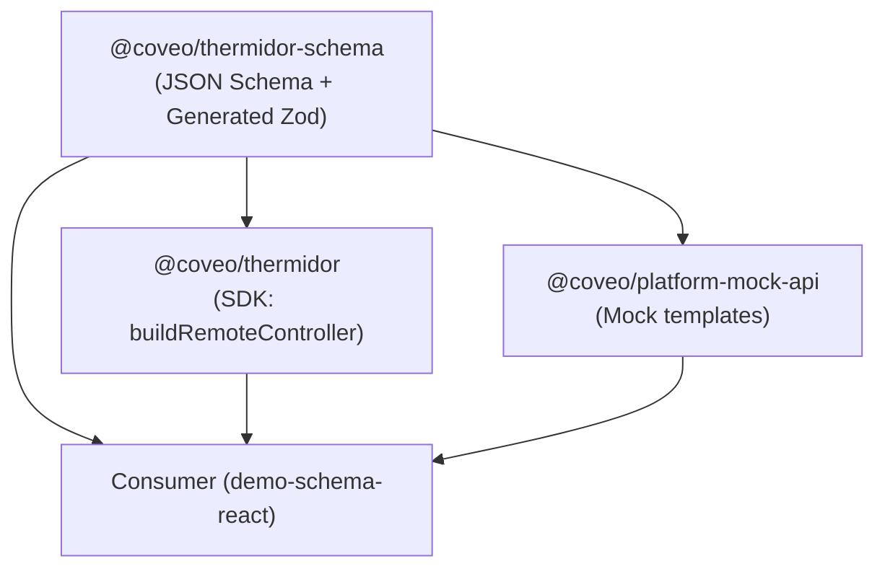
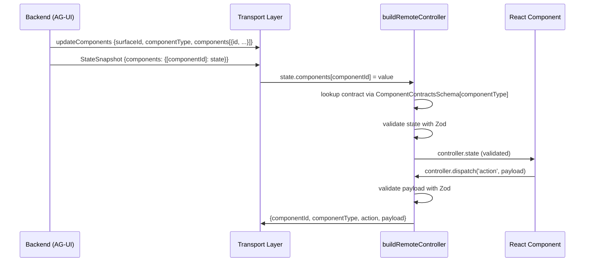

# Design Document: Remove Controllers from Schema

## Overview

This design implements Option B from ADR-006: removing the `controllers` abstraction from the Thermidor public schema and exposing `state` and `actions` directly on each component. The change affects three packages (`@coveo/thermidor-schema`, `@coveo/thermidor`, `@coveo/platform-mock-api`) across four layers: JSON Schema source-of-truth, Zod code generation, SDK runtime, and mock server templates.

The goal is a flatter, more consumer-friendly public contract. The SDK continues to encapsulate resolution, validation, caching, and dispatch internally via `buildRemoteController` — only its parameters change.

### Key Concepts

| Before (Option A) | After (Option B) |
|---|---|
| `controllerSchema` URI as discriminant | `componentType` string literal as discriminant |
| `controllerId` for instance correlation | `componentId` (globally unique) for instance correlation |
| `ControllerContractsSchema` (Zod union) | `ComponentContractsSchema` (Zod union) |
| `state.controllers[controllerId]` | `state.components[componentId]` |
| Nested `controllers` map in component props | Flat `componentId` + `componentType` props |

---

## Architecture

### Package Dependency Flow



### Data Flow: Component State Resolution



### Layers of Change

1. **JSON Schema layer** — Source of truth. Component contracts replace controller contracts.
2. **Generation layer** — Script reads schemas, emits Zod. Entry point and heuristics change.
3. **Runtime layer** — SDK resolves state and dispatches actions using new identifiers.
4. **Mock layer** — Test templates emit the new transport message structure.
5. **Consumer layer** — Sample app adapts to flat props and new hook API.

---

## Components and Interfaces

### Layer 1: JSON Schema (`packages/thermidor-schema/schema/`)

#### New `base/component.schema.json`

```json
{
  "$schema": "https://json-schema.org/draft/2020-12/schema",
  "$id": "https://schema.thermidor.coveo.com/base/component.schema.json",
  "title": "Component",
  "description": "A Component is a discrete, renderable UI element. Components describe what can be rendered, not how it is rendered. Each component has a type, an observable state, and a set of available actions.",
  "type": "object",
  "required": ["componentId", "displayName", "componentType", "state", "actions"],
  "properties": {
    "componentId": {
      "type": "string",
      "pattern": "^[a-z][a-z0-9-]*$",
      "description": "Stable kebab-case identifier for this component (e.g. 'product-carousel'). Must be unique within a Catalog."
    },
    "displayName": {
      "type": "string",
      "description": "Human-readable name for this component (e.g. 'Product Carousel')."
    },
    "description": {
      "type": "string",
      "description": "Human-readable description of this component's purpose and rendering intent."
    },
    "componentType": {
      "type": "string",
      "pattern": "^[a-z][a-z0-9]*(-[a-z0-9]+)*$",
      "maxLength": 128,
      "description": "Stable kebab-case type identifier (e.g. 'cart'). Used as discriminant for contract resolution."
    },
    "state": {
      "type": "object",
      "description": "The observable state owned by the backend. An empty object {} is valid for components with no observable state."
    },
    "actions": {
      "type": "object",
      "description": "Map of available actions. Each value conforms to base/action.schema.json. An empty object {} is valid for read-only components.",
      "additionalProperties": {
        "$ref": "https://schema.thermidor.coveo.com/base/action.schema.json"
      }
    }
  },
  "additionalProperties": false
}
```

Key changes from current:
- Removes `controllers` property entirely
- Adds `componentType`, `state`, `actions` as required top-level properties
- `additionalProperties: false` ensures `controllers` is rejected

#### Removal: `base/controller.schema.json`

This file is deleted. No other schema references it after migration.

#### New Component Contract Pattern

Each controller schema file (e.g., `controllers/cart.schema.json`) is replaced by a component contract file under a new `components/` structure. Example for Cart:

**`schema/components/cart.schema.json`** (replaces both the current component file and controller file):

```json
{
  "$schema": "https://json-schema.org/draft/2020-12/schema",
  "$id": "https://schema.thermidor.coveo.com/components/cart.schema.json",
  "title": "Cart",
  "description": "Renders the current cart contents and exposes actions for the frontend to manage line items.",
  "allOf": [{"$ref": "https://schema.thermidor.coveo.com/base/component.schema.json"}],
  "properties": {
    "componentType": {
      "type": "string",
      "const": "cart"
    },
    "state": {"$ref": "#/$defs/CartState"},
    "actions": {
      "type": "object",
      "required": ["setItems", "updateItemQuantity"],
      "properties": {
        "setItems": {"$ref": "#/$defs/SetItemsAction"},
        "updateItemQuantity": {"$ref": "#/$defs/UpdateItemQuantityAction"}
      },
      "additionalProperties": false
    }
  },
  "additionalProperties": false,
  "$defs": {
    "CartState": {
      "title": "CartState",
      "description": "The current contents of the cart.",
      "type": "object",
      "required": ["items"],
      "properties": {
        "items": {
          "type": "array",
          "description": "The current line items in the cart.",
          "items": {
            "$ref": "https://schema.thermidor.coveo.com/definitions/cart-item.schema.json"
          }
        }
      },
      "additionalProperties": false
    },
    "SetItemsAction": {
      "title": "setItems",
      "description": "Replaces the entire cart contents with the provided list of items.",
      "allOf": [{"$ref": "https://schema.thermidor.coveo.com/base/action.schema.json"}],
      "properties": {
        "payload": {
          "type": "object",
          "required": ["items"],
          "properties": {
            "items": {
              "type": "array",
              "items": {
                "$ref": "https://schema.thermidor.coveo.com/definitions/cart-item.schema.json"
              }
            }
          },
          "additionalProperties": false
        }
      }
    },
    "UpdateItemQuantityAction": {
      "title": "updateItemQuantity",
      "description": "Updates the quantity of a single existing cart line item.",
      "allOf": [{"$ref": "https://schema.thermidor.coveo.com/base/action.schema.json"}],
      "properties": {
        "payload": {
          "type": "object",
          "required": ["item"],
          "properties": {
            "item": {
              "$ref": "https://schema.thermidor.coveo.com/definitions/cart-item.schema.json"
            }
          },
          "additionalProperties": false
        }
      }
    }
  }
}
```

#### Component Type Mapping

| Current Controller File | New Component Schema | `componentType` literal |
|---|---|---|
| `controllers/product-list.schema.json` | `components/product-carousel.schema.json` | `"product-carousel"` |
| `controllers/cart.schema.json` | `components/cart.schema.json` | `"cart"` |
| `controllers/next-actions.schema.json` | `components/next-actions-bar.schema.json` | `"next-actions-bar"` |
| `controllers/bundle-display.schema.json` | `components/bundle-display.schema.json` | `"bundle-display"` |
| `controllers/comparison-table.schema.json` | `components/comparison-table.schema.json` | `"comparison-table"` |

#### New `component-contracts.schema.json`

Replaces `controllers/controller-contracts.schema.json`:

```json
{
  "$schema": "https://json-schema.org/draft/2020-12/schema",
  "$id": "https://schema.thermidor.coveo.com/components/component-contracts.schema.json",
  "title": "Component Contracts",
  "description": "Discriminated index of component runtime contracts. componentType is the stable discriminant; componentId identifies a particular instance outside this static contract.",
  "$defs": {
    "ComponentContracts": {
      "title": "ComponentContracts",
      "oneOf": [
        {"$ref": "https://schema.thermidor.coveo.com/components/product-carousel.schema.json"},
        {"$ref": "https://schema.thermidor.coveo.com/components/cart.schema.json"},
        {"$ref": "https://schema.thermidor.coveo.com/components/next-actions-bar.schema.json"},
        {"$ref": "https://schema.thermidor.coveo.com/components/bundle-display.schema.json"},
        {"$ref": "https://schema.thermidor.coveo.com/components/comparison-table.schema.json"}
      ]
    }
  }
}
```

#### Directory Structure (After)

```
schema/
├── base/
│   ├── action.schema.json       (unchanged)
│   ├── catalog.schema.json      (unchanged)
│   └── component.schema.json    (rewritten — no controllers)
├── components/
│   ├── component-contracts.schema.json  (NEW — replaces controllers/controller-contracts)
│   ├── bundle-display.schema.json       (rewritten — inline state+actions)
│   ├── cart.schema.json                 (rewritten — inline state+actions)
│   ├── comparison-table.schema.json     (rewritten — inline state+actions)
│   ├── next-actions-bar.schema.json     (rewritten — inline state+actions)
│   └── product-carousel.schema.json     (rewritten — inline state+actions)
└── definitions/
    ├── action-item.schema.json          (unchanged)
    ├── bundle-tier.schema.json          (unchanged)
    ├── cart-item.schema.json            (unchanged)
    ├── comparison-attribute.schema.json (unchanged)
    ├── comparison-product.schema.json   (unchanged)
    └── product.schema.json             (unchanged)
```

The entire `controllers/` directory is deleted.

---

### Layer 2: Code Generation (`scripts/generate-zod.ts`)

#### Entry Point Change

```diff
-function loadControllerIndex(documents: Map<string, SchemaDocument>): SchemaDocument {
-  const id = 'https://schema.thermidor.coveo.com/controllers/controller-contracts.schema.json';
+function loadComponentIndex(documents: Map<string, SchemaDocument>): SchemaDocument {
+  const id = 'https://schema.thermidor.coveo.com/components/component-contracts.schema.json';
   const document = documents.get(id);
   if (!document) {
-    throw new Error(`Unable to find controller index ${id}.`);
+    throw new Error(`Unable to find component index ${id}.`);
   }
   return document;
 }
```

#### Detection Heuristic Change

```diff
-function loadControllerDocuments(documents: SchemaDocument[]): SchemaDocument[] {
-  return documents.filter(
-    (document) => document.properties?.controllerSchema?.const === document.$id
-  );
-}
+function loadComponentContractDocuments(documents: SchemaDocument[]): SchemaDocument[] {
+  return documents.filter(
+    (document) => typeof document.properties?.componentType?.const === 'string'
+  );
+}
```

The heuristic detects component contract documents by the presence of `properties.componentType.const` (a string literal).

#### Discriminator Change

```diff
 function loadDiscriminatedUnions(
-  index: SchemaDocument,
+  index: SchemaDocument,
   documents: SchemaDocument[]
 ): DiscriminatedUnion[] {
-  const union = loadControllerUnion(index);
+  const union = loadComponentUnion(index);
   return [
     {
       typeName: loadSchemaTitle(union),
-      discriminator: 'controllerSchema',
-      memberTypeNames: loadControllerDocuments(documents).map(loadSchemaTitle),
+      discriminator: 'componentType',
+      memberTypeNames: loadComponentContractDocuments(documents).map(loadSchemaTitle),
     },
   ];
 }
```

#### Component Props Schema Generation

```diff
-function loadComponentPropsEntries(documents: Map<string, SchemaDocument>): ComponentPropsEntry[] {
-  // reads doc.properties?.controllers?.properties
-  // outputs z.object({ controllers: z.object({ name: z.object({ controllerId, controllerSchema }) }) })
-}
+interface ComponentPropsEntry {
+  componentName: string;
+  schemaName: string;
+  componentType: string;
+}
+
+function loadComponentPropsEntries(documents: Map<string, SchemaDocument>): ComponentPropsEntry[] {
+  const entries: ComponentPropsEntry[] = [];
+  for (const [id, doc] of documents) {
+    if (!id.includes('/components/') || id.includes('component-contracts')) continue;
+    const title = doc.title as string | undefined;
+    const componentType = doc.properties?.componentType?.const as string | undefined;
+    if (!title || !componentType) continue;
+    entries.push({
+      componentName: title,
+      schemaName: `${title}Props`,
+      componentType,
+    });
+  }
+  return entries.sort((a, b) => a.componentName.localeCompare(b.componentName));
+}
+
+function renderComponentPropsSchemas(entries: ComponentPropsEntry[]): string[] {
+  const output: string[] = ['', '// Component props schemas (generated from schema/components/)'];
+  for (const entry of entries) {
+    output.push(
+      `export const ${entry.schemaName}Schema = z.object({`,
+      `  componentId: z.string(),`,
+      `  componentType: z.literal("${entry.componentType}"),`,
+      '});',
+      `export type ${entry.schemaName} = z.infer<typeof ${entry.schemaName}Schema>;`,
+      ''
+    );
+  }
+  return output;
+}
```

#### State/Payload Extraction

The `loadControllerStateEntry` and `loadControllerPayloadEntries` functions are renamed to `loadComponentStateEntry` and `loadComponentPayloadEntries`. They now look for `state` and `actions` at the top level of the component contract (where they already are — the same relative position as the controller contracts).

---

### Layer 3: Generated Zod Output (`src/generated/schemas.ts`)

#### ComponentContractsSchema

```typescript
export const ComponentContractsSchema = z.discriminatedUnion('componentType', [
  CartSchema,
  ProductCarouselSchema,
  NextActionsBarSchema,
  BundleDisplaySchema,
  ComparisonTableSchema,
]);
export type ComponentContracts = z.infer<typeof ComponentContractsSchema>;
```

#### Example Component Contract Schema (Cart)

```typescript
export const CartSchema = z.strictObject({
  componentType: z.literal('cart'),
  state: CartStateSchema,
  actions: z.strictObject({
    setItems: SetItemsSchema,
    updateItemQuantity: UpdateItemQuantitySchema,
  }),
});
export type Cart = z.infer<typeof CartSchema>;
```

#### Simplified Props Schemas

```typescript
export const CartPropsSchema = z.object({
  componentId: z.string(),
  componentType: z.literal('cart'),
});
export type CartProps = z.infer<typeof CartPropsSchema>;

export const ProductCarouselPropsSchema = z.object({
  componentId: z.string(),
  componentType: z.literal('product-carousel'),
});
export type ProductCarouselProps = z.infer<typeof ProductCarouselPropsSchema>;
```

#### Preserved Schemas (Unchanged)

All entity, state, payload, and action schemas remain identical:
- `ProductSchema`, `CartItemSchema`, `ActionItemSchema`, `BundleSlotSchema`, `BundleTierSchema`, `ComparisonAttributeSchema`, `ComparisonProductSchema`
- `CartStateSchema`, `ProductListStateSchema`, `NextActionsStateSchema`, `BundleDisplayStateSchema`, `ComparisonTableStateSchema`
- `SetItemsPayloadSchema`, `UpdateItemQuantityPayloadSchema`, `SelectActionPayloadSchema`

---

### Layer 4: SDK Runtime (`packages/thermidor/src/public/controllers/remote/remote-controller.ts`)

#### New Types

```typescript
import {ComponentContractsSchema, type ComponentContracts} from '@coveo/thermidor-schema';

export type ComponentType = ComponentContracts['componentType'];

export type RemoteControllerContractSchemaFor<TComponentType extends ComponentType> = Extract<
  (typeof ComponentContractsSchema)['options'][number],
  {shape: {componentType: {value: TComponentType}}}
>;

export type RemoteControllerStateForSchema<TComponentType extends ComponentType> = z.infer<
  RemoteControllerContractSchemaFor<TComponentType>['shape']['state']
>;

export type RemoteControllerActionNameForSchema<TComponentType extends ComponentType> =
  keyof z.infer<RemoteControllerContractSchemaFor<TComponentType>['shape']['actions']> & string;

export type RemoteControllerActionPayloadForSchema<
  TComponentType extends ComponentType,
  TAction extends RemoteControllerActionNameForSchema<TComponentType>,
> = z.infer<RemoteControllerContractSchemaFor<TComponentType>['shape']['actions']> extends Record<
  TAction,
  {payload: infer TPayload}
>
  ? TPayload
  : never;
```

#### New Action Interface

```typescript
export interface RemoteControllerAction<TAction extends string = string, TPayload = unknown> {
  componentId: string;
  componentType: string;
  action: TAction;
  payload: TPayload;
}
```

#### New Options Interface

```typescript
export interface RemoteControllerOptions<TComponentType extends ComponentType> {
  source: RemoteControllerSource;
  componentId: string;
  componentType: TComponentType;
}
```

#### New `buildRemoteController` Signature

```typescript
export function buildRemoteController<TComponentType extends ComponentType>(
  options: RemoteControllerOptions<TComponentType>
): RemoteController<TComponentType> {
  const contract = findComponentContract(options.componentType);
  return new RemoteControllerImpl(options.source, options.componentId, options.componentType, contract);
}

function findComponentContract<TComponentType extends ComponentType>(
  componentType: TComponentType
): RemoteControllerContractSchemaFor<TComponentType> {
  const contract = ComponentContractsSchema.options.find(
    (candidate): candidate is RemoteControllerContractSchemaFor<TComponentType> =>
      candidate.shape.componentType.value === componentType
  );
  if (!contract) {
    throw new Error(`Unknown component contract: ${componentType}.`);
  }
  return contract;
}
```

#### State Resolution

```typescript
const EMPTY_REMOTE_CONTROLLER_STATE = {};

export function selectRemoteControllerState(
  state: RemoteControllerSource['state'],
  componentId: string
): unknown {
  const snapshot = state.activeTurn?.agentResponse?.state;
  if (!isRecord(snapshot)) {
    return EMPTY_REMOTE_CONTROLLER_STATE;
  }

  const components = snapshot['components'];
  if (!isRecord(components)) {
    return EMPTY_REMOTE_CONTROLLER_STATE;
  }

  const componentState = components[componentId];
  if (!isRecord(componentState)) {
    return EMPTY_REMOTE_CONTROLLER_STATE;
  }

  return componentState;
}
```

#### Dispatch

```typescript
dispatch<TAction extends RemoteControllerActionNameForSchema<TComponentType>>(
  action: TAction,
  payload: RemoteControllerActionPayloadForSchema<TComponentType, TAction>
): Promise<void> {
  // ... payload validation unchanged ...
  return this.source.dispatchAction({
    componentId: this.componentId,
    componentType: this.componentType,
    action,
    payload: result.data,
  });
}
```

#### RemoteController Interface

```typescript
export interface RemoteController<TComponentType extends ComponentType> extends Controller<
  RemoteControllerStateForSchema<TComponentType> | undefined
> {
  readonly componentId: string;
  dispatch<TAction extends RemoteControllerActionNameForSchema<TComponentType>>(
    action: TAction,
    payload: RemoteControllerActionPayloadForSchema<TComponentType, TAction>
  ): Promise<void>;
}
```

#### Removed Exports

- `RemoteControllerSchemaId` — replaced by `ComponentType`
- `AdvertisedRemoteController` — removed (was just a type alias)

---

### Layer 5: Platform Mock API (`packages/platform-mock-api/`)

#### ActivitySnapshot Template Change

```diff
 const surfaceActivitySnapshot: ConverseEvent = ActivitySnapshot({
   messageId: 'activity-next-actions-fallback',
   activityType: 'a2ui-surface',
   replace: true,
   content: {
     messages: [{
       version: 'v1.0',
       createSurface: {
         surfaceId: 'next-actions-surface',
         catalogId: 'https://schema.thermidor.coveo.com/a2-ui/catalog.json',
         components: [{
-          id: 'root',
+          id: 'next-actions-root',
           component: 'NextActionsBar',
-          props: {
-            controllers: {
-              nextActionsController: {
-                controllerId: 'next-actions-ctrl-1',
-                controllerSchema: 'https://schema.thermidor.coveo.com/controllers/next-actions.schema.json',
-              },
-            },
-          },
+          props: {},
         }],
       },
     }],
   },
 });
```

Note: The `id` field on each component node (e.g., `'next-actions-root'`) is the `componentId`. It is globally unique and serves as the sole state correlation key: `state.components[componentId]`.

#### StateSnapshot Template Change

```diff
 const stateSnapshot: ConverseEvent = StateSnapshot({
-  controllers: {
-    'next-actions-ctrl-1': {
+  components: {
+    'next-actions-root': {
       actions: [
         {text: 'Show me popular products', type: 'followup'},
         {text: 'sports equipment', type: 'search'},
         {text: 'outdoor gear', type: 'search'},
       ],
     },
   },
 });
```

The state is now indexed by `componentId` (the globally unique `id` field of the component node) instead of `controllerId` (from the component props).

#### Affected Template Files

All four templates follow the same pattern:
1. `schema-response-fallback.ts` — NextActionsBar
2. `schema-response-discovery.ts` — ProductCarousel (search results)
3. `schema-response-comparison.ts` — ComparisonTable
4. `schema-response-bundle.ts` — BundleDisplay + ProductCarousels
5. `schema-response-search.ts` — ProductCarousel

#### Removed Constants

All controller schema URI constants (`PRODUCT_LIST_CONTROLLER_SCHEMA`, `NEXT_ACTIONS_CONTROLLER_SCHEMA`, etc.) are removed. They are no longer part of the transport contract.

---

### Layer 6: Package Exports

#### `@coveo/thermidor-schema` (`src/index.ts`)

**Added exports:**
- `ComponentContractsSchema`, `ComponentContracts`
- `CartSchema`, `ProductCarouselSchema`, `NextActionsBarSchema`, `BundleDisplaySchema`, `ComparisonTableSchema` (component contract schemas + types)

**Removed exports:**
- `ControllerContractsSchema`, `ControllerContracts`
- `CartControllerContractSchema`, `ProductListControllerContractSchema`, `NextActionsControllerContractSchema`, `BundleDisplayControllerContractSchema`, `ComparisonTableControllerContractSchema`

**Updated exports:**
- Props schemas remain exported with same names but produce flat `{componentId, componentType}` shapes

**Unchanged exports:**
- All state, entity, and payload schemas + types

#### `@coveo/thermidor` (`src/public/controllers/index.ts`)

**Added exports:**
- `ComponentType`

**Removed exports:**
- `RemoteControllerSchemaId`
- `AdvertisedRemoteController`

**Updated exports:**
- `RemoteController<TComponentType>` (generic changes from schema ID to component type)
- `RemoteControllerOptions<TComponentType>`
- `RemoteControllerContractSchemaFor<TComponentType>`
- `RemoteControllerStateForSchema<TComponentType>`
- `RemoteControllerActionNameForSchema<TComponentType>`
- `RemoteControllerActionPayloadForSchema<TComponentType>`

---

### Layer 7: Sample Consumer (`samples/thermidor/demo-schema-react`)

The demo-schema-react sample is a consumer of both `@coveo/thermidor-schema` and `@coveo/thermidor`. It demonstrates the contract-driven rendering pattern and must be updated to use the new Option B API.

#### `src/a2ui/controllers.tsx` — Consumer Hook

**Before (Option A):**

```typescript
import {
  buildRemoteController,
  type AdvertisedRemoteController,
  type RemoteControllerSource,
} from '@coveo/thermidor';
import type {ControllerContracts} from '@coveo/thermidor-schema';

type ControllerSchemaId = ControllerContracts['controllerSchema'];

export type ControllerAdvertisement<TSchema extends ControllerSchemaId = ControllerSchemaId> = {
  controllerId: string;
  controllerSchema: TSchema;
};

export function useAdvertisedController<TSchema extends ControllerSchemaId>(
  source: RemoteControllerSource,
  {controllerId, controllerSchema: contract}: ControllerAdvertisement<TSchema>
): AdvertisedRemoteController<TSchema> {
  const controller = useMemo(
    () => buildRemoteController({source, controllerId, contract}),
    [controllerId, contract, source]
  );
  // ...useSyncExternalStore...
  return controller;
}
```

**After (Option B):**

```typescript
import {
  buildRemoteController,
  type ComponentType,
  type RemoteController,
  type RemoteControllerSource,
} from '@coveo/thermidor';

export type EngineStateSource = RemoteControllerSource;

export function useRemoteController<TComponentType extends ComponentType>(
  source: RemoteControllerSource,
  componentId: string,
  componentType: TComponentType
): RemoteController<TComponentType> {
  const controller = useMemo(
    () => buildRemoteController({source, componentId, componentType}),
    [componentId, componentType, source]
  );
  // ...useSyncExternalStore...
  return controller;
}
```

Key changes:
- No more `ControllerContracts`, `ControllerAdvertisement`, `AdvertisedRemoteController`
- Hook accepts flat `componentId`, `componentType` params
- Contract resolution is automatic via `componentType`

#### Component Renderers — Props Consumption

**Before (Option A):**

```tsx
// ProductCarousel
export function ProductCarouselRenderer({props}: {props: ProductCarouselProps & {heading?: string}}) {
  const stateSource = useStateSource();
  const controller = useAdvertisedController(stateSource, props.controllers.productListController);
  const products = controller.state?.products ?? [];
}

// NextActionsBar
export function NextActionsBarRenderer({props}: {props: NextActionsBarProps}) {
  const stateSource = useStateSource();
  const controller = useAdvertisedController(stateSource, props.controllers.nextActionsController);
  const actions = controller.state?.actions ?? [];
}

// BundleDisplay (with nested surface state resolution)
export function BundleDisplayRenderer({props}: {props: BundleDisplayProps}) {
  const stateSource = useStateSource();
  const controller = useAdvertisedController(stateSource, props.controllers.bundleDisplayController);
  // ...
  const controllerState = selectRemoteControllerState(stateSource.state, slot.surfaceRef);
}
```

**After (Option B):**

```tsx
// ProductCarousel
export function ProductCarouselRenderer({props}: {props: ProductCarouselProps & {heading?: string}}) {
  const stateSource = useStateSource();
  const controller = useRemoteController(stateSource, props.componentId, props.componentType);
  const products = controller.state?.products ?? [];
}

// NextActionsBar
export function NextActionsBarRenderer({props}: {props: NextActionsBarProps}) {
  const stateSource = useStateSource();
  const controller = useRemoteController(stateSource, props.componentId, props.componentType);
  const actions = controller.state?.actions ?? [];
}

// BundleDisplay (with nested component state resolution)
export function BundleDisplayRenderer({props}: {props: BundleDisplayProps}) {
  const stateSource = useStateSource();
  const controller = useRemoteController(stateSource, props.componentId, props.componentType);
  // ...
  const controllerState = selectRemoteControllerState(stateSource.state, slot.componentId);
}
```

Key changes:
- `useAdvertisedController(source, props.controllers.X)` → `useRemoteController(source, props.componentId, props.componentType)`
- No more `props.controllers` access — flat props
- `selectRemoteControllerState` takes 2 args: `(state, componentId)`

#### `src/a2ui/controllers.test.ts` — SDK Integration Tests

**Before (Option A):**

```typescript
import {CartControllerContractSchema, type CartControllerContract} from '@coveo/thermidor-schema';

it('selects the advertised controller slice', () => {
  const state = {
    activeTurn: {agentResponse: {state: {controllers: {'featured-products': {products: [...]}}}}}
  };
  expect(selectRemoteControllerState(state, 'featured-products')).toEqual({products: [...]});
});

it('builds a remote controller from schema ID', async () => {
  const controller = buildRemoteController({
    source,
    controllerId: 'shopping-cart',
    contract: 'https://schema.thermidor.coveo.com/controllers/cart.schema.json',
  });
  await controller.dispatch('updateItemQuantity', {...});
  expect(dispatchAction).toHaveBeenCalledWith({
    controllerId: 'shopping-cart',
    controllerSchema: 'https://schema.thermidor.coveo.com/controllers/cart.schema.json',
    action: 'updateItemQuantity',
    payload: {...},
  });
});
```

**After (Option B):**

```typescript
import {ComponentContractsSchema} from '@coveo/thermidor-schema';

it('selects state from components[componentId]', () => {
  const state = {
    activeTurn: {agentResponse: {state: {components: {'featured-products': {products: [...]}}}}}
  };
  expect(selectRemoteControllerState(state, 'featured-products')).toEqual({products: [...]});
});

it('builds a remote controller from componentType', async () => {
  const controller = buildRemoteController({
    source,
    componentId: 'shopping-cart',
    componentType: 'cart',
  });
  await controller.dispatch('updateItemQuantity', {...});
  expect(dispatchAction).toHaveBeenCalledWith({
    componentId: 'shopping-cart',
    componentType: 'cart',
    action: 'updateItemQuantity',
    payload: {...},
  });
});
```

#### `src/a2ui/components.test.ts` — Props Schema & Contract Tests

**Before (Option A):**

```typescript
import {
  CartControllerContractSchema,
  ProductListControllerContractSchema,
  ProductCarouselPropsSchema,
} from '@coveo/thermidor-schema';

it('accepts the controller advertisements', () => {
  expect(ProductCarouselPropsSchema.safeParse({
    controllers: {
      productListController: {
        controllerId: 'featured-products',
        controllerSchema: 'https://schema.thermidor.coveo.com/controllers/product-list.schema.json',
      },
    },
  }).success).toBe(true);
});

it('generated props literals match controller contract values', () => {
  expect(
    ProductCarouselPropsSchema.shape.controllers.shape.productListController.shape.controllerSchema.value
  ).toBe(ProductListControllerContractSchema.shape.controllerSchema.value);
});
```

**After (Option B):**

```typescript
import {
  ComponentContractsSchema,
  CartSchema,
  ProductCarouselSchema,
  ProductCarouselPropsSchema,
} from '@coveo/thermidor-schema';

it('accepts flat props with componentId, componentType', () => {
  expect(ProductCarouselPropsSchema.safeParse({
    componentId: 'featured-products',
    componentType: 'product-carousel',
  }).success).toBe(true);
});

it('props componentType literal matches the component contract', () => {
  expect(ProductCarouselPropsSchema.shape.componentType.value).toBe('product-carousel');
  expect(ProductCarouselSchema.shape.componentType.value).toBe('product-carousel');
});

it('validates component state and actions via ComponentContractsSchema', () => {
  expect(CartSchema.shape.state.safeParse({items: []}).success).toBe(true);
  expect(CartSchema.shape.actions.shape.setItems.shape.payload.safeParse({
    items: [{productId: 'p1', name: 'Trail shoes', price: 99.99, quantity: 1}],
  }).success).toBe(true);
});
```

#### Affected Files Summary

| File | Change |
|---|---|
| `src/a2ui/controllers.tsx` | `useAdvertisedController` → `useRemoteController` (flat signature) |
| `src/a2ui/ProductCarousel/ProductCarousel.tsx` | `props.controllers.productListController` → flat props |
| `src/a2ui/NextActionsBar/NextActionsBar.tsx` | `props.controllers.nextActionsController` → flat props |
| `src/a2ui/BundleDisplay/BundleDisplay.tsx` | `props.controllers.bundleDisplayController` → flat props; `selectRemoteControllerState` 2-arg |
| `src/a2ui/ComparisonTable/ComparisonTable.tsx` | `props.controllers.comparisonTableController` → flat props |
| `src/a2ui/controllers.test.ts` | State structure, API calls, assertions updated |
| `src/a2ui/components.test.ts` | Props schema tests, contract validation tests updated |

---

## Data Models

### Transport Messages

#### `updateComponents` (ActivitySnapshot)

```typescript
interface CreateSurfaceMessage {
  version: string;
  createSurface: {
    surfaceId: string;     // A2-UI surface envelope identifier (composition/layout)
    catalogId: string;
    components: Array<{
      id: string;          // componentId — globally unique, serves as state correlation key
      component: string;   // component type for rendering
      props: {};           // no controllers — empty or component-specific non-contract props
    }>;
  };
}
```

#### AG-UI State Transport

State arrives via the AG-UI protocol's `StateSnapshot` and `StateDelta` events (not via A2-UI `updateDataModel`). The snapshot carries the full state indexed by `componentId` (globally unique):

```typescript
// StateSnapshot — full state replace
interface StateSnapshotEvent {
  type: 'STATE_SNAPSHOT';
  snapshot: {
    components: {
      [componentId: string]: Record<string, unknown>;
    };
  };
}

// StateDelta — incremental JSON Patch
interface StateDeltaEvent {
  type: 'STATE_DELTA';
  delta: Array<{op: string; path: string; value?: unknown}>;
  // path format: /components/{componentId}/...
}
```

The A2-UI `updateComponents` message handles surface composition (which components exist), while the AG-UI `StateSnapshot`/`StateDelta` events handle state delivery (what the component's current state is). These are separate protocol concerns.

### SDK Internal State Path

```
source.state.activeTurn.agentResponse.state.components[componentId]
```

### ComponentType Values (Runtime)

| Component | `componentType` value |
|---|---|
| ProductCarousel | `"product-carousel"` |
| Cart | `"cart"` |
| NextActionsBar | `"next-actions-bar"` |
| BundleDisplay | `"bundle-display"` |
| ComparisonTable | `"comparison-table"` |

---

## Correctness Properties

*A property is a characteristic or behavior that should hold true across all valid executions of a system — essentially, a formal statement about what the system should do. Properties serve as the bridge between human-readable specifications and machine-verifiable correctness guarantees.*

### Property 1: Schema round-trip preservation

*For any* valid component contract JSON document (conforming to `component-contracts.schema.json`), parsing it with the generated Zod `ComponentContractsSchema` and then serializing back via `JSON.parse(JSON.stringify(...))` SHALL produce a deep-equal object (property order notwithstanding).

**Validates: Requirements 10.1**

### Property 2: Zod generation idempotence

*For any* set of JSON Schema files under `schema/`, running the generation script twice in succession SHALL produce byte-identical output in `src/generated/schemas.ts`.

**Validates: Requirements 10.2, 10.6**

### Property 3: Component contract resolution

*For any* valid `componentType` value in the `ComponentContractsSchema` discriminated union, calling `findComponentContract(componentType)` SHALL return the unique schema entry whose `shape.componentType.value` matches the input, and the returned contract SHALL contain `state` and `actions` shapes.

**Validates: Requirements 6.2, 8.2**

### Property 4: State selector isolation

*For any* source snapshot containing `components: {[c1]: state1, [c2]: state2}` where `c1 !== c2`, calling `selectRemoteControllerState(source, c1)` SHALL return `state1` and SHALL NOT return `state2`, and subsequent calls with the same snapshot reference SHALL return the same object reference.

**Validates: Requirements 7.1, 7.4**

### Property 5: Empty state singleton identity

*For any* source snapshot that does not contain a `components` key, or does not contain an entry for a given `componentId`, calling `selectRemoteControllerState` SHALL always return the same singleton object reference (referential equality across all calls).

**Validates: Requirements 7.3**

### Property 6: Action dispatch payload round-trip

*For any* valid action payload conforming to a component contract's action schema, calling `controller.dispatch(actionName, payload)` SHALL invoke `source.dispatchAction` with a message containing `{componentId, componentType, action: actionName, payload: validatedPayload}` where `validatedPayload` deep-equals the input payload.

**Validates: Requirements 7.2, 9.3**

### Property 7: Invalid payload rejection

*For any* payload that does NOT conform to the target action's Zod schema, calling `controller.dispatch(actionName, invalidPayload)` SHALL reject with an error and SHALL NOT invoke `source.dispatchAction`.

**Validates: Requirements 6.4 (error case), 9.6**

### Property 8: Data type backward compatibility

*For any* valid instance of a definition schema (Product, CartItem, ActionItem, BundleTier, ComparisonAttribute, ComparisonProduct), a state schema (CartState, ProductListState, etc.), or a payload schema (SetItemsPayload, etc.), parsing with the post-migration Zod schema SHALL succeed and produce an identical structure to parsing with the pre-migration Zod schema.

**Validates: Requirements 11.1, 11.2, 11.3, 11.5**

### Property 9: Controllers property rejection

*For any* JSON document containing a top-level `controllers` property on a component object, validation against `base/component.schema.json` SHALL fail with an error indicating an unrecognized property.

**Validates: Requirements 1.6, 10.5**

---

## Error Handling

| Scenario | Behavior |
|---|---|
| Unknown `componentType` passed to `buildRemoteController` | Throws `Error("Unknown component contract: <type>.")` at construction time. TypeScript also catches this at compile time via the `ComponentType` constraint. |
| Invalid state in snapshot (fails Zod parse) | `controller.state` returns `undefined`. No throw. Consumer must handle `undefined`. |
| Invalid action payload | `controller.dispatch()` returns a rejected Promise with message `"Invalid payload for component action <componentId>/<action>."` |
| Unknown action name | `controller.dispatch()` returns a rejected Promise with message `"Unknown component action <componentId>/<action>."` TypeScript also catches this at compile time. |
| Missing `components` key in snapshot | `selectRemoteControllerState` returns the singleton empty object `{}`. |
| Missing entry for `componentId` in `components` | Same as above — returns singleton empty object. |
| Generation script finds no component index | Throws at script startup with a descriptive message. |
| `generate:check` detects stale output | Exits with code 1 and message `"Generated Zod schemas are stale. Run pnpm run generate."` |

---

## Testing Strategy

### Unit Tests (Vitest)

#### `remote-controller.test.ts` (SDK)

Tests are updated to use the new API surface:

```typescript
describe('buildRemoteController', () => {
  it('selects state from state.components[componentId]', () => {
    const source = createSource({components: {'cart-root': {items: [cartItem]}}});
    const controller = buildRemoteController({source, componentId: 'cart-root', componentType: 'cart'});
    expect(controller.state).toEqual({items: [cartItem]});
  });

  it('dispatches actions with {componentId, componentType, action, payload}', async () => {
    const source = createSource({components: {'cart-root': {items: []}}});
    const controller = buildRemoteController({source, componentId: 'cart-root', componentType: 'cart'});
    await controller.dispatch('updateItemQuantity', {item: cartItem});
    expect(source.dispatchAction).toHaveBeenCalledWith({
      componentId: 'cart-root',
      componentType: 'cart',
      action: 'updateItemQuantity',
      payload: {item: cartItem},
    });
  });

  it('throws for unknown componentType', () => {
    expect(() =>
      buildRemoteController({source: createSource({}), componentId: 'c', componentType: 'invalid' as any})
    ).toThrow('Unknown component contract');
  });
});
```

#### `generate-zod.test.ts` (Schema package)

- Validates that `pnpm run generate:check` passes after a fresh generate
- Validates discriminated union output structure
- Validates component props output structure

### Property-Based Tests (Vitest + fast-check)

Property-based testing library: **fast-check** (already available in the monorepo dev dependencies).

Each property test runs a minimum of **100 iterations**.

```typescript
// Feature: remove-controllers-from-schema, Property 1: Schema round-trip preservation
it.prop([validComponentContractArb], {numRuns: 100}, (doc) => {
  const parsed = ComponentContractsSchema.parse(doc);
  expect(JSON.parse(JSON.stringify(parsed))).toEqual(doc);
});

// Feature: remove-controllers-from-schema, Property 4: State selector isolation
it.prop([fc.string(), fc.string(), fc.anything(), fc.anything()], {numRuns: 100}, (c1, c2, state1, state2) => {
  fc.pre(c1 !== c2);
  const source = {activeTurn: {agentResponse: {state: {components: {[c1]: state1, [c2]: state2}}}}};
  expect(selectRemoteControllerState(source as any, c1)).toBe(state1);
});

// Feature: remove-controllers-from-schema, Property 5: Empty state singleton identity
it.prop([fc.string()], {numRuns: 100}, (componentId) => {
  const emptySource = {activeTurn: {agentResponse: {state: {}}}};
  const r1 = selectRemoteControllerState(emptySource as any, componentId);
  const r2 = selectRemoteControllerState(emptySource as any, componentId);
  expect(r1).toBe(r2);  // referential equality
});
```

### Integration Validation

- Run `pnpm run generate` and verify exit 0
- Run `pnpm run generate:check` and verify exit 0
- Run `pnpm run build` across all three affected packages
- Run `pnpm run test` scoped to thermidor and thermidor-schema packages
- Verify `pnpm run lint:check` passes

---

## Implementation Notes

### Migration Order

The implementation must follow this order to maintain a green build at each step:

1. **Schema layer first** — Create new component schemas, new index file, update base component
2. **Generation script** — Update heuristics and entry point to read new schemas
3. **Run generation** — Produce new `schemas.ts`
4. **Update exports** — `thermidor-schema` `src/index.ts`
5. **Update SDK** — Adapt `remote-controller.ts` and its types
6. **Update SDK tests** — Reflect new API
7. **Update mock templates** — Platform mock API
8. **Clean up** — Delete `controllers/` directory and `base/controller.schema.json`
9. **Update sample consumer** — Migrate `demo-schema-react` hook, renderers, and tests

### Breaking Change Assessment

This is a **breaking change** for:
- Direct consumers of `ControllerContractsSchema` or controller contract types
- Direct consumers of `buildRemoteController` (API signature changes)
- Consumers relying on `state.controllers[...]` state path

Mitigation: This is an internal/experimental package (`@coveo/thermidor` and `@coveo/thermidor-schema`). External consumers are limited to the demo samples, which are updated as part of this work.
