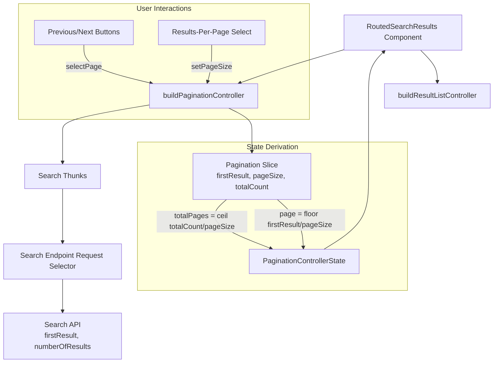
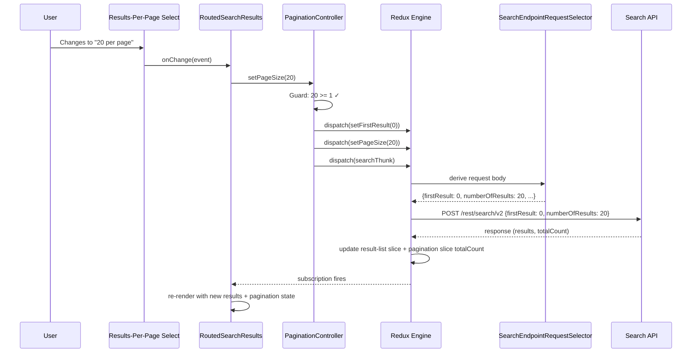
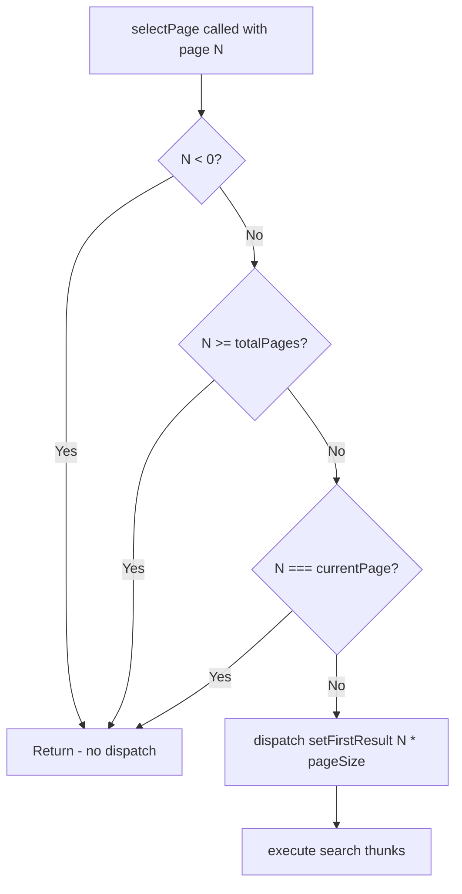

# Design Document: Search API Pagination

## Overview

This feature adds results-per-page controls to the `RoutedSearchResults` component in the `conversation-react` sample, completing its pagination UI to match the existing `RoutedCommerceResults` pattern. The key architectural insight is that no headless-future controller or slice changes are needed — `buildPaginationController` already provides `selectPage` and `setPageSize` for any interface with a `search` thunk, and the `search-endpoint-request-selector` already maps `firstResult` and `pageSize` to the Search API's `firstResult` and `numberOfResults` body parameters.

### Design Decisions

| Decision                                          | Rationale                                                                                                                                                                  |
| ------------------------------------------------- | -------------------------------------------------------------------------------------------------------------------------------------------------------------------------- |
| Reuse existing `buildPaginationController`        | Controller already supports both commerce and search interfaces via the shared pagination slice and `THUNKS.search` symbol. No new controller needed.                      |
| Mirror `RoutedCommerceResults` pagination pattern | Consistent UX between commerce and search results. Same page sizes (5, 10, 20, 50), same Previous/Next + select layout.                                                    |
| No headless-future code changes                   | The search endpoint request selector already maps `pageSize → numberOfResults` and `firstResult → firstResult`. The pagination slice and controller are endpoint-agnostic. |
| Page size options: 5, 10, 20, 50                  | Matches the commerce results component. These are typical API-friendly sizes that align with Coveo Search API limits.                                                      |
| `<select>` element for results-per-page           | Simple, accessible native control. Matches the commerce pattern and avoids custom dropdown complexity in a sample app.                                                     |

## Architecture

### High-Level Design



### Low-Level Design: Data Flow for Page Size Change



### Low-Level Design: selectPage Guard Logic



## Components and Interfaces

### Modified Component: `RoutedSearchResults.tsx`

The component already has Previous/Next buttons and the `buildPaginationController` wired up. The change adds a `<select>` for results-per-page, positioned after the Next button (matching `RoutedCommerceResults`).

```typescript
// New addition to the pagination controls section
<select
  value={paginationState.pageSize}
  onChange={(e) =>
    paginationRef.current?.setPageSize(Number(e.target.value))
  }
  style={{marginLeft: 'auto'}}
>
  <option value={5}>5 per page</option>
  <option value={10}>10 per page</option>
  <option value={20}>20 per page</option>
  <option value={50}>50 per page</option>
</select>
```

### Existing Interfaces (Unchanged)

| Interface                             | Location                                                                                    | Role                                                           |
| ------------------------------------- | ------------------------------------------------------------------------------------------- | -------------------------------------------------------------- |
| `PaginationController`                | `headless-future/src/public/controllers/pagination/pagination-controller.ts`                | Exposes `state`, `selectPage()`, `setPageSize()`               |
| `PaginationControllerState`           | Same file                                                                                   | `{page, pageSize, totalCount, totalPages}`                     |
| `PaginationControllerOptions`         | Same file                                                                                   | `{interface: Interface & Requires<'search'>}`                  |
| `createSearchEndpointRequestSelector` | `headless-future/src/core/internal/api/search-endpoint/search-endpoint-request-selector.ts` | Maps `firstResult → firstResult`, `pageSize → numberOfResults` |

### Component Props (Unchanged)

```typescript
interface RoutedSearchResultsProps {
  interface: unknown;
}
```

## Data Models

### Pagination Slice State (Existing)

```typescript
interface PaginationState {
  firstResult: number; // zero-indexed offset
  pageSize: number; // results per page (default: 10)
  totalCount: number; // total matching results
}
```

### Derived Controller State (Existing)

```typescript
interface PaginationControllerState {
  page: number; // floor(firstResult / pageSize), 0-indexed
  pageSize: number; // from slice directly
  totalCount: number; // from slice directly
  totalPages: number; // ceil(totalCount / pageSize)
}
```

### Search API Request Body Fields (Relevant Subset)

```typescript
interface SearchAPIRequestBody {
  q: string;
  firstResult: number; // ← from pagination slice firstResult
  numberOfResults: number; // ← from pagination slice pageSize
  facets: FacetRequest[];
}
```

### Page Size Options (New Constant)

```typescript
const PAGE_SIZE_OPTIONS = [5, 10, 20, 50] as const;
```

## Correctness Properties

_A property is a characteristic or behavior that should hold true across all valid executions of a system — essentially, a formal statement about what the system should do. Properties serve as the bridge between human-readable specifications and machine-verifiable correctness guarantees._

### Property 1: Pagination state derivation

_For any_ pagination slice state with `firstResult >= 0`, `pageSize > 0`, and `totalCount >= 0`, the `PaginationController` state SHALL expose `page` equal to `floor(firstResult / pageSize)`, `pageSize` equal to the slice's `pageSize`, `totalCount` equal to the slice's `totalCount`, and `totalPages` equal to `ceil(totalCount / pageSize)`.

**Validates: Requirements 1.1**

### Property 2: selectPage correctness with guards

_For any_ pagination state and any target page number, `selectPage` SHALL dispatch `setFirstResult(page * pageSize)` and execute the search thunk if and only if the target page is non-negative, less than `totalPages`, and not equal to the current page. Otherwise, no action SHALL be dispatched.

**Validates: Requirements 1.2, 1.4**

### Property 3: setPageSize resets to first page

_For any_ page size value >= 1, calling `setPageSize` SHALL dispatch `setFirstResult(0)` followed by `setPageSize(newSize)` and execute the search thunk. For any value < 1, no action SHALL be dispatched.

**Validates: Requirements 1.3, 1.5**

### Property 4: Search endpoint request field mapping

_For any_ pagination slice state with `firstResult >= 0` and `pageSize > 0`, the `createSearchEndpointRequestSelector` SHALL produce a request object where `firstResult` equals the slice's `firstResult` and `numberOfResults` equals the slice's `pageSize`.

**Validates: Requirements 2.1, 2.2, 2.3**

### Property 5: Pagination controls conditional rendering

_For any_ pagination state, the RoutedSearchResults component SHALL render pagination controls (Previous button, Next button, page indicator, and results-per-page selector) if and only if `totalPages > 1`. When rendered, the results-per-page selector SHALL reflect the current `pageSize` as the selected value.

**Validates: Requirements 3.1, 3.4, 4.1**

### Property 6: Page navigation and page-size interactions

_For any_ rendered pagination state with `totalPages > 1`, clicking Next SHALL invoke `selectPage(currentPage + 1)`, clicking Previous SHALL invoke `selectPage(currentPage - 1)`, and selecting a page size SHALL invoke `setPageSize` with the selected numeric value.

**Validates: Requirements 3.3, 4.2, 4.3**

### Property 7: Pagination state isolation across sub-interfaces

_For any_ set of simultaneously rendered search sub-interfaces, dispatching `selectPage` or `setPageSize` on one interface's pagination controller SHALL not modify the pagination slice state of any other interface.

**Validates: Requirements 5.1, 5.2**

## Error Handling

| Scenario                                                                    | Handling                                                                                                                                                          |
| --------------------------------------------------------------------------- | ----------------------------------------------------------------------------------------------------------------------------------------------------------------- |
| `selectPage` called with invalid page (negative, >= totalPages, == current) | Controller returns early — no dispatch, no API call                                                                                                               |
| `setPageSize` called with value < 1                                         | Controller returns early — no dispatch, no API call                                                                                                               |
| `pageSize` is 0 in slice state (should not happen in practice)              | Controller computes `page = 0` and `totalPages = 0`, avoiding division-by-zero via the `pageSize > 0` guard in the state derivation selector                      |
| Search API returns error after pagination action                            | Handled by the existing `GenerativeRuntime` error pipeline — `failTurn()` sets error state, UI shows error message. No pagination-specific error handling needed. |
| Component unmounts during pending search request                            | The `useEffect` cleanup unsubscribes from both controllers. The thunk may still resolve but the component won't re-render since subscriptions are removed.        |

## Testing Strategy

### Unit Tests (Vitest)

**RoutedSearchResults component:**

- Render with `totalPages > 1` → verify results-per-page `<select>` is present with options 5, 10, 20, 50
- Render with `totalPages <= 1` → verify no pagination controls rendered
- Render with `page === 0` → verify Previous button is disabled
- Render with `page === totalPages - 1` → verify Next button is disabled
- Simulate page size change → verify `setPageSize` called with correct value
- Simulate Next click → verify `selectPage(currentPage + 1)` called
- Simulate Previous click → verify `selectPage(currentPage - 1)` called
- Verify `<select>` value reflects current `pageSize`

**PaginationController (existing, verify no regression):**

- Verify `selectPage` with valid page dispatches correctly
- Verify `selectPage` with invalid page is no-op
- Verify `setPageSize` resets firstResult to 0
- Verify `setPageSize` with value < 1 is no-op
- Verify default initialization: page=0, pageSize=10

**SearchEndpointRequestSelector (existing, verify no regression):**

- Verify mapping: `firstResult → firstResult`, `pageSize → numberOfResults`

### Property-Based Tests (Vitest + fast-check)

Property-based testing is appropriate here because the pagination controller operates on numeric inputs with clear mathematical relationships (page derivation, guards based on ranges). The input space (arbitrary page numbers, page sizes, totalCounts) is large and edge cases emerge from boundary values.

**Configuration:** Minimum 100 iterations per property test.

**Tag format:** `Feature: search-api-pagination, Property {N}: {title}`

| Property   | Test Description                                                                               | Generator Strategy                                                                 |
| ---------- | ---------------------------------------------------------------------------------------------- | ---------------------------------------------------------------------------------- |
| Property 1 | Generate random `(firstResult, pageSize, totalCount)` triples → verify derived state           | `fc.nat()` for firstResult/totalCount, `fc.integer({min:1, max:100})` for pageSize |
| Property 2 | Generate random pagination states + target pages (valid/invalid) → verify dispatch/no-dispatch | `fc.integer()` for page, combined with random state                                |
| Property 3 | Generate random page sizes (positive and non-positive) → verify dispatch behavior              | `fc.integer({min: -100, max: 200})` for page size                                  |
| Property 4 | Generate random `(firstResult, pageSize)` pairs → verify selector output fields                | `fc.nat()` for firstResult, `fc.integer({min:1})` for pageSize                     |
| Property 7 | Generate 2+ interfaces with random states → paginate one → verify others unchanged             | `fc.array(fc.record(...))` for interface states                                    |

Properties 5 and 6 are UI-interaction properties better suited to example-based React Testing Library tests since they test DOM rendering and event handling rather than pure computational logic.

### Integration Tests

- Verify that changing page size in the UI triggers a search API request with updated `numberOfResults` and `firstResult: 0`
- Verify that navigating pages updates displayed results correctly
- Verify state isolation: paginating one search turn doesn't affect another turn's results
