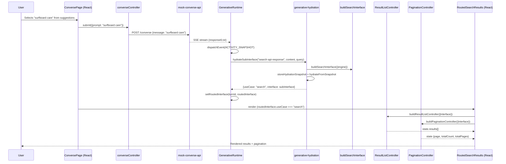

# Design Document: Search API Response Support

## Overview

This feature adds end-to-end support for the `search-api-response` activity type across three packages: `mock-converse-api`, `headless-future`, and the `conversation-react` sample. The primary new work is:

1. **mock-converse-api**: Two new prompt/template mappings ("surfboard care" → `response6.txt`, "boating safety" → `response7.txt`) and a README update.
2. **conversation-react**: New suggestion entries, a search result list with clickable links, result count, empty-state message, and pagination controls.

The headless-future layer already fully supports `search-api-response` routing via `generative-hydration.ts` (which maps it to the `'search'` use case), `buildResultListController`, and `buildPaginationController`. No headless-future code changes are required.

### Design Decisions

- **No headless-future changes**: The `ACTIVITY_TYPE_TO_ROUTED_USE_CASE` map already contains `'search-api-response': 'search'`, and the `buildSearchInterface` + hydration pipeline already parses results and pagination from the response content. The existing `RoutedSearchResults` component already demonstrates the pattern. The work is extending it with pagination support.
- **Pagination in RoutedSearchResults**: Follow the same pattern as `RoutedCommerceResults` which already integrates `buildPaginationController`.
- **Facets out of scope**: Only result list and pagination are rendered. Facet data in the response payload is ignored by the UI.

## Architecture



## Components and Interfaces

### mock-converse-api Changes

| File               | Change                                                                                                                                                    |
| ------------------ | --------------------------------------------------------------------------------------------------------------------------------------------------------- |
| `src/types.ts`     | Add `'response6' \| 'response7'` to `TemplateId` union                                                                                                    |
| `src/constants.ts` | Add two entries to `PROMPT_TEMPLATE_MAP`: `{prompt: 'surfboard care', templateId: 'response6'}` and `{prompt: 'boating safety', templateId: 'response7'}` |
| `README.md`        | Insert two rows in the "Supported Prompts" table before the fallback row                                                                                  |

The existing `prompt-matcher.ts` already trims and lowercases the input before comparing, so case-insensitive matching is inherent.

The existing `template-loader.ts` already throws a fatal error with the file path if a template file is missing on disk (requirement 1.5 is already satisfied by the current implementation).

### headless-future (No Changes Required)

The following existing code already satisfies Requirement 3:

| Component                                                    | How it satisfies the requirement                                                                  |
| ------------------------------------------------------------ | ------------------------------------------------------------------------------------------------- |
| `generative-hydration.ts` `ACTIVITY_TYPE_TO_ROUTED_USE_CASE` | Maps `'search-api-response'` → `'search'`                                                         |
| `createHydrateSubInterface()`                                | Builds a search sub-interface, stores snapshot, dispatches `hydrateFromSnapshot`                  |
| `generative-slice.ts` `setRoutedInterface` action            | Attaches the routed interface to the turn and sets status to `'complete'`                         |
| `result-list-controller.ts`                                  | Exposes `results[]` with `title`, `uri`, `excerpt`, `uniqueId`, `clickUri`, `printableUri`        |
| `pagination-controller.ts`                                   | Exposes `page`, `pageSize`, `totalCount`, `totalPages` and `selectPage()`/`setPageSize()` methods |

If the response content lacks a `results` array, the result-list slice initializes to an empty array — so `buildResultListController` returns `{results: []}`.

### conversation-react Changes

| File                          | Change                                                                                                      |
| ----------------------------- | ----------------------------------------------------------------------------------------------------------- |
| `src/ConversePage.tsx`        | Add `'surfboard care'` and `'boating safety'` to `PROMPT_SUGGESTIONS` array                                 |
| `src/RoutedSearchResults.tsx` | Add `buildPaginationController`, render result count, clickable links, empty state, and pagination controls |

### RoutedSearchResults Component API

```typescript
interface RoutedSearchResultsProps {
  interface: unknown;
}
```

Internal state:

- `ResultListControllerState` — `{results: ResultListControllerResult[]}`
- `PaginationControllerState` — `{page: number, pageSize: number, totalCount: number, totalPages: number}`

Rendered elements:

- Result count: `"Showing {results.length} of {totalCount} results"`
- Each result: title (as heading), excerpt (if present), clickUri as `<a href={clickUri} target="_blank" rel="noopener noreferrer">`
- Each result keyed by `uniqueId`
- Empty state: "No results found." when `results.length === 0`
- Pagination: Previous/Next buttons when `totalPages > 1`

## Data Models

### Search API Response Content (from SSE payload)

The `ACTIVITY_SNAPSHOT` event's `content` field for `search-api-response` carries a Coveo Search API response object. Key fields consumed by the controllers:

```typescript
interface SearchAPIResponseContent {
  totalCount: number;
  totalCountFiltered: number;
  results: SearchResult[];
  facets: Facet[]; // present but ignored (out of scope)
  // ... other metadata fields (pipeline, searchUid, etc.)
}

interface SearchResult {
  title: string;
  uri: string;
  printableUri: string;
  clickUri: string;
  uniqueId: string;
  excerpt: string | null;
  score: number;
  raw: Record<string, unknown>;
  // ... highlight fields, flags, etc.
}
```

### Controller State Models (existing, unchanged)

```typescript
// ResultListControllerState
interface ResultListControllerState {
  results: {
    uniqueId: string;
    title: string;
    uri: string;
    excerpt?: string;
    printableUri: string;
    clickUri: string;
    raw: Record<string, unknown>;
    score: number;
  }[];
}

// PaginationControllerState
interface PaginationControllerState {
  page: number; // 0-indexed current page
  pageSize: number;
  totalCount: number;
  totalPages: number;
}
```

### Prompt Template Map Entry (existing shape, two new entries)

```typescript
interface PromptTemplateEntry {
  prompt: string; // lowercase, trimmed
  templateId: TemplateId;
}
```

## Correctness Properties

_A property is a characteristic or behavior that should hold true across all valid executions of a system — essentially, a formal statement about what the system should do. Properties serve as the bridge between human-readable specifications and machine-verifiable correctness guarantees._

### Property 1: Case-insensitive whitespace-trimmed prompt matching

_For any_ string that, after trimming leading/trailing whitespace and converting to lowercase, equals `"surfboard care"` or `"boating safety"`, the prompt matcher SHALL return `'response6'` or `'response7'` respectively.

**Validates: Requirements 1.3**

### Property 2: Search result field preservation through hydration

_For any_ valid search-api-response content containing a `results` array, after the hydration pipeline creates a search sub-interface and `buildResultListController` reads its state, each result in the controller state SHALL contain `title`, `uri`, `excerpt`, `uniqueId`, `clickUri`, and `printableUri` values matching those in the original content.

**Validates: Requirements 3.1, 3.2**

### Property 3: Pagination state derivation from response content

_For any_ valid search-api-response content with a `totalCount` field and a default `pageSize > 0`, the `buildPaginationController` state SHALL have `page` equal to 0, `totalCount` matching the content value, and `totalPages` equal to `ceil(totalCount / pageSize)`.

**Validates: Requirements 3.3**

### Property 4: Result rendering completeness

_For any_ non-empty array of search results, the `RoutedSearchResults` component SHALL render each result's title, render its excerpt when present, render its `clickUri` as an `<a>` element with `target="_blank"`, and use `uniqueId` as the list item key.

**Validates: Requirements 5.1, 5.5, 5.6**

### Property 5: Result count and total count display

_For any_ pagination state with `totalCount > 0`, the `RoutedSearchResults` component SHALL display both the number of currently displayed results and the `totalCount` value as visible text. When `totalCount` exceeds the number of displayed results, a textual indication of the total SHALL be present.

**Validates: Requirements 5.3, 6.1, 6.2**

### Property 6: Pagination controls conditional rendering

_For any_ pagination state where `totalPages > 1`, the `RoutedSearchResults` component SHALL render Previous and Next page navigation controls.

**Validates: Requirements 6.3**

## Error Handling

| Scenario                           | Handling                                                                                                                                                               |
| ---------------------------------- | ---------------------------------------------------------------------------------------------------------------------------------------------------------------------- |
| Template file missing on disk      | `template-loader.ts` throws `Error` with message containing the file path. The server's `handlePost` catch handler returns 500. (Existing behavior, no change needed.) |
| Empty results array in response    | `ResultListController` returns `{results: []}`. `RoutedSearchResults` renders "No results found." message.                                                             |
| Missing `results` field in content | The result-list slice initializes with an empty array — same as empty results.                                                                                         |
| `totalCount = 0`                   | Pagination state has `totalPages = 0`, so pagination controls are not rendered.                                                                                        |
| Prompt not matching any entry      | Falls through to `FALLBACK_TEMPLATE_ID` (`response5`). Existing behavior, unchanged.                                                                                   |
| Network/stream errors              | `GenerativeRuntime` catches errors and calls `failTurn()`. ConversePage displays the error with a retry button. Existing behavior.                                     |

## Testing Strategy

### Unit Tests (Vitest)

**mock-converse-api:**

- Verify `matchPrompt('surfboard care')` returns `'response6'`
- Verify `matchPrompt('boating safety')` returns `'response7'`
- Verify existing prompts are not broken (regression)
- Verify fallback still works for unmatched prompts

**conversation-react:**

- Verify `PROMPT_SUGGESTIONS` includes both new entries
- Render `RoutedSearchResults` with mock results → assert titles, excerpts, links appear
- Render `RoutedSearchResults` with empty results → assert "No results found." message
- Render with `totalPages > 1` → assert pagination buttons present
- Render with `totalPages === 1` → assert no pagination buttons

### Property-Based Tests (Vitest + fast-check)

Property-based testing is appropriate here because:

- The prompt matcher has a large input space (arbitrary strings with whitespace/casing variations)
- The hydration pipeline should preserve data for any valid result structure
- The UI rendering properties should hold for any arbitrary result data

**Configuration:** Minimum 100 iterations per property test.

**Tag format:** `Feature: search-api-response-support, Property {N}: {title}`

| Property   | Test Description                                                                                                 | Library    |
| ---------- | ---------------------------------------------------------------------------------------------------------------- | ---------- |
| Property 1 | Generate random whitespace/casing variations of "surfboard care" and "boating safety", assert correct templateId | fast-check |
| Property 2 | Generate random arrays of result objects with required fields, hydrate, verify controller state preserves fields | fast-check |
| Property 3 | Generate random totalCount values (0–10000), verify pagination state derivation is correct                       | fast-check |
| Property 4 | Generate random result arrays, render `RoutedSearchResults`, verify all titles/excerpts/links/keys present       | fast-check |
| Property 5 | Generate random (results.length, totalCount) pairs, render, verify count displays                                | fast-check |
| Property 6 | Generate random totalPages values, render, verify navigation presence matches `totalPages > 1`                   | fast-check |

### Integration / E2E Tests

- Smoke test: start mock server, send "surfboard care", verify SSE response streams correctly
- Playwright: load conversation-react with mock server, select "surfboard care" suggestion, verify results rendered with pagination
