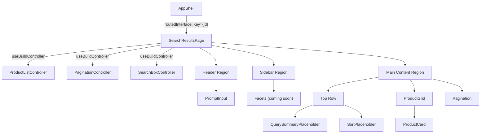

# Design Document: Search Results Page

## Overview

The Search Results Page is the primary product-browsing view in the `demo-react` Thermidor sample application. It displays a three-region layout — header, sidebar, and main content — built on top of Thermidor's `ProductListController`, `PaginationController`, and `SearchBoxController`. The page receives a persisted `RoutedInterface` from the `AppShell` parent, builds controllers once per mount via the existing `useBuildController` hook, and remounts cleanly when the interface identity changes (via React key strategy).

Key design goals:
- Reuse existing infrastructure (`PromptInput`, `useSuggestions`, `useBuildController`, toast mechanism)
- Keep presentational components pure and testable in isolation
- Extract the pagination windowing algorithm as a pure utility for easy unit testing
- Use CSS Modules with the project's design tokens for consistent styling

## Architecture



### Mounting & Lifecycle

1. `AppShell` renders `<SearchResultsPage key={routedInterface.interface.id} ... />` so that when the routed interface identity changes, React unmounts and remounts the entire page, discarding stale controller subscriptions.
2. Inside `SearchResultsPage`, three `useBuildController` calls (one per controller) run their factory exactly once per mount (guarded by `useRef` inside the hook).
3. On unmount, `SearchResultsPage` does **not** dispose the interface — `AppShell` retains ownership for navigation-back scenarios.

> **Tradeoff note:** The full unmount/remount strategy (via React key) is suboptimal — ideally only components whose data changed would re-render. However, this is currently unavoidable because `useBuildController` binds a controller to a specific interface instance via `useRef`, and Thermidor produces a new interface object on each routed turn rather than mutating the existing one. A future optimization would be for Thermidor to support re-binding a controller to a new interface (or providing a stable mutable handle), which would allow in-place updates without remounting. In practice, the remount cost is low since the new interface arrives pre-hydrated with data from the snapshot.

## Components and Interfaces

### File Structure

```
src/components/
├── SearchResultsPage/
│   ├── SearchResultsPage.tsx          # Main page orchestrator
│   ├── SearchResultsPage.module.css   # Page-level layout styles
│   ├── SearchResultsPage.test.tsx     # Integration tests
│   ├── ProductCard/
│   │   ├── ProductCard.tsx
│   │   ├── ProductCard.module.css
│   │   └── ProductCard.test.tsx
│   ├── ProductGrid/
│   │   ├── ProductGrid.tsx
│   │   ├── ProductGrid.module.css
│   │   └── ProductGrid.test.tsx
│   ├── Pagination/
│   │   ├── Pagination.tsx
│   │   ├── Pagination.module.css
│   │   ├── Pagination.test.tsx
│   │   └── pagination-utils.ts        # Pure windowing function
│   ├── QuerySummaryPlaceholder/
│   │   ├── QuerySummaryPlaceholder.tsx
│   │   ├── QuerySummaryPlaceholder.module.css
│   │   └── QuerySummaryPlaceholder.test.tsx
│   └── SortPlaceholder/
│       ├── SortPlaceholder.tsx
│       ├── SortPlaceholder.module.css
│       └── SortPlaceholder.test.tsx
```

### Component Interfaces

```typescript
// SearchResultsPage.tsx
interface SearchResultsPageProps {
  onSubmit: (prompt: string) => void;
  isStreaming: boolean;
  routedInterface: RoutedInterface;
}

// ProductCard.tsx
interface ProductCardProps {
  product: Product;
}

// ProductGrid.tsx
interface ProductGridProps {
  controller: ProductListController;
}

// Pagination.tsx
interface PaginationProps {
  controller: PaginationController;
}

// QuerySummaryPlaceholder.tsx
interface QuerySummaryPlaceholderProps {
  query: string;
  totalCount: number;
}

// SortPlaceholder.tsx
interface SortPlaceholderProps {
  onToast: () => void;
}
```

### Design Decisions

1. **Components tightly coupled to a single controller receive the controller directly.** `ProductGrid` receives `ProductListController` and `Pagination` receives `PaginationController`. This reduces prop-threading and colocates the subscription logic with the component that renders it. Components that combine data from multiple controllers (`QuerySummaryPlaceholder` — SearchBox query + Pagination totalCount) or are leaf presentational nodes rendered in a list (`ProductCard`) still receive plain props.

2. **Controller-passing is the intended pattern for all future components.** When Thermidor adds controllers for facets, sort, and query summary, the current placeholders (FacetPlaceholder, SortPlaceholder, QuerySummaryPlaceholder) will be replaced with real components that receive their respective controller directly — the same pattern used by `ProductGrid` and `Pagination`. The placeholder components are temporary stand-ins designed to be swapped with minimal refactoring.

3. **Pagination receives the `PaginationController` directly** and calls `controller.selectPage(page)` internally. This colocates the navigation logic and avoids prop-threading through the parent. The `pagination-utils.ts` module remains a pure function for testability of the windowing algorithm.

4. **`pagination-utils.ts` exports a pure `computeVisiblePages` function** that takes `(currentPage, totalPages)` and returns an array of page numbers or ellipsis sentinels. This enables straightforward unit testing of the windowing algorithm without DOM rendering.

5. **Toast mechanism is lifted to `SearchResultsPage`** and shared between `SortPlaceholder` and suggestion actions, reusing the existing `useState`/`useRef` timer pattern already in the current codebase.

6. **RoutedInterface null guard:** If `routedInterface` is unexpectedly null/undefined, the component returns `null` early without building controllers. In practice, `AppShell` only renders `SearchResultsPage` when the ref is non-null, but the guard provides defense-in-depth.

## Data Models

### Product (from Thermidor)

```typescript
interface Product {
  permanentid: string;
  ec_name: string;
  ec_description?: string;
  ec_shortdesc?: string;
  ec_brand?: string;
  ec_category?: string[];
  ec_price?: number;
  ec_promo_price?: number;
  ec_images?: string[];
  ec_thumbnails?: string[];
  ec_in_stock?: boolean;
  ec_rating?: number | null;
  ec_color?: string;
  clickUri?: string;
  additionalFields: Record<string, unknown>;
  children?: Product[];
}
```

### Pagination State (from Thermidor)

```typescript
interface PaginationControllerState {
  page: number;        // zero-indexed current page
  pageSize: number;
  totalCount: number;
  totalPages: number;
}
```

### Pagination Windowing Output

```typescript
type PageItem = number | 'ellipsis-start' | 'ellipsis-end';

function computeVisiblePages(currentPage: number, totalPages: number): PageItem[];
```

**Algorithm rules (max 5 visible buttons):**
- If `totalPages <= 5`: return all pages `[0, 1, 2, 3, 4]`
- If `currentPage <= 1`: return `[0, 1, 2, 'ellipsis-end', totalPages - 1]`
- If `currentPage >= totalPages - 2`: return `[0, 'ellipsis-start', totalPages - 3, totalPages - 2, totalPages - 1]`
- Otherwise: return `[0, 'ellipsis-start', currentPage, 'ellipsis-end', totalPages - 1]`

### Image Resolution Logic

```typescript
function resolveProductImage(product: Product): string | null {
  if (product.ec_thumbnails?.length) return product.ec_thumbnails[0];
  if (product.ec_images?.length) return product.ec_images[0];
  return null;
}
```

### Query Summary Formatting

```typescript
function formatQuerySummary(query: string, totalCount: number): string | null {
  if (!query && totalCount === 0) return null;
  if (totalCount === 0 && query) return `No results for "${truncate(query, 100)}"`;
  if (!query && totalCount > 0) return totalCount.toLocaleString();
  return `Showing results for "${truncate(query, 100)}" (${totalCount.toLocaleString()})`;
}

function truncate(text: string, maxLen: number): string {
  return text.length > maxLen ? text.slice(0, maxLen) + '…' : text;
}
```

## Error Handling

| Scenario | Behavior |
|----------|----------|
| `routedInterface` is null/undefined at mount | Return `null`, render nothing, do not build controllers |
| Controller factory throws | Let error propagate to React error boundary (not implemented in demo; acceptable for sample app) |
| `products` array is empty | ProductGrid shows "No results found" message |
| `ec_price` is undefined | ProductCard renders "—" in place of price |
| Network error during `selectPage` | PaginationController's `isLoading`/`error` state propagates but the Pagination component does not display errors (out of scope for this iteration) |
| Toast timer cleanup on unmount | `useEffect` cleanup clears the timeout ref to prevent state updates on unmounted component |

## Testing Strategy

### Unit Tests (example-based, Vitest + Testing Library)

| Component / Utility | Key assertions |
|---------------------|----------------|
| SearchResultsPage | Renders header with PromptInput, sidebar, main content; builds all 3 controllers via mock interface; returns null when routedInterface is null |
| ProductCard | Renders name, brand, price; shows placeholder when no image; shows promo price correctly; displays title attribute with full product name |
| ProductGrid | Renders correct number of cards; shows empty state message |
| Pagination | Renders nothing when totalPages <= 1; calls onSelectPage with correct args; disables Previous on first page; disables Next on last page; enables both when in middle |
| QuerySummaryPlaceholder | Renders correct text for each state combination (query+count, query only, count only, neither) |
| SortPlaceholder | Shows label; triggers toast on click |
| `computeVisiblePages` | Returns all pages when totalPages ≤ 5; returns correct window when current page is at start, middle, and end; always includes first and last page; returns at most 5 items for large page counts |
| `resolveProductImage` | Returns first thumbnail when thumbnails exist; falls back to first image when no thumbnails; returns null when neither thumbnails nor images exist |
| `formatQuerySummary` / `truncate` | Correct formatting for all state combinations (query+count, query-only, count-only, neither); truncates query at 100 characters with ellipsis; preserves short queries verbatim; formats count with locale separators |
