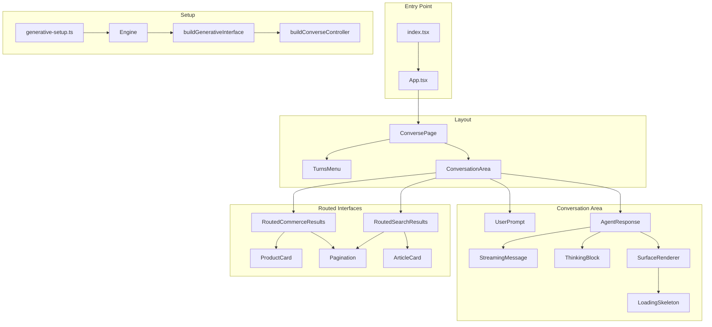
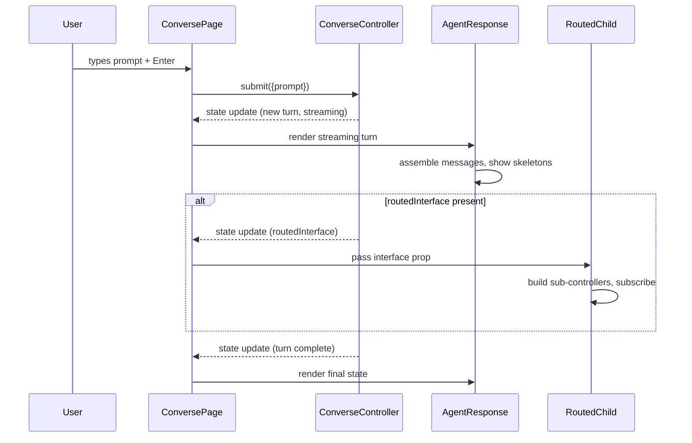

# Design Document: shiny-conversation-react

## Overview

The `shiny-conversation-react` sample is a polished React application demonstrating headless-future DX patterns in a conversational UI. It reuses the same controller-based architecture as the existing `conversation-react` sample but upgrades the visual presentation to stakeholder-ready quality with CSS modules, streaming assembly, collapsible thinking blocks, AGUI surface rendering with loading skeletons, product/article cards, and a turns navigation menu.

The application is a **read-only consumer** of the headless-future public API. It introduces no new library code — only React components and CSS modules that demonstrate correct usage of `buildConverseController`, `buildProductListController`, `buildResultListController`, and `buildPaginationController`.

### Key Design Decisions

1. **CSS Modules over inline styles** — The existing sample uses inline `style={{}}` objects. The new sample moves all styles to co-located `.module.css` files to demonstrate maintainability and comply with the zero-inline-style requirement.
2. **Single ConversePage orchestrator** — A top-level `ConversePage` component subscribes to the `ConverseController` and passes the active turn data down. Child components are stateless renderers except for the routed interface components, which build their own sub-controllers.
3. **Pure utility functions for testable logic** — Text truncation, message assembly, and price formatting are extracted into pure utility functions that can be property-tested independently of React rendering.
4. **Skeleton-per-surface pattern** — During streaming, each entry in `agentResponse.surfaces` gets a skeleton placeholder; on completion, the skeleton is replaced with rendered surface content.

## Architecture



### Data Flow



## Components and Interfaces

### Component Tree

| Component               | File                        | Responsibility                                                         |
| ----------------------- | --------------------------- | ---------------------------------------------------------------------- |
| `App`                   | `App.tsx`                   | Root layout shell                                                      |
| `ConversePage`          | `ConversePage.tsx`          | Subscribes to `ConverseController`, orchestrates layout                |
| `TurnsMenu`             | `TurnsMenu.tsx`             | Left sidebar listing turns, handles selection                          |
| `ConversationArea`      | `ConversationArea.tsx`      | Main content area rendering the active turn                            |
| `UserPrompt`            | `UserPrompt.tsx`            | Displays a user prompt bubble                                          |
| `AgentResponse`         | `AgentResponse.tsx`         | Renders agent message, thinking block, and surfaces                    |
| `StreamingMessage`      | `StreamingMessage.tsx`      | Assembles and renders streamed message text                            |
| `ThinkingBlock`         | `ThinkingBlock.tsx`         | Collapsible tool call details                                          |
| `SurfaceRenderer`       | `SurfaceRenderer.tsx`       | Renders surfaces or skeletons based on turn status                     |
| `LoadingSkeleton`       | `LoadingSkeleton.tsx`       | Animated placeholder                                                   |
| `RoutedCommerceResults` | `RoutedCommerceResults.tsx` | Commerce results with `ProductListController` + `PaginationController` |
| `RoutedSearchResults`   | `RoutedSearchResults.tsx`   | Search results with `ResultListController` + `PaginationController`    |
| `ProductCard`           | `ProductCard.tsx`           | Single product card                                                    |
| `ArticleCard`           | `ArticleCard.tsx`           | Single article/search result card                                      |
| `Pagination`            | `Pagination.tsx`            | Shared prev/next page controls                                         |
| `PromptInput`           | `PromptInput.tsx`           | Input field with submit behavior                                       |

### Component Interfaces (Props)

```typescript
// TurnsMenu
interface TurnsMenuProps {
  turns: Turn[];
  activeTurnId: string | undefined;
  onSelectTurn: (id: string) => void;
}

// ConversationArea
interface ConversationAreaProps {
  turn: Turn | undefined;
  isStreaming: boolean;
}

// UserPrompt
interface UserPromptProps {
  text: string;
}

// AgentResponse
interface AgentResponseProps {
  agentResponse: AgentResponse;
  status: TurnStatus;
}

// StreamingMessage
interface StreamingMessageProps {
  messages: AgentMessage[];
}

// ThinkingBlock
interface ThinkingBlockProps {
  toolCalls: ToolCall[];
  isStreaming: boolean;
}

// SurfaceRenderer
interface SurfaceRendererProps {
  surfaces: A2UISurface[];
  status: TurnStatus;
}

// RoutedCommerceResults / RoutedSearchResults
interface RoutedResultsProps {
  interface: unknown;
}

// ProductCard
interface ProductCardProps {
  product: ProductListControllerProduct;
}

// ArticleCard
interface ArticleCardProps {
  result: SearchResult;
}

// Pagination
interface PaginationProps {
  page: number;
  totalPages: number;
  onPrevious: () => void;
  onNext: () => void;
}

// PromptInput
interface PromptInputProps {
  onSubmit: (prompt: string) => void;
  disabled: boolean;
}
```

### Utility Functions (Pure Logic)

```typescript
// utils.ts

/** Concatenate message contents in arrival order */
function assembleMessages(messages: AgentMessage[]): string;

/** Truncate text at maxLength, append ellipsis if exceeded */
function truncateText(text: string, maxLength: number): string;

/** Format price as currency string with 2 decimals */
function formatPrice(price: number): string;
```

## Data Models

The sample consumes state from headless-future controllers. No custom data storage is introduced.

### Controller State Shapes (consumed)

```typescript
// From ConverseController
interface ConverseControllerState {
  turns: Turn[];
  activeTurnId: string | undefined;
  activeTurn: Turn | undefined;
  isStreaming: boolean;
}

// From ProductListController
interface ProductListControllerState {
  products: Product[];
}

// From ResultListController
interface ResultListControllerState {
  results: SearchResult[];
}

// From PaginationController
interface PaginationControllerState {
  page: number;
  pageSize: number;
  totalCount: number;
  totalPages: number;
}
```

### Key Type Definitions (from headless-future)

```typescript
interface Turn {
  id: string;
  prompt: string;
  status: 'streaming' | 'complete' | 'error';
  routedInterface?: RoutedInterface;
  agentResponse?: AgentResponse;
  error?: string;
}

interface AgentResponse {
  messages: AgentMessage[];
  surfaces: A2UISurface[];
  toolCalls: ToolCall[];
}

interface AgentMessage {
  content: string;
  role: string;
}
type A2UISurface = Record<string, unknown>;
interface ToolCall {
  id: string;
  name: string;
  args: string;
  result?: string;
  status: 'calling' | 'completed';
}

interface Product {
  permanentid: string;
  ec_name: string;
  ec_brand?: string;
  ec_price?: number;
  ec_images?: string[];
  ec_thumbnails?: string[];
  clickUri?: string;
  // ... additional fields
}

interface SearchResult {
  uniqueId: string;
  title: string;
  excerpt?: string;
  clickUri: string;
  // ... additional fields
}
```

### CSS Custom Properties (Design Tokens)

```css
:root {
  /* Spacing scale (4px base) */
  --space-1: 4px;
  --space-2: 8px;
  --space-3: 12px;
  --space-4: 16px;
  --space-5: 24px;
  --space-6: 32px;
  --space-7: 48px;
  --space-8: 64px;

  /* Color palette */
  --color-bg-primary: #ffffff;
  --color-bg-secondary: #f8f9fa;
  --color-bg-tertiary: #f0f2f5;
  --color-bg-user-prompt: #e3f2fd;
  --color-bg-agent: #ffffff;
  --color-bg-active: #e8edf3;
  --color-bg-skeleton: #e0e0e0;

  --color-text-primary: #1a1a2e;
  --color-text-secondary: #4a5568;
  --color-text-muted: #718096;
  --color-text-link: #2563eb;

  --color-border: #e2e8f0;
  --color-border-active: #3b82f6;

  --color-success: #10b981;
  --color-processing: #f59e0b;
  --color-error: #ef4444;

  /* Typography */
  --font-sans: 'Inter', -apple-system, BlinkMacSystemFont, sans-serif;
  --font-mono: 'JetBrains Mono', 'Fira Code', monospace;
  --font-size-sm: 13px;
  --font-size-base: 14px;
  --font-size-md: 15px;
  --font-size-lg: 18px;
  --font-size-xl: 22px;

  /* Layout */
  --sidebar-width: 260px;

  /* Transitions */
  --transition-fast: 150ms ease;
  --transition-normal: 200ms ease;
  --transition-slow: 300ms ease;

  /* Radius */
  --radius-sm: 4px;
  --radius-md: 8px;
  --radius-lg: 12px;
}
```

## Correctness Properties

_A property is a characteristic or behavior that should hold true across all valid executions of a system — essentially, a formal statement about what the system should do. Properties serve as the bridge between human-readable specifications and machine-verifiable correctness guarantees._

### Property 1: Message assembly preserves content and order

_For any_ array of `AgentMessage` entries with arbitrary content strings, the `assembleMessages` utility SHALL return a string equal to the concatenation of all `content` values in their original array order.

**Validates: Requirements 2.1**

### Property 2: Skeleton count equals surface count during streaming

_For any_ Turn with status "streaming" and an `agentResponse.surfaces` array of length N (where N ≥ 1), the `SurfaceRenderer` component SHALL render exactly N `LoadingSkeleton` elements.

**Validates: Requirements 4.1**

### Property 3: User prompt text displayed without truncation

_For any_ non-empty string used as a user prompt, the `UserPrompt` component SHALL render the complete string without removing or shortening any characters.

**Validates: Requirements 5.3**

### Property 4: Product card price formatting

_For any_ finite positive number used as `ec_price`, the `formatPrice` utility SHALL return a string matching the pattern `$X.YY` where YY is exactly two decimal digits representing the value rounded to the nearest cent.

**Validates: Requirements 6.2**

### Property 5: Pagination button disabled states

_For any_ `PaginationControllerState` where `totalPages > 1`: the previous-page button SHALL be disabled if and only if `page === 0`, and the next-page button SHALL be disabled if and only if `page === totalPages - 1`.

**Validates: Requirements 7.6**

### Property 6: Turns menu text truncation

_For any_ string of length L, the `truncateText(text, 40)` utility SHALL return the original string unchanged when L ≤ 40, and SHALL return the first 40 characters followed by a single ellipsis character ("…") when L > 40.

**Validates: Requirements 8.4**

## Error Handling

| Scenario                                    | Behavior                                                                                |
| ------------------------------------------- | --------------------------------------------------------------------------------------- |
| Turn status = "error"                       | Display error message with retry button; call `converseController.retry({id})` on click |
| Empty product list from commerce search     | Render "No products found" message instead of grid                                      |
| Empty result list from search               | Render "No results found" message instead of article list                               |
| Missing `ec_price` on product               | Omit price from ProductCard; display name and brand only                                |
| Missing `excerpt` on search result          | Render ArticleCard with title and link only, no excerpt area                            |
| Zero Agent_Message entries on turn complete | Do not render an empty message container                                                |
| A2UI_Surface with unknown structure         | Render surface data as key-value pairs in a generic card layout                         |
| Controller subscription failure             | Components return `null` until first state update (same pattern as existing sample)     |
| Missing environment variables               | Throw at startup with a clear error message indicating which variable is missing        |

## Testing Strategy

### Unit Tests (Vitest + @testing-library/react)

Unit tests focus on concrete rendering scenarios and component behavior:

- **StreamingMessage**: Verify assembled text renders, no empty container for zero messages
- **ThinkingBlock**: Verify collapsed by default, expand reveals tool details, processing vs success indicators
- **SurfaceRenderer**: Verify skeletons replaced by content on status transition
- **UserPrompt**: Verify styling distinction from agent messages
- **TurnsMenu**: Verify active turn highlighting, click triggers `onSelectTurn`
- **ProductCard**: Verify conditional brand/price rendering, image display
- **ArticleCard**: Verify link opens in new tab (`target="_blank"`), no excerpt when missing
- **Pagination**: Verify button disable states at boundaries
- **RoutedCommerceResults / RoutedSearchResults**: Verify controller subscribe/unsubscribe lifecycle (mock controllers)

### Property-Based Tests (Vitest + fast-check)

Property-based tests validate universal properties using the `fast-check` library. Each test runs a **minimum of 100 iterations** with randomly generated inputs.

| Property                        | Test Target                 | Generator                                                                 |
| ------------------------------- | --------------------------- | ------------------------------------------------------------------------- |
| Property 1: Message assembly    | `assembleMessages()`        | `fc.array(fc.record({content: fc.string(), role: fc.string()}))`          |
| Property 2: Skeleton count      | `SurfaceRenderer` component | `fc.integer({min: 1, max: 20})` for surface array length                  |
| Property 3: Prompt display      | `UserPrompt` component      | `fc.string({minLength: 1})`                                               |
| Property 4: Price formatting    | `formatPrice()`             | `fc.double({min: 0.01, max: 99999.99, noNaN: true})`                      |
| Property 5: Pagination disabled | `Pagination` component      | `fc.record({page: fc.nat(), totalPages: fc.integer({min: 2, max: 100})})` |
| Property 6: Text truncation     | `truncateText()`            | `fc.string()` with varying lengths                                        |

Each test is tagged with:

```
// Feature: shiny-conversation-react, Property {N}: {property_text}
```

### End-to-End Tests (Playwright)

E2E tests exercise the full application against the mock converse API:

- Submit a prompt and verify user message + agent response render
- Verify turns menu populates and allows navigation
- Verify thinking block collapse/expand interaction
- Verify product grid renders for commerce search routed responses
- Verify article list renders for search routed responses
- Verify pagination controls work across pages

### Static Checks

- **Zero inline styles**: ESLint rule or grep check ensuring no `style={{` patterns in component files
- **One component per file**: Manual review or custom lint rule
- **CSS module co-location**: File naming convention check
