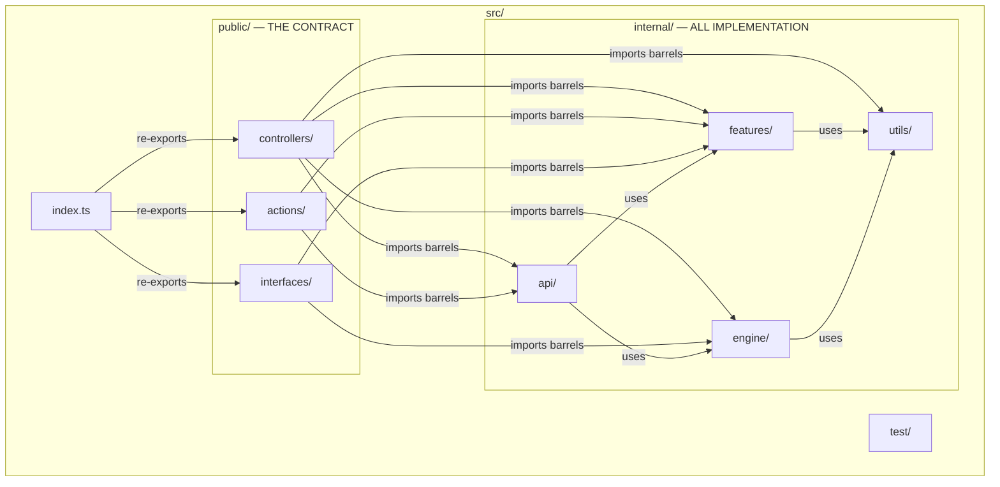
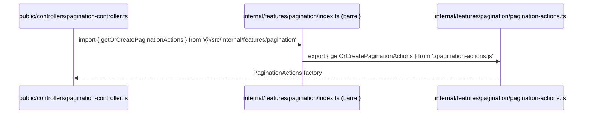
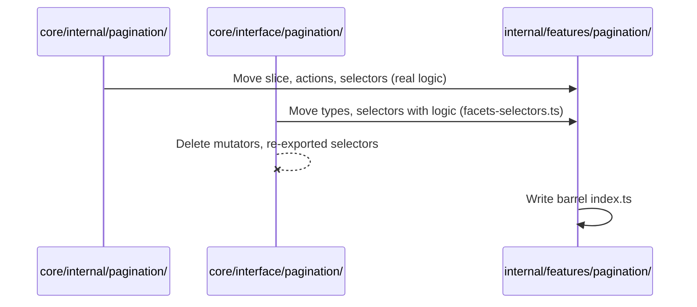

# Design Document: Simplified Internal Folder Structure (ADR-006)

## Overview

This design implements ADR-006 for the Thermidor package: collapsing the current three-layer internal structure (`api/interface/` + `api/internal/` + `core/interface/` + `core/internal/`) into a single `internal/` directory with four sub-modules (`features/`, `api/`, `engine/`, `utils/`). The `public/` directory remains unchanged. The anti-corruption boundary between `public/` and implementation details is enforced by barrel `index.ts` files and an ESLint `no-restricted-imports` rule, replacing the current directory-nesting approach.

This is a purely structural refactor — no behavioral, runtime, or public API changes. The goal is to reduce cognitive overhead for contributors (one canonical location per concept), eliminate ~30 mechanical indirection files (mutators and re-exported selectors), and strengthen the import boundary through tooling.

**Source of truth**: [ADR-006](../../../packages/thermidor/docs/internal/adr/ADR-006-simplified-folder-structure.md), [Annex A](../../../packages/thermidor/docs/internal/adr/ADR-006-annex-a-proposed-structure.md), [Annex B](../../../packages/thermidor/docs/internal/adr/ADR-006-annex-b-removed-indirection.md).

## Architecture



## Sequence Diagrams

### Import Resolution Flow (public → internal)



### File Migration Flow (per feature)



## Components and Interfaces

### Component 1: Feature Modules (`internal/features/<name>/`)

**Purpose**: Encapsulate all state management for a domain feature — slice definition, action creators, selectors, and types.

**Barrel interface** (`index.ts`):

```typescript
// internal/features/pagination/index.ts
export {getOrCreatePaginationSlice} from './pagination-slice.js';
export {getOrCreatePaginationActions} from './pagination-actions.js';
export {getOrCreatePaginationSelectors} from './pagination-selectors.js';
export type {PaginationState} from './pagination-types.js';
```

**Responsibilities**:

- Expose factory functions (`getOrCreate*`) for slice, actions, selectors
- Export type definitions needed by `public/`
- Keep implementation files private (no deep imports allowed)

**Features**: pagination, facets, result-list, product-list, search-box, cart, configuration, generative, sort, search-parameters, query-correction, triggers

### Component 2: API Module (`internal/api/`)

**Purpose**: Consolidate all HTTP client logic, endpoint thunks, response handlers, and facades into domain-oriented sub-modules.

**Sub-modules**:

- `protocol/` — Transport layer (http, stream, sse-parser, buffer, error-handling)
- `search/` — Search endpoint client + thunk + facade + response handler
- `commerce-search/` — Commerce search endpoint client + thunk + facade
- `conversation/` — Conversation endpoint client + event stream
- `query-suggest/` — Query suggest thunk + facade
- `commerce-query-suggest/` — Commerce query suggest thunk + facade
- `generative/` — Generative runtime endpoint
- Root files: `organization-endpoint.ts`

**Barrel interface** (`internal/api/search/index.ts`):

```typescript
export {createSearchEndpointClient} from './search-endpoint-client.js';
export type {
  SearchEndpointClient,
  SearchEndpointClientConfiguration,
} from './search-endpoint-client.js';
export type {
  CoveoSearchEndpointRequest,
  CoveoSearchEndpointResponse,
} from './search-endpoint-types.js';
export {createSearchFacadeResolver} from './search-facade.js';
export {createSearchEndpointThunk} from './search-thunk.js';
```

**Responsibilities**:

- Merge files from 4 sources: `api/interface/`, `api/internal/`, `core/internal/api/`, `core/interface/api/`
- Each domain sub-module has its own barrel
- `protocol/` has no barrel (imported directly by sibling api modules)

### Component 3: Engine Module (`internal/engine/`)

**Purpose**: Engine class and core plumbing (slice adoption, configuration, dispatch).

**Barrel interface**:

```typescript
// internal/engine/index.ts
export {Engine} from './engine.js';
export type {EngineOptions, EngineConfiguration} from './engine-types.js';
export {createEngineConfiguration} from './engine-configuration.js';
```

**Responsibilities**:

- Provide the Engine class for public interfaces
- Manage slice adoption lifecycle
- Abstract Redux store details

### Component 4: Utils Module (`internal/utils/`)

**Purpose**: Shared cross-cutting utilities used by features, api, and engine.

**Barrel interface**:

```typescript
// internal/utils/index.ts
export {createMemoizedStateSelector} from './memoized-state-selector.js';
export {symbols} from './symbols.js';
export type {InterfaceTypes} from './interface-types.js';
export {selectSlice} from './select-slice.js';
export {generateId} from './id-generator.js';
export {getHandleInternals} from './get-handle-internals.js';
export type {NavigatorContextTypes} from './navigator-context-types.js';
export {createFacadeCache} from './facade-cache.js';
export {resolveFacades} from './resolve-facades.js';
```

**Responsibilities**:

- House `base-controller.ts` and `base-interface.ts`
- Provide memoization, ID generation, and selector utilities
- Define shared type contracts

### Component 5: ESLint Boundary Rule

**Purpose**: Enforce the anti-corruption boundary mechanically — prevent `public/` from importing Redux/Immer or deep internal paths.

**Configuration**:

```typescript
// Applied to files matching src/public/**
{
  "no-restricted-imports": ["error", {
    patterns: [
      {
        group: ["@reduxjs/toolkit", "@reduxjs/toolkit/*", "immer"],
        message: "Public layer must not depend on Redux or Immer directly."
      },
      {
        group: [
          "@/src/internal/features/*/*",
          "@/src/internal/api/*/*",
          "@/src/internal/engine/*",
          "@/src/internal/utils/*"
        ],
        message: "Import from the barrel (index.ts), not deep paths. Use @/src/internal/features/<name> or @/src/internal/api/<name>."
      }
    ]
  }]
}
```

**Responsibilities**:

- Block `public/` from importing `@reduxjs/toolkit` or `immer`
- Block `public/` from bypassing barrels (no deep paths into internal sub-modules)
- Produce clear error messages for contributors

### Component 6: API Snapshot Gate

**Purpose**: Snapshot the public API surface and detect if any RTK/Immer symbols or types leak into the package's public contract.

**Responsibilities**:

- Capture the set of exported symbols from `src/index.ts`
- Flag any exports whose types reference `@reduxjs/toolkit` or `immer` internals
- Run as part of CI to prevent regressions

### Component 7: `.d.ts` Validation Gate

**Purpose**: Check that generated TypeScript declaration files (`.d.ts`) do not contain leaked RTK/Immer types or imports.

**Responsibilities**:

- After build, inspect `.d.ts` output for references to `@reduxjs/toolkit` or `immer`
- Flag any declaration that exposes implementation-layer types to consumers
- Run as part of CI to ensure the anti-corruption boundary holds at the type level

### Component 8: Module README Documentation

**Purpose**: Provide lightweight markdown documentation alongside each top-level `internal/` sub-module so that agents and contributors can quickly understand the architecture without reading source files.

**Files created**:

- `internal/README.md` — Overview of the internal layer, relationship to `public/`, barrel convention
- `internal/features/README.md` — What a feature module is, naming conventions, how to add a new feature
- `internal/api/README.md` — API module purpose, domain sub-module structure, how to add a new endpoint
- `internal/engine/README.md` — Engine module responsibilities, what belongs here vs. `utils/`
- `internal/utils/README.md` — Shared utilities scope, when to put something here vs. in a feature

**Responsibilities**:

- Describe the module's purpose and conventions
- Explain how to add new code (which directory, naming, barrel registration)
- Remain lightweight — no exhaustive file listings (the barrel serves that role)

## Data Models

### Import Path Mapping

| Before                                                               | After                                |
| -------------------------------------------------------------------- | ------------------------------------ |
| `@/src/core/internal/pagination/pagination-actions.js`               | `@/src/internal/features/pagination` |
| `@/src/core/internal/pagination/pagination-selectors.js`             | `@/src/internal/features/pagination` |
| `@/src/core/internal/pagination/pagination-slice.js`                 | `@/src/internal/features/pagination` |
| `@/src/core/interface/utils/memoized-state-selector.js`              | `@/src/internal/utils`               |
| `@/src/core/interface/utils/interface-types.js`                      | `@/src/internal/utils`               |
| `@/src/core/interface/utils/symbols.js`                              | `@/src/internal/utils`               |
| `@/src/core/interface/engine/engine.js`                              | `@/src/internal/engine`              |
| `@/src/core/interface/engine/engine-types.js`                        | `@/src/internal/engine`              |
| `@/src/api/interface/search-endpoint/search-endpoint-client.js`      | `@/src/internal/api/search`          |
| `@/src/core/internal/api/search/search-thunk.js`                     | `@/src/internal/api/search`          |
| `@/src/core/interface/api/commerce-search/commerce-search-facade.js` | `@/src/internal/api/commerce-search` |
| `@/src/core/interface/api/query-suggest/query-suggest-facade.js`     | `@/src/internal/api/query-suggest`   |
| `@/src/core/interface/api/generative-endpoint/generative-runtime.js` | `@/src/internal/api/generative`      |
| `@/src/core/interface/base-controller.js`                            | `@/src/internal/utils`               |
| `@/src/core/interface/base-interface.js`                             | `@/src/internal/utils`               |
| `@/src/core/interface/cache/interface-cache-registry.js`             | `@/src/internal/utils`               |
| `@/src/core/interface/navigator-context/navigator-context-types.js`  | `@/src/internal/utils`               |
| `@/src/core/interface/generative/generative-hydration.js`            | `@/src/internal/features/generative` |

### Files Removed (Indirection — per Annex B)

**Mutators** (6 files): pagination, facets, result-list, cart, search-box, configuration  
**Re-exported selectors** (4 files): cart, result-list, search-box, pagination  
**Associated tests** (~12 files): tests for removed mutators and re-exports

### Files Preserved (Real Logic)

| File                                                                   | New Location                                                 |
| ---------------------------------------------------------------------- | ------------------------------------------------------------ |
| `core/interface/facets/facets-selectors.ts` (has `buildFacetsRequest`) | `internal/features/facets/facets-selectors.ts`               |
| `core/interface/configuration/configuration-selectors.ts`              | `internal/features/configuration/configuration-selectors.ts` |
| `core/interface/generative/generative-hydration.ts` + test             | `internal/features/generative/generative-hydration.ts`       |

## Error Handling

### Error Scenario 1: Circular Imports After Merge

**Condition**: Merging files from `core/interface/api/` and `core/internal/api/` into the same directory may introduce circular dependencies (e.g., facade imports thunk, thunk imports facade resolver).
**Response**: Verify no circular dependencies exist by running `madge --circular` on the resulting `internal/api/` directory. If found, break the cycle by extracting shared types into a `*-types.ts` file.
**Recovery**: Re-organize the offending import to go through a shared types file.

### Error Scenario 2: Barrel Re-export Conflicts

**Condition**: Two source files export the same symbol name (e.g., both `core/interface/pagination/` and `core/internal/pagination/` export a `PaginationState` type).
**Response**: Identify the canonical definition. If identical, keep one. If different, rename the internal variant.
**Recovery**: Update all consumers of the renamed symbol.

### Error Scenario 3: Deep Import in public/ Not Caught by Lint

**Condition**: A `public/` file uses a relative path instead of the `@/src/` alias, bypassing the lint rule.
**Response**: The lint rule uses glob patterns matching both `@/src/internal/` paths and relative `../internal/` paths.
**Recovery**: Add relative path patterns to the lint rule if missed.

## Testing Strategy

### Unit Testing Approach

- All existing unit tests for files with real logic (slices, actions, selectors, endpoint clients, engine) must continue to pass after the move.
- Tests co-located with their source files move alongside them.
- Tests for removed indirection (mutators, re-exported selectors) are deleted per Annex B.
- Tests with relevant assertions about behavior (not just re-export verification) are migrated to the corresponding `internal/features/` test file.

### Verification Approach

1. **Import correctness**: After all moves, run `tsc --noEmit` to verify all import paths resolve.
2. **Lint rule enforcement**: Verify `pnpm run lint:check` passes with the new rule.
3. **Test suite**: Run `pnpm run test` in the thermidor package — all tests must pass (minus deleted indirection tests).
4. **Public API stability**: The package's `src/index.ts` re-exports must be unchanged.
5. **No circular dependencies**: Run circular dependency check on `internal/`.
6. **API snapshot gate**: Verify no RTK/Immer symbols leak into the public API surface.
7. **`.d.ts` validation gate**: Verify generated declarations contain no references to `@reduxjs/toolkit` or `immer`.

### Property-Based Testing Approach

Property-based testing is not applicable for this refactor. This is a structural reorganization with no new runtime logic. Correctness is verified by the TypeScript compiler (import resolution), existing test suite (behavioral equivalence), and lint rules (boundary enforcement).

## Dependencies

- **TypeScript**: Path alias `@/src/` must continue to resolve correctly in `tsconfig.json`
- **ESLint**: `no-restricted-imports` rule with pattern support (available in ESLint core)
- **Existing test framework**: Vitest (no changes to test runner configuration)
- **Build tooling**: No changes to build configuration (Turbo, tsup, or equivalent)

## Correctness Properties

_A property is a characteristic or behavior that should hold true across all valid executions of a system — essentially, a formal statement about what the system should do. Properties serve as the bridge between human-readable specifications and machine-verifiable correctness guarantees._

### Property 1: Public API Preservation

_For any_ symbol exported by `src/index.ts` before the refactor, that same symbol with the same type signature must be exported by `src/index.ts` after the refactor.

**Validates: Requirements 14.1, 10.2**

### Property 2: Import Path Resolution

_For any_ file in `public/` that imports from `internal/`, the import must resolve to a barrel `index.ts` file (not a deep path), and the imported symbol must be available from that barrel.

**Validates: Requirements 8.1, 8.2**

### Property 3: Boundary Enforcement

_For any_ file in `public/`, no import statement shall reference `@reduxjs/toolkit`, `immer`, or a path matching `@/src/internal/**/*/*` (i.e., a path deeper than one level into an internal sub-module).

**Validates: Requirements 9.2, 9.3**

### Property 4: Test Behavioral Equivalence

_For any_ test file that existed before the refactor and tests real logic (not indirection), that test must continue to pass with identical assertions after the refactor.

**Validates: Requirements 14.3, 15.3**

### Property 5: Single Canonical Location

_For any_ implementation concept (slice, action factory, selector factory, endpoint client), there exists exactly one file in `internal/` that defines it — no duplicate definitions across directories.

**Validates: Requirements 16.1, 16.2, 3.5**

### Property 6: Barrel Completeness

_For any_ barrel `index.ts` file in `internal/`, all symbols required by consuming modules (features, api, engine, utils, or public/) must be exported from that barrel.

**Validates: Requirements 2.3, 4.6, 6.3**

### Property 7: Declaration File Purity

_For any_ generated `.d.ts` file in the build output, the file shall contain zero import statements or type references to `@reduxjs/toolkit` or `immer`.

**Validates: Requirements 11.2, 11.3**
