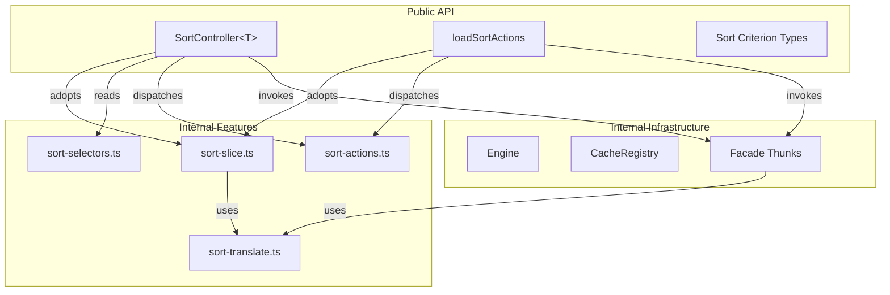
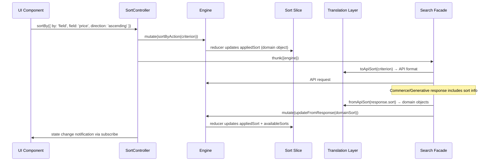

# Design Document: Sort Controller

## Overview

The Sort Controller feature adds a public controller and public actions to `@coveo/thermidor` that allow consumers to change the sort order of search results. It follows the established pattern of internal feature module + public controller + public actions.

Per ADR-008, the sort criterion is a **domain-level discriminated union** that expresses intent rather than transport syntax. An internal translation layer (per ADR-001) converts between domain types and API formats. The controller is generic over the interface type, narrowing the criterion union accordingly.

## Architecture



### Data Flow



## Components and Interfaces

### Public Criterion Types

```typescript
export type SortDirection = 'ascending' | 'descending';

export type SortByRelevance = { by: 'relevance' };
export type SortByDate      = { by: 'date'; direction: SortDirection };
export type SortByField     = { by: 'field'; field: string; direction: SortDirection; displayName?: string };
export type SortByQRE       = { by: 'qre' };
export type SortByNoSort    = { by: 'nosort' };

export type SearchSortCriterion   = SortByRelevance | SortByDate | SortByField | SortByQRE | SortByNoSort;
export type CommerceSortCriterion = SortByRelevance | SortByField;

export type SortCriterionFor<T> =
  T extends Supports<'commerce'> ? CommerceSortCriterion :
  T extends Supports<'search'> ? SearchSortCriterion :
  SearchSortCriterion | CommerceSortCriterion;
```

### Internal Translation Layer: `src/internal/features/sort/sort-translate.ts`

```typescript
import type {SearchSortCriterion, CommerceSortCriterion} from '@/src/public/sort-types.js';

// Commerce API types — uses 'asc'/'desc' instead of domain 'ascending'/'descending'
interface CommerceApiSortField {
  field: string;
  direction?: 'asc' | 'desc';
  displayName?: string;
}

interface CommerceApiSortPayload {
  sortCriteria: 'relevance' | 'fields';
  fields?: CommerceApiSortField[];
}

// Search API: domain → string
export function toSearchApiSort(criterion: SearchSortCriterion): string {
  switch (criterion.by) {
    case 'relevance': return 'relevancy';
    case 'date':      return `date ${criterion.direction}`;
    case 'field':     return `@${criterion.field} ${criterion.direction}`;
    case 'qre':       return 'qre';
    case 'nosort':    return 'nosort';
  }
}

// Search API: compound → comma-separated string
export function toSearchApiCompoundSort(criteria: SearchSortCriterion[]): string {
  return criteria.map(toSearchApiSort).join(',');
}

// Commerce API: domain → API payload
export function toCommerceApiSort(criterion: CommerceSortCriterion): CommerceAPISortPayload {
  switch (criterion.by) {
    case 'relevance': return { sortCriteria: 'relevance' };
    case 'field':     return { sortCriteria: 'fields', fields: [{ field: criterion.field, direction: criterion.direction === 'ascending' ? 'asc' : 'desc' }] };
  }
}

// Commerce API: response → domain
export function fromCommerceApiSort(raw: CommerceAPISortPayload): CommerceSortCriterion {
  if (raw.sortCriteria === 'relevance') return { by: 'relevance' };
  if (raw.sortCriteria === 'fields' && raw.fields?.length) {
    return {
      by: 'field',
      field: raw.fields[0].field,
      direction: raw.fields[0].direction === 'desc' ? 'descending' : 'ascending',
      displayName: raw.fields[0].displayName,
    };
  }
  return { by: 'relevance' };
}
```

### Search Request Selector Integration

The translation layer is integrated into both API request paths via selectors in `sort-selectors.ts`:

- **Commerce/Generative path**: `sort-selectors.ts` → `buildSortRequest` → returns `CommerceApiSortPayload | undefined` → wired into `commerce-search-request-selector.ts`
- **Search path**: `sort-selectors.ts` → `buildSearchSortCriteria` → returns `string | undefined` (e.g., `"@price ascending"`) → wired into `search-request-selector.ts` as `sortCriteria`

```typescript
// In sort-selectors.ts
buildSortRequest: createMemoizedStateSelector(sliceSelector, (state: SortState): CommerceApiSortPayload | undefined => {
  if (!state.appliedSort) { return undefined; }
  const criterion = Array.isArray(state.appliedSort) ? state.appliedSort[0] : state.appliedSort;
  return toCommerceApiSort(criterion as CommerceSortCriterion);
}),

buildSearchSortCriteria: createMemoizedStateSelector(sliceSelector, (state: SortState): string | undefined => {
  if (!state.appliedSort) { return undefined; }
  const criteria = Array.isArray(state.appliedSort) ? state.appliedSort : [state.appliedSort];
  return toSearchApiCompoundSort(criteria as SearchSortCriterion[]);
}),
```

### Internal Feature: `src/internal/features/sort/`

#### `sort-actions.ts`

```typescript
import {createAction} from '@reduxjs/toolkit';
import type {CacheKey} from '@/src/internal/utils/index.js';
import {createCacheKey, getHandleInternals} from '@/src/internal/utils/index.js';
import type {InterfaceHandle} from '@/src/internal/utils/index.js';
import type {SearchSortCriterion, CommerceSortCriterion} from '@/src/public/sort-types.js';

// Internal sort payload — stores domain objects
type SortResponsePayload = {
  appliedSort: SearchSortCriterion | CommerceSortCriterion;
  availableSorts: (SearchSortCriterion | CommerceSortCriterion)[];
} | undefined;

type SortActions = ReturnType<typeof createSortActions>;
const CACHE_KEY: CacheKey<SortActions> = createCacheKey<SortActions>('sort/actions');

export function createSortActions(interfaceId: string) {
  return {
    updateFromResponse: createAction<SortResponsePayload>(
      `${interfaceId}/sort/updateFromResponse`
    ),
    sortBy: createAction<SearchSortCriterion | CommerceSortCriterion | (SearchSortCriterion | CommerceSortCriterion)[]>(
      `${interfaceId}/sort/sortBy`
    ),
  };
}

export function getOrCreateSortActions(iface: InterfaceHandle) {
  const {stateId, cacheRegistry} = getHandleInternals(iface);
  return cacheRegistry.getOrCreate(CACHE_KEY, () => createSortActions(stateId));
}
```

#### `sort-slice.ts`

```typescript
import {createSlice} from '@reduxjs/toolkit';
import {type CacheKey, createCacheKey, getHandleInternals} from '@/src/internal/utils/index.js';
import type {InterfaceHandle} from '@/src/internal/utils/index.js';
import {getOrCreateSortActions} from './sort-actions.js';
import {getOrCreateHydrateFromSnapshotAction} from '@/src/internal/features/generative/index.js';
import {fromCommerceApiSort} from './sort-translate.js';
import type {SearchSortCriterion, CommerceSortCriterion} from '@/src/public/sort-types.js';

export interface SortState {
  appliedSort: (SearchSortCriterion | CommerceSortCriterion) | (SearchSortCriterion | CommerceSortCriterion)[] | null;
  availableSorts: (SearchSortCriterion | CommerceSortCriterion)[];
}

export const initialSortState: SortState = {
  appliedSort: null,
  availableSorts: [],
};

export function createSortSlice(
  interfaceId: string,
  actions: ReturnType<typeof getOrCreateSortActions>,
  hydrateAction: ReturnType<typeof getOrCreateHydrateFromSnapshotAction>
) {
  return createSlice({
    name: `${interfaceId}/sort`,
    initialState: initialSortState,
    reducers: {},
    extraReducers: (builder) => {
      builder.addCase(actions.updateFromResponse, (state, action) => {
        const sort = action.payload;
        if (!sort) { return; }
        state.appliedSort = sort.appliedSort;
        state.availableSorts = sort.availableSorts;
      });
      builder.addCase(actions.sortBy, (state, action) => {
        state.appliedSort = action.payload;
      });
      builder.addCase(hydrateAction, (state, action) => {
        const payload = action.payload as Record<string, unknown> | null;
        if (!payload?.sort) { return; }
        // Translation from API format to domain types happens here
        const sort = payload.sort as {appliedSort?: unknown; availableSorts?: unknown[]};
        if (sort.appliedSort) {
          state.appliedSort = fromCommerceApiSort(sort.appliedSort as any);
        }
        if (Array.isArray(sort.availableSorts)) {
          state.availableSorts = sort.availableSorts.map((s: any) => fromCommerceApiSort(s));
        }
      });
    },
  });
}

export function getOrCreateSortSlice(iface: InterfaceHandle) {
  const {stateId, cacheRegistry} = getHandleInternals(iface);
  const CACHE_KEY: CacheKey<any> = createCacheKey('sort/slice');
  return cacheRegistry.getOrCreate(CACHE_KEY, () => {
    const actions = getOrCreateSortActions(iface);
    const hydrateAction = getOrCreateHydrateFromSnapshotAction(iface);
    return createSortSlice(stateId, actions, hydrateAction);
  });
}
```

### Public Controller: `src/public/controllers/sort/sort-controller.ts`

```typescript
import {BaseController} from '@/src/internal/utils/index.js';
import type {Supports, EndpointThunk} from '@/src/internal/utils/index.js';
import type {StateSelector} from '@/src/internal/engine/index.js';
import {createMemoizedStateSelector, getHandleInternals} from '@/src/internal/utils/index.js';
import {getOrCreateSortActions, getOrCreateSortSelectors, getOrCreateSortSlice} from '@/src/internal/features/sort/index.js';
import type {SortCriterionFor} from '@/src/public/sort-types.js';
import type {Controller} from '@/src/public/controllers/controller-types.js';

export interface SortControllerState<T> {
  appliedSort: SortCriterionFor<T> | SortCriterionFor<T>[] | null;
  availableSorts: SortCriterionFor<T>[];
}

export interface SortController<T> extends Controller<SortControllerState<T>> {
  sortBy(criterion: SortCriterionFor<T> | SortCriterionFor<T>[]): void;
  isSortedBy(criterion: SortCriterionFor<T> | SortCriterionFor<T>[]): boolean;
}

export interface SortControllerOptions<T extends Supports<'search'>> {
  interface: T;
}

export function buildSortController<T extends Supports<'search'>>(
  options: SortControllerOptions<T>
): SortController<T>;
```

**`isSortedBy` implementation** — structural equality excluding `displayName`:

```typescript
isSortedBy(criterion: SortCriterionFor<T> | SortCriterionFor<T>[]): boolean {
  const {appliedSort} = this.engine.read(this.#controllerState);
  if (!appliedSort) return false;
  return structuralEqual(appliedSort, criterion);
}

function structuralEqual(a: unknown, b: unknown): boolean {
  if (Array.isArray(a) && Array.isArray(b)) {
    return a.length === b.length && a.every((item, i) => structuralEqual(item, b[i]));
  }
  if (typeof a === 'object' && typeof b === 'object' && a && b) {
    const {displayName: _a, ...restA} = a as any;
    const {displayName: _b, ...restB} = b as any;
    return JSON.stringify(restA) === JSON.stringify(restB);
  }
  return a === b;
}
```

### Public Actions: `src/public/actions/sort/sort-actions.ts`

```typescript
import type {Supports} from '@/src/internal/utils/index.js';
import {getHandleInternals} from '@/src/internal/utils/index.js';
import {getOrCreateSortActions, getOrCreateSortSlice} from '@/src/internal/features/sort/index.js';
import type {SortCriterionFor} from '@/src/public/sort-types.js';

export interface LoadSortActionsOptions<T extends Supports<'search'>> {
  interface: T;
}

export function loadSortActions<T extends Supports<'search'>>(options: LoadSortActionsOptions<T>) {
  const {engine, resolveFacades} = getHandleInternals(options.interface);
  engine.adoptSlice(getOrCreateSortSlice(options.interface));

  const thunks = resolveFacades('search');
  const actions = getOrCreateSortActions(options.interface);

  return {
    sortBy(criterion: SortCriterionFor<T> | SortCriterionFor<T>[]) {
      engine.mutate(actions.sortBy(criterion as any));
      for (const thunk of thunks) {
        engine.mutate(thunk({engine}));
      }
    },
  };
}
```

### Package Exports

**`src/public/controllers/index.ts`** — add:
```typescript
export {buildSortController} from './sort/sort-controller.js';
export type {SortController, SortControllerOptions, SortControllerState} from './sort/sort-controller.js';
```

**`src/public/actions/index.ts`** — add:
```typescript
export * from './sort/sort-actions.js';
```

**`src/index.ts`** — add criterion types:
```typescript
export type {
  SortByRelevance, SortByDate, SortByField, SortByQRE, SortByNoSort,
  SearchSortCriterion, CommerceSortCriterion, SortCriterionFor, SortDirection,
} from './public/sort-types.js';
```

## Error Handling

| Scenario | Behavior |
|----------|----------|
| `sortBy` called with criterion unsupported by the interface's API | Falls back to `{ sortCriteria: 'relevance' }` at the translation layer. Type narrowing is aspirational — `SortCriterionFor<T>` does not narrow today due to structural identity of `SearchInterface` and `CommerceInterface`. |
| `updateFromResponse` receives `undefined` | Slice retains current state (no-op). |
| `isSortedBy` called when `appliedSort` is `null` | Returns `false`. |
| Slice not yet adopted when reading state | Selectors fall back to `initialSortState`. |
| `hydrateFromSnapshot` without sort data | Slice retains current state (no-op). |
| Translation encounters unknown format (inbound or outbound) | Returns safe relevance fallback: `fromCommerceApiSort` returns `{ by: 'relevance' }`, `toCommerceApiSort` returns `{ sortCriteria: 'relevance' }`. No warning logged. |

## Testing Strategy

### Unit Tests (Vitest)

**Translation Layer tests:**
- `toSearchApiSort` converts each variant correctly
- `toSearchApiCompoundSort` produces comma-separated strings
- `toCommerceApiSort` produces correct API payloads
- `fromCommerceApiSort` produces domain objects with `displayName`
- Round-trip: `fromCommerceApiSort(toCommerceApiSort(criterion))` preserves semantic equality

**Sort Slice tests:**
- Initial state matches `initialSortState`
- `updateFromResponse` with valid payload sets domain-level `appliedSort` and `availableSorts`
- `sortBy` with single criterion and with array
- `hydrateFromSnapshot` translates API format to domain types
- Slice isolation (does not respond to other interface's actions)

**Sort Controller tests:**
- `buildSortController` returns correct initial state
- `sortBy` with single criterion and compound array
- `isSortedBy` structural equality (same object, equivalent object, different object)
- `isSortedBy` excludes `displayName` from comparison
- `isSortedBy` with compound sorts (array comparison)
- `subscribe` notifies on state changes
- Type narrowing: search interface allows `SortByQRE`, commerce does not (compile-time only)

**Sort Public Actions tests:**
- `loadSortActions` adopts the sort slice
- `sortBy` updates state and triggers facades
