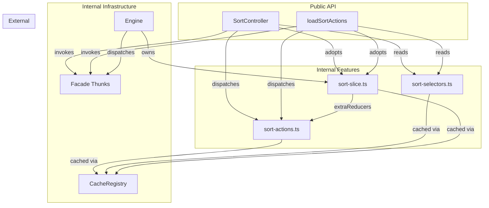
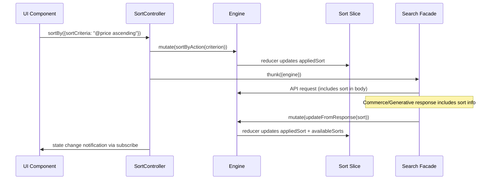

# Design Document: Sort Controller

## Overview

The Sort Controller feature adds a public controller and public actions to `@coveo/thermidor` that allow consumers to change the sort order of search results. It follows the established pattern of internal feature module + public controller + public actions, exactly mirroring the pagination controller architecture.

The design accounts for two distinct API contracts:
- **Search API**: Sort state is fully client-managed. The controller sets `appliedSort` via the `sortBy` action and includes it in the request body. No sort info comes back in the response.
- **Commerce/Generative API**: Sort state is response-driven. The server returns `appliedSort` and `availableSorts`, which the slice consumes via `updateFromResponse`.

Both paths converge on the same `CommerceSearchSortCriterion` type (`{sortCriteria: string}`), keeping the public API unified.

## Architecture



### Data Flow



## Components and Interfaces

### Internal Feature: `src/internal/features/sort/`

#### `sort-actions.ts` (modified)

Adds a `sortBy` action alongside the existing `updateFromResponse`:

```typescript
import {createAction} from '@reduxjs/toolkit';
import type {CacheKey} from '@/src/internal/utils/index.js';
import {createCacheKey, getHandleInternals} from '@/src/internal/utils/index.js';
import type {InterfaceHandle} from '@/src/internal/utils/index.js';
import type {CommerceSearchSort, CommerceSearchSortCriterion} from '@/src/internal/api/commerce-search/index.js';

type SortActions = ReturnType<typeof createSortActions>;

const CACHE_KEY: CacheKey<SortActions> = createCacheKey<SortActions>('sort/actions');

export function createSortActions(interfaceId: string) {
  return {
    updateFromResponse: createAction<CommerceSearchSort | undefined>(
      `${interfaceId}/sort/updateFromResponse`
    ),
    sortBy: createAction<CommerceSearchSortCriterion>(
      `${interfaceId}/sort/sortBy`
    ),
  };
}

export function getOrCreateSortActions(iface: InterfaceHandle) {
  const {stateId, cacheRegistry} = getHandleInternals(iface);
  return cacheRegistry.getOrCreate(CACHE_KEY, () => createSortActions(stateId));
}
```

#### `sort-slice.ts` (modified)

Adds reducer cases for `sortBy` and `hydrateFromSnapshot`, and accepts the `hydrateAction` parameter:

```typescript
import {createSlice} from '@reduxjs/toolkit';
import type {CommerceSearchSortCriterion} from '@/src/internal/api/commerce-search/index.js';
import {type CacheKey, createCacheKey} from '@/src/internal/utils/index.js';
import {getHandleInternals} from '@/src/internal/utils/index.js';
import type {InterfaceHandle} from '@/src/internal/utils/index.js';
import {getOrCreateSortActions} from './sort-actions.js';
import {getOrCreateHydrateFromSnapshotAction} from '@/src/internal/features/generative/index.js';

// ... (SortState, initialSortState unchanged)

export function createSortSlice(
  interfaceId: string,
  actions: ReturnType<typeof getOrCreateSortActions>,
  hydrateAction: ReturnType<typeof getOrCreateHydrateFromSnapshotAction>
) {
  return createSlice({
    name: `${interfaceId}/sort`,
    initialState: initialSortState,
    reducers: {},
    extraReducers: (builder) => {
      builder.addCase(actions.updateFromResponse, (state, action) => {
        const sort = action.payload;
        if (!sort) { return; }
        state.appliedSort = sort.appliedSort;
        state.availableSorts = sort.availableSorts;
      });
      builder.addCase(actions.sortBy, (state, action) => {
        state.appliedSort = action.payload;
      });
      builder.addCase(hydrateAction, (state, action) => {
        const payload = action.payload as Record<string, unknown> | null;
        if (!payload) { return; }
        const sort = payload.sort as {appliedSort?: unknown; availableSorts?: unknown} | undefined;
        if (!sort) { return; }
        if (sort.appliedSort && typeof (sort.appliedSort as Record<string, unknown>).sortCriteria === 'string') {
          state.appliedSort = sort.appliedSort as CommerceSearchSortCriterion;
        }
        if (Array.isArray(sort.availableSorts)) {
          state.availableSorts = sort.availableSorts as CommerceSearchSortCriterion[];
        }
      });
    },
  });
}

export function getOrCreateSortSlice(iface: InterfaceHandle) {
  const {stateId, cacheRegistry} = getHandleInternals(iface);
  return cacheRegistry.getOrCreate(CACHE_KEY, () => {
    const actions = getOrCreateSortActions(iface);
    const hydrateAction = getOrCreateHydrateFromSnapshotAction(iface);
    return createSortSlice(stateId, actions, hydrateAction);
  });
}
```

#### `sort-selectors.ts` (unchanged)

Already provides `getAppliedSort`, `getAvailableSorts`, and `buildSortRequest`. No modifications needed.

### Public Controller: `src/public/controllers/sort/sort-controller.ts`

```typescript
import {BaseController} from '@/src/internal/utils/index.js';
import type {Supports, EndpointThunk} from '@/src/internal/utils/index.js';
import type {StateSelector} from '@/src/internal/engine/index.js';
import {createMemoizedStateSelector, getHandleInternals} from '@/src/internal/utils/index.js';
import {getOrCreateSortActions} from '@/src/internal/features/sort/index.js';
import {getOrCreateSortSelectors} from '@/src/internal/features/sort/index.js';
import {getOrCreateSortSlice} from '@/src/internal/features/sort/index.js';
import type {CommerceSearchSortCriterion} from '@/src/internal/api/commerce-search/index.js';
import type {Controller} from '@/src/public/controllers/controller-types.js';

class SortControllerImpl extends BaseController<SortControllerState> {
  #thunks: EndpointThunk[];
  #actions: ReturnType<typeof getOrCreateSortActions>;
  #controllerState: StateSelector<SortControllerState>;

  constructor(options: SortControllerOptions) {
    const {engine, resolveFacades} = getHandleInternals(options.interface);

    engine.adoptSlice(getOrCreateSortSlice(options.interface));

    const selectors = getOrCreateSortSelectors(options.interface);
    const actions = getOrCreateSortActions(options.interface);

    const controllerState = createMemoizedStateSelector(
      selectors.getAppliedSort,
      selectors.getAvailableSorts,
      (appliedSort, availableSorts) => ({appliedSort, availableSorts})
    ) as unknown as StateSelector<SortControllerState>;

    super(engine, controllerState);

    this.#thunks = resolveFacades('search');
    this.#actions = actions;
    this.#controllerState = controllerState;
  }

  sortBy(criterion: CommerceSearchSortCriterion): void {
    this.engine.mutate(this.#actions.sortBy(criterion));
    for (const thunk of this.#thunks) {
      this.engine.mutate(thunk({engine: this.engine}));
    }
  }

  isSortedBy(criterion: CommerceSearchSortCriterion): boolean {
    const {appliedSort} = this.engine.read(this.#controllerState);
    if (!appliedSort) {
      return false;
    }
    return appliedSort.sortCriteria === criterion.sortCriteria;
  }
}

export const buildSortController = (
  options: SortControllerOptions
): SortController => new SortControllerImpl(options);

export interface SortControllerState {
  appliedSort: CommerceSearchSortCriterion | null;
  availableSorts: CommerceSearchSortCriterion[];
}

export interface SortController extends Controller<SortControllerState> {
  sortBy(criterion: CommerceSearchSortCriterion): void;
  isSortedBy(criterion: CommerceSearchSortCriterion): boolean;
}

export interface SortControllerOptions {
  interface: Supports<'search'>;
}
```

### Public Actions: `src/public/actions/sort/sort-actions.ts`

```typescript
import type {Supports} from '@/src/internal/utils/index.js';
import {getHandleInternals} from '@/src/internal/utils/index.js';
import {getOrCreateSortActions} from '@/src/internal/features/sort/index.js';
import {getOrCreateSortSelectors} from '@/src/internal/features/sort/index.js';
import {getOrCreateSortSlice} from '@/src/internal/features/sort/index.js';
import type {CommerceSearchSortCriterion} from '@/src/internal/api/commerce-search/index.js';

export interface LoadSortActionsOptions {
  interface: Supports<'search'>;
}

export function loadSortActions(options: LoadSortActionsOptions) {
  const {engine, resolveFacades} = getHandleInternals(options.interface);

  engine.adoptSlice(getOrCreateSortSlice(options.interface));

  const thunks = resolveFacades('search');
  const actions = getOrCreateSortActions(options.interface);
  const selectors = getOrCreateSortSelectors(options.interface);

  return {
    sortBy(criterion: CommerceSearchSortCriterion) {
      engine.mutate(actions.sortBy(criterion));
      for (const thunk of thunks) {
        engine.mutate(thunk({engine}));
      }
    },
    getState() {
      return {
        appliedSort: engine.read(selectors.getAppliedSort),
        availableSorts: engine.read(selectors.getAvailableSorts),
      };
    },
  };
}
```

### Package Exports

**`src/public/controllers/index.ts`** — add:
```typescript
export {buildSortController} from './sort/sort-controller.js';
export type {
  SortController,
  SortControllerOptions,
  SortControllerState,
} from './sort/sort-controller.js';
```

**`src/public/actions/index.ts`** — add:
```typescript
export * from './sort/sort-actions.js';
```

## Data Models

### Sort State (internal)

```typescript
interface SortState {
  appliedSort: CommerceSearchSortCriterion | null;
  availableSorts: CommerceSearchSortCriterion[];
}

const initialSortState: SortState = {
  appliedSort: null,
  availableSorts: [],
};
```

### Sort Criterion (shared type from Commerce Search API)

```typescript
interface CommerceSearchSortCriterion {
  sortCriteria: string;
}
```

The `sortCriteria` string holds:
- **Search API values**: `"relevancy"`, `"date ascending"`, `"date descending"`, `"qre"`, `"nosort"`, `"@field ascending"`, `"@field descending"`, or comma-separated combinations.
- **Commerce API values**: Values from the Commerce `SortBy` type, returned by the server.

### Sort Response Payload (Commerce/Generative)

```typescript
interface CommerceSearchSort {
  appliedSort: CommerceSearchSortCriterion;
  availableSorts: CommerceSearchSortCriterion[];
}
```

### Controller State (public)

```typescript
interface SortControllerState {
  appliedSort: CommerceSearchSortCriterion | null;
  availableSorts: CommerceSearchSortCriterion[];
}
```

## Correctness Properties

Correctness is validated through comprehensive unit tests (no property-based testing is used).

## Error Handling

| Scenario | Behavior |
|----------|----------|
| `sortBy` called with any criterion | No validation — the criterion is passed through. Invalid values are the caller's responsibility. This matches the pagination controller pattern (no bounds check on the criterion itself). |
| `updateFromResponse` receives `undefined` | Slice retains current state (no-op). |
| `isSortedBy` called when `appliedSort` is `null` | Returns `false`. No error thrown. |
| Slice not yet adopted when reading state | Selectors fall back to `initialSortState` via `createSelectSlice`. |
| Multiple `sortBy` calls in rapid succession | Each call dispatches immediately. The last facade thunk response wins via `updateFromResponse` (Commerce/Generative) or last `sortBy` state persists (Search). |
| `hydrateFromSnapshot` dispatched without `sort` in payload | Slice retains current state (no-op). |

The sort controller intentionally does no input validation on the `sortCriteria` string. This is consistent with the existing Thermidor pattern where controllers are thin orchestrators and validation belongs at the UI/consumer layer.

## Testing Strategy

### Unit Tests (Vitest)

Following the established pattern from `pagination-slice.test.ts`:

**Sort Actions tests:**
- `createSortActions` produces correctly scoped action types
- `getOrCreateSortActions` returns the same cached instance for the same interface
- `getOrCreateSortActions` returns different instances for different interfaces

**Sort Slice tests:**
- Initial state matches `initialSortState`
- `updateFromResponse` with valid payload sets `appliedSort` and `availableSorts`
- `updateFromResponse` with `undefined` is a no-op
- `sortBy` sets `appliedSort` to the given criterion
- `sortBy` does not modify `availableSorts`
- `hydrateFromSnapshot` with sort payload hydrates `appliedSort` and `availableSorts`
- `hydrateFromSnapshot` without sort field is a no-op
- `hydrateFromSnapshot` with null payload is a no-op
- Slice does not respond to actions from a different interface
- State immutability is preserved

**Sort Selectors tests:**
- `getAppliedSort` reads from scoped state
- `getAvailableSorts` reads from scoped state
- Falls back to initial state when slice is not present
- Caching behavior (same/different interface IDs)

**Sort Controller tests:**
- `buildSortController` returns a controller with correct initial state
- `sortBy` updates `appliedSort` in state
- `sortBy` invokes search facade thunks
- `isSortedBy` returns `true` when criteria match
- `isSortedBy` returns `false` when criteria differ
- `isSortedBy` returns `false` when `appliedSort` is `null`
- `subscribe` notifies on state changes

**Sort Public Actions tests:**
- `loadSortActions` adopts the sort slice
- `sortBy` updates state and triggers facades
- `getState` returns current sort state

**Test file location**: `src/internal/features/sort/sort-slice.test.ts` for slice tests, `src/public/controllers/sort/sort-controller.test.ts` for controller tests.
