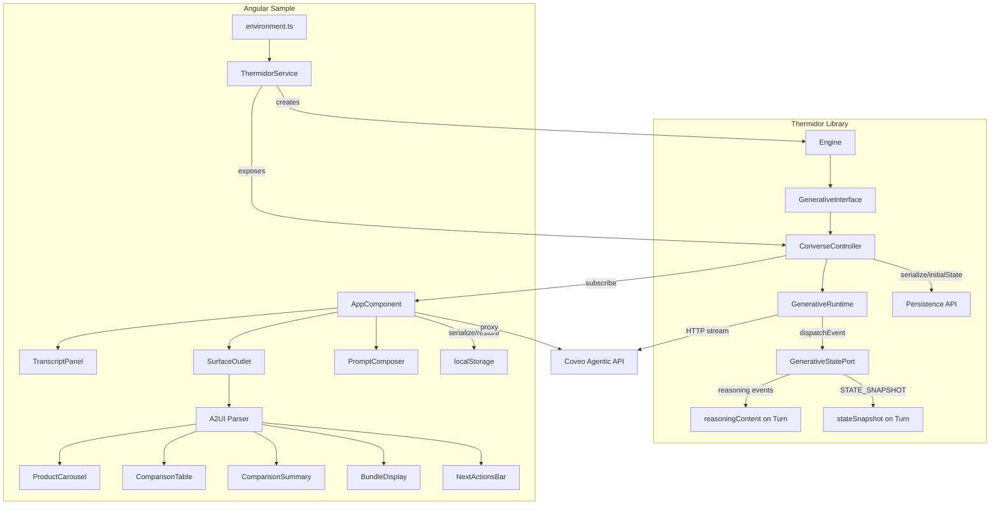

# Design Document: Thermidor Angular Commerce Agent Sample

## Overview

This design describes two workstreams that together deliver a fully integrated Angular commerce agent sample within the ui-kit monorepo:

1. **Thermidor library enhancements** — Adding conversation persistence (`serialize()`/`initialState`), reasoning event support (`reasoningContent`), and state snapshot support (`stateSnapshot`) to the `ConverseController` and `GenerativeRuntime`.

2. **Angular sample adaptation** — Replacing the Angular sample's custom transport, state management, and AG-UI event parsing with Thermidor's `Engine`, `GenerativeInterface`, and `ConverseController` APIs while preserving Angular-native presentation components.

The resulting sample follows the same structural conventions as the existing `generative-react` sample: workspace dependency on `@coveo/thermidor`, catalog-managed Angular dependencies, Turbo pipeline integration, and a dev server proxy for the Coveo platform.

## Architecture



### Layer Responsibilities

| Layer                   | Responsibility                                                                         |
| ----------------------- | -------------------------------------------------------------------------------------- |
| **Thermidor Engine**    | Configuration, state store, navigator context                                          |
| **GenerativeInterface** | Manages the generative state slice for one conversation                                |
| **ConverseController**  | Public API (`submit`, `selectTurn`, `retry`, `serialize`) + subscribable state         |
| **GenerativeRuntime**   | Consumes the AG-UI event stream, dispatches to state port                              |
| **GenerativeStatePort** | Mutates turn state (messages, surfaces, toolCalls, reasoning, snapshots)               |
| **ThermidorService**    | Angular injectable that initializes Engine/Interface/Controller                        |
| **A2UI Parser**         | Transforms opaque `A2UISurface` records into typed `RenderableCommerceSurface` objects |
| **Surface Components**  | Angular standalone OnPush components rendering commerce UI                             |

## Components and Interfaces

### Workstream 1: Thermidor Library Enhancements

#### 1.1 Conversation Persistence API

```typescript
// Added to ConverseController
interface ConverseController {
  // ... existing methods
  serialize(): SerializedConverseState;
}

interface SerializedConverseState {
  turns: SerializedTurn[];
  activeTurnId: string | undefined;
}

type SerializedTurn = Omit<Turn, 'routedInterface'> & {
  routedInterface?: {useCase: string} | undefined;
};

// Added to ConverseControllerOptions
interface ConverseControllerOptions {
  interface: GenerativeInterface;
  initialState?: SerializedConverseState;
}
```

**Design decisions:**

- `serialize()` returns a plain object that survives `JSON.stringify`/`JSON.parse` round-trips. The `routedInterface` field is serialized as a use-case identifier only (the live interface cannot be serialized).
- When `initialState` is provided, any turns with `status: 'streaming'` are transitioned to `status: 'error'` with a descriptive message, since in-flight streams cannot be resumed.
- The serialized format is a public contract within the same major version.

#### 1.2 Reasoning Event Support

```typescript
// Extended AgentResponse
interface AgentResponse {
  messages: AgentMessage[];
  surfaces: A2UISurface[];
  toolCalls: ToolCall[];
  reasoningContent: string; // NEW — accumulated reasoning text
}

// Extended GenerativeStatePort
interface GenerativeStatePort {
  // ... existing methods
  startReasoning(turnId: string): void;
  appendReasoningDelta(turnId: string, delta: string): void;
  endReasoning(turnId: string): void;
}
```

**Design decisions:**

- `reasoningContent` is a single concatenated string (not an array of deltas) because consumers display it as flowing text.
- The runtime calls `startReasoning` / `appendReasoningDelta` / `endReasoning` in the `dispatchEvent` switch/case alongside the existing event handlers.
- When no reasoning events arrive, `reasoningContent` defaults to `''`.

#### 1.3 State Snapshot Support

```typescript
// Extended Turn
interface Turn {
  // ... existing fields
  stateSnapshot: Record<string, unknown> | null; // NEW — transient execution status
}

// Extended GenerativeStatePort
interface GenerativeStatePort {
  // ... existing methods
  setStateSnapshot(turnId: string, snapshot: Record<string, unknown>): void;
}
```

**Design decisions:**

- `stateSnapshot` is transient: it is set to `null` when the turn completes (status → `complete`). This prevents stale status labels from persisting after the agent finishes.
- The snapshot is opaque (`Record<string, unknown>`) — interpretation (e.g., extracting a `label` field) is the consumer's responsibility.
- The `serialize()` method includes the `stateSnapshot` field as-is (it's already JSON-safe by contract from the server).

### Workstream 2: Angular Sample Adaptation

#### 2.1 ThermidorService (Injectable)

```typescript
@Injectable({providedIn: 'root'})
export class ThermidorService {
  readonly converseController: ConverseController;

  constructor() {
    const config = getEngineConfiguration(); // from environment.ts
    const engine = new Engine({
      configuration: config,
      navigatorContextProvider: getNavigatorContext,
    });
    const generativeInterface = buildGenerativeInterface({engine});
    this.converseController = buildConverseController({
      interface: generativeInterface,
      initialState: this.loadPersistedState(),
    });
  }

  private loadPersistedState(): SerializedConverseState | undefined {
    /* localStorage */
  }
}
```

#### 2.2 NavigatorContextProvider

```typescript
function getNavigatorContext(): NavigatorContext {
  return {
    clientId: getClientId(),
    location: window.location.href,
    referrer: document.referrer || null,
    userAgent: navigator.userAgent || null,
  };
}

function getClientId(): string | undefined {
  try {
    const stored = sessionStorage.getItem('commerce-agent-client-id');
    if (stored) return stored;
    const id = crypto.randomUUID();
    sessionStorage.setItem('commerce-agent-client-id', id);
    return id;
  } catch {
    return undefined;
  }
}
```

#### 2.3 Environment Configuration

```typescript
// src/environments/environment.ts
export const environment = {
  organizationId: '',
  accessToken: '',
  trackingId: '',
  language: 'en',
  country: 'AU',
  currency: 'AUD',
  endpoint: '', // empty = use proxy
};
```

The Angular CLI proxy (`proxy.conf.json` or `angular.json` `proxyConfig`) routes:

- `/rest/organizations/{orgId}/commerce/unstable/agentic` → admin endpoint
- `/rest/**` → platform endpoint

When environment variables for the endpoints are not set, the proxy configuration is omitted and the dev server starts without error.

#### 2.4 A2UI Parser (Retained)

The existing `a2ui-parser.ts` is retained with a narrowed interface: it receives `A2UISurface[]` (opaque records from Thermidor state) and produces `RenderableCommerceSurface[]`. The `SurfaceState` internal type moves into the parser file as a private implementation detail.

The `applyActivitySnapshot` function signature changes to accept a single `A2UISurface` record (since Thermidor delivers surfaces one at a time) and accumulates state internally.

#### 2.5 Component Input Contracts

All surface components use Angular `input()` signal inputs:

```typescript
@Component({ changeDetection: ChangeDetectionStrategy.OnPush, ... })
export class ProductCarouselComponent {
  readonly surface = input.required<ProductCarouselSurface>();
}
```

The `SurfaceOutlet` maps `componentType` → component class via the existing `SURFACE_COMPONENTS` registry. Unknown types render nothing (no error).

#### 2.6 Files Removed

| File/Directory                   | Reason                                           |
| -------------------------------- | ------------------------------------------------ |
| `.git/`                          | Monorepo VCS                                     |
| `package-lock.json`              | pnpm workspace                                   |
| `.prettierrc`                    | Root oxfmt handles formatting                    |
| `tsconfig.spec.json`             | No unit tests ported                             |
| `docs/screenshots/`              | Old standalone UX screenshots                    |
| `services/` (entire directory)   | Custom transport replaced by Thermidor           |
| `conversation.interfaces.ts`     | Types superseded by Turn/ConverseControllerState |
| `formatting.ts`                  | Mock catalog utility no longer used              |
| `mock-catalog.ts`                | Local mock data removed                          |
| `demo-agent.config.ts`           | Mock/live toggle removed                         |
| AG-UI event types in `models.ts` | Thermidor exports these                          |
| `ChatMessage`, `ChatRole`        | Replaced by Turn, AgentMessage                   |

#### 2.7 Package.json Target State

```json
{
  "name": "@samples/thermidor-commerce-agent-angular",
  "version": "0.0.0",
  "private": true,
  "scripts": {
    "build": "ng build",
    "dev": "ng serve --configuration development"
  },
  "dependencies": {
    "@coveo/thermidor": "workspace:*",
    "@angular/common": "catalog:",
    "@angular/compiler": "catalog:",
    "@angular/core": "catalog:",
    "@angular/forms": "catalog:",
    "@angular/platform-browser": "catalog:",
    "rxjs": "~7.8.0",
    "tslib": "^2.3.0"
  },
  "devDependencies": {
    "@angular/build": "catalog:",
    "@angular/cli": "catalog:",
    "@angular/compiler-cli": "catalog:",
    "typescript": "catalog:"
  }
}
```

#### 2.8 TypeScript Path Resolution

The `tsconfig.app.json` adds a path mapping so imports of `@coveo/thermidor` resolve to the local source entry:

```jsonc
{
  "compilerOptions": {
    "paths": {
      "@coveo/thermidor": ["../../packages/thermidor/src/index.ts"],
      "@/*": ["../../packages/thermidor/*"],
    },
  },
}
```

This mirrors the React sample's Vite `resolve.alias` approach but uses TypeScript paths since Angular CLI respects them natively.

## Data Models

### Turn (Extended)

```typescript
interface Turn {
  id: string;
  prompt: string;
  status: TurnStatus; // 'streaming' | 'complete' | 'error'
  routedInterface?: RoutedInterface;
  agentResponse?: AgentResponse;
  error?: string;
  stateSnapshot: Record<string, unknown> | null; // NEW
}

interface AgentResponse {
  messages: AgentMessage[];
  surfaces: A2UISurface[];
  toolCalls: ToolCall[];
  reasoningContent: string; // NEW
}
```

### SerializedConverseState

```typescript
interface SerializedConverseState {
  turns: SerializedTurn[];
  activeTurnId: string | undefined;
}

// Turns are serialized as-is except routedInterface is reduced to a use-case tag
type SerializedTurn = {
  id: string;
  prompt: string;
  status: TurnStatus;
  agentResponse?: {
    messages: AgentMessage[];
    surfaces: A2UISurface[];
    toolCalls: ToolCall[];
    reasoningContent: string;
  };
  error?: string;
  stateSnapshot: Record<string, unknown> | null;
  routedInterface?: {useCase: string};
};
```

### RenderableCommerceSurface (Retained from Angular sample)

The discriminated union of `ProductCarouselSurface | ComparisonTableSurface | ComparisonSummarySurface | BundleDisplaySurface | NextActionsBarSurface` is kept in the Angular sample's `models.ts`. These types are sample-specific and not exported by Thermidor.

## Correctness Properties

_A property is a characteristic or behavior that should hold true across all valid executions of a system — essentially, a formal statement about what the system should do. Properties serve as the bridge between human-readable specifications and machine-verifiable correctness guarantees._

### Property 1: Prompt validation determines submission

_For any_ string `s`, calling the prompt submission logic SHALL invoke `converseController.submit({prompt: s.trim()})` if and only if `s.trim()` is non-empty. If `s.trim()` is empty, the controller state SHALL remain unchanged.

**Validates: Requirements 3.4, 3.5**

### Property 2: A2UI parser produces typed surfaces from opaque records

_For any_ valid `A2UISurface` record containing a recognized `componentType` and well-formed operation payloads, the A2UI parser SHALL produce a `RenderableCommerceSurface` object whose `componentType` matches the input and whose data fields are populated from the operation payload.

**Validates: Requirements 4.1**

### Property 3: Surface component dispatch matches componentType

_For any_ `RenderableCommerceSurface` with a `componentType` in the set `{ProductCarousel, ComparisonTable, ComparisonSummary, BundleDisplay, NextActionsBar}`, the `SurfaceOutlet` SHALL resolve to the corresponding Angular component class from the `SURFACE_COMPONENTS` registry.

**Validates: Requirements 4.4, 8.2**

### Property 4: Surface insertion order is preserved during streaming

_For any_ sequence of surfaces arriving during a streaming turn, the rendered surface list SHALL maintain the first-appearance insertion order — a surface that appeared at index `i` (by first-seen time) SHALL never render at a position after a surface that appeared at index `j > i`.

**Validates: Requirements 4.6**

### Property 5: Assistant messages render in array order

_For any_ turn with `agentResponse.messages` of length `n`, the rendered message list SHALL display messages at indices `0..n-1` in the same sequential order as the array.

**Validates: Requirements 5.2**

### Property 6: Tool call name truncation

_For any_ tool call with a `name` of length `L`, the displayed tool name SHALL equal `name` when `L ≤ 60`, and SHALL equal `name.slice(0, 57) + '...'` when `L > 60`.

**Validates: Requirements 5.5**

### Property 7: Turn history display capacity

_For any_ turn list of length `N`, the scrollable history SHALL display at least `min(N, 50)` entries.

**Validates: Requirements 5.6**

### Property 8: Serialization JSON round-trip

_For any_ valid `ConverseControllerState`, calling `serialize()` SHALL return a plain object `s` such that `JSON.parse(JSON.stringify(s))` deep-equals `s`.

**Validates: Requirements 13.1, 13.6**

### Property 9: State restoration hydrates turns before first subscriber callback

_For any_ valid `SerializedConverseState` passed as `initialState`, the first state emitted to a subscriber SHALL contain turns matching the serialized data (with streaming turns transitioned to error).

**Validates: Requirements 13.3**

### Property 10: Streaming turns become error on restore

_For any_ `SerializedConverseState` containing turns with `status: 'streaming'`, after restoration those turns SHALL have `status: 'error'` and a non-empty `error` message indicating stream interruption.

**Validates: Requirements 13.4**

### Property 11: Reasoning delta accumulation

_For any_ sequence of `REASONING_MESSAGE_CONTENT` events with deltas `[d₁, d₂, ..., dₙ]` received during a turn, the turn's `agentResponse.reasoningContent` SHALL equal the concatenation `d₁ + d₂ + ... + dₙ`.

**Validates: Requirements 14.2, 14.3**

### Property 12: State snapshot storage

_For any_ `STATE_SNAPSHOT` event with payload `p` received during a streaming turn, the turn's `stateSnapshot` field SHALL equal `p` (replacing any previous value).

**Validates: Requirements 15.2**

### Property 13: State snapshot cleared on completion

_For any_ turn that transitions to `status: 'complete'`, the turn's `stateSnapshot` field SHALL be `null` regardless of its prior value.

**Validates: Requirements 15.4**

## Error Handling

| Scenario                                                  | Behavior                                                                                                                                                        |
| --------------------------------------------------------- | --------------------------------------------------------------------------------------------------------------------------------------------------------------- |
| `sessionStorage` or `crypto.randomUUID()` unavailable     | `getClientId()` returns `undefined`; Engine initializes without clientId                                                                                        |
| `localStorage` unavailable or stored state fails to parse | Controller initializes without `initialState`; no error thrown                                                                                                  |
| `initialState` contains streaming turns                   | Those turns are marked `error` with message "Stream was interrupted"                                                                                            |
| AG-UI stream ends without terminal event                  | `GenerativeRuntime` fails the turn with "Stream ended without a terminal event"                                                                                 |
| Network error during stream                               | `GenerativeRuntime` catches the error and fails the turn with the error message                                                                                 |
| Unknown `componentType` in surface                        | `SurfaceOutlet` renders nothing; no error propagated                                                                                                            |
| Empty/whitespace prompt submission                        | Submission is silently rejected; no state mutation                                                                                                              |
| Dev proxy environment variables missing                   | Dev server starts without proxy; requests go directly to configured endpoint                                                                                    |
| `serialize()` called during streaming                     | Returns current state snapshot (streaming turn is included as-is); consumers may persist and restore — the restore logic handles the streaming→error transition |

## Testing Strategy

### Unit Tests (Example-Based)

- **Engine initialization**: Verify `ThermidorService` creates Engine with expected configuration values from environment.
- **NavigatorContextProvider**: Verify `getClientId` persists to sessionStorage and reuses across calls.
- **Graceful fallbacks**: Verify missing `sessionStorage`/`crypto` doesn't throw; verify broken localStorage doesn't throw.
- **SurfaceOutlet unknown type**: Verify no error and no DOM output for unrecognized componentType.
- **UI indicators**: Verify streaming indicator shows when `isStreaming=true`, reasoning indicator shows when `reasoningContent` is non-empty.
- **Turn selection**: Verify `selectTurn` updates displayed content.
- **Retry**: Verify retry control calls `converseController.retry` with the error turn's id.

### Property-Based Tests

Property-based tests use `fast-check` with a minimum of **100 iterations** per property.

Each test is tagged with a comment referencing the design property:

```
// Feature: thermidor-angular-commerce-agent-sample, Property {N}: {title}
```

Properties 1, 6, 7, 8, 9, 10, 11, 12, 13 are implemented as property-based tests in Thermidor's test suite (for library properties) and the Angular sample's test file (for sample-level properties like prompt validation and truncation).

Properties 2, 3, 4, 5 are implemented as property-based tests in the Angular sample's test file since they exercise the A2UI parser and component dispatch logic.

### Integration Tests

- `pnpm install` resolves with exit code 0 from monorepo root.
- `pnpm run build` from the sample directory produces exit code 0.
- Dev server starts without error when proxy env vars are unset.
- `pnpm run lint:fix` from root formats the sample without errors.

### Smoke Tests

- `package.json` contains correct `name`, `private`, `workspace:*` dependency, `catalog:` versions, `build`/`dev` scripts.
- Removed files (`.git`, `package-lock.json`, `.prettierrc`, `tsconfig.spec.json`, `docs/screenshots/`, `services/`, `mock-catalog.ts`, `demo-agent.config.ts`, `conversation.interfaces.ts`, `formatting.ts`) do not exist.
- No source file imports reference removed modules.
- All surface components use `ChangeDetectionStrategy.OnPush`.
- `angular.json` uses `@angular/build:application` builder.
- `tsconfig.json` has `skipLibCheck: true`.
