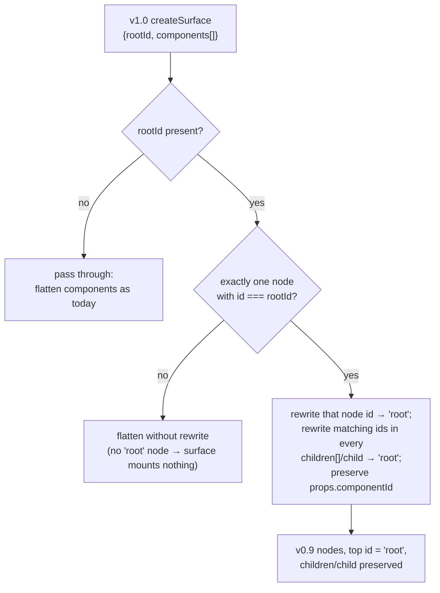

# Design Document

## Overview

This design realizes the runtime switchover to the A2-UI adjacency-list composition model in the mock-driven sample `samples/thermidor/demo-schema-react` (the Schema_Sample). It is KIT-6147 track #2 and consumes the additive schema contract delivered by track #1 (`thermidor-schema-adjacency-list`): `children`/`child` on the base component contract, the `commerce-search` surface-root component type, and the widened SDK union.

> **Descoped:** an earlier revision of track #1 also delivered a `CompositionSnapshot` contract (`rootId` + a flat component map, with a `CompositionSnapshotEntry` view) used purely to verify assembled surfaces. That contract was removed from `@coveo/thermidor-schema` (see the "drop unused composition-snapshot contract" change), so the snapshot-assembly verification below and Properties 7/8 are **not implemented on this branch**. They are retained here as design history and can return if the contract is reintroduced.

The essence of the change is to stop reconstructing composition in the consumer and instead let the message dictate it (ADR-007). Today three things reconstruct or carry composition off the A2-UI plane:

- The commerce-search surface has no root node and is arranged by a bespoke React shell (`CommerceSearchLayout`) that finds components by `componentType`.
- `FacetManager` reads facet ordering from `facetIds` in AG-UI state and receives a fabricated `childComponents: Map`.
- `BundleDisplay` reads `slot.surfaceRef` strings from AG-UI state to locate product data.
- Surface-routing intent is carried by a `surfaceType` field on `createSurface` across the SDK, the mocks, and the sample.

After this change, composition lives on the A2-UI plane (`children`/`child`/`rootId` on the component nodes), per-component data stays on the AG-UI plane keyed by `componentId`, and the two planes correlate only by `componentId`. `CommerceSearch`, `FacetManager`, and `BundleDisplay` become true A2-UI renderers that mount children through the renderer's `children(id)` function. `surfaceType` is removed everywhere and navigation routes on the root component's `componentType`.

### Research findings

The decisive technical unknown named in the requirements is the behavior of `@copilotkit/a2ui-renderer` v1.61.2 — specifically how it locates a surface's root and how a custom renderer mounts its children. The renderer package is not resolvable from the workspace source tree (it lives in the pnpm store and ships no readable `.d.ts` under a searchable path), so the design treats its behavior as the requirements do: as verifiable outcomes, not an over-specified mechanism. Two facts are load-bearing and are established from the code that already integrates the renderer:

1. **The renderer begins a surface's tree at the literal component id `"root"`.** The existing `Mock_Bundle_Template` emits its top node with `id: 'root'` (in `schema-response-bundle.ts`), and the existing `surfaces.test.ts` fixture that exercises the v1→v0.9 adapter also uses `id: 'root'` for the surface's single component. This confirms the Renderer_Root_Id is `"root"` and that a surface whose top node is not `"root"` will not be mounted from the intended root without a mapping.
2. **The `V1_To_V09_Adapter` (`convertV1ToV09` in `surfaces.tsx`) is where each node's `id`, catalog `component`, and props survive into the v0.9 `{id, component, ...props}` shape.** Track #1's ADR-007 model already added `children`/`child` to the component contracts, so those fields flow through the adapter's `{...rest, ...props}` spread today — but nothing yet renames the Declared_Root_Id to `"root"`, and the search template emits no root node at all. This makes the adapter the correct, single place to resolve the Root_Mapping.

ADR-007 and its Annex A are the source of truth for the plane boundary: composition (`children`/`child`/`rootId`) is expressed between components on the A2-UI plane and is never placed in AG-UI state; per-component `state` stays flat and keyed by `componentId` (ADR-002, ADR-006). Annex A §4.3 further establishes that the root component's `componentType` carries the surface-routing intent that a separate `surfaceType` concept would otherwise carry — the basis for Requirement 10.

The current-state facts that ground the design (read from `main`):

- `surfaces.tsx` `convertV1ToV09` flattens `createSurface.components[]` into v0.9 `updateComponents`, spreading `props` onto each node. It does not read or rewrite `rootId`.
- `schema-response-search.ts` emits a flat `components[]` with **no** `commerce-search` root node and **no** `rootId`; facet ordering is carried as `facetIds` inside `facet-manager-2` AG-UI state; it emits `surfaceType: 'commerceSearch'`.
- `schema-response-bundle.ts` emits a `bundle-display` node with `id: 'root'`; each tier slot carries `surfaceRef`; it emits `surfaceType: 'converse'`.
- `components.tsx` registers no `CommerceSearch` renderer, wraps `FacetManager` with a `FacetManagerCatalogRenderer` that passes `EMPTY_CHILD_COMPONENTS`, and the real child map is fabricated in `CommerceSearchLayout`.
- `use-navigation.ts` (`findSurface`, `findCommerceSurfaceId`, `deriveTransitionAction`) routes on `createSurface.surfaceType`.
- The SDK (`unified-runtime.ts`, `unified-surface-hydration.ts`) declares `surfaceType?` on `CreateSurfacePayload`, validates it as a string, exposes `extractSurfaceType`, and branches `onA2uiSurface` on its presence.

## Architecture

### The two planes and their correlation

```mermaid
flowchart LR
  subgraph MOCK["platform-mock-api templates"]
    A2["A2-UI plane\ncreateSurface.rootId\ncomponents[].id / children / child"]
    AG["AG-UI plane\nStateSnapshot.components\nkeyed by componentId"]
  end
  A2 -->|v1.0 messages| BR["Surface_Bridge\nconvertV1ToV09\n(root mapping)"]
  BR -->|v0.9 nodes with children/child\ntop node id = 'root'| R["@copilotkit/a2ui-renderer"]
  R -->|children(id)| CR["Catalog renderers\nCommerceSearch / FacetManager / BundleDisplay / leaves"]
  AG -->|useRemoteController(componentId)| CR
  CR -.correlated only by componentId.- AG
```

Composition flows A2-UI → Surface_Bridge → renderer → catalog renderers, which mount children by id. Data flows AG-UI → `useRemoteController(componentId)` into each mounted renderer. The only link between a mounted node and its data is the shared `componentId`.

### Root mapping strategy

The renderer mounts from the node whose id is `"root"`. A Decomposed_Surface declares a real Declared_Root_Id (`commerce-search-2` for search, `bundle-root`/`root` for bundle) via `createSurface.rootId`. The Root_Mapping is resolved inside `convertV1ToV09` by **rewriting the id of the node whose id equals the Declared_Root_Id to `"root"`, and rewriting every reference to that id (in other nodes' `children`/`child`) to `"root"` as well.** The node's `props.componentId` is left untouched, so AG-UI lookups keyed by `componentId` still resolve.

Rationale for id-rewrite over alternatives:

- It requires no renderer patch and no change to how catalog renderers receive `children(id)`.
- It keeps the renderer's single-root invariant intact (exactly one `"root"` node per surface).
- `componentId` (used for state correlation and action dispatch) is a separate field from the node `id`, so remapping `id` does not disturb data correlation or dispatch.

When `createSurface` declares no `rootId`, the adapter preserves today's behavior (no rewrite; the surface either already has a `"root"` node or mounts nothing new). When `rootId` names an id that matches no node, no rewrite is applied and no `"root"` node is synthesized, so the renderer mounts no tree for that surface while leaving other surfaces untouched — satisfying the invalid-root tolerance in Requirement 1.4.



### Renderer conversion strategy

The three container renderers move from reading AG-UI state (or a fabricated map) for composition to reading their child ids from the A2-UI renderer inputs and mounting each through `children(id)`:

- **CommerceSearch** (new renderer, new catalog entry): mounts its ordered children (search box, facet manager, sort, pagination, product list) via `children(id)`. Replaces the bespoke `CommerceSearchLayout` shell.
- **FacetManager**: mounts its facet children via `children(id)` in `children` order. Stops reading `facetIds`; stops taking a `childComponents` map.
- **BundleDisplay**: mounts each slot product-list child via `children(id)`; each mounted child reads its own product data from AG-UI state by its `componentId`. Stops reading `surfaceRef`.

A renderer obtains its ordered child ids from the composition provided through its A2-UI renderer inputs. Concretely, the renderer reads its own node's `children` list (the ordered child ids on the A2-UI node) — the same list the mock declares and the adapter preserves. It never reads `children`/`child` from AG-UI state.

### surfaceType removal and routing by root componentType

Surface-routing intent moves from `createSurface.surfaceType` to the root component's `componentType` (ADR-007 Annex A §4.3). The navigation helpers resolve the root via `createSurface.rootId` and read `components[rootId].props.componentType`:

- root `componentType === 'commerce-search'` → search-results page.
- any other root `componentType`, or no surface → inline conversation.

This is observably equivalent to the prior rule where only `surfaceType === 'commerceSearch'` routed to search. The removal spans the SDK (`CreateSurfacePayload`, its validation, `extractSurfaceType`, the `onA2uiSurface` branch), the five mock templates that emit `surfaceType`, and the sample navigation.

> Because `findSurface` reads the raw v1.0 `createSurface` message (the mock payload as authored), it reads `rootId`/`components[rootId]` as authored by the template — **before** the Surface_Bridge id-rewrite. Navigation therefore does not depend on the `"root"` rename.

## Components and Interfaces

### Surface_Bridge — `convertV1ToV09` (`a2ui/surfaces.tsx`)

Extend the existing `createSurface` branch to resolve the Root_Mapping.

```ts
// Inside convertV1ToV09, createSurface branch:
const rootId = createSurface['rootId'] as string | undefined;

// Determine whether exactly one component matches the declared root id.
const rootMatches =
  rootId !== undefined && rootId !== RENDERER_ROOT_ID
    ? components?.filter((c) => c['id'] === rootId) ?? []
    : [];
const resolveRoot = rootMatches.length === 1;

const v09Components = (components ?? []).map((comp) => {
  const {props, ...rest} = comp;
  const remapped = resolveRoot ? remapId(rest, rootId!) : rest;
  return isRecord(props) ? {...remapped, ...props} : remapped;
});
```

- `RENDERER_ROOT_ID = 'root'`.
- `remapId(node, declaredRootId)` returns the node with `id` rewritten to `'root'` when `node.id === declaredRootId`, and with any entry in `children[]` equal to `declaredRootId` (and a `child` equal to `declaredRootId`) rewritten to `'root'`. `props.componentId` is untouched (it lives under the still-spread `props`).
- When `rootId` is absent, or matches zero or more than one node, `resolveRoot` is false and the mapping is a no-op (preserving Requirement 1.3 and tolerating 1.4 without error).
- The absence of a `children`/`child` field on a source node is preserved (never fabricated), satisfying Requirement 2.6.

### CommerceSearch renderer (new) — `a2ui/CommerceSearch/CommerceSearch.tsx`

```ts
export function CommerceSearchRenderer({
  props,
  children,
}: {
  props: CommerceSearchProps;
  children: (id: string) => React.ReactNode;
}) { /* mounts ordered child ids via children(id) */ }
```

- Derives ordered child ids from its A2-UI node's `children` (via renderer inputs), not AG-UI state.
- Mounts each child once, first-to-last, by `children(id)`.
- Empty `children` → zero mounts, renders a stable empty layout without error (Requirement 3.5).
- A declared child id with no corresponding component is skipped by `children(id)` returning nothing renderable; the remaining ids still mount in order (Requirement 3.6).
- Owns only the layout markup that `CommerceSearchLayout` owned (sidebar/main grid); it no longer finds components by type.

### FacetManager renderer — `a2ui/FacetManager/FacetManager.tsx`

New signature and body:

```ts
export function FacetManagerRenderer({
  props,
  children,
}: {
  props: FacetManagerProps;
  children: (id: string) => React.ReactNode;
}) { /* mounts facet child ids via children(id) in children order */ }
```

- Removes the `childComponents: Map` parameter, the `renderChild` switch, and the `facetIds` read.
- Obtains ordered facet child ids from renderer inputs (`children` on the facet-manager node).
- Mounts each via `children(id)` preserving order (Requirement 4.3).
- While composition is not yet available, or `children` is empty, mounts nothing and renders without error (4.5, 4.6). A declared-but-missing child id is skipped (4.7).

### BundleDisplay renderer — `a2ui/BundleDisplay/BundleDisplay.tsx`

- Keeps its own state (tier tabs) read from AG-UI via `useRemoteController(componentId)`.
- Replaces the `slot.surfaceRef` lookup with mounting slot product-list children by id via `children(id)`, using the bundle root node's `children` in declared order.
- Each mounted slot product-list renderer sources its product data from AG-UI state keyed by its own `componentId` (Requirement 5.3); a missing entry renders an empty product set without error (5.4).
- Removes all `surfaceRef` reads (5.5). Empty `children` → zero slot mounts, no error (5.6).

### Catalog registration — `a2ui/components.tsx`

- Add a `CommerceSearch` catalog definition (`CommerceSearchPropsSchema`) and register `CommerceSearchRenderer`.
- Register `FacetManagerRenderer` and `BundleDisplayRenderer` directly (both now conform to the `{props, children}` contract), removing the `FacetManagerCatalogRenderer` wrapper and `EMPTY_CHILD_COMPONENTS`.
- Exactly one renderer entry per catalog `componentType`; no remaining reference to the fabricated `childComponents` map or `EMPTY_CHILD_COMPONENTS` (Requirement 6.6).
- Unresolved `componentType` is handled by the renderer/catalog by declining to render that node while preserving the rest and surfacing an error indication naming the `componentType` (Requirement 6.5).

### Removal of `CommerceSearchLayout`

The bespoke shell `components/CommerceSearchLayout/CommerceSearchLayout.tsx` (and its test) is superseded by the `CommerceSearchRenderer` mounted through the renderer. The call site that renders the decomposed search surface switches to mounting the surface via the A2UI_Renderer (as other surfaces already do through `ThermidorA2UISurfaces`).

### Navigation — `hooks/use-navigation.ts`

```ts
interface DerivedSurface {
  rootComponentType: string;
  surfaceId: string;
}
```

- `findSurface`: for the first `createSurface` message with a `surfaceId`, resolve `rootId` and read `components[rootId].props.componentType` (matching by node `id === rootId`); return `{rootComponentType, surfaceId}`. No `surfaceType` read.
- `findCommerceSurfaceId`: returns `surfaceId` when `rootComponentType === 'commerce-search'`, else null.
- `deriveTransitionAction`: `commerce-search` root → `NAVIGATE_SEARCH`; any other root, or no surface with an agent response → `NAVIGATE_CONVERSATION`.

### SDK — `packages/thermidor`

- `unified-surface-hydration.ts`: remove `surfaceType?` from `CreateSurfacePayload` and its validation branch.
- `unified-runtime.ts`: remove `extractSurfaceType`; simplify `onA2uiSurface` so a2ui surfaces route without reading `surfaceType`. The legacy SurfaceProcessor delegation is preserved as the unconditional path for surfaces that require hydration (the branch condition that referenced `surfaceType` is removed, not the hydration behavior it guarded), consistent with keeping the Real_Backend_Sample working.
- Tests: remove/adapt `extract-surface-type.test.ts` and the `surfaceType`-based properties in `unified-routing-properties.test.ts`.

## Data Models

### v1.0 `createSurface` after this change

Search surface (`schema-response-search.ts`):

```jsonc
{
  "version": "v1.0",
  "createSurface": {
    "surfaceId": "ui-commerce-water-sports",
    "rootId": "commerce-search-2",           // Declared_Root_Id (was absent)
    "catalogId": "…",
    // surfaceType removed
    "components": [
      {"id": "commerce-search-2", "component": "CommerceSearch",
       "props": {"componentId": "commerce-search-2", "componentType": "commerce-search"},
       "children": ["search-box-2", "facet-manager-2", "sort-2", "pagination-2", "product-list-2"]},
      {"id": "search-box-2", "component": "SearchBox", "props": {…}},
      {"id": "facet-manager-2", "component": "FacetManager", "props": {…},
       "children": ["facet-brand-2", "facet-price-2", "facet-category-2"]},
      {"id": "sort-2", "component": "Sort", "props": {…}},
      {"id": "pagination-2", "component": "Pagination", "props": {…}},
      {"id": "product-list-2", "component": "ProductList", "props": {…}},
      {"id": "facet-brand-2", "component": "RegularFacet", "props": {…}},
      {"id": "facet-price-2", "component": "NumericFacet", "props": {…}},
      {"id": "facet-category-2", "component": "CategoryFacet", "props": {…}}
    ]
  }
}
```

Bundle surface (`schema-response-bundle.ts`): the `bundle-display` node declares `children` as the ids of one product-list node per slot (in slot-enumeration order); each slot product-list is emitted as its own node. `rootId` names the bundle root; `surfaceRef` is removed from the AG-UI tier/slot data.

### AG-UI `StateSnapshot.components` (unchanged shape, minus composition)

Keyed by `componentId`. Carries per-component data only. After this change:

- `facet-manager-2` state no longer contains `facetIds`.
- Bundle tier slots no longer contain `surfaceRef`; each slot's product data is delivered under the slot product-list's `componentId`.
- No `children`/`child`/`rootId` ever appears in AG-UI state.

### Schema contract change — `FacetManagerState`

`packages/thermidor-schema` source schema for `FacetManagerState` removes `facetIds`; the Zod projection (`src/generated/schemas.ts`) is regenerated so `FacetManagerStateSchema` no longer declares `facetIds`. A changeset for `@coveo/thermidor-schema` describes the removal.

### `CompositionSnapshot` assembly (verification) — DESCOPED

> The `composition-snapshot` contract was removed from `@coveo/thermidor-schema`, so this verification is **not implemented on this branch**. The section is kept as design history.

For validation (Requirement 8.4), a mock surface would be assembled into a `CompositionSnapshot`: `{rootId: Declared_Root_Id, components: {<id>: <CompositionSnapshotEntry>}}`, validated by `CompositionSnapshotSchema`. Each node would validate against the `CompositionSnapshotEntry` view for its `componentType`.

## Correctness Properties

*A property is a characteristic or behavior that should hold true across all valid executions of a system — essentially, a formal statement about what the system should do. Properties serve as the bridge between human-readable specifications and machine-verifiable correctness guarantees.*

The pure, input-driven cores of this feature are amenable to property-based testing: the `convertV1ToV09` transform, the container renderers' child-mounting order, the plane-boundary invariants the mock emits, the componentId correlation, the composition-rejection error condition, the schema validators, and the routing partition. Purely structural facts (catalog registration, removed symbols), the external renderer's internal mounting, deterministic template shape, and build/test-runner outcomes are covered by example, integration, and smoke tests in the Testing Strategy instead.

### Property 1: Root mapping resolves, preserves identity, and tolerates the no-match cases

*For any* v1.0 `createSurface` message, when `convertV1ToV09` processes it: (a) if the message declares a `rootId` other than `"root"` that matches exactly one component node's `id`, the converted output contains exactly one node whose `id` is `"root"` and it is the node that had that `rootId`, with every reference to the old id in any `children`/`child` also rewritten to `"root"`; (b) if the message declares no `rootId`, or a `rootId` that matches zero or more than one node, no node id is rewritten and no `"root"` node is synthesized, and conversion completes without throwing; and in all cases (c) every node retains its `props.componentId` and `props.componentType` unchanged and preserves its `children`/`child` fields (including their absence) except for the single root-id rename in case (a).

**Validates: Requirements 1.1, 1.3, 1.4, 1.5, 2.6**

### Property 2: Every declared child id resolves to an emitted node

*For any* surface a mock template emits, every id appearing in any node's `children` list (and any node's `child`) is equal to the `id` of exactly one node emitted in the same `createSurface.components[]`, and the Declared_Root_Id equals the `id` of exactly one emitted node.

**Validates: Requirements 2.2, 2.3, 7.1, 7.3**

### Property 3: A container renderer mounts each present child once, in declared order, tolerating gaps

*For any* ordered list of child ids supplied to a container renderer (CommerceSearch, FacetManager, or BundleDisplay) through its A2-UI renderer inputs, the renderer invokes the Children_Mount_Function exactly once for each id that has a corresponding component in the composition, in the exact order the ids appear in the list, skips any id with no corresponding component while preserving the order of the remaining ids, makes zero calls when the list is empty or unavailable, and renders without raising an error in every case.

**Validates: Requirements 3.2, 3.3, 3.5, 3.6, 4.2, 4.3, 4.6, 4.7, 5.2, 5.6**

### Property 4: Emitted AG-UI state carries only per-component data keyed by componentId

*For any* payload a mock template emits (initial or action-driven update), the AG-UI `StateSnapshot`/`StateDelta` contains no `children`, `child`, or `rootId` at any key path; each AG-UI state key equals the `componentId` of exactly one emitted A2UI_Component_Node; and each emitted node's `componentId` equals its own `id`.

**Validates: Requirements 2.4, 2.5, 7.5, 9.5**

### Property 5: Slot product data correlates to AG-UI state solely by componentId

*For any* mapping of `componentId` to product data and any set of mounted slot product-list child ids, each mounted child renders exactly the product data found at the AG-UI state entry whose key equals that child's `componentId`, and renders an empty product set (without error) when no such entry exists.

**Validates: Requirements 5.3, 5.4, 9.4**

### Property 6: A composition missing a referenced node is rejected, naming the missing node

*For any* composition a mock template would emit in which the Declared_Root_Id has no matching node, or any id referenced by a `children`/`child` list has no matching node, the template rejects the composition and produces an error indication that names the missing node, and emits no partial tree.

**Validates: Requirements 7.2, 7.4**

### Property 7: Assembled snapshots are accepted by CompositionSnapshot validation — DESCOPED

> Not implemented on this branch: the `composition-snapshot` contract was removed from `@coveo/thermidor-schema`. Retained as design history.

*For any* surface a mock template emits, assembling it into a `Composition_Snapshot_Contract` (`rootId` plus the flat component map) yields a snapshot accepted by the Schema_Package `CompositionSnapshot` validation; and *for any* snapshot that violates the contract, validation is rejected with an error identifying the offending component id and the failed constraint.

**Validates: Requirements 8.4**

### Property 8: Every emitted node is accepted by the CompositionSnapshotEntry view for its componentType — DESCOPED

> Not implemented on this branch: the `composition-snapshot` contract was removed from `@coveo/thermidor-schema`. Retained as design history.

*For any* A2UI_Component_Node a mock template emits, the node's component contract is accepted by the Schema_Package `CompositionSnapshotEntry` validation for its `componentType`; and *for any* node that is not valid for its `componentType`, validation is rejected with an error identifying the offending node id and its `componentType`.

**Validates: Requirements 8.5**

### Property 9: Surface routing partitions on the root componentType

*For any* mounted surface, navigation routes to the search-results page when and only when the resolved Root_Component's `componentType` equals `commerce-search`; every other root `componentType`, and the absence of a surface (with an agent response present), routes to inline conversation.

**Validates: Requirements 10.5, 10.6, 10.7, 10.9**

### Property 10: Facet-manager state validates without facetIds

*For any* facet-manager per-component data that omits the Facet_Ids_Field, the regenerated `Facet_Manager_State` validation accepts it; and *for any* facet-manager data that carries a Facet_Ids_Field (or omits a required field), validation is rejected with an error identifying the offending field.

**Validates: Requirements 8.6, 9.1**

## Error Handling

- **Invalid Declared_Root_Id (renderer side).** When a `createSurface` declares a `rootId` matching no node, `convertV1ToV09` performs no id rewrite and synthesizes no `"root"` node. The renderer finds no root for that surface and mounts nothing for it, while other surfaces are unaffected. No exception is thrown (Requirement 1.4).
- **Missing child id at mount time.** A container renderer that encounters a declared child id with no corresponding component skips it — `children(id)` yields nothing renderable — and continues mounting the remaining ids in order. No exception is thrown (Requirements 3.6, 4.7).
- **Missing AG-UI data for a mounted node.** A mounted leaf whose `componentId` has no AG-UI state entry renders its empty state (e.g. a product-list with an empty product set). Containers already guard on `controller.state` being absent by rendering nothing (Requirements 4.5, 5.4).
- **Unresolved componentType.** The catalog declines to render a node whose `componentType` has no registered renderer, preserves every successfully resolved node, and surfaces an error indication naming the unresolved `componentType` (Requirement 6.5).
- **Invalid composition at the mock (producer side).** A template asked to emit a composition whose root or any referenced child is absent rejects the composition with an error naming the missing node rather than emitting a partial tree (Requirements 7.2, 7.4). This is the producer-side counterpart to the consumer's tolerance: the trusted producer never ships a dangling reference.
- **Schema validation failures.** Snapshot, node, and facet-state validation failures produce errors that identify the offending id/constraint/field (Requirements 8.4, 8.5, 8.6), used by the verification tests rather than surfaced to end users.

## Testing Strategy

### Property-based tests

The ten properties above are each implemented as a single property-based test using **fast-check** (already the PBT library in this repo, e.g. `unified-routing-properties.test.ts`), each configured to run **at least 100 iterations** and tagged with a comment of the form:

`// Feature: thermidor-commerce-search-composition, Property {n}: {property text}`

- **P1** (root mapping) — pure test over `convertV1ToV09` with generated component maps and root ids (matching, absent, duplicate, and no-rootId cases), asserting the id-rewrite, no-op, and preservation clauses. Lives in `a2ui/surfaces.test.ts` (or a sibling).
- **P2** (children closure) — over emitted surfaces and generated compositions, asserting referential integrity.
- **P3** (container mount order) — a single reusable harness that spies on the Children_Mount_Function and drives generated ordered child-id lists (including empty, unavailable, and lists with absent ids) against all three container renderers, asserting the call sequence equals the present-id subsequence in declared order. Rendered with a mocked `children` prop; no real renderer needed.
- **P4** (plane boundary) — over emitted initial and action-driven payloads, asserting no composition field in AG-UI state and the componentId ⇒ id correlation.
- **P5** (componentId correlation) — generated `componentId`→products maps and mounted child id sets.
- **P6** (composition rejection) — generated compositions with an injected missing reference.
- **P10** (schema validation) — generated valid and invalid facet-states validated against the regenerated `FacetManagerStateSchema`. (**P7/P8 descoped**: they validated the removed `CompositionSnapshot`/`CompositionSnapshotEntry` contract.)
- **P9** (routing) — generated surfaces with varied root `componentType` (including commerce-search, arbitrary others, and no-surface) asserted against `deriveTransitionAction`.

### Unit / example tests

- Renderer contract conformance and rendering for CommerceSearch, FacetManager, BundleDisplay (Requirements 3.1, 4.1, 5.1).
- Negative structural guarantees: no `facetIds`/`surfaceRef` reads, no `childComponents` map / `EMPTY_CHILD_COMPONENTS` (via focused tests plus the existing `import-boundary.test.ts` / grep-style assertions) (Requirements 4.4, 5.5, 6.3, 9.6).
- Catalog registration facts: `commerce-search` → CommerceSearchRenderer, FacetManager/BundleDisplay entries, one entry per `componentType`, unknown-type handling (Requirements 6.1, 6.2, 6.4, 6.6).
- Deterministic template shape: one node per mount target, unique ids, empty `children` emitted as `[]`, no `surfaceType` in the five templates, facet order equals `children`, slot association via `children` (Requirements 2.1, 2.7, 2.8, 7.3, 9.2, 9.3, 10.4).
- SDK structural changes: `CreateSurfacePayload` and its validation no longer reference `surfaceType`; `extractSurfaceType` removed; `onA2uiSurface` no longer reads `surfaceType` (Requirements 10.1, 10.2). Adapt `extract-surface-type.test.ts` and the `surfaceType` properties in `unified-routing-properties.test.ts` (Requirement 10.3).
- Navigation adaptation and named-scenario routing: water sports → search; bundle/comparison/discovery/fallback → conversation; affected sample tests (`ConversationPage.integration.test.tsx`, `AppShell.test.tsx`, `AppShell.bidirectional.test.tsx`) carry no `surfaceType` payloads (Requirements 10.8, 10.10).
- Behavior-preservation equivalence for query, facets, sort, pagination, and bundle tiers, all sourced from AG-UI (Requirement 7.6).

### Integration / E2E tests

- Mounting a Decomposed_Surface end-to-end and asserting the root renderer and its children render (Requirement 1.2), via the existing Playwright suite where defined (Requirement 8.3).

### Smoke / verification (build, suites, changeset, untouched real-backend sample)

- `pnpm run build` for the Schema_Sample compiles with zero type errors (Requirement 8.1).
- Schema_Sample unit tests and (where defined) e2e tests pass (Requirements 8.2, 8.3).
- Affected SDK and Schema_Sample suites pass (Requirements 10.3, 10.11).
- The Real_Backend_Sample (`samples/thermidor/demo-react`) has no modified source and its build/tests pass on the real backend (Requirement 8.7).
- A changeset exists naming each affected public package (`@coveo/thermidor-schema`, `@coveo/thermidor`, and any other modified public package) with a semver bump and a non-empty description (Requirements 8.8, 9.1). The regenerated `FacetManagerStateSchema` contains no `facetIds` (Requirement 9.1).

### Test type summary

- **Property (fast-check, ≥100 iters):** P1–P10 above.
- **Example/unit:** contract conformance, structural removals, catalog facts, template shape, SDK/navigation adaptation, behavior preservation.
- **Integration/E2E:** end-to-end mount of decomposed surfaces.
- **Smoke:** builds, test-suite exit statuses, changeset presence, real-backend sample untouched.
