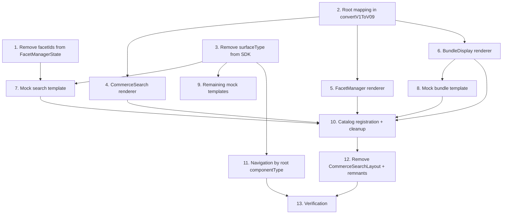

# Implementation Plan

## Overview

Runtime switchover to A2-UI adjacency-list composition in `samples/thermidor/demo-schema-react`, consuming the track #1 schema contract. Tasks are ordered so the schema/SDK/mock producers are ready before the sample consumers, and each renderer is testable in isolation before end-to-end mounting.

Naming note (DESCOPED): an earlier revision of track #1 exposed an identity-free per-component view `SnapshotEntry` (per document `#/$defs/SnapshotEntry`) and a `CompositionSnapshotEntry` / `CompositionSnapshotEntrySchema` union. That `composition-snapshot` contract was removed from `@coveo/thermidor-schema`, so tasks/requirements that reference it (12.1's P7/P8, 8.4/8.5) are not implemented on this branch.

## Task Dependency Graph



```json
{
  "waves": [
    {"wave": 1, "tasks": ["1", "2", "3"]},
    {"wave": 2, "tasks": ["4", "5", "6", "9"]},
    {"wave": 3, "tasks": ["7", "8"]},
    {"wave": 4, "tasks": ["10", "11"]},
    {"wave": 5, "tasks": ["12"]},
    {"wave": 6, "tasks": ["13"]}
  ]
}
```


## Tasks

- [x] 1. Remove `facetIds` from `FacetManagerState` in `@coveo/thermidor-schema`
  - Edit `packages/thermidor-schema/schema/components/facet-manager.schema.json` to remove the `facetIds` field from the `FacetManagerState` `$defs` (and from its `required`), on both the root state and the `SnapshotEntry` view.
  - Run `pnpm --filter @coveo/thermidor-schema generate` and confirm `FacetManagerStateSchema` in `src/generated/schemas.ts` no longer declares `facetIds`.
  - Update `tests/facet-schemas.test.ts` assertions that reference `facetIds` on the facet-manager state.
  - Add a changeset for `@coveo/thermidor-schema` describing the removal.
  - _Requirements: 9.1, 8.6_

- [x] 2. Resolve the Root_Mapping inside `convertV1ToV09` (`a2ui/surfaces.tsx`)
  - In the `createSurface` branch, read `createSurface.rootId`; when it is present, not equal to `"root"`, and matches exactly one component node's `id`, rewrite that node's `id` to `"root"` and rewrite every matching entry in other nodes' `children[]` and any `child` to `"root"`.
  - Leave `props.componentId` untouched so AG-UI correlation and dispatch are undisturbed.
  - No-op (no rewrite, no synthesized `"root"` node) when `rootId` is absent, or matches zero or more than one node; preserve the absence of `children`/`child` rather than fabricating one.
  - _Requirements: 1.1, 1.2, 1.3, 1.4, 1.5, 2.6_

- [x] 2.1 Property test P1 — root mapping resolves, preserves identity, tolerates no-match
  - fast-check test (>=100 iters) over `convertV1ToV09` with generated component maps and root ids (matching, absent, duplicate, no-rootId). Tag: `// Feature: thermidor-commerce-search-composition, Property 1: ...`.
  - _Requirements: 1.1, 1.3, 1.4, 1.5, 2.6_

- [x] 3. Remove `surfaceType` from the `@coveo/thermidor` SDK
  - `unified-surface-hydration.ts`: remove `surfaceType?` from `CreateSurfacePayload` and its validation in `isCreateSurfacePayload`.
  - `unified-runtime.ts`: remove `extractSurfaceType` and the `surfaceType`-based branch of `onA2uiSurface`; keep the legacy SurfaceProcessor delegation as the unconditional hydration path.
  - Adapt/remove `extract-surface-type.test.ts` and the `surfaceType`-based properties in `unified-routing-properties.test.ts` so no SDK test asserts on `surfaceType`.
  - _Requirements: 10.1, 10.2, 10.3_

- [x] 4. New `CommerceSearch` renderer that mounts children by id
  - Create `a2ui/CommerceSearch/CommerceSearch.tsx` conforming to the renderer contract `{props, children}`; derive ordered child ids from the A2-UI renderer inputs (its node's `children`) and mount each once via `children(id)` in declared order.
  - Empty `children` -> zero mounts, stable empty layout, no error. A declared child id with no component is skipped; remaining ids still mount in order.
  - Own only the layout markup previously in `CommerceSearchLayout` (sidebar/main grid); never read composition from AG-UI state.
  - _Requirements: 3.1, 3.2, 3.3, 3.4, 3.5, 3.6_

- [x] 5. Convert `FacetManager` into a true A2-UI renderer
  - Change `a2ui/FacetManager/FacetManager.tsx` to the `{props, children}` contract; remove the `childComponents: Map` parameter, the `renderChild` switch, and the `facetIds` read.
  - Obtain ordered facet child ids from renderer inputs and mount each via `children(id)` in `children` order; tolerate unavailable/empty composition and declared-but-missing child ids without error.
  - _Requirements: 4.1, 4.2, 4.3, 4.4, 4.5, 4.6, 4.7_

- [x] 6. Convert `BundleDisplay` into a fully adjacency-list renderer
  - Change `a2ui/BundleDisplay/BundleDisplay.tsx` to mount each slot product-list child via `children(id)` using the bundle root's `children` in declared order; keep tier-tab state read from AG-UI via `useRemoteController(componentId)`.
  - Each mounted slot product-list sources its product data from AG-UI state keyed by its own `componentId`; a missing entry renders an empty product set without error.
  - Remove all `slot.surfaceRef` reads; empty `children` -> zero slot mounts, no error.
  - _Requirements: 5.1, 5.2, 5.3, 5.4, 5.5, 5.6, 9.4_

- [x] 6.1 Property test P3 — container mount order/tolerance (one harness for the three renderers)
  - Single reusable fast-check harness (>=100 iters) spying on a mocked `children` prop, driving generated ordered child-id lists (incl. empty, unavailable, lists with absent ids) against CommerceSearch, FacetManager, BundleDisplay; assert the call sequence equals the present-id subsequence in declared order.
  - _Requirements: 3.2, 3.3, 3.5, 3.6, 4.2, 4.3, 4.6, 4.7, 5.2, 5.6_

- [x] 6.2 Property test P5 — slot product data correlates to AG-UI state solely by componentId
  - fast-check test over generated `componentId`->products maps and mounted slot child id sets.
  - _Requirements: 5.3, 5.4, 9.4_

- [x] 7. Update `Mock_Search_Template` (`schema-response-search.ts`) to emit the full adjacency-list tree
  - Emit a `commerce-search` root node plus one node per mount target (search box, facet manager, each facet, product list, sort, pagination), each with a unique non-empty `id`; declare the root's `children` in layout order and the facet manager's `children` as the facet ids in emission order.
  - Set `createSurface.rootId` to the commerce-search root id; place `children`/`child`/`rootId` only on the A2-UI nodes and `createSurface`, never in AG-UI state.
  - Express facet ordering solely via the facet-manager node's `children`; do not emit `facetIds`. Remove `surfaceType`.
  - Reject (with an error naming the missing node) any composition whose declared root or a referenced child is absent, without emitting a partial tree.
  - _Requirements: 2.1, 2.2, 2.4, 2.5, 7.1, 7.2, 7.5, 9.2, 10.4_

- [x] 8. Update `Mock_Bundle_Template` (`schema-response-bundle.ts`) to emit slot product-lists as nodes
  - Emit the bundle-display root plus one node per slot product-list; declare the bundle root's `children` as those slot product-list ids in slot-enumeration order; set `createSurface.rootId`.
  - Express slot association solely via `children`; remove `surfaceRef` from the tier/slot AG-UI data. Empty `children` emitted as `[]`. Remove `surfaceType`.
  - Reject a composition with a missing root/child node, naming it, without a partial tree.
  - _Requirements: 2.3, 2.4, 2.5, 7.3, 7.4, 7.5, 9.3, 10.4_

- [x] 9. Remove `surfaceType` from the remaining mock templates
  - Remove `surfaceType` from `schema-response-comparison.ts`, `schema-response-discovery.ts`, and `schema-response-fallback.ts` (the search and bundle templates are handled in tasks 7-8).
  - _Requirements: 10.4_

- [x] 9.1 Property tests P2, P4, P6 — closure, plane boundary, rejection (mock templates)
  - P2: every id in any node's `children`/`child` matches exactly one emitted node, and the Declared_Root_Id matches exactly one. P4: emitted AG-UI state has no `children`/`child`/`rootId`, keys equal componentIds, each node's `componentId` equals its `id`. P6: a composition with a missing referenced node is rejected naming it.
  - _Requirements: 2.2, 2.3, 2.4, 2.5, 7.1, 7.2, 7.3, 7.4, 7.5, 9.5_

- [x] 10. Register the catalog and wire the new/converted renderers (`components.tsx`)
  - Add a `CommerceSearch` catalog definition (`CommerceSearchPropsSchema`) resolving to `CommerceSearchRenderer`; register `FacetManagerRenderer` and `BundleDisplayRenderer` directly under the `{props, children}` contract.
  - Remove the `FacetManagerCatalogRenderer` wrapper, `EMPTY_CHILD_COMPONENTS`, and the `FacetProps` map import; ensure exactly one renderer entry per `componentType`.
  - Decline to render an unresolved `componentType` while preserving resolved components and surfacing an error indication naming the type.
  - _Requirements: 6.1, 6.2, 6.3, 6.4, 6.5, 6.6_

- [x] 11. Route navigation by the Root_Component's `componentType` (`hooks/use-navigation.ts`)
  - Change `findSurface` to resolve the root via `createSurface.rootId` and read `components[rootId].props.componentType` (from the raw v1.0 payload, before the id-rewrite); return `{rootComponentType, surfaceId}`.
  - `findCommerceSurfaceId` returns `surfaceId` when `rootComponentType === 'commerce-search'`, else null. `deriveTransitionAction`: `commerce-search` root -> `NAVIGATE_SEARCH`; any other root, or no surface with an agent response -> `NAVIGATE_CONVERSATION`.
  - Adapt `ConversationPage.integration.test.tsx`, `AppShell.test.tsx`, `AppShell.bidirectional.test.tsx` so no sample test constructs a `surfaceType` payload.
  - _Requirements: 10.5, 10.6, 10.7, 10.8, 10.9, 10.10_

- [x] 11.1 Property test P9 — surface routing partitions on root componentType
  - fast-check test over generated surfaces with varied root `componentType` (commerce-search, arbitrary others, no-surface) asserted against `deriveTransitionAction`.
  - _Requirements: 10.5, 10.6, 10.7, 10.9_

- [x] 12. Remove `CommerceSearchLayout` and the last workaround remnants
  - Delete `components/CommerceSearchLayout/CommerceSearchLayout.tsx` (and its test); switch the decomposed-search call site to mount the surface via `ThermidorA2UISurfaces` like other surfaces.
  - Confirm no remaining read of `facetIds` or `surfaceRef`, and no reference to the fabricated `childComponents` map or `EMPTY_CHILD_COMPONENTS` in the sample.
  - _Requirements: 6.3, 9.6_

- [x] 12.1 Schema-validation property test P10 (P7/P8 descoped)
  - P10: facet-manager state without `facetIds` is accepted; with `facetIds` (or a missing required field) rejected. **P7/P8 descoped** — they validated the removed `CompositionSnapshot` / `CompositionSnapshotEntry` contract, so they are not implemented on this branch.
  - _Requirements: 8.6, 9.1 (8.4, 8.5 descoped)_

- [x] 13. Verification — builds, suites, mock validity, real-backend sample untouched, changeset
  - `pnpm --filter @coveo/thermidor-schema build` and the Schema_Sample build compile with zero type errors; Schema_Sample unit tests and (where defined) Playwright e2e tests pass.
  - Affected SDK suites and the adapted sample suites pass. (Snapshot assembly/validation, Req 8.4/8.5, is descoped — the `composition-snapshot` contract was removed.)
  - Confirm `samples/thermidor/demo-react` (Real_Backend_Sample) has no modified source and its build/tests pass; ensure changesets name each affected public package with a semver bump and description.
  - _Requirements: 7.6, 8.1, 8.2, 8.3, 8.4, 8.5, 8.7, 8.8, 10.11_

## Notes

- Tasks marked with `*` are optional property-based tests (fast-check, >=100 iterations) validating the design's correctness properties P1-P10; they can be deferred but are recommended for the switchover.
- `samples/thermidor/demo-react` (the real-backend sample) must not be modified (Requirement 8.7).
- The `composition-snapshot` contract (`SnapshotEntry` / `CompositionSnapshotEntry`) was removed from `@coveo/thermidor-schema` on this branch; the tasks and requirements that reference it are descoped (see the naming note above).
- `@coveo/thermidor` is exempt from changeset/Conventional Commits rules per its package `AGENTS.md`; `@coveo/thermidor-schema` (public) still requires a changeset (task 1).
