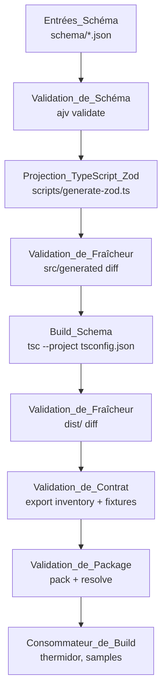
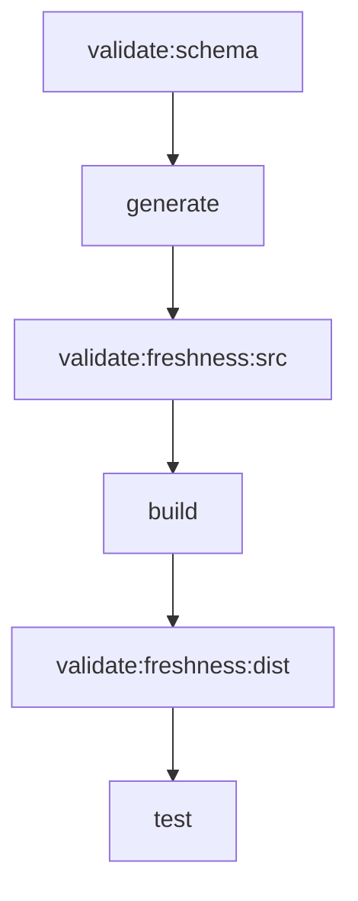

# Design Document

## Overview

This design defines the new `packages/thermidor-schema` package published as `@coveo/thermidor-schema`. The package faithfully reproduces the TypeScript projection pipeline from PR #17 of `coveo-platform/thermidor-schema` (commit `b046dea970dcdb427065f9daf61c910d172fc31e`) within the ui-kit monorepo. It owns the full lifecycle: versioned JSON Schema inputs, a generation script producing TypeScript/Zod source, the generated source itself, a TypeScript build producing `dist/`, and validations ensuring correctness and freshness at every stage.

The design integrates with the monorepo's existing tooling (Turbo, pnpm workspaces, Vitest, TypeScript catalog version) while adapting only where strictly necessary via the two permitted adaptation categories: version alignment and workspace integration.

### Design Decisions

| Decision | Rationale |
|----------|-----------|
| Use `tsc` for build (not tsdown) | Faithful reproduction of the external reference; tsdown is used in thermidor-contracts but the PR uses plain tsc |
| Separate Turbo tasks for generate/validate | Enables caching of generation independently from build; mirrors the pattern in `@coveo/atomic` |
| `quicktype-core` as local devDependency | Not in the monorepo catalog; required by the generator script; scoped to this package only |
| `ajv` + `ajv-formats` as local devDependencies | Required for schema validation; not in the catalog; scoped to this package only |
| Node `--experimental-strip-types` for generator | Faithful reproduction; avoids adding a transpiler step for scripts; Node 22+ supports this natively |
| Generated source committed to repo | Faithful reproduction; enables freshness validation (diff-based); consumers can inspect contracts without running generation |

## Architecture

The package follows a linear pipeline architecture orchestrated by Turbo:



### Turbo Task Graph



The `build` task in Turbo uses `dependsOn: ["generate"]` locally (via package-level `turbo.json`). The `test` task runs after `build` (inherited from root Turbo config). Downstream packages that depend on `@coveo/thermidor-schema` will see their build wait via `^build`.

## Components and Interfaces

### Package Layout

```
packages/thermidor-schema/
├── schema/
│   └── controllers/
│       ├── product-list.schema.json    # Entrée_Schéma
│       └── cart.schema.json            # Entrée_Schéma
├── scripts/
│   ├── generate-zod.ts                 # Script_de_Projection
│   └── validate-schema.ts             # Validation_de_Schéma script
├── src/
│   ├── generated/
│   │   └── schemas.ts                  # Source_TypeScript_Générée
│   └── index.ts                        # Public re-export barrel
├── tests/
│   ├── fixtures/
│   │   ├── product-list.valid.json     # Fixture_de_Comportement_de_Schéma (accepté)
│   │   ├── product-list.invalid.json   # Fixture_de_Comportement_de_Schéma (rejeté)
│   │   ├── cart.valid.json             # Fixture_de_Comportement_de_Schéma (accepté)
│   │   ├── cart.invalid.json           # Fixture_de_Comportement_de_Schéma (rejeté)
│   │   ├── set-items.valid.json        # Fixture_de_Comportement_de_Schéma (accepté)
│   │   ├── set-items.invalid.json      # Fixture_de_Comportement_de_Schéma (rejeté)
│   │   ├── update-item-quantity.valid.json   # Fixture_de_Comportement_de_Schéma (accepté)
│   │   └── update-item-quantity.invalid.json # Fixture_de_Comportement_de_Schéma (rejeté)
│   ├── schema-validation.test.ts       # Validation_de_Schéma tests
│   ├── projection.test.ts             # Projection determinism tests
│   ├── freshness.test.ts              # Freshness validation tests
│   ├── contract.test.ts               # Export inventory + fixture behavior
│   ├── canonical-ids.test.ts          # ID_Schéma_Canonique validation
│   ├── boundary.test.ts              # Import boundary enforcement
│   ├── pack.test.ts                   # Validation_de_Package
│   └── spot-check-equivalence.test.ts # Validation_de_Conformité_Spot
├── dist/                               # Sortie_Dist (built output)
│   ├── index.js
│   ├── index.d.ts
│   └── generated/
│       ├── schemas.js
│       └── schemas.d.ts
├── ADAPTATIONS.md                      # Registre_d_Adaptations
├── CONSUMER-HANDOFF.md                 # Contrat_de_Handoff_Consommateur
├── package.json
├── tsconfig.json
├── turbo.json
└── vitest.config.ts
```

### package.json

```json
{
  "name": "@coveo/thermidor-schema",
  "version": "0.0.1",
  "description": "Versioned JSON Schema-derived Zod contracts for Thermidor controllers",
  "license": "Apache-2.0",
  "repository": {
    "type": "git",
    "url": "git+https://github.com/coveo/ui-kit.git",
    "directory": "packages/thermidor-schema"
  },
  "files": ["dist"],
  "type": "module",
  "main": "./dist/index.js",
  "types": "./dist/index.d.ts",
  "exports": {
    ".": {
      "types": "./dist/index.d.ts",
      "import": "./dist/index.js",
      "default": "./dist/index.js"
    },
    "./package.json": "./package.json"
  },
  "publishConfig": {
    "access": "public"
  },
  "scripts": {
    "validate:schema": "node --experimental-strip-types scripts/validate-schema.ts",
    "generate": "node --experimental-strip-types scripts/generate-zod.ts",
    "validate:freshness:src": "node --experimental-strip-types scripts/check-freshness.ts src",
    "validate:freshness:dist": "node --experimental-strip-types scripts/check-freshness.ts dist",
    "build": "tsc --project tsconfig.json",
    "test": "vitest run",
    "test:watch": "vitest",
    "clean": "node ../../utils/ci/rm-rf.mjs dist"
  },
  "dependencies": {
    "zod": "catalog:"
  },
  "devDependencies": {
    "quicktype-core": "26.0.0",
    "ajv": "8.20.0",
    "ajv-formats": "3.0.1",
    "typescript": "catalog:",
    "vitest": "catalog:"
  }
}
```

### tsconfig.json

```json
{
  "extends": "../../tsconfig.json",
  "compilerOptions": {
    "declaration": true,
    "rootDir": "src/",
    "outDir": "dist/",
    "moduleResolution": "NodeNext",
    "module": "NodeNext",
    "target": "ES2022",
    "strict": true,
    "noUnusedLocals": true,
    "noUnusedParameters": true,
    "types": ["node"]
  },
  "include": ["src/**/*.ts"]
}
```

### turbo.json (package-level)

```json
{
  "$schema": "https://turbo.build/schema.json",
  "extends": ["//"],
  "tasks": {
    "validate:schema": {
      "inputs": ["schema/**/*.json", "scripts/validate-schema.ts"],
      "outputs": []
    },
    "generate": {
      "dependsOn": ["validate:schema"],
      "inputs": ["schema/**/*.json", "scripts/generate-zod.ts"],
      "outputs": ["src/generated/**"]
    },
    "build": {
      "dependsOn": ["generate"],
      "inputs": ["src/**/*.ts", "tsconfig.json"],
      "outputs": ["dist/**"]
    },
    "test": {
      "dependsOn": ["build"]
    }
  }
}
```

### API_Publique_Schema (Public API Surface)

The public API exported from `@coveo/thermidor-schema` reproduces the exports from the external reference:

**Value exports (Zod schemas):**
- `productListControllerContract` — Contrat_de_Liste_de_Produits
- `productListControllerStateSchema` — État_de_Liste_de_Produits
- `cartControllerContract` — Contrat_de_Panier
- `cartControllerStateSchema` — État_de_Panier
- `cartControllerContractSetItemsPayloadSchema` — Charge_Utile_Set_Items
- `cartControllerContractUpdateItemQuantityPayloadSchema` — Charge_Utile_Update_Item_Quantity
- `controllerContracts` — Union_Discriminée_de_Contrôleurs
- `productSchema` — Product shape validator
- `cartItemSchema` — Cart item validator
- `productCarouselPropsSchema` — Component props validator
- `cartPropsSchema` — Component props validator

**Type exports:**
- `ProductListController`
- `ProductListControllerState`
- `CartController`
- `CartControllerState`
- `SetItemsPayload`
- `UpdateItemQuantityPayload`
- `Product`
- `CartItem`
- `ControllerContracts`

**Canonical schema IDs (literals):**
- `https://schema.thermidor.coveo.com/controllers/product-list.schema.json`
- `https://schema.thermidor.coveo.com/controllers/cart.schema.json`

### Script Interfaces

#### scripts/validate-schema.ts

Validates all JSON Schema files under `schema/` using ajv:
- Validates structural correctness (valid JSON Schema draft)
- Validates `$id` fields are absolute URIs
- Validates internal `$ref` resolution
- Exits 0 on success, non-zero with diagnostics on failure

#### scripts/generate-zod.ts

Transforms validated JSON Schema inputs into TypeScript/Zod declarations:
- Reads schema files from `schema/`
- Uses quicktype-core to produce Zod schema declarations
- Writes output to `src/generated/schemas.ts`
- Deterministic: same inputs produce byte-identical output
- Exits 0 on success, non-zero with diagnostics on failure

#### scripts/check-freshness.ts

Compares an artifact directory against its expected state:
- Argument `src`: re-runs generation in-memory, diffs against `src/generated/`
- Argument `dist`: re-runs build in-memory, diffs against `dist/`
- Reports first divergent path in lexicographic order
- Exits 0 if fresh, non-zero with diagnostic (path, expected, observed)

## Data Models

### JSON Schema Inputs (Entrées_Schéma)

Each schema file follows the JSON Schema standard and contains:

```json
{
  "$id": "https://schema.thermidor.coveo.com/controllers/<name>.schema.json",
  "$schema": "https://json-schema.org/draft/2020-12/schema",
  "title": "<ControllerName>",
  "type": "object",
  "properties": { ... },
  "required": [ ... ]
}
```

The `$id` field is the canonical identifier preserved through projection into the Zod literal type.

### Diagnostic_de_Build

A structured error record produced by any validation phase:

```typescript
interface BuildDiagnostic {
  phase: 'schema-validation' | 'projection' | 'freshness' | 'contract' | 'package';
  artifact: string;    // file path or export name
  expected: string;    // expected value or content hash
  observed: string;    // observed value or content hash
  cause: string;       // human-readable explanation
}
```

### Adaptation Registry Entry

Each entry in `ADAPTATIONS.md`:

```markdown
### <Adaptation Name>

- **Category**: Alignement_de_Version_Monorepo | Intégration_Workspace_Monorepo
- **Justification**: <why the adaptation is needed>
- **External value**: <original value from Référence_TypeScript_Externe>
- **Adapted value**: <value used in Package_Thermidor_Schema>
```

### Known Adaptations (Registre_d_Adaptations)

| Name | Category | External | Adapted |
|------|----------|----------|---------|
| TypeScript version | Alignement_de_Version_Monorepo | 7.0.2 | 6.0.3 (catalog) |
| Vitest version | Alignement_de_Version_Monorepo | 4.1.10 | 4.1.10 (catalog, same version) |
| pnpm version | Alignement_de_Version_Monorepo | 11.17.0 | 10.34.5 (root packageManager) |
| Node engines | Intégration_Workspace_Monorepo | `>=22.6.0` | `^22.14.0 \|\| ^24.11.0` (root engines) |
| packageManager field | Intégration_Workspace_Monorepo | `pnpm@11.17.0` | omitted (inherited from root) |
| Workspace integration | Intégration_Workspace_Monorepo | standalone lockfile | monorepo pnpm-lock.yaml |
| oxfmt version | Alignement_de_Version_Monorepo | 0.61.0 | 0.61.0 (root devDeps, same version) |

### Consumer Handoff Contract

The `CONSUMER-HANDOFF.md` document specifies preconditions that must pass before any downstream consumer can resolve `@coveo/thermidor-schema`:

1. Validation_de_Schéma passed
2. Projection_TypeScript_Zod passed
3. Validation_de_Fraîcheur (src) passed
4. Build_Schema passed
5. Validation_de_Fraîcheur (dist) passed
6. Validation_de_Contrat passed
7. Validation_de_Package passed
8. Inventaire_d_Exports_Publiés validated

Turbo's `^build` dependency ensures this ordering at the task graph level.

## Error Handling

### Validation Phase Errors

Each validation phase produces a structured `BuildDiagnostic` on failure and terminates the pipeline:

| Phase | Failure Mode | Diagnostic Content |
|-------|-------------|-------------------|
| Validation_de_Schéma | Invalid JSON Schema structure | Schema path, ajv error message, expected structure |
| Validation_de_Schéma | Missing/relative `$id` | Schema path, observed `$id`, expected absolute URI |
| Projection_TypeScript_Zod | quicktype failure | Input schema, quicktype error, exit code |
| Validation_de_Fraîcheur (src) | Generated source differs from committed | First divergent path (lexicographic), expected hash, observed hash |
| Validation_de_Fraîcheur (dist) | Built output differs from committed | First divergent path (lexicographic), expected hash, observed hash |
| Validation_de_Contrat | Export inventory mismatch | Expected exports list, observed exports list |
| Validation_de_Contrat | Fixture rejection | Fixture path, expected result, observed result, Zod error |
| Validation_de_Contrat | Canonical ID mismatch | Contract name, expected ID, observed ID |
| Validation_de_Contrat | Internal boundary violation | Consumer path, resolved internal reference |
| Validation_de_Contrat | Unregistered adaptation | Divergent file path, external content, observed content |
| Validation_de_Package | Pack failure | npm pack error output |
| Validation_de_Package | Resolution failure | Import specifier, resolution error |
| Validation_de_Package | Internal artifact leaked | Resolved path within packed tarball |

### Pipeline Halt Semantics

The Turbo task graph enforces halt-on-failure: if any task exits non-zero, all dependent tasks are skipped. This provides the "preserve artifacts not started" guarantee from the requirements. Each script exits with:
- `0`: success
- `1`: validation failure (diagnostic written to stderr as JSON)
- `2`: infrastructure error (missing file, permission, etc.)

### Approval Gate (Porte_d_Approbation)

The approval gate is enforced during implementation (not at runtime). When adding dependencies:
- Local devDependencies (`quicktype-core`, `ajv`, `ajv-formats`) require explicit maintainer approval before being added to `packages/thermidor-schema/package.json`
- No changes to `pnpm-workspace.yaml` catalog section
- No changes to root `pnpm-lock.yaml` structure beyond what pnpm install naturally produces from the new package

## Testing Strategy

### Approach: Deterministic Fixed-Input Testing

This feature explicitly uses **Vitest with fixed inputs only**. No property-based testing, no random generators, no time-dependent assertions. Every test has a versioned input and a pre-determined expected output.

**Why PBT does not apply:**
- The feature is primarily about deterministic code generation (same schema always produces same TypeScript/Zod output)
- Validations use fixed fixtures with known accept/reject outcomes
- Build pipeline integration is configuration, not algorithmic logic
- The requirements explicitly mandate `Validation_Vitest_Fixe` with `Entrée_Fixe` only

### Test Suites

#### 1. Schema Validation Tests (`tests/schema-validation.test.ts`)

| Test | Fixed Input | Expected Output |
|------|-------------|-----------------|
| Valid schema accepted | `schema/controllers/product-list.schema.json` | `accepté` |
| Valid schema accepted | `schema/controllers/cart.schema.json` | `accepté` |
| Invalid schema structure rejected | Inline fixture (missing `$id`) | `rejeté` + diagnostic |
| Relative `$id` rejected | Inline fixture (relative URI) | `rejeté` + diagnostic |

#### 2. Projection Tests (`tests/projection.test.ts`)

| Test | Fixed Input | Expected Output |
|------|-------------|-----------------|
| Deterministic output | All schema files | `src/generated/schemas.ts` content byte-identical |
| Canonical IDs preserved | Schema `$id` values | Literal strings in generated Zod schemas |

#### 3. Freshness Tests (`tests/freshness.test.ts`)

| Test | Fixed Input | Expected Output |
|------|-------------|-----------------|
| Source fresh when matching | Committed `src/generated/` | `accepté` |
| Source stale on mismatch | Modified fixture vs committed | `rejeté` + first divergent path |
| Dist fresh when matching | Committed `dist/` | `accepté` |
| Dist stale on mismatch | Modified fixture vs committed | `rejeté` + first divergent path |

#### 4. Contract Tests (`tests/contract.test.ts`)

| Test | Fixed Input | Expected Output |
|------|-------------|-----------------|
| Product-list valid fixture accepted | `tests/fixtures/product-list.valid.json` | Zod parse succeeds |
| Product-list invalid fixture rejected | `tests/fixtures/product-list.invalid.json` | Zod parse fails + diagnostic |
| Cart valid fixture accepted | `tests/fixtures/cart.valid.json` | Zod parse succeeds |
| Cart invalid fixture rejected | `tests/fixtures/cart.invalid.json` | Zod parse fails + diagnostic |
| SetItems valid accepted | `tests/fixtures/set-items.valid.json` | Zod parse succeeds |
| SetItems invalid rejected | `tests/fixtures/set-items.invalid.json` | Zod parse fails + diagnostic |
| UpdateItemQuantity valid accepted | `tests/fixtures/update-item-quantity.valid.json` | Zod parse succeeds |
| UpdateItemQuantity invalid rejected | `tests/fixtures/update-item-quantity.invalid.json` | Zod parse fails + diagnostic |
| Discriminated union accepts known IDs | Fixture with valid schemaId | Zod parse succeeds |
| Discriminated union rejects unknown ID | Fixture with unknown schemaId | Zod parse fails |

#### 5. Canonical ID Tests (`tests/canonical-ids.test.ts`)

| Test | Fixed Input | Expected Output |
|------|-------------|-----------------|
| Product-list canonical ID | Imported contract | Literal matches `https://schema.thermidor.coveo.com/controllers/product-list.schema.json` |
| Cart canonical ID | Imported contract | Literal matches `https://schema.thermidor.coveo.com/controllers/cart.schema.json` |

#### 6. Boundary Tests (`tests/boundary.test.ts`)

| Test | Fixed Input | Expected Output |
|------|-------------|-----------------|
| Internal paths not exported | Package exports map | No `src/generated`, no `scripts/`, no `schema/` |
| dist contains only public API | `dist/` file listing | Only `.js` and `.d.ts` files |

#### 7. Package Tests (`tests/pack.test.ts`)

| Test | Fixed Input | Expected Output |
|------|-------------|-----------------|
| Pack succeeds after build | Built `dist/` | Tarball created |
| JS import resolves from tarball | `@coveo/thermidor-schema` | Resolves to `dist/index.js` |
| TS types resolve from tarball | `@coveo/thermidor-schema` | Resolves to `dist/index.d.ts` |
| Tarball contains dist | Packed tarball | `dist/` present |
| Tarball excludes internals | Packed tarball | No `schema/`, `scripts/`, `src/generated/` |
| Export inventory matches reference | Package exports | All expected value + type exports present |

#### 8. Spot-Check Equivalence Tests (`tests/spot-check-equivalence.test.ts`)

This test suite validates that the reproduced `@coveo/thermidor-schema` package produces contracts equivalent to those already present in `packages/thermidor-contracts/src/generated/catalog-contracts.ts`. It imports from both packages for comparison purposes only — this is NOT a runtime consumer pattern and NOT part of the ongoing build pipeline. It is a one-time conformity check during implementation.

**What is compared:**

1. **Exported schema names**: The test imports the built exports from `@coveo/thermidor-schema` and the existing exports from `packages/thermidor-contracts/src/generated/catalog-contracts.ts`, then verifies that every Zod schema export name present in the existing contracts also exists in the new package.

2. **Fixture acceptance/rejection behavior**: Using the same fixed fixture values (from `tests/fixtures/`), the test evaluates each schema from both packages and asserts they produce the same `safeParse` result (success/failure). This validates behavioral equivalence without requiring byte-identical generated code.

3. **Type shape compatibility**: The test uses TypeScript compile-time assertions (`satisfies`, conditional type checks) to verify that the inferred types from `@coveo/thermidor-schema` schemas are assignable to the corresponding types from the existing contracts file.

**What is NOT compared:**

- Byte-identical source output (generation tool and TS version differ)
- Internal implementation details (helper functions, private types)
- Ordering of properties within schemas
- Formatting or whitespace

| Test | Fixed Input | Expected Output |
|------|-------------|-----------------|
| Schema export names match | Exports from both packages | Every export in existing contracts exists in new package |
| Product-list valid fixture: same behavior | `tests/fixtures/product-list.valid.json` | Both schemas accept |
| Product-list invalid fixture: same behavior | `tests/fixtures/product-list.invalid.json` | Both schemas reject |
| Cart valid fixture: same behavior | `tests/fixtures/cart.valid.json` | Both schemas accept |
| Cart invalid fixture: same behavior | `tests/fixtures/cart.invalid.json` | Both schemas reject |
| SetItems valid fixture: same behavior | `tests/fixtures/set-items.valid.json` | Both schemas accept |
| SetItems invalid fixture: same behavior | `tests/fixtures/set-items.invalid.json` | Both schemas reject |
| UpdateItemQuantity valid fixture: same behavior | `tests/fixtures/update-item-quantity.valid.json` | Both schemas accept |
| UpdateItemQuantity invalid fixture: same behavior | `tests/fixtures/update-item-quantity.invalid.json` | Both schemas reject |
| Type compatibility: ProductListController | Type inference from both packages | New type assignable to existing type |
| Type compatibility: CartController | Type inference from both packages | New type assignable to existing type |
| Divergence reporting | Deliberately mismatched fixture (if any) | Diagnostic with export name, expected value, observed value |

**Implementation approach:**

```typescript
// tests/spot-check-equivalence.test.ts
import {describe, it, expect} from 'vitest';
import * as newSchema from '@coveo/thermidor-schema';
import * as existingContracts from '../../thermidor-contracts/src/generated/catalog-contracts';
import productListValid from './fixtures/product-list.valid.json';
import productListInvalid from './fixtures/product-list.invalid.json';
import cartValid from './fixtures/cart.valid.json';
import cartInvalid from './fixtures/cart.invalid.json';
// ... other fixtures

describe('Spot-check equivalence with existing thermidor-contracts', () => {
  describe('exported schema names', () => {
    it('every Zod schema export in existing contracts exists in the new package', () => {
      const existingExportNames = Object.keys(existingContracts)
        .filter(key => existingContracts[key]?._def); // Zod schemas have _def
      for (const name of existingExportNames) {
        expect(newSchema).toHaveProperty(name);
        expect(newSchema[name]?._def).toBeDefined();
      }
    });
  });

  describe('fixture acceptance/rejection behavior', () => {
    it.each([
      ['product-list', 'valid', productListValid],
      ['product-list', 'invalid', productListInvalid],
      ['cart', 'valid', cartValid],
      ['cart', 'invalid', cartInvalid],
      // ... more fixtures
    ])('%s %s fixture produces same result in both packages', (schema, validity, fixture) => {
      const existingResult = existingContracts[schemaName].safeParse(fixture);
      const newResult = newSchema[schemaName].safeParse(fixture);
      expect(newResult.success).toBe(existingResult.success);
    });
  });

  describe('type compatibility', () => {
    // Compile-time checks — if this file compiles, types are compatible
    it('ProductListController types are assignable', () => {
      type ExistingType = typeof existingContracts.productListControllerContract;
      type NewType = typeof newSchema.productListControllerContract;
      // Assignment test: would fail at compile time if incompatible
      const _check: NewType extends ExistingType ? true : false = true;
      expect(_check).toBe(true);
    });
  });
});
```

**Constraints:**
- The import from `../../thermidor-contracts/src/generated/catalog-contracts` is allowed ONLY in this test file for validation purposes
- This test is not part of the Graphe_de_Build pipeline — it runs as a standard Vitest suite during the `test` task
- Fixture data from `packages/thermidor-contracts` test data may be reused
- Failures produce diagnostics with: export name, expected (existing) value/behavior, observed (new) value/behavior

### Test Execution

- Framework: Vitest (catalog version 4.1.10)
- Mode: Single run (`vitest run`)
- No network access, no random generators, no clocks
- All fixtures committed and versioned alongside test files
- Turbo caches test results; re-runs only on input change

### Vitest Configuration

```typescript
// vitest.config.ts
import {defineConfig} from 'vitest/config';

export default defineConfig({
  test: {
    include: ['tests/**/*.test.ts'],
  },
});
```
