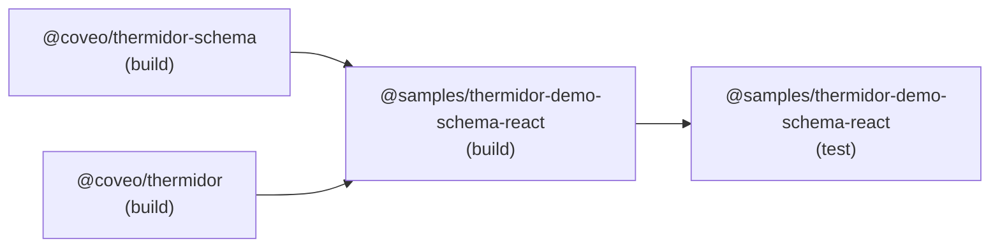
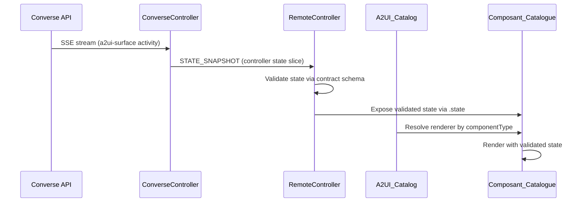

# Design Document

## Overview

This design specifies the creation of `samples/thermidor/demo-schema-react`, a private sample (`@samples/thermidor-demo-schema-react`) that is a structural copy of `samples/thermidor/demo-react` with the A2-UI rendering layer refactored to use catalog-based contract-driven rendering.

The refactoring replaces the hardcoded `switch`-statement component resolution in `SurfaceRenderer` with a catalog pattern imported from `@copilotkit/a2ui-renderer`, where `ProductCarousel` and `Cart` components are resolved via an A2-UI catalog backed by Zod-validated controller contracts from `@coveo/thermidor-schema`.

### Design Decisions

| Decision | Rationale |
|----------|-----------|
| Copy demo-react wholesale, refactor only `src/a2ui/` | Minimizes divergence; the shell, providers, pages, navigation, and non-contract components are proven code |
| Adapt schema-contract-react pattern for v2 format | The reference sample uses `@coveo/thermidor-contracts` (v1: `schemaId` discriminator, top-level actions, exported props schemas). The new sample uses `@coveo/thermidor-schema` (v2: `controllerSchema` discriminator, nested actions under `actions` field, no props schemas exported). Pattern adaptation required, not a verbatim copy. |
| Define catalog component props schemas locally | `@coveo/thermidor-schema` does NOT export `productCarouselPropsSchema` or `cartPropsSchema`. The sample defines them locally using `z.strictObject()` with literals extracted from the controller contract schemas. |
| Use `ControllerContracts['controllerSchema']` as discriminator type | v2 format uses `controllerSchema` field (not `schemaId`). The hook's type parameter must reflect this. Runtime compatibility is preserved because the canonical URL string values are identical. |
| Keep non-contract components as direct renderers | BundleDisplay, NextActionsBar, ComparisonTable, ComparisonSummary don't use controller contracts; wrapping them in the catalog adds complexity without value |
| Use `@copilotkit/a2ui-renderer` for catalog resolution | Same library used in schema-contract-react; provides `createCatalog`, `A2UIProvider`, `A2UIRenderer`, `useA2UI` |
| Gate action scenarios on `dispatchAction` availability | Cart actions (setItems, updateItemQuantity) require the Converse controller to expose `dispatchAction`; until available, tests for these paths are skipped |
| Reuse existing `packages/mock-converse-api` | Already serves on localhost:3456; demo-react's `dev:mock` pattern already targets it |
| Deterministic Vitest with fixed fixtures only | Explicitly required by the spec; no PBT, no randomness, no network |

## Architecture

The sample follows the same layered architecture as demo-react, with the A2-UI layer restructured:

```mermaid
graph TD
    subgraph "Shell (copied as-is from demo-react)"
        App[App.tsx]
        EP[EngineProvider]
        GIP[GenerativeInterfaceProvider]
        AS[AppShell]
        Pages[ConversationPage / LandingPage]
    end

    subgraph "A2-UI Layer (refactored)"
        SR[SurfaceRenderer]
        CAT[A2UI_Catalog]
        CTRL[useAdvertisedController]
        PC[Composant_ProductCarousel]
        CART[Composant_Cart]
    end

    subgraph "A2-UI Layer (direct renderers, copied)"
        BD[BundleDisplay]
        NAB[NextActionsBar]
        CT[ComparisonTable]
        CS[ComparisonSummary]
        SK[Skeleton]
    end

    subgraph "External packages"
        TS[@coveo/thermidor-schema]
        TH[@coveo/thermidor]
        A2R[@copilotkit/a2ui-renderer]
    end

    App --> EP --> GIP --> AS --> Pages
    Pages --> SR
    SR -->|catalog resolution| CAT
    SR -->|direct render| BD & NAB & CT & CS & SK
    CAT --> PC & CART
    PC --> CTRL
    CART --> CTRL
    CTRL --> TH
    CAT --> A2R
    PC & CART -.->|controller contracts + state schemas| TS
    CTRL -.->|controller contracts| TS
```

### Dependency Graph (Turbo)



Turbo's `^build` rule ensures `@coveo/thermidor-schema` and `@coveo/thermidor` are built before the sample's build starts.

## Components and Interfaces

### File Layout

```
samples/thermidor/demo-schema-react/
├── package.json                         # NEW: identity + deps
├── tsconfig.json                        # Copied from demo-react
├── vite.config.ts                       # Copied from demo-react
├── vitest.config.ts                     # Copied from demo-react
├── playwright.config.ts                 # Copied from demo-react
├── index.html                           # Copied from demo-react
├── .env.example                         # Copied/adapted from demo-react
├── src/
│   ├── App.tsx                          # Copied (unchanged)
│   ├── App.test.tsx                     # Copied (unchanged)
│   ├── env.ts                           # Copied (unchanged)
│   ├── index.css                        # Copied (unchanged)
│   ├── index.tsx                        # Copied (unchanged)
│   ├── utils.ts                         # Copied (unchanged)
│   ├── context/
│   │   ├── engine.tsx                   # Copied (unchanged)
│   │   ├── generative-interface.tsx     # Copied (unchanged)
│   │   └── targeting.tsx                # Copied (unchanged)
│   ├── components/                      # Copied (unchanged, all files)
│   ├── hooks/
│   │   ├── use-app-state.ts             # Copied (unchanged)
│   │   ├── use-build-controller.ts      # Copied (unchanged, used by non-catalog controllers)
│   │   ├── use-scroll-anchor.ts         # Copied (unchanged)
│   │   ├── use-suggestions.ts           # Copied (unchanged)
│   │   └── use-targeting-mode.ts        # Copied (unchanged)
│   └── a2ui/
│       ├── types.ts                     # Copied (unchanged — parseSurfaceSnapshot)
│       ├── types.test.ts                # Copied (unchanged)
│       ├── controllers.tsx              # NEW: useAdvertisedController hook (v2: controllerSchema discriminator)
│       ├── controllers.test.ts          # NEW: controller construction tests
│       ├── components.tsx               # NEW: local props schemas + catalog definitions + renderers
│       ├── components.test.ts           # NEW: catalog validation tests
│       ├── import-boundary.test.ts      # NEW: import boundary scan
│       ├── SurfaceRenderer/
│       │   ├── SurfaceRenderer.tsx      # MODIFIED: hybrid catalog + direct rendering
│       │   └── SurfaceRenderer.module.css  # Copied (unchanged)
│       ├── ProductCarousel/             # Copied (unchanged — used by catalog renderer internally)
│       ├── ProductCard/                 # Copied (unchanged)
│       ├── BundleDisplay/              # Copied (unchanged)
│       ├── ComparisonTable/            # Copied (unchanged)
│       ├── ComparisonSummary/          # Copied (unchanged)
│       ├── NextActionsBar/             # Copied (unchanged)
│       └── Skeleton/                   # Copied (unchanged)
```

### package.json

```json
{
  "name": "@samples/thermidor-demo-schema-react",
  "version": "0.0.0",
  "private": true,
  "type": "module",
  "scripts": {
    "dev": "vite",
    "dev:mock": "VITE_COVEO_ENDPOINT=http://localhost:3456 vite",
    "build": "vite build",
    "preview": "vite preview",
    "test": "vitest run",
    "e2e": "playwright test --pass-with-no-tests",
    "e2e:watch": "playwright test --ui"
  },
  "dependencies": {
    "@copilotkit/a2ui-renderer": "1.61.2",
    "@coveo/thermidor": "workspace:*",
    "@coveo/thermidor-schema": "workspace:*",
    "dompurify": "catalog:",
    "marked": "catalog:",
    "react": "catalog:",
    "react-dom": "catalog:",
    "zod": "catalog:"
  },
  "devDependencies": {
    "@playwright/test": "catalog:",
    "@testing-library/react": "catalog:",
    "@types/node": "catalog:",
    "@types/react": "catalog:",
    "@types/react-dom": "catalog:",
    "@vitejs/plugin-react": "catalog:",
    "playwright": "catalog:",
    "typescript": "catalog:",
    "vite": "catalog:",
    "vitest": "catalog:"
  }
}
```

Key differences from demo-react's `package.json`:
- **Added**: `@copilotkit/a2ui-renderer`, `@coveo/thermidor-schema`, `zod`
- **Removed**: no `@coveo/thermidor-contracts` dependency (props schemas are defined locally, controller contracts come from `@coveo/thermidor-schema`)
- **Identity**: `@samples/thermidor-demo-schema-react` (private)

### src/a2ui/controllers.tsx (NEW)

This file adapts the schema-contract-react pattern for the v2 format of `@coveo/thermidor-schema`. The key difference: the discriminator field is `controllerSchema` (not `schemaId` as in the old `@coveo/thermidor-contracts`).

```typescript
import {useMemo} from 'react';
import {
  buildRemoteController,
  type AdvertisedRemoteController,
  type RemoteControllerSource,
} from '@coveo/thermidor';
import type {ControllerContracts} from '@coveo/thermidor-schema';

type ControllerSchemaId = ControllerContracts['controllerSchema'];

export type ControllerAdvertisement<TSchema extends ControllerSchemaId = ControllerSchemaId> = {
  controllerId: string;
  controllerSchema: TSchema;
};

export type EngineStateSource = RemoteControllerSource;

type AdvertisedController<TSchema extends ControllerSchemaId> = AdvertisedRemoteController<TSchema>;

export function useAdvertisedController<TSchema extends ControllerSchemaId>(
  source: EngineStateSource,
  {controllerId, controllerSchema: contract}: ControllerAdvertisement<TSchema>
): AdvertisedController<TSchema> {
  return useMemo(
    () => buildRemoteController({source, controllerId, contract}),
    [controllerId, contract, source]
  );
}
```

**Note on compatibility**: `buildRemoteController` from `@coveo/thermidor` accepts a `contract` parameter of type `RemoteControllerSchemaId` (which is `ControllerContracts['schemaId']` from `@coveo/thermidor-contracts`). Since the canonical URL values are identical between v1 and v2 (only the field name differs: `schemaId` vs `controllerSchema`), the runtime string values passed to `buildRemoteController` remain valid. The `@coveo/thermidor` runtime resolves the contract by matching the literal value against its internal registry.

### src/a2ui/components.tsx (NEW)

Catalog definitions and renderers adapting the schema-contract-react pattern for the v2 format. Key differences from the schema-contract-react reference:
- **Props schemas are defined locally** (not imported from `@coveo/thermidor-schema` which doesn't export them)
- **Controller contract schema literals** are extracted from the v2 contract schemas to keep them DRY
- **`z` imported from `zod`** for local props schema construction

```typescript
import {
  createCatalog,
  type CatalogDefinitions,
  type CatalogRenderers,
} from '@copilotkit/a2ui-renderer';
import {z} from 'zod';
import {type EngineStateSource, useAdvertisedController} from './controllers.js';
import {
  ProductListControllerContractSchema,
  CartControllerContractSchema,
} from '@coveo/thermidor-schema';

export const THERMIDOR_CATALOG_ID = 'https://schema.thermidor.coveo.com/a2-ui/catalog.json';

// Extract canonical schema IDs from the v2 controller contracts (DRY)
const PRODUCT_LIST_SCHEMA_ID = ProductListControllerContractSchema.shape.controllerSchema.value;
const CART_SCHEMA_ID = CartControllerContractSchema.shape.controllerSchema.value;

// Props schemas defined locally — these describe the controller advertisement
// shape expected by each catalog component. Not exported by @coveo/thermidor-schema.
export const productCarouselPropsSchema = z.strictObject({
  controllers: z.strictObject({
    productListController: z.strictObject({
      controllerId: z.string(),
      controllerSchema: z.literal(PRODUCT_LIST_SCHEMA_ID),
    }),
  }),
});

export const cartPropsSchema = z.strictObject({
  controllers: z.strictObject({
    cartController: z.strictObject({
      controllerId: z.string(),
      controllerSchema: z.literal(CART_SCHEMA_ID),
    }),
  }),
});

export const thermidorCatalogDefinitions = {
  ProductCarousel: {
    description: 'A responsive product carousel backed by a product-list controller.',
    props: productCarouselPropsSchema,
  },
  Cart: {
    description: 'A shopping-cart summary backed by a cart controller.',
    props: cartPropsSchema,
  },
} satisfies CatalogDefinitions;

export function createThermidorCatalog(stateSource: EngineStateSource) {
  const renderers = {
    ProductCarousel: ({props}) => {
      const controller = useAdvertisedController(
        stateSource,
        props.controllers.productListController
      );
      const products = controller.state?.products ?? [];

      return (
        <section className="product-carousel" aria-label="Featured products">
          {/* Renders product list using the same ProductCarousel/ProductCard components */}
          {/* from the copied a2ui layer, consuming validated controller state */}
        </section>
      );
    },
    Cart: ({props}) => {
      const controller = useAdvertisedController(stateSource, props.controllers.cartController);
      const items = controller.state?.items ?? [];
      const total = items.reduce((sum, item) => sum + item.price * item.quantity, 0);

      return (
        <aside className="cart" aria-label="Cart">
          {/* Renders cart items and total from validated controller state */}
        </aside>
      );
    },
  } satisfies CatalogRenderers<typeof thermidorCatalogDefinitions>;

  return createCatalog(thermidorCatalogDefinitions, renderers, {
    catalogId: THERMIDOR_CATALOG_ID,
    includeBasicCatalog: true,
  });
}
```

The renderers inside the catalog will:
- Use the existing `A2UIProductCarousel` component's internal rendering logic (product grid with cards, scroll navigation) for visual parity with demo-react
- Use validated state from the Remote Controllers rather than raw `surface.data`
- Compute `Total_Panier` as `sum(price * quantity)` for each cart item
- Access cart actions via the v2 nested structure: `controller.dispatch('setItems', payload)` where the action name is resolved against `CartControllerContractSchema.shape.actions.shape.setItems.shape.payload`

### src/a2ui/SurfaceRenderer/SurfaceRenderer.tsx (MODIFIED)

The key modification: catalog components (ProductCarousel, Cart) are rendered via `A2UIRenderer` from the catalog; other components remain as direct renders:

```typescript
import {useMemo} from 'react';
import {A2UIRenderer} from '@copilotkit/a2ui-renderer';
import {A2UIBundleDisplay} from '../BundleDisplay/BundleDisplay.js';
import {A2UINextActionsBar} from '../NextActionsBar/NextActionsBar.js';
import {A2UIComparisonTable} from '../ComparisonTable/ComparisonTable.js';
import {A2UIComparisonSummary} from '../ComparisonSummary/ComparisonSummary.js';
import {A2UISkeleton} from '../Skeleton/Skeleton.js';
import {parseSurfaceSnapshot, type ParsedSurface} from '../types.js';
import styles from './SurfaceRenderer.module.css';

// Components resolved via the A2-UI catalog (contract-driven)
const CATALOG_COMPONENTS = new Set(['ProductCarousel', 'Cart']);

// Components rendered directly (no controller contract)
const DIRECT_COMPONENTS = new Set([
  'BundleDisplay',
  'NextActionsBar',
  'ComparisonTable',
  'ComparisonSummary',
]);

const KNOWN_COMPONENTS = new Set([...CATALOG_COMPONENTS, ...DIRECT_COMPONENTS]);

// ... (SurfaceRendererProps and render logic remain structurally identical)

function A2UISurfaceComponent({surface, allSurfaces, onAction}: A2UISurfaceComponentProps) {
  // Catalog-resolved components: delegate to A2UIRenderer
  if (CATALOG_COMPONENTS.has(surface.componentType)) {
    return <A2UIRenderer surfaceId={surface.surfaceId} />;
  }

  // Direct-rendered components (no contract)
  switch (surface.componentType) {
    case 'BundleDisplay':
      return <A2UIBundleDisplay surface={surface} allSurfaces={allSurfaces} />;
    case 'NextActionsBar':
      return <A2UINextActionsBar surface={surface} onAction={onAction} />;
    case 'ComparisonTable':
      return <A2UIComparisonTable surface={surface} />;
    case 'ComparisonSummary':
      return <A2UIComparisonSummary surface={surface} />;
    default:
      return null;
  }
}
```

The `SurfaceRenderer` needs to integrate with the `A2UIProvider` + `useA2UI` pattern from `@copilotkit/a2ui-renderer`. The provider will be inserted at the `App.tsx` or `GenerativeInterfaceProvider` level, wrapping the content that uses catalog rendering. The catalog is created once with the `ConverseController` as the `EngineStateSource`, matching the schema-contract-react pattern.

### Integration Point: A2UIProvider Wiring

The `A2UIProvider` must wrap the component tree that uses catalog resolution. Two approaches:

**Option A** (minimal change): Add `A2UIProvider` in `App.tsx` wrapping `AppShell`:
```typescript
import {A2UIProvider} from '@copilotkit/a2ui-renderer';
import {createThermidorCatalog} from './a2ui/components.js';

export default function App() {
  return (
    <EngineProvider>
      <GenerativeInterfaceProvider>
        <CatalogProvider>
          <AppShell />
        </CatalogProvider>
      </GenerativeInterfaceProvider>
    </EngineProvider>
  );
}
```

The `CatalogProvider` component creates the catalog with the Converse controller as source and provides it via `A2UIProvider`. This component needs access to the Converse controller, so it lives inside `GenerativeInterfaceProvider`.

**Option B**: Create a dedicated `CatalogContext` in `src/context/catalog.tsx` following the same pattern as the engine and generative-interface contexts.

**Chosen: Option A with a CatalogProvider component** — keeps the pattern consistent with schema-contract-react while requiring minimal deviation from the demo-react shell.

### Surface Processing Integration

The `SurfaceRenderer` currently receives pre-parsed `A2UISurface[]` data. For catalog-resolved components, the A2-UI renderer library expects messages to be processed through `useA2UI().processMessages()`. The integration strategy:

1. The existing `parseSurfaceSnapshot` logic (`types.ts`) continues to handle operation ordering, data model updates, and surface lifecycle for **all** components (both catalog and direct)
2. For catalog components, the parsed surface data is also fed to the `@copilotkit/a2ui-renderer` via `processMessages` so the `A2UIRenderer` can resolve them
3. For direct components, the parsed surface data is passed as props directly (unchanged from demo-react)

This dual-path approach preserves the existing operation parsing behavior while enabling catalog resolution for contract-driven components.

## Data Models

### Remote Controller State Flow



### Controller Advertisement (from Surface Data)

The catalog renderer receives controller advertisements embedded in the A2-UI surface message. The advertisement uses the v2 discriminator field `controllerSchema`:

```typescript
// Example createSurface operation with catalog component
{
  createSurface: {
    surfaceId: 'product-carousel-1',
    catalogId: 'https://schema.thermidor.coveo.com/a2-ui/catalog.json',
    components: [{
      id: 'root',
      component: 'ProductCarousel',
      componentProps: {
        controllers: {
          productListController: {
            controllerId: 'featured-products',
            controllerSchema: 'https://schema.thermidor.coveo.com/controllers/product-list.schema.json'
          }
        }
      }
    }]
  }
}
```

### v2 Contract Format Reference (`@coveo/thermidor-schema` vs `@coveo/thermidor-contracts`)

This section documents the structural differences between the v1 format (used by `@coveo/thermidor-contracts` in schema-contract-react) and the v2 format (used by `@coveo/thermidor-schema` in this sample):

| Aspect | v1 (`@coveo/thermidor-contracts`) | v2 (`@coveo/thermidor-schema`) |
|--------|-----------------------------------|--------------------------------|
| Discriminator field | `schemaId` | `controllerSchema` |
| Discriminated union type | `ControllerContracts['schemaId']` | `ControllerContracts['controllerSchema']` |
| Action structure | Top-level: `contract.setItems`, `contract.updateItemQuantity` | Nested: `contract.actions.setItems.payload`, `contract.actions.updateItemQuantity.payload` |
| Props schemas | Exported: `productCarouselPropsSchema`, `cartPropsSchema` | NOT exported; must be defined locally |
| Naming convention | camelCase: `productSchema`, `cartItemSchema`, `productListControllerContract` | PascalCase + Schema suffix: `ProductSchema`, `CartItemSchema`, `ProductListControllerContractSchema` |
| Cart item price | `z.number()` (no constraint) | `z.number().min(0)` (≥ 0) |
| Cart item quantity | `z.number()` (no constraint) | `z.number().int().min(1)` (positive integer) |
| Zod import | `import {z} from 'zod'` | `import * as z from 'zod/v4'` |
| Product fields | No `additionalFields` required | `additionalFields: z.record(z.string(), z.unknown())` required |

**Impact on `buildRemoteController` compatibility**: The `@coveo/thermidor` runtime's `buildRemoteController` uses `ControllerContracts['schemaId']` as its schema ID type. The actual string literal values (`https://schema.thermidor.coveo.com/controllers/product-list.schema.json`, `https://schema.thermidor.coveo.com/controllers/cart.schema.json`) are identical between v1 and v2. The runtime resolves by matching the string value, so passing a v2 `controllerSchema` value as the `contract` parameter works correctly at runtime.

### Cart Total Computation

```typescript
// Total_Panier is always computed locally from validated state
const total = items.reduce((sum, item) => sum + item.price * item.quantity, 0);
```

### Invalid Ingress Handling

When a `STATE_SNAPSHOT` fails Zod validation against the controller contract:
- The Remote Controller exposes an empty/default state
- The component renders nothing or a graceful empty state
- No fallback rendering, no partial state exposure

## Error Handling

### Invalid Ingress (STATE_SNAPSHOT fails validation)

| Scenario | Behavior |
|----------|----------|
| Product-list state with invalid product shape | Remote Controller exposes `{products: []}` — component renders nothing |
| Cart state with invalid item (price < 0, fractional quantity) | Remote Controller exposes `{items: []}` — component renders empty cart |
| Unknown controller schema ID | `useAdvertisedController` returns controller with empty state |
| Missing controllerId in advertisement | Zod validation of props fails — catalog skips rendering |

Note: Cart item validation per v2 schema: `price` must be `≥ 0` (`z.number().min(0)`), `quantity` must be a positive integer (`z.number().int().min(1)`).

### Unknown Component Type

| Scenario | Behavior |
|----------|----------|
| Surface references a component not in catalog or direct set | `SurfaceRenderer` returns `null` — surface silently ignored |
| Surface references catalog component but catalog not available | `A2UIRenderer` renders nothing |

### Action Bridge Gate

| Scenario | Behavior |
|----------|----------|
| `dispatchAction` not available on ConverseController | Actions (setItems, updateItemQuantity) are no-ops; test scenarios gated with skip condition |
| `dispatchAction` available | Actions dispatched via Converse controller with `{controllerId, controllerSchema, action, payload}` shape. In v2 format, actions are validated against `CartControllerContractSchema.shape.actions.shape.<actionName>.shape.payload` |

### Build Errors

| Scenario | Behavior |
|----------|----------|
| `@coveo/thermidor-schema` not built | Turbo's `^build` prevents sample build from starting |
| Import from `@coveo/thermidor-contracts` | TypeScript compilation fails (not a dependency) |
| Import of `productCarouselPropsSchema` or `cartPropsSchema` from `@coveo/thermidor-schema` | TypeScript compilation fails (not exported) |
| Import from internal path of thermidor-schema | TypeScript compilation fails + import-boundary test fails |

## Testing Strategy

### Approach: Deterministic Fixed-Input Testing

All validation uses Vitest in single-run mode (`vitest run`) with fixed fixtures and predetermined expected results. No property-based testing, no random generators, no network access, no clock manipulation.

**Why PBT does not apply:**
- The feature is UI rendering (React components rendering from fixed state)
- Validation is fixture-based (specific inputs produce specific DOM output)
- The requirements explicitly mandate `Validation_Vitest_Fixe` with no PBT
- Testing is primarily integration verification (correct wiring of imports, contracts, catalog resolution)

### Test Suites

#### 1. Catalog Validation Tests (`src/a2ui/components.test.ts`)

Tests that the locally-defined catalog props schemas correctly validate controller advertisements:

| Test | Fixed Input | Expected Output |
|------|-------------|-----------------|
| ProductCarousel props accept valid advertisement | `{controllers: {productListController: {controllerId: 'x', controllerSchema: 'https://schema.thermidor.coveo.com/controllers/product-list.schema.json'}}}` | `safeParse.success === true` |
| Cart props accept valid advertisement | `{controllers: {cartController: {controllerId: 'x', controllerSchema: 'https://schema.thermidor.coveo.com/controllers/cart.schema.json'}}}` | `safeParse.success === true` |
| ProductCarousel props reject wrong schema ID | Advertisement with cart schema ID in productListController | `safeParse.success === false` |
| Cart props reject extra properties | Advertisement with unexpected field | `safeParse.success === false` (strictObject rejects) |
| Catalog ID matches literal | `THERMIDOR_CATALOG_ID` constant | Equals `https://schema.thermidor.coveo.com/a2-ui/catalog.json` |
| Props schema literals match controller contract schemas | `productCarouselPropsSchema` literal | Equals `ProductListControllerContractSchema.shape.controllerSchema.value` |
| Props schema literals match controller contract schemas | `cartPropsSchema` literal | Equals `CartControllerContractSchema.shape.controllerSchema.value` |

#### 2. Controller Construction Tests (`src/a2ui/controllers.test.ts`)

Tests that Remote Controllers are built with the correct contracts using the v2 `controllerSchema` discriminator:

| Test | Fixed Input | Expected Output |
|------|-------------|-----------------|
| Product-list controller selects state from active turn | Mock source with controller state slice | Returns `{products: [...]}` |
| Cart controller selects state from active turn | Mock source with cart state slice | Returns `{items: [...]}` |
| Controller dispatches action via source | Mock source + dispatch call | `dispatchAction` called with `{controllerId, controllerSchema, action, payload}` shape |
| Unknown controller returns empty state | Mock source without matching controllerId | Returns `undefined` |
| Controller uses `controllerSchema` literal from v2 contract | `ProductListControllerContractSchema.shape.controllerSchema.value` | Matches `'https://schema.thermidor.coveo.com/controllers/product-list.schema.json'` |

#### 3. A2-UI Operations Tests (`src/a2ui/types.test.ts` — copied from demo-react)

Already comprehensive. Tests createSurface, updateComponents, updateDataModel, replace, actionResponse, unknown operations, and malformed entries.

#### 4. Import Boundary Tests (`src/a2ui/import-boundary.test.ts`)

Static scan of all `.ts` and `.tsx` files in the sample:

| Test | Fixed Input | Expected Output |
|------|-------------|-----------------|
| No imports from `@coveo/thermidor-contracts` | All source files | No matches found |
| No imports from internal `packages/thermidor-schema/src` | All source files | No matches found |
| No imports from internal `packages/thermidor-schema/schema` | All source files | No matches found |
| No imports from internal `packages/thermidor-schema/scripts` | All source files | No matches found |
| No imports of non-existent props schemas from `@coveo/thermidor-schema` | All source files | No `productCarouselPropsSchema` or `cartPropsSchema` imported from `@coveo/thermidor-schema` |

Implementation approach:
```typescript
import {describe, expect, it} from 'vitest';
import {readFileSync, readdirSync} from 'node:fs';
import {join} from 'node:path';

describe('import boundary', () => {
  const sourceFiles = getAllSourceFiles(join(__dirname, '..'));

  it('does not import from @coveo/thermidor-contracts', () => {
    for (const file of sourceFiles) {
      const content = readFileSync(file, 'utf-8');
      expect(content).not.toMatch(/@coveo\/thermidor-contracts/);
    }
  });

  it('does not import from internal thermidor-schema paths', () => {
    const forbidden = [
      /packages\/thermidor-schema\/src/,
      /packages\/thermidor-schema\/schema/,
      /packages\/thermidor-schema\/scripts/,
      /packages\/thermidor-schema\/generated/,
    ];
    for (const file of sourceFiles) {
      const content = readFileSync(file, 'utf-8');
      for (const pattern of forbidden) {
        expect(content).not.toMatch(pattern);
      }
    }
  });

  it('does not import non-existent props schemas from @coveo/thermidor-schema', () => {
    const nonExistentImports = [
      /productCarouselPropsSchema.*from\s+['"]@coveo\/thermidor-schema['"]/,
      /cartPropsSchema.*from\s+['"]@coveo\/thermidor-schema['"]/,
    ];
    for (const file of sourceFiles) {
      const content = readFileSync(file, 'utf-8');
      for (const pattern of nonExistentImports) {
        expect(content).not.toMatch(pattern);
      }
    }
  });
});
```

#### 5. Invalid Ingress Tests

| Test | Fixed Input | Expected Output |
|------|-------------|-----------------|
| Product-list with invalid product (missing permanentid) | Invalid fixture | Controller state falls back to empty products |
| Cart with invalid item (price = -1) | Invalid fixture | Controller state falls back to empty items |
| Cart with invalid item (quantity = 1.5) | Invalid fixture | Controller state falls back to empty items |
| Cart with valid item (price = 0) | Valid fixture | Controller state accepted (price ≥ 0 is valid per v2 schema) |

#### 6. Cart Total Computation Tests

| Test | Fixed Input | Expected Output |
|------|-------------|-----------------|
| Single item total | `[{price: 10, quantity: 2}]` | Total = 20.00 |
| Multiple items total | `[{price: 10, quantity: 2}, {price: 5.50, quantity: 3}]` | Total = 36.50 |
| Empty cart total | `[]` | Total = 0.00 |

#### 7. Build Validation

| Test | Method | Expected Output |
|------|--------|-----------------|
| Build succeeds | `pnpm --filter @samples/thermidor-demo-schema-react build` | Exit 0 |
| Tests pass | `pnpm --filter @samples/thermidor-demo-schema-react test` | Exit 0 |

### Test Execution

- **Framework**: Vitest (catalog version)
- **Mode**: Single run (`vitest run`)
- **No network access, no random generators, no clocks**
- **All fixtures are inline or committed alongside test files**
- **Turbo caches test results; re-runs only on input change**
- **Action tests (dispatchAction scenarios) are gated/skipped until Porte_Prérequis_Action is met**
