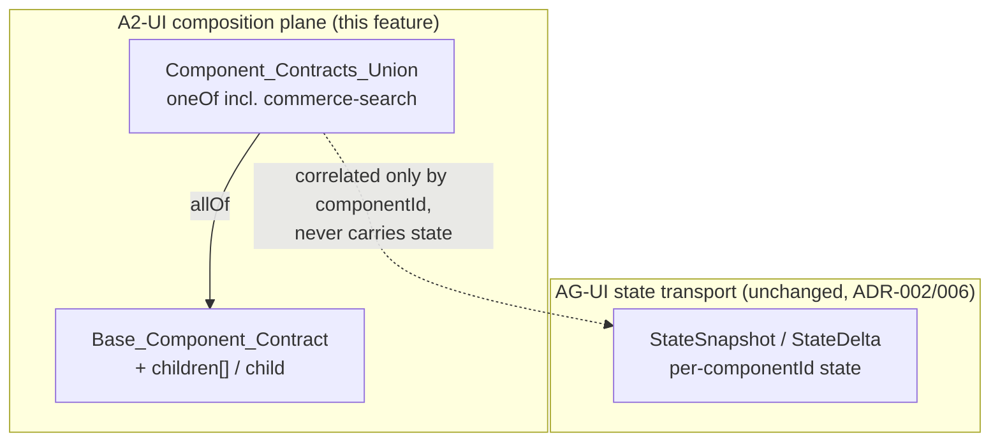
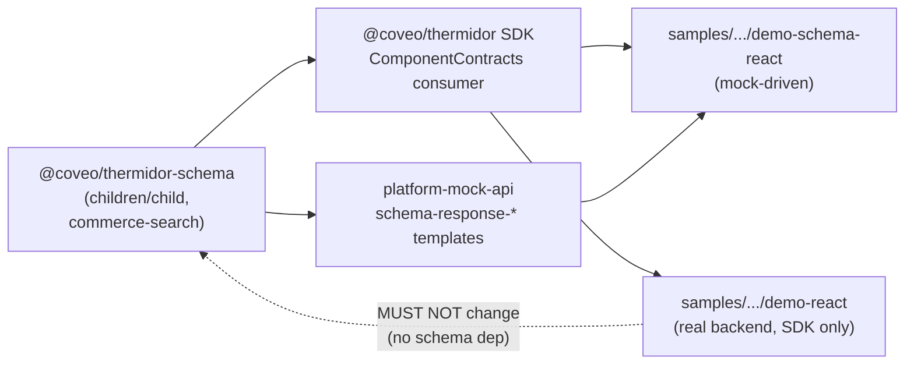

# Design Document

## Overview

This feature implements Phase 1 (Schema) of [ADR-007 Annex A §8](../../../packages/thermidor-schema/docs/ADR-007-annex-a-composition-adjacency-list-analysis.md) inside `@coveo/thermidor-schema`. It introduces an A2-UI adjacency-list composition primitive to the canonical JSON Schema contract:

- an optional ordered `children: string[]` and an optional single `child: string` on the base component contract (Req 1, Req 2);
- a `commerce-search` surface-root component contract added to the discriminated union (Req 4);
- the regenerated Zod projection and public exports for the new documents (Req 5);
- the single cross-package update this additive change requires: the `@coveo/thermidor` SDK is widened for the new union member (a minimal `commerce-search` instance wherever the union is enumerated). Because `children`/`child` are optional and no existing field is removed, the `platform-mock-api` Thermidor mock templates and both `samples/thermidor/*` samples are left **unchanged** and keep building/passing. Placing composition on the A2-UI component nodes, removing `children` from the AG-UI state, retiring `facetIds`/`surfaceRef`, mounting the tree via CopilotKit `children(id)`, and root mapping are all deferred to `thermidor-commerce-search-composition` (track #2) (Req 3);
- preservation of the existing validation, freshness, and packaging guarantees (Req 6).

The single most consequential design decision is how the two composition fields survive JSON Schema's `additionalProperties: false`, which every component document sets at its own root. That decision is grounded in the behavior observed directly from the package's own schemas and Ajv, documented in the Architecture section below.

### Grounding: what the schemas actually do today

Every component document (e.g. [`schema/components/search-box.schema.json`](../../../packages/thermidor-schema/schema/components/search-box.schema.json)) composes the base via `allOf` **and** sets `additionalProperties: false` at its own root, while re-declaring `componentType`, `state`, and `actions` in its own `properties`:

```jsonc
{
  "$id": "https://schema.thermidor.coveo.com/components/search-box.schema.json",
  "allOf": [{"$ref": "https://schema.thermidor.coveo.com/base/component.schema.json"}],
  "properties": {
    "componentType": {"type": "string", "const": "search-box"},
    "state": {"$ref": "#/$defs/SearchBoxState"},
    "actions": {"...": "..."}
  },
  "additionalProperties": false
}
```

In JSON Schema 2020-12, `additionalProperties` only considers the `properties`/`patternProperties` **in the same schema object** — it does not see properties contributed through `allOf` branches. This is verifiable against the real schemas with Ajv: validating a full component object (with `componentId` and `displayName`, which live only on the base) against the component document's own `$id` is **rejected**, because the component-level `additionalProperties: false` treats `componentId` and `displayName` as additional:

```
validate(searchBoxId)({componentId:'search-box-1', displayName:'Search', componentType:'search-box', state:{query:'x'}, actions:{...}})
// => false: additionalProperty "componentId", additionalProperty "displayName"
```

This is by design and matches the existing tests: the discriminated-union member contract (what a component document validates, and what the Zod projection covers) is the **`{componentType, state, actions}` triad**, not the full component object. The `contract.test.ts` fixtures pass `{actions, componentType, state}` with no `componentId` through `ComponentContractsSchema`, and the generated `SearchBoxSchema` is `z.strictObject({actions, componentType, state})` — `componentId`/`displayName`/`description` do not appear in the projection. Full-component identity (`componentId`, `displayName`) is validated at the `base/component.schema.json` level.

The consequence for this feature: because a component that is a member of `Component_Contracts_Union` enforces its own `additionalProperties: false`, **`children`/`child` must be accepted by that member**. Declaring them only on the base is not sufficient — Ajv rejects them as additional on the member branch. This drives the placement decision in Architecture §"The additionalProperties decision".

## Architecture

### Package layout after the change

```
packages/thermidor-schema/
├── schema/
│   ├── base/
│   │   └── component.schema.json          # + children, + child (canonical declaration + docs)
│   ├── components/
│   │   ├── commerce-search.schema.json    # NEW surface-root component (Req 4)
│   │   ├── component-contracts.schema.json # + commerce-search in the oneOf (Req 4.3)
│   │   ├── search-box.schema.json          # + children, + child in own properties
│   │   ├── product-list.schema.json        #   (each of the 14 existing component
│   │   ├── ... (all 14 existing)           #    documents gains children/child so
│   │   └── facet-manager.schema.json       #    additionalProperties:false accepts them)
│   └── definitions/
│       └── child-ref.schema.json           # NEW shared component-id-ref definition (DRY)
├── scripts/
│   ├── generate-zod.ts                     # crawl reaches commerce-search via the union
│   └── quicktype-zod.ts                     # unchanged (string[]/string → flat, no z.lazy)
├── src/
│   ├── generated/schemas.ts                # regenerated: CommerceSearchSchema
│   └── index.ts                             # + new schema/type exports
└── tests/
    └── ... (new equivalence + property tests)
```

Diagram of the composition planes and where this feature sits:



### The `additionalProperties` decision (Req 1, Req 2, Req 4.2 — the central decision)

**Chosen approach: declare `children`/`child` on the base contract as the canonical, documented home, AND re-declare them in every component document's own `properties` (via a shared `$ref`), exactly as those documents already re-declare `componentType`/`state`/`actions`.**

Rationale, grounded in the verified Ajv behavior:

- A component document's root `additionalProperties: false` only sees its own `properties`. To keep a `children`/`child` key on a component (i.e. a union member) from being rejected as an additional property, that key must appear in the member's own `properties`. This was confirmed directly: with `children` on the base only, Ajv rejects `children` on the member branch (`additionalProperty: "children"`); with `children` also declared on the member, Ajv accepts it.
- The base declaration is still required and is not redundant: (a) it is the canonical, documented location the requirements name (Req 1, Req 2 target `Base_Component_Contract`); (b) full-component validation at the `base/component.schema.json` level (which carries `componentId`/`displayName`) must also accept `children`/`child`; (c) it keeps the contract's intent legible — composition is a base capability, uniformly available to every component "through the Base_Component_Contract" (Req 3.5).
- To keep the per-member declaration DRY and consistent, both keys reference a shared definition `definitions/child-ref.schema.json` for the item/string constraint. Each component document adds:

  ```jsonc
  "properties": {
    "componentType": { "const": "search-box" },
    "state": { "...": "..." },
    "actions": { "...": "..." },
    "children": {
      "type": "array",
      "items": {"$ref": "https://schema.thermidor.coveo.com/definitions/child-ref.schema.json"},
      "maxItems": 1000,
      "default": []
    },
    "child": {"$ref": "https://schema.thermidor.coveo.com/definitions/child-ref.schema.json"}
  }
  ```

**Alternative considered — `unevaluatedProperties: false` on the base branch instead of per-member `additionalProperties: false`.** `unevaluatedProperties` is `allOf`-aware: it "sees" properties evaluated by adjacent `allOf` branches, so `children` declared on the base would be accepted by a component using `unevaluatedProperties: false`, and it would be DRY (declare once on the base). It was verified to work in Ajv. It is **rejected** because it changes the root object keyword on all 14 existing component documents (and the new one) from `additionalProperties` to `unevaluatedProperties`, altering their long-standing "no extra keys" contract keyword, invalidating the existing `facet-schemas.test.ts` assertions that each document `additionalProperties === false`, and widening the blast radius of a Phase-1 additive change. The per-member re-declaration matches the pattern the documents already use for `componentType`/`state`/`actions`, so it is the smaller, more consistent change and keeps every existing structural test valid. There is now an additional reason to reject it beyond validation semantics: even if `unevaluatedProperties: false` were `allOf`-aware for validation, it is *not* verified that quicktype would still project the clean `{componentType, state, actions}` triad from such a document. quicktype may re-flatten the `allOf` and reintroduce the base identity fields into the generated `*Schema`, which is exactly the contract-pollution failure described in "Why `additionalProperties: false` is the decisive keyword (generation-time)" below. Switching keywords would therefore risk that pollution, whereas the per-member `additionalProperties: false` root is empirically known to project the triad cleanly.

**Alternative considered — declare on base only (no per-member).** Rejected: verified to reject `children`/`child` on union members via Ajv, which would make any union member reject a component carrying composition. This is the failure mode the central decision exists to avoid.

**Why `additionalProperties: false` is the decisive keyword (generation-time).** The Ajv reasoning above is necessary but not the strongest reason to keep `additionalProperties: false`. These canonical JSON Schema documents are *projected to Zod by quicktype* ([`scripts/generate-zod.ts`](../../../packages/thermidor-schema/scripts/generate-zod.ts)); for the member documents the decisive consumer is the generator, not Ajv at runtime. Keeping `additionalProperties: false` at each component document's own root is what makes quicktype project the component contract as exactly the `{componentType, state, actions}` triad. If it were removed, quicktype flattens the `allOf` and injects the base identity fields — `componentId`/`displayName`/`description` — into the generated `*Schema` (the runtime contract aggregated into `ComponentContractsSchema`), polluting the state/actions contract with identity metadata that does not belong there. This was verified empirically on the PR. So `additionalProperties: false` here is not merely a runtime validation constraint; it is the mechanism that keeps the generated contract clean.

This preserves a deliberate two-schema separation already established in the package:

- The **props** schema (`*PropsSchema`) carries component *identity*: `componentId` + `componentType` (see `component-props.test.ts` and the `renderComponentPropsSchemas` output in `generate-zod.ts`).
- The **contract** schema (`*Schema`, aggregated into `ComponentContractsSchema`) carries *only* the runtime contract: `componentType` + `state` + `actions`; base metadata (`componentId`/`displayName`/`description`) is intentionally excluded (see `contract.test.ts`).

`additionalProperties: false` on each component document's root is what holds that boundary through the generator: identity stays in the props schema, the runtime contract stays free of identity metadata.

**Acknowledged trade-off.** Validating a *full* component object (with the base identity fields present) against a component document alone is technically unsatisfiable under strict JSON Schema semantics — the base props would be rejected as additional. This does not occur in practice: no real instance is ever validated against the merged component document with base props present. The union member *is* the `{componentType, state, actions}` triad, and full-component identity is validated at the `base/component.schema.json` level. This is an accepted, documented trade-off, not a defect.

This decision was reviewed and confirmed in the resolved reviewer thread on PR #8320 (on `product-carousel.schema.json`); it is recorded here so it is not re-litigated.

### Non-recursive projection (Req 3.2, Req 3.3)

`children` is `array<string>` and `child` is `string` — component **ids**, not nested component objects. No schema references a component document from inside `children`/`child`, so the Quicktype crawl introduces no cycle through these fields and the [`ThermidorZodRenderer`](../../../packages/thermidor-schema/scripts/quicktype-zod.ts) renders them as `z.array(z.string()...)` / `z.string()...` with no `get`-accessor and no `z.lazy()`. This is confirmed by contrast with the existing `Product` schema, whose `children` field **is** a nested `Product[]` and therefore renders recursively as `get children() { return z.array(ProductSchema).optional(); }`. The composition `children` is a string array and will not trigger that path. The generation determinism test (`projection.test.ts`, `--check`) and a targeted assertion that the generated file contains no `z.lazy(` for the composition fields guard this (Req 3.3, Req 5.2).

### Generation pipeline reachability (Req 5.1)

`generate-zod.ts` seeds Quicktype from the component index and crawls `$ref`s to decide what to project. `commerce-search` is reached automatically once it is a member of the `component-contracts` `oneOf`, and `crawlSchemaDocuments` pulls in the shared `child-ref` definition from the component documents' `children`/`child` `$ref`s. Determinism (`--check`) and freshness (`validate:freshness:src`) are unchanged in mechanism.

### AG-UI / A2-UI boundary

The composition fields `children`/`child` live on the A2-UI plane; each component's `state`/`actions` continue to travel on the AG-UI transport keyed by `componentId` (ADR-002, ADR-006). The composition primitives do **not** define a second, parallel state-transport shape (no `StateSnapshot`/`StateDelta` message is redefined here). Composition (which components exist, what contains what, in what order via `children`/`child`) lives on the A2-UI component node; per-`componentId` state delivery over AG-UI is untouched.

> **Anti-regression invariant — `children`/`child` are A2-UI, never AG-UI.** The composition fields `children` and `child` belong to the **A2-UI composition plan** — conceptually carried on the component *node* of the `createSurface`/`updateComponents` message (i.e. the entries of `createSurface.components[]`), following the A2-UI adjacency-list standard, which places `children`/`child` on the component node. They MUST **never** appear in the **AG-UI state transport** (`StateSnapshot`/`StateDelta`, or a mock's `computeComponentsState`), which carries only per-`componentId` `state`. In this additive track #1, the mock templates are not modified — they do not emit `children` and do not carry `children` in the state on `main`, so there is nothing to correct in the mocks here; the invariant is upheld by construction. This invariant is required by ADR-002 (AG-UI/A2-UI plane separation) and ADR-006 (per-`componentId` state transport unchanged). Emitting composition on the A2-UI component nodes (and any corresponding state cleanup) is track #2 (`thermidor-commerce-search-composition`).

## Components and Interfaces

### 1. Base component contract — `schema/base/component.schema.json` (Req 1, Req 2)

Add two optional properties; leave `required` unchanged (Req 1.7).

```jsonc
{
  "properties": {
    "componentId":   {"type": "string", "pattern": "^[a-z][a-z0-9-]*$", "...": "..."},
    "displayName":   {"type": "string"},
    "description":   {"type": "string"},
    "componentType": {"type": "string", "pattern": "^[a-z][a-z0-9]*(-[a-z0-9]+)*$", "maxLength": 128},
    "state":         {"type": "object"},
    "actions":       {"type": "object", "additionalProperties": {"$ref": ".../base/action.schema.json"}},
    "children": {
      "type": "array",
      "items": {"$ref": "https://schema.thermidor.coveo.com/definitions/child-ref.schema.json"},
      "maxItems": 1000,
      "default": [],
      "description": "Ordered list of child component ids referencing other components in the same flat map. Order is backend-owned and meaningful for container components; referential integrity and uniqueness are owned by the backend and not enforced at parse time."
    },
    "child": {
      "$ref": "https://schema.thermidor.coveo.com/definitions/child-ref.schema.json",
      "description": "A single child component id following the A2-UI single-child convention."
    }
  },
  "required": ["componentId", "displayName", "componentType", "state", "actions"],
  "additionalProperties": false
}
```

- `children` optional, `array`, `items` = component-id string, `maxItems: 1000`, `default: []` (Req 1.1, 1.2, 3.1).
- `children` items constrained to `^[a-z][a-z0-9-]*$` (Req 1.3); a non-matching item is rejected whole (Req 1.4).
- `description` documents that order is backend-owned and meaningful (Req 1.5) and that duplicates are accepted (Req 1.6 — no `uniqueItems`).
- `child` optional `string` matching the id pattern (Req 2.1, 2.2); absent → valid (Req 2.3); non-matching → rejected (Req 2.4); documented as the A2-UI single-child convention (Req 2.5).

### 2. Shared child-ref definition — `schema/definitions/child-ref.schema.json` (new, DRY)

```jsonc
{
  "$schema": "https://json-schema.org/draft/2020-12/schema",
  "$id": "https://schema.thermidor.coveo.com/definitions/child-ref.schema.json",
  "title": "ChildRef",
  "type": "string",
  "pattern": "^[a-z][a-z0-9-]*$",
  "description": "A reference to another component in the same flat map, by componentId."
}
```

Referenced by the base and by every component document's own `children.items`/`child`. Keeps the id pattern in one place at the JSON-Schema level. quicktype **inlines** this definition at each use site (emitting `z.string().regex(...)`) rather than projecting a named `ChildRefSchema`; that inlining is accepted — the pattern is still enforced everywhere it is used, and `child-ref` remains the single JSON-Schema-level source of the pattern.

### 3. Every existing component document (Req 3.5)

Each of the 14 documents (`product-carousel`, `cart`, `next-actions-bar`, `bundle-display`, `comparison-table`, `product-list`, `pagination`, `sort`, `search-box`, `regular-facet`, `numeric-facet`, `date-facet`, `category-facet`, `facet-manager`) adds `children` and `child` to its own `properties` (referencing `child-ref`). This is the per-member declaration required so each union member's `additionalProperties: false` accepts composition. All fourteen documents keep their own `state`/`actions` **unchanged** (Req 3.4, 3.5) — including `facet-manager`, which retains its existing `facetIds` state field exactly as on `main`. This track is purely additive: no component's `state`/`actions` is modified; each document only gains the optional `children`/`child` properties. Retiring `facetIds` in favor of `facet-manager.children` is deferred to track #2 (`thermidor-commerce-search-composition`).

### 4. `commerce-search` surface-root component — `schema/components/commerce-search.schema.json` (new, Req 4)

```jsonc
{
  "$schema": "https://json-schema.org/draft/2020-12/schema",
  "$id": "https://schema.thermidor.coveo.com/components/commerce-search.schema.json",
  "title": "CommerceSearch",
  "description": "Surface-root component for a commerce search surface. Its componentType carries the surface intent; it owns the surface's top-level components via children.",
  "allOf": [{"$ref": "https://schema.thermidor.coveo.com/base/component.schema.json"}],
  "properties": {
    "componentType": {"type": "string", "const": "commerce-search"},
    "state": {"type": "object", "additionalProperties": false},
    "actions": {"type": "object", "properties": {}, "additionalProperties": false},
    "children": {
      "type": "array",
      "items": {"$ref": "https://schema.thermidor.coveo.com/definitions/child-ref.schema.json"},
      "maxItems": 1000,
      "default": []
    },
    "child": {"$ref": "https://schema.thermidor.coveo.com/definitions/child-ref.schema.json"}
  },
  "additionalProperties": false
}
```

- `allOf` → base, so it carries `children`/`child` and preserves the base required set with no new required properties (Req 4.2).
- `componentType` fixed to the const `commerce-search`, which matches the base `componentType` pattern `^[a-z][a-z0-9]*(-[a-z0-9]+)*$` (Req 4.1, 4.5).
- `state`/`actions` are empty objects — allowed by the base (`state`/`actions` are `type: object`, empty `{}` valid). A `commerce-search` root carries no observable state or actions of its own; it composes via `children`. `additionalProperties: false` on `state` keeps it strictly empty for now, mirroring `facet-manager`'s empty `actions`.
- Added to the `component-contracts` `oneOf` as a new member keyed on the `componentType` discriminant, a value distinct from every other member (Req 4.3, 4.4).

### 5. Public exports — `src/index.ts` (Req 5.4)

Add to the generated re-export block:
- `CommerceSearchSchema` + type `CommerceSearch` (Req 5.4).

The shared `child-ref` definition is **not** exported as a named schema: quicktype inlines it at each use site as `z.string().regex(...)` (no `ChildRefSchema`/`ChildRef`), which is intentional (Req 5.8). `child-ref.schema.json` remains the single JSON-Schema-level source of the Component_Id pattern.

`commerce-search` also flows into the generated component-props block (`CommerceSearchPropsSchema`) since `generate-zod.ts` derives a props schema for every `/components/` document with a `componentType.const`; that export is added for consistency with the other 14.

### 7. Cross-package consumers (Req 3)



- **SDK — `@coveo/thermidor`** ([`src/public/controllers/remote/remote-controller.ts`](../../../packages/thermidor/src/public/controllers/remote/remote-controller.ts)): consumes `ComponentContractsSchema` and derives `ComponentType = ComponentContracts['componentType']`. Adding `commerce-search` to the union widens that union type automatically; the SDK builds and its type-level `RemoteControllerContractSchemaFor` continues to resolve members by `componentType`. The SDK's per-`componentId` state resolution and action dispatch are unchanged (ADR-006). The SDK does not need to consume `children`/`child` in this track. **The only SDK change is for the widened union**: any SDK test enumerating `ComponentContractsSchema.options` (e.g. `remote-controller.property.test.ts`) will now include a `commerce-search` case and must provide a minimal `commerce-search` instance (Req 3.6). The SDK build and tests must pass.
- **Mock templates — `platform-mock-api`** (NOT modified in this track, Req 3.7): the `schema-response-*` converse templates are left **unchanged**. `schema-response-search.ts` continues to express facet ordering via `facet-manager.state.facetIds`, and `schema-response-bundle.ts` continues to use `BundleSlot.surfaceRef`, exactly as on `main`. Because `children`/`child` are optional additions and no existing field is retired here, the templates need no edits to remain schema-valid; they keep building and passing their tests. Emitting `children`/`child` on the A2-UI component nodes and removing `children` from the AG-UI state (there is no `children` in the state on `main` in any case) is deferred to track #2 (`thermidor-commerce-search-composition`).
- **`samples/thermidor/demo-schema-react`** (NOT modified in this track, Req 3.8): the renderers keep their current mechanism exactly as on `main`. `FacetManager.tsx` reads facet ordering via `const {facetIds} = controller.state` (AG-UI state) and receives a `childComponents: Map` prop; `BundleDisplay.tsx` reads `slot.surfaceRef` and then `selectRemoteControllerState(..., slot.surfaceRef)` for products. There is no `resolveChildIds` workaround on `main`, so nothing is removed. The renderers do **not** mount an A2-UI tree via CopilotKit's `children(id)` and do **not** resolve root mapping. Turning FacetManager/BundleDisplay into real A2-UI renderers that read `children` from the A2-UI node, mount via `children(id)`, and resolve root mapping is deferred to **`thermidor-commerce-search-composition`** (KIT-6147 track #2). The additive `children`/`child` fields being optional means the sample builds and passes without any rendering change.
- **`samples/thermidor/demo-react`**: not modified; it depends on `@coveo/thermidor` only (real backend), not on `@coveo/thermidor-schema`, and must keep building and passing (Req 3.9).
- **Changeset**: a changeset naming `@coveo/thermidor-schema` documents the additive composition change. Because no external consumer depends on the contract yet and no existing field is removed, the change is not breaking in practice; the changeset is a normal (minor or patch, as appropriate for a 0.x package) bump rather than a breaking/major bump (Req 3.10, Req 6.7).

## Data Models

### Base component contract (extended)

| Field | Type | Required | Constraint | Requirement |
|---|---|---|---|---|
| `componentId` | string | yes | `^[a-z][a-z0-9-]*$` | existing |
| `displayName` | string | yes | — | existing |
| `description` | string | no | — | existing |
| `componentType` | string | yes | `^[a-z][a-z0-9]*(-[a-z0-9]+)*$`, ≤128 | existing |
| `state` | object | yes | per component | existing |
| `actions` | object | yes | per component | existing |
| `children` | string[] | no (default `[]`) | items `^[a-z][a-z0-9-]*$`, ≤1000 items, duplicates allowed | 1.1–1.7, 3.1, 3.2 |
| `child` | string | no | `^[a-z][a-z0-9-]*$` | 2.1–2.5 |

### `commerce-search` component

| Field | Type | Constraint | Requirement |
|---|---|---|---|
| `componentType` | const `"commerce-search"` | distinct union discriminant | 4.1, 4.3, 4.4, 4.5 |
| `state` | object | empty `{}` valid | 4.2 |
| `actions` | object | empty `{}` valid | 4.2 |
| `children` / `child` | via base | id refs | 4.2 |

### Example component with composition fields (valid fixture shape, Req 6.6)

```jsonc
{
  "componentType": "facet-manager",
  "children": ["brand-facet", "price-facet"],
  "child": "brand-facet",
  "state": {"facetIds": ["brand-facet", "price-facet"]},
  "actions": {}
}
```

Note the map value is the union-member triad (`componentType`/`state`/`actions`) plus the new `children`/`child` — it does **not** carry `componentId`/`displayName`, consistent with the verified member contract. Identity is carried on the A2-UI props layer and derived from the map key, not from the value.

## Correctness Properties

*A property is a characteristic or behavior that should hold true across all valid executions of a system — essentially, a formal statement about what the system should do. Properties serve as the bridge between human-readable specifications and machine-verifiable correctness guarantees.*

Using property-based testing is a good fit here: the changed contracts are pure input/output validators (JSON Schema via Ajv and its Zod projection). The input space (component ids, arbitrary strings, arrays with duplicates) is large and edge-prone, so 100+ generated inputs find bugs example tests miss. The properties below were consolidated from a per-criterion prework analysis to remove redundancy (e.g. the "accept iff id pattern matches" criteria across `children` items and `child` collapse into a single pattern property).

`fast-check` (already a devDependency) is the property library; each property test runs a minimum of 100 iterations and is tagged with the feature name `thermidor-schema-adjacency-list`, the index of the property it validates, and that property's text.

### Property 1: Ajv–Zod agreement per changed contract

*For any* generated input value and *for any* changed contract (the base component contract with composition fields, the `commerce-search` component, and the `Component_Contracts_Union`), the generated Zod projection accepts the value if and only if the Ajv-validated canonical JSON Schema document accepts it.

**Validates: Requirements 6.3, 6.4, 5.5**

### Property 2: Composition-field optionality

*For any* component type in the union, a component instance that declares neither `children` nor `child` is accepted, and its resolved composition is empty (no `children`/`child` implies an empty ordered child list).

**Validates: Requirements 1.1, 1.2, 2.1, 2.3, 3.1**

### Property 3: Child-reference pattern enforcement

*For any* string `s`, `s` is accepted as a `children` item and as a `child` value if and only if `s` matches the component-id pattern `^[a-z][a-z0-9-]*$`; and *for any* array of pattern-matching id strings — including arrays containing duplicate entries — the `children` field is accepted, while an array containing any non-matching item causes the whole component to be rejected.

**Validates: Requirements 1.3, 1.4, 1.6, 2.2, 2.4, 5.5**

### Property 4: Every component type carries composition through the base

*For any* component type in the union (the 14 existing types and `commerce-search`) and *for any* valid `children` array and/or `child` id, a valid instance of that type augmented with those composition fields is accepted, and the instance's `state`/`actions` validate exactly as they do without the composition fields.

**Validates: Requirements 3.5, 4.2**

### Property 5: Discriminant resolution

*For any* union-valid component instance, parsing with `Component_Contracts_Union` resolves it to the single member whose `componentType` const equals the instance's `componentType` (including resolving a `commerce-search` instance to the `commerce-search` contract), and any instance whose `componentType` does not equal a member's const is rejected by that member.

**Validates: Requirements 4.4, 5.7**

### Property 6: Rejection leaves invalid input unmodified

*For any* value whose `children` property is present but is not an array of strings, the Zod projection rejects it and the input object is deep-equal to its pre-parse state (no mutation, no coercion).

**Validates: Requirements 5.6**

## Error Handling

The schema layer's "errors" are validation rejections, produced by two engines that must agree (Property 1).

- **Ajv (canonical JSON Schema).** Invalid inputs produce structured Ajv errors identifying the offending keyword and path. The existing `validate-schema.ts` emits a JSON diagnostic (`phase`, `artifact`, `expected`, `observed`, `cause`) and exits non-zero on a missing/empty `$id` or an unresolvable `$ref`; the new `child-ref` and `commerce-search` documents flow through this unchanged, so a malformed new document fails `validate:schema` with the offending document named (Req 6.1, 6.2).
- **Zod (generated projection).** Consumers use `safeParse`; on failure it returns `{success: false, error}` and does not mutate the input (Property 6, Req 5.6). Rejections for a bad `children` item or a bad `child` carry Zod's issue path (e.g. `["children", 2]`), which surfaces the offending field the requirements ask to be indicated (Req 5.6).
- **Generation errors.** `generate-zod.ts` throws on an unresolved cross-document `$ref` during the crawl and on a projected schema missing/with an invalid `title`. The new `commerce-search` and `child-ref` documents must carry valid TypeScript-identifier `title`s (`CommerceSearch`, `ChildRef`); otherwise generation fails fast before writing output. `generate:check` reports staleness without modifying the committed file (Req 5.2, 5.3).
- **Referential integrity is intentionally not an error.** A `children` id that does not exist in the map and duplicate `children` ids are all accepted at parse time (Req 1.6); the backend owns referential integrity (ADR-007). Consumers tolerate a dangling id by rendering nothing for it.

## Testing Strategy

The package's established dual approach is preserved: example/fixture tests for concrete shapes and edge cases, and property tests for universal guarantees. Both Ajv and the generated Zod schema are exercised so the two engines are proven to agree.

### Property-based tests (`fast-check`, ≥100 iterations each)

One property-based test per correctness property (Properties 1–6), each tagged with a comment referencing the feature name `thermidor-schema-adjacency-list`, the index of the property it validates, and that property's text, and referencing its design property. Generators:

- **Component-id strings**: a generator producing pattern-valid ids (`^[a-z][a-z0-9-]*$`) and an adversarial generator mixing invalid ids (leading digit, uppercase, empty, unicode, leading/trailing hyphen edge cases) — drives Properties 1, 3.
- **`children` arrays**: arrays over the id generators, explicitly including empty arrays, single-element arrays, and arrays with duplicates — drives Properties 2, 3.
- **Per-type valid component instances**: a minimal valid instance per `componentType` (the 14 existing plus `commerce-search`), reused from/aligned with the SDK's `minimalInstances` map, augmented with generated `children`/`child` — drives Properties 4, 5.

Property 1 (Ajv–Zod agreement) is the linchpin: it registers all `schema/` documents in Ajv (as `contract.test.ts` already does) and, for each changed contract and each generated input, asserts `zodSchema.safeParse(x).success === Boolean(ajvValidate(x))`. A divergence fails the run and the assertion message names the contract (Req 6.4).

### Example / fixture tests

- **Composition-field fixtures (Req 6.6)**: at least one valid fixture populating `children` and `child` (accepted by both Ajv and Zod), and at least one invalid fixture violating a composition field (rejected by both). Added to the `contract.test.ts` fixture-driven table and to `tests/fixtures/`.
- **Base contract examples**: `required` unchanged and excludes `children`/`child` (Req 1.7); `children.description` and `child.description` present (Req 1.5, 2.5); `children.items` is a string ref with no component-object ref under `children`/`child` (Req 3.2).
- **`commerce-search` examples**: `$id` and `componentType.const` (Req 4.1, 4.5); `allOf` → base and required set equals the base set (Req 4.2); membership in the union with a discriminant distinct from all others (Req 4.3); mirrors the existing `facet-schemas.test.ts` structural assertions.
- **Generated-output examples**: `CommerceSearchSchema` is emitted and exported from `src/index.ts` with its inferred type (Req 5.1, 5.4); the generated file contains no `z.lazy(` for the composition fields (Req 3.3); `--check` passes (Req 5.2) via the existing `projection.test.ts`.
- **Backward-compat regression (Req 3.4)**: the existing state fixtures and `migration-properties.test.ts` continue to pass, confirming **every** component's `state`/`actions` — including `facet-manager`, which keeps its `facetIds` state field exactly as on `main` — are untouched. No fixture or assertion changes for component state are needed in this additive track; each component document only gains the optional `children`/`child` properties.

### Tooling / integration / smoke checks

- `pnpm run validate:schema` passes over the extended document set (Req 6.1); a simulated bad document (missing `$id` or dangling `$ref`) exits non-zero (Req 6.2).
- `pnpm run generate:check` passes with the committed projection; a simulated stale input fails without rewriting the file (Req 5.2, 5.3).
- `pnpm run build` compiles to `dist/` with no type errors (Req 6.5); `publint` unchanged.
- **Cross-package (Req 3.6–3.9)**: `@coveo/thermidor` builds and its tests pass, with the union-enumerating tests extended for `commerce-search` (Req 3.6); the `platform-mock-api` templates are unchanged and their tests continue to pass as on `main` (Req 3.7); `samples/thermidor/demo-schema-react` is unchanged and its Playwright/unit tests continue to pass (Req 3.8); `samples/thermidor/demo-react` is untouched and still builds/passes (Req 3.9).
- **Changeset (Req 3.10, 6.7)**: a changeset under `.changeset/` names `@coveo/thermidor-schema`, declares a normal (minor or patch, as appropriate for a 0.x package) semver bump, and describes the additive composition change. Because no external consumer depends on the contract yet and no existing field is removed, the change is not breaking in practice — it is not a breaking/major change.

### Property-to-test summary

| Property | Test kind | Key generator / fixture |
|---|---|---|
| P1 Ajv–Zod agreement | property | id/children/component generators |
| P2 optionality | property | per-type instance without composition |
| P3 pattern + duplicates | property | valid/adversarial id strings, dup arrays |
| P4 all types carry composition | property | 15 per-type instances + generated children |
| P5 discriminant resolution | property | per-type instances incl. commerce-search |
| P6 no-mutation on reject | property | malformed `children` values |
| Req 6.6 fixtures | example | valid + invalid composition-field fixtures |
| Req 1.7/4.x structure | example | base + commerce-search schema assertions |
| Req 5.x generation | example | generated file + index exports |
