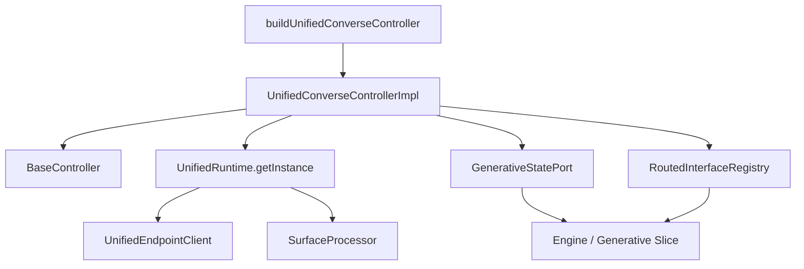

# Design Document: Unified Converse Controller

## Overview

The `UnifiedConverseController` is a conversation controller that mirrors the public API of `ConverseController` but is backed by `UnifiedRuntime` instead of `GenerativeRuntime`. It targets the unified endpoint (v0) and requires a `GenerativeUnifiedInterface`.

The controller is a structural clone of `ConverseController` with these key differences:

1. Accepts `GenerativeUnifiedInterface` instead of `GenerativeInterface`
2. Uses `UnifiedRuntime.getInstance()` instead of `GenerativeRuntime.getInstance()`
3. Exposes a `cancel()` public method (delegating to `UnifiedRuntime.cancel()`)
4. Does NOT call `createHydrateSubInterface` — `UnifiedRuntime` handles hydration internally via its `surfaceProcessor`
5. Passes a no-op `hydrateSubInterface` to satisfy the `UnifiedRuntimeConfig` type (the field is vestigial)

The factory is a separate entry point for clean tree-shaking and straightforward deprecation when the legacy converse endpoint is retired.

## Architecture



The controller sits between the public API consumer and the internal `UnifiedRuntime`. It:
- Creates a `GenerativeStatePort` that dispatches mutations to the generative slice
- Registers hydrated sub-interfaces in the `RoutedInterfaceRegistry`
- Derives controller state via a memoized selector combining state turns with registry entries

## Components and Interfaces

### `buildUnifiedConverseController(options: UnifiedConverseControllerOptions): UnifiedConverseController`

Factory function exported from the controllers barrel.

### `UnifiedConverseControllerOptions`

```typescript
interface UnifiedConverseControllerOptions {
  interface: GenerativeUnifiedInterface;
  conversationToRestore?: SerializedConverseState;
  onSurfaceOperation?: (operations: unknown[]) => void;
}
```

### `UnifiedConverseController`

```typescript
interface UnifiedConverseController extends Controller<UnifiedConverseControllerState> {
  serialize(): SerializedConverseState;
  restore(state: SerializedConverseState): void;
  clear(): void;
  submit(options: {prompt: string}): void;
  cancel(): void;
  selectTurn(options: {id: string}): void;
  retry(options: {id: string}): void;
}
```

### `UnifiedConverseControllerState`

```typescript
interface UnifiedConverseControllerState {
  turns: Turn[];
  activeTurn: Turn | undefined;
  isStreaming: boolean;
}
```

### Internal Implementation: `UnifiedConverseControllerImpl`

Extends `BaseController<UnifiedConverseControllerState>`. Private fields:
- `#runtime: UnifiedRuntime`
- `#actions: ReturnType<typeof getOrCreateGenerativeActions>`
- `#selectors: ReturnType<typeof getOrCreateGenerativeSelectors>`
- `#generativeInterface: GenerativeUnifiedInterface`

### State Port

The `GenerativeStatePort` passed to `UnifiedRuntime.getInstance()` is identical to `ConverseController`'s implementation with one addition:

- `setRoutedInterface` stores `surfaceId` (from unified hydration) in the registry entry alongside `useCase`, `interface`, `snapshot`, and `query`.
- `appendSurface` invokes `onSurfaceOperation` callback when operations are present.

### No-op `hydrateSubInterface`

The `UnifiedRuntimeConfig` type requires a `hydrateSubInterface` field. Since `UnifiedRuntime` handles hydration internally via `createSurfaceProcessor`, the controller passes a no-op:

```typescript
hydrateSubInterface: () => null
```

## Data Models

### Serialization

Reuses existing types from `converse-controller-serialization.ts`:
- `SerializedConverseState`
- `SerializedTurn`
- `SerializedRoutedInterface`

The `hydrateFromSerializedState` logic is duplicated as a private function within the controller module (same as `ConverseController` does today). It maps `SerializedConverseState` → `GenerativeState`, transitioning any `streaming` turns to `error` status with message "Stream was interrupted".

### Registry Entry

Uses the existing `RoutedInterfaceEntry` type with the optional `surfaceId` field:

```typescript
interface RoutedInterfaceEntry {
  useCase: RoutedUseCase;
  interface: UseCaseInterfaceMap[RoutedUseCase];
  snapshot: Record<string, unknown>;
  query: string | undefined;
  surfaceId?: string;
}
```

## Error Handling

| Scenario | Behavior |
|----------|----------|
| Empty/whitespace prompt submitted | `submit()` returns early, no runtime call |
| Submit while streaming | `submit()` returns early, no runtime call |
| `cancel()` with no active stream | No-op (runtime's `cancel()` is safe to call) |
| `retry()` on non-error turn | No-op |
| `retry()` on non-existent turn ID | No-op |
| `selectTurn()` with unknown ID | Active turn unchanged |
| Runtime stream error | Runtime calls `statePort.failTurn()`, turn transitions to error status |

## Testing Strategy

### Why PBT Does Not Apply

The controller is thin glue code that:
- Delegates all streaming logic to `UnifiedRuntime`
- Delegates all state management to the engine via actions/selectors
- Has no pure transformation logic with a large input space

Testing it with 100+ random inputs would not find more bugs than targeted example-based tests. The controller's correctness depends on correct wiring, not on input variation.

### Unit Testing Approach

Mock `UnifiedRuntime.getInstance()` to return a controllable runtime mock. Verify:

1. **Construction**: state port is wired, initial state is correct, `conversationToRestore` hydrates state
2. **`submit()`**: delegates to runtime for valid prompts, rejects empty/whitespace, rejects while streaming
3. **`cancel()`**: delegates to `runtime.cancel()`
4. **`selectTurn()`**: sets active turn for valid IDs, no-op for invalid IDs
5. **`retry()`**: delegates to `runtime.resubmit()` for error turns, no-op otherwise
6. **`serialize()`**: produces correct `SerializedConverseState` including routed interface data
7. **`restore()`**: hydrates state, transitions streaming turns to error
8. **`clear()`**: resets generative slice to empty state
9. **State port wiring**: trigger runtime callbacks and verify engine mutations
10. **`onSurfaceOperation` callback**: invoked when `appendSurface` receives operations

### Integration Points

- Verify the controller does NOT import `GenerativeRuntime`, `createConversationEndpointClient`, or `createHydrateSubInterface` (tree-shaking boundary)
