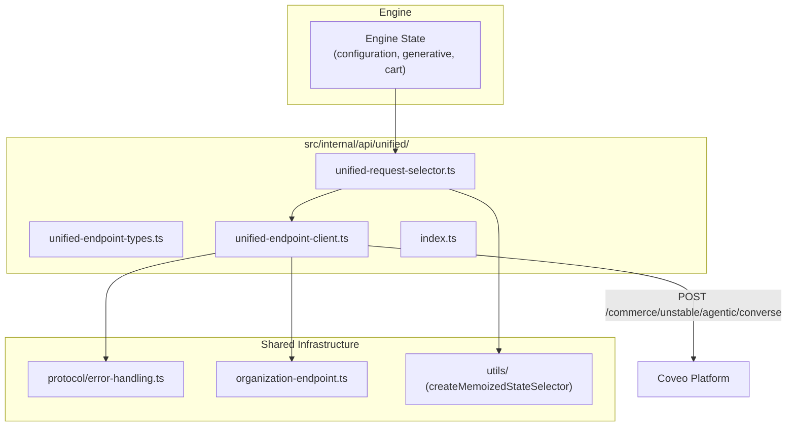

# Design Document: Unified Endpoint Client

## Overview

This design introduces an independent HTTP client for the v0 unified endpoint (AG-UI protocol) in the thermidor package. The module mirrors the architecture of the existing `conversation-endpoint-client` — a factory-created client with a `call` method, a typed request envelope, and a memoized state selector — but targets the AG-UI `UnifiedEndpointRequest` contract instead of the flat converse request shape.

The module lives at `src/internal/api/unified/` with no imports from `src/internal/api/conversation/`, ensuring either module can be deleted independently.

## Architecture



The data flow is:

1. The runtime reads engine state via `unified-request-selector.ts`, producing the raw fields needed for a request.
2. The runtime assembles the full `UnifiedEndpointRequest` envelope (adding session metadata, messages, etc.) and passes it to the client.
3. `unified-endpoint-client.ts` serializes the envelope and POSTs it to the unified endpoint.
4. On success, the client returns a `ReadableStream<Uint8Array>` for SSE processing downstream.

## Components and Interfaces

### 1. Type Definitions (`unified-endpoint-types.ts`)

All type definitions live in a single file. These are pure interfaces/types with no runtime code.

```typescript
// ─── Top-level request envelope ────────────────────────────────────────────

export interface UnifiedEndpointRequest {
  session: UnifiedEndpointSession;
  messages: UnifiedEndpointMessage[];
  requestContext: Record<string, unknown>;
  forwardedProps: Record<string, unknown>;
  agentInput: CommerceRequestModel;
}

export interface UnifiedEndpointSession {
  threadId: string;
  continuationTokens: Record<string, unknown>;
  runId?: string;
  clientMessageId?: string;
}

export interface UnifiedEndpointMessage {
  id: string;
  role: string;
  content: string;
}

// ─── Commerce agent input ──────────────────────────────────────────────────

export interface CommerceRequestModel {
  trackingId: string;
  language: string;
  country: string;
  currency: string;
  clientId?: string;
  message: string | null;
  action: A2uiAction | null;
  conversationSessionId?: string;
  conversationToken?: string;
  context: CommerceRequestContext;
  pinnedProducts: string[];
}

export interface CommerceRequestContext {
  view: { url: string | null; referrer: string | null };
  user: Record<string, unknown>;
  cart: CommerceCartItem[];
  source: string[];
  custom: Record<string, unknown>;
}

export interface CommerceCartItem {
  productId: string;
  name: string;
  price: number;
  quantity: number;
}

// ─── Action envelope ───────────────────────────────────────────────────────

export interface A2uiAction<TContext = unknown> {
  surfaceId: string | null;
  name: string;
  sourceComponentId: string;
  timestamp: string; // ISO-8601
  actionId: string | null;
  wantResponse: boolean;
  context: TContext;
}

// ─── Search action contexts ────────────────────────────────────────────────

export interface ExecuteSearchContext {
  query: string;
  display?: string | null;
  pinnedProducts?: string[];
}

export interface ToggleFacetContext {
  facetId: string;
  value: string;
}

export interface ToggleExcludeFacetContext {
  facetId: string;
  value: string;
}

export interface DeselectAllFacetsContext {
  facetId: string;
}

export interface ToggleNumericFacetContext {
  facetId: string;
  start: number;
  end: number;
  endInclusive: boolean;
}

export interface SetNumericFacetRangeContext {
  facetId: string;
  start: number;
  end: number;
  endInclusive: boolean;
}

export interface SelectPageContext {
  page: number;
}

export interface SetPageSizeContext {
  pageSize: number;
}

export interface SetSortContext {
  sortCriteria: string;
  fields?: SortField[];
}

export interface SortField {
  field: string;
  direction: string;
}

export interface FetchMoreContext {}

export interface RestoreStateContext {
  query?: string;
  facets?: FacetRestore[];
  page: number;
  pageSize: number;
  sortCriteria?: string;
  pinnedProducts?: string[];
}

export interface FacetRestore {
  facetId: string;
  values: string[];
  numericRanges: NumericRange[];
}

export interface NumericRange {
  start: number;
  end: number;
  endInclusive: boolean;
}

export interface OverrideCorrectionContext {
  originalQuery: string;
}

export interface SelectProductsContext {
  productIds: string[];
}

// ─── Suggestion action contexts ────────────────────────────────────────────

export interface FetchSuggestionsContext {
  query: string;
}

export interface FacetSearchContext {
  facetId: string;
  query: string;
}

// ─── Analytics action contexts ─────────────────────────────────────────────

export interface CartActionContext {
  productId: string;
  name?: string;
  price?: number;
  quantity: number;
  action: 'add' | 'remove';
}

export interface ProductClickContext {
  productId: string;
  name?: string;
  price?: number;
  position: number;
}

export interface ProductViewContext {
  productId: string;
  name?: string;
  price?: number;
}

export interface PurchaseContext {
  products: PurchaseProduct[];
  transaction: Transaction;
}

export interface PurchaseProduct {
  productId: string;
  name?: string;
  price?: number;
  quantity: number;
}

export interface Transaction {
  id: string;
  revenue: number;
}
```

**Design decision:** `message` and `action` are typed as `string | null` and `A2uiAction | null` respectively. The mutual exclusivity constraint (exactly one must be non-null) is enforced via documentation and runtime validation in the caller rather than a discriminated union, because the REST contract uses `null` for the absent field rather than omitting it.

### 2. HTTP Client (`unified-endpoint-client.ts`)

Mirrors `conversation-endpoint-client.ts` structurally:

```typescript
export interface UnifiedEndpointClientConfiguration {
  organizationId?: string;
  accessToken?: string;
  endpoint?: string;
}

export interface UnifiedEndpointCallOptions {
  signal?: AbortSignal;
}

export interface UnifiedEndpointResponse {
  stream: ReadableStream<Uint8Array>;
}

export type UnifiedEndpointClientResult =
  | { success: true; data: UnifiedEndpointResponse }
  | { success: false; error: string };

export interface UnifiedEndpointClient {
  call: (
    request: UnifiedEndpointRequest,
    configuration: UnifiedEndpointClientConfiguration,
    options?: UnifiedEndpointCallOptions
  ) => Promise<UnifiedEndpointClientResult>;
}

export function createUnifiedEndpointClient(): UnifiedEndpointClient;
```

**Implementation details:**

- URL: `{organizationEndpoint}/rest/organizations/{orgId}/commerce/unstable/agentic/converse`
- Endpoint resolution: `getOrganizationEndpoint(orgId, { endpoint, endpointType: 'admin' })`
- Headers:
  - `Content-Type: application/json`
  - `Accept: text/event-stream`
  - `Authorization: Bearer {accessToken}`
  - `X-Coveo-Feature-Flags-Overrides: {"cpd-stateful-commerce-enabled":true}`
- Pre-flight checks: return `{ success: false }` early if `organizationId` or `accessToken` is missing
- Success path: `isSuccessResponse(response)` → return `{ success: true, data: { stream: response.body } }`
- Null body guard: if `response.body` is null on a 2xx, return failure
- Error path: `transformError(response)` or `transformError(error)` on catch

**Design decision:** The feature flag header value differs from the conversation client (`cpd-stateful-commerce-enabled` vs `use-demo-agent-core-runtime`). This is the key behavioral distinction and the reason the client cannot simply reuse the conversation client's fetch logic.

### 3. Request Selector (`unified-request-selector.ts`)

Mirrors `conversation-request-selector.ts`:

```typescript
export function createUnifiedEndpointRequestSelector(
  generativeInterface: InterfaceHandle,
  cartInterface: InterfaceHandle
): StateSelector<UnifiedRequestSelectorOutput>;

export interface UnifiedRequestSelectorOutput {
  trackingId: string;
  language: string;
  country: string;
  currency: string;
  message: string;
  cart: CartItem[] | undefined;
  conversationSessionId: string | undefined;
  conversationToken: string | undefined;
}
```

The selector uses `createMemoizedStateSelector` combining:
- `configuration.getTrackingId`
- `configuration.getLanguage`
- `configuration.getCountry`
- `configuration.getCurrency`
- `generative.getActiveMessage`
- `cart.getCartContext`
- `generative.getConversationSessionId`
- `generative.getConversationToken`

The output is the raw data the runtime needs to assemble `CommerceRequestModel.context` and the top-level `agentInput` fields. The runtime is responsible for constructing the full `UnifiedEndpointRequest` envelope (adding `session`, `messages`, `requestContext`, `forwardedProps`, navigator context, etc.).

**Design decision:** The selector intentionally does NOT construct the full `UnifiedEndpointRequest`. Session metadata, messages history, and navigator context are managed by the runtime layer and injected at call time. This keeps the selector pure and focused on engine state.

### 4. Barrel Export (`index.ts`)

```typescript
export { createUnifiedEndpointClient } from './unified-endpoint-client.js';
export type {
  UnifiedEndpointClient,
  UnifiedEndpointClientConfiguration,
  UnifiedEndpointClientResult,
  UnifiedEndpointCallOptions,
} from './unified-endpoint-client.js';
export type {
  UnifiedEndpointRequest,
  UnifiedEndpointSession,
  UnifiedEndpointMessage,
  CommerceRequestModel,
  CommerceRequestContext,
  CommerceCartItem,
  A2uiAction,
  UnifiedEndpointResponse,
  // Search action context types
  ExecuteSearchContext,
  ToggleFacetContext,
  ToggleExcludeFacetContext,
  DeselectAllFacetsContext,
  ToggleNumericFacetContext,
  SetNumericFacetRangeContext,
  SelectPageContext,
  SetPageSizeContext,
  SetSortContext,
  SortField,
  FetchMoreContext,
  RestoreStateContext,
  FacetRestore,
  NumericRange,
  OverrideCorrectionContext,
  SelectProductsContext,
  // Suggestion action context types
  FetchSuggestionsContext,
  FacetSearchContext,
  // Analytics action context types
  CartActionContext,
  ProductClickContext,
  ProductViewContext,
  PurchaseContext,
  PurchaseProduct,
  Transaction,
} from './unified-endpoint-types.js';
export { createUnifiedEndpointRequestSelector } from './unified-request-selector.js';
```

## Data Models

### Engine State → Request Mapping

| Engine State Source | Selector Field | UnifiedEndpointRequest Target |
|---|---|---|
| `configuration.getTrackingId` | `trackingId` | `agentInput.trackingId` |
| `configuration.getLanguage` | `language` | `agentInput.language` |
| `configuration.getCountry` | `country` | `agentInput.country` |
| `configuration.getCurrency` | `currency` | `agentInput.currency` |
| `generative.getActiveMessage` | `message` | `agentInput.message` |
| `cart.getCartContext` | `cart` | `agentInput.context.cart` |
| `generative.getConversationSessionId` | `conversationSessionId` | `agentInput.conversationSessionId` |
| `generative.getConversationToken` | `conversationToken` | `agentInput.conversationToken` |
| Navigator context (runtime) | — | `agentInput.clientId`, `agentInput.context.view`, `agentInput.context.user` |
| Runtime session state | — | `session.threadId`, `session.continuationTokens`, `messages[]` |

### Response Shape

The unified endpoint returns an SSE stream. The client exposes it as `ReadableStream<Uint8Array>`. Downstream event parsing is out of scope for this module (handled by existing event-stream infrastructure or a future unified variant).

## Error Handling

The module reuses existing error-handling infrastructure with no new error types:

| Scenario | Handling |
|---|---|
| Missing `organizationId` | Return `{ success: false, error: "Configuration error: ..." }` before fetch |
| Missing `accessToken` | Return `{ success: false, error: "Configuration error: ..." }` before fetch |
| HTTP 4xx / 5xx | `transformError(response)` from `protocol/error-handling.ts` |
| Network failure | `transformError(error)` catches `TypeError` for fetch failures |
| 2xx with null body | Return `{ success: false, error: "...empty stream response body." }` |
| AbortSignal abort | `fetch` throws `AbortError`, caught and transformed |

No exceptions are thrown — all error paths return `{ success: false, error: string }`.

## Testing Strategy

### Why Property-Based Testing Does Not Apply

This feature is a thin HTTP client + state-to-request field mapping. The logic consists of:
- Conditional early returns for missing config
- A single `fetch` call with fixed URL/header construction
- Direct field passthrough in the selector

There is no complex transformation, parsing, or serialization where input variation would reveal edge cases through randomized testing. Example-based unit tests with mocked fetch provide complete coverage.

### Unit Tests

**`unified-endpoint-client.test.ts`** (mirrors `conversation-endpoint-client.test.ts`):

| Test Case | Validates |
|---|---|
| Returns config error when `organizationId` is missing | Req 2.8 |
| Returns config error when `accessToken` is missing | Req 2.9 |
| Sends POST with correct URL, headers, and body | Req 2.1, 2.2, 2.3, 2.4 |
| Uses custom endpoint when configured | Req 2.1 |
| Returns success with stream on 2xx response | Req 2.5 |
| Returns failure on null response body | Req 2.10 |
| Transforms HTTP error responses into failures | Req 2.6 |
| Transforms thrown errors into failures | Req 2.7 |
| Forwards AbortSignal to fetch | Req 2.11 |

**`unified-request-selector.test.ts`**:

| Test Case | Validates |
|---|---|
| Maps `trackingId` from configuration selectors | Req 3.1 |
| Maps `language`, `country`, `currency` from configuration | Req 3.1 |
| Maps `conversationSessionId` and `conversationToken` from generative | Req 3.2 |
| Maps active message from generative state | Req 3.6 |
| Maps cart context from cart selectors | Req 3.8 |
| Returns memoized output when inputs unchanged | Req 3.5 |

### Test Framework

- Vitest (project standard)
- Mock `fetch` via `vi.stubGlobal`
- No external dependencies needed
