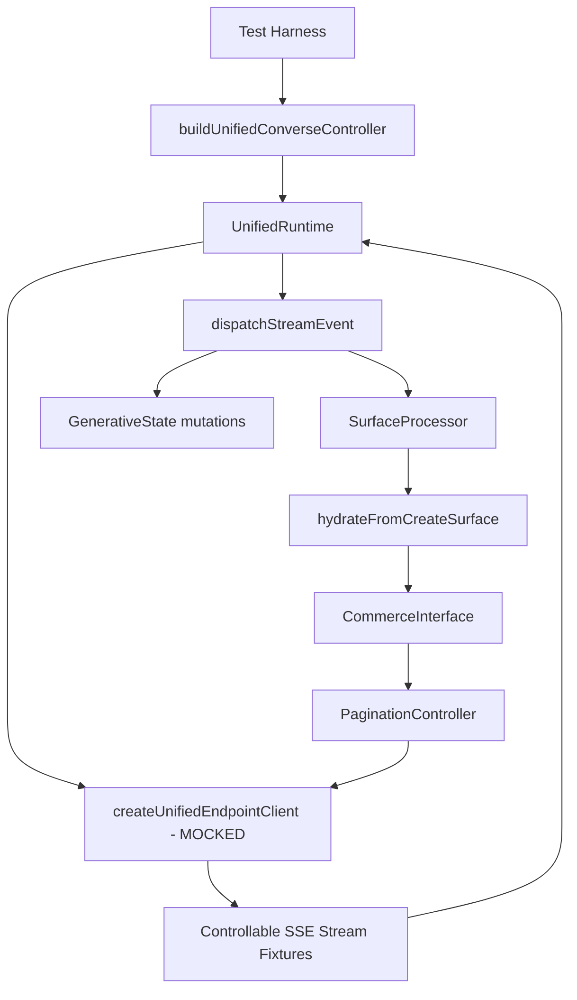

# Design: Unified Endpoint Integration Test

## Overview

This integration test validates the full round-trip flow of the unified endpoint system in thermidor. It exercises `buildUnifiedConverseController` → `UnifiedRuntime` → mocked SSE stream → state mutations → controller state, ensuring all pieces work together when wired through a real `Engine`.

The testing approach mocks only at the network boundary (`createUnifiedEndpointClient`) while keeping all internal state management real. This catches wiring bugs that unit tests of individual components would miss.

## Architecture



The test creates a real `Engine`, configures it with dummy credentials, builds a `GenerativeUnifiedInterface`, and constructs a `UnifiedConverseController`. The only mock is `createUnifiedEndpointClient`, which returns pre-built `ReadableStream<Uint8Array>` fixtures simulating various server responses.

## Components and Interfaces

### SSE Stream Factory

A helper function that converts an array of event descriptors into a `ReadableStream<Uint8Array>` matching the SSE wire format:

```typescript
interface SSEEvent {
  event?: string;  // SSE event: field (e.g., "turn_started", "turn_complete")
  data: string;    // SSE data: field (JSON payload)
}

function createSSEStream(events: SSEEvent[]): ReadableStream<Uint8Array>
```

### Stream Fixtures

Pre-defined event arrays for each test scenario:

1. **Text response fixture** — `turn_started` → `RUN_STARTED` → `TEXT_MESSAGE_START` → `TEXT_MESSAGE_CONTENT` → `TEXT_MESSAGE_END` → `RUN_FINISHED` → `turn_complete`
2. **Surface creation fixture** — `turn_started` → `RUN_STARTED` → `ACTIVITY_SNAPSHOT` (createSurface) → `RUN_FINISHED` → `turn_complete`
3. **Action response fixture** — `turn_started` → `RUN_STARTED` → `ACTIVITY_SNAPSHOT` (updateDataModel) → `RUN_FINISHED` → `turn_complete`
4. **Error fixture** — `turn_started` → `RUN_STARTED` → `RUN_ERROR`
5. **Incomplete stream fixture** — `turn_started` → `RUN_STARTED` → `TEXT_MESSAGE_START` (stream closes without terminal)

### Mock Client Setup

The test mocks `createUnifiedEndpointClient` via `vi.mock()` to return a client whose `call` method returns `{success: true, data: {stream}}` with the appropriate fixture stream for each scenario.

For the surface interaction scenario, the mock needs to respond differently on the second call (the action request from `selectPage`), so it uses `mockReturnValueOnce` chaining.

### Test Engine Configuration

The engine is configured with:
- `organizationId: "test-org"`
- `accessToken: "test-token"`

This satisfies the client's validation checks without hitting real infrastructure.

## Data Models

### Turn State (after text response)

```typescript
{
  turns: [{
    id: string,           // generated UUID
    prompt: "hiking boots",
    status: "complete",
    agentResponse: {
      messages: [{ content: "Here are some hiking boots", role: "assistant" }],
      surfaces: [],
      reasoningSteps: []
    }
  }],
  activeTurn: /* same turn */,
  isStreaming: false
}
```

### Turn State (after surface hydration)

```typescript
{
  turns: [{
    id: string,
    prompt: "show me boots",
    status: "complete",
    routedInterface: {
      useCase: "commerceSearch",
      interface: CommerceInterface  // live, attachable
    },
    agentResponse: { messages: [], surfaces: [...], reasoningSteps: [] }
  }],
  ...
}
```

### Pagination State (after hydration)

```typescript
{
  page: 0,
  pageSize: 20,
  totalCount: 100,
  totalPages: 5
}
```

### Pagination State (after selectPage → updateDataModel)

```typescript
{
  page: 1,
  pageSize: 20,
  totalCount: 100,
  totalPages: 5
}
```

## Error Handling

- **RUN_ERROR** events in the stream → turn transitions to `error` with the error message
- **Premature stream close** (no terminal event) → turn transitions to `error` with "Stream ended without a terminal event."
- **AbortSignal** (cancel) → turn transitions to `error` with "Cancelled"
- **Client failure** (success: false) → turn transitions to `error` with the client error string

## Testing Strategy

### Why Property-Based Testing Does NOT Apply

This integration test validates fixed wiring between components using deterministic fixtures. The behavior doesn't vary meaningfully with random inputs — we're testing that specific SSE event sequences produce specific state transitions. PBT would not find more bugs than the fixed scenarios.

### Test Structure

The test file uses Vitest with `vi.mock()` for the unified endpoint client module. Each scenario is a separate `it()` block within a `describe()` group.

**Test groups:**
1. **Text response round-trip** — verifies prompt → stream → turn state
2. **Surface hydration** — verifies ACTIVITY_SNAPSHOT → routedInterface → PaginationController state
3. **Surface interaction** — verifies selectPage → endpoint call → updateDataModel → state update
4. **Error handling** — verifies RUN_ERROR and premature close produce error turns
5. **Cancel** — verifies cancel aborts and produces "Cancelled" error
6. **Retry** — verifies failed turn → retry → success
7. **Barrel export** — verifies the controller is importable from the public barrel

### Async Handling

Since stream consumption is async, tests use `await` and `vi.waitFor()` or polling on `controller.state` to wait for the stream to be fully consumed before asserting.

### File Location

`packages/thermidor/src/public/controllers/unified-converse/unified-converse-integration.test.ts`
