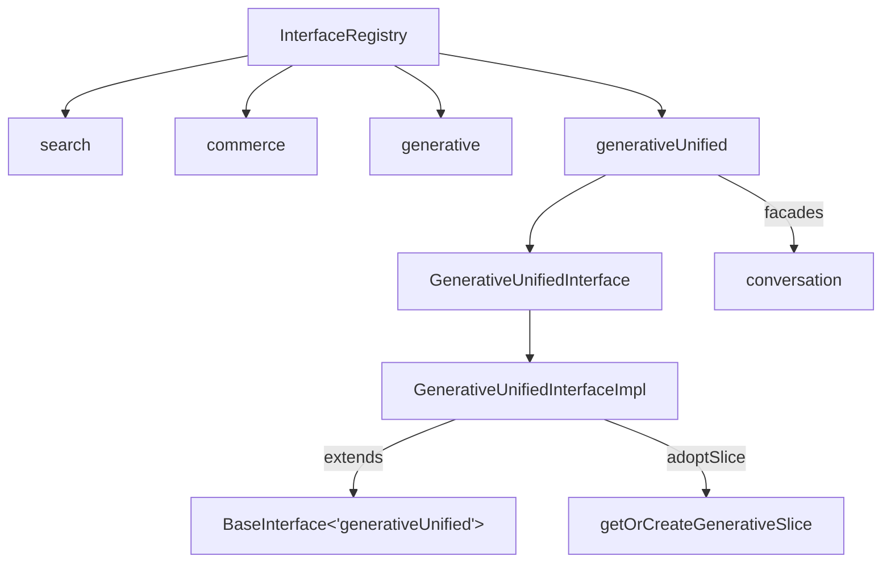

# Design Document: Unified Interface Type

## Overview

This feature registers a new `generativeUnified` interface type in the thermidor package's `InterfaceRegistry`. The new type is structurally parallel to the existing `generative` type but nominally distinct, enabling the type system to differentiate between unified-endpoint interfaces and converse-endpoint interfaces.

The implementation mirrors `GenerativeInterfaceImpl` exactly — same slice adoption, same noop conversation facade resolver — differing only in the registry key (`'generativeUnified'`) and branded interface type (`GenerativeUnifiedInterface`).

## Architecture

The change introduces no new architectural patterns. It extends the existing interface registration mechanism by adding a fourth entry to `InterfaceRegistry`:



File layout:

```
packages/thermidor/src/
├── internal/
│   ├── interfaces/
│   │   ├── generative-unified.ts        ← NEW: impl class
│   │   └── index.ts                     ← MODIFY: add export
│   └── utils/
│       ├── interface-types.ts           ← MODIFY: add registry entry + branded type
│       └── index.ts                     ← MODIFY: add type export
└── public/
    └── interfaces/
        └── generative-unified.ts        ← NEW: factory function
```

## Components and Interfaces

### 1. Type Registration (`internal/utils/interface-types.ts`)

Add to `InterfaceRegistry`:

```typescript
generativeUnified: {interface: GenerativeUnifiedInterface; facades: 'conversation'};
```

Add branded type alongside existing ones:

```typescript
export interface GenerativeUnifiedInterface extends Supports<Facades['generativeUnified']> {}
```

This ensures `GenerativeUnifiedInterface` and `GenerativeInterface` are nominally distinct — both extend `Supports<'conversation'>` but via different registry paths, and the `SupportsBrand` symbol captures the specific facade set per type. Since both resolve `Facades[T]` to `'conversation'` but through different keys, the branded structural types remain incompatible.

### 2. Implementation Class (`internal/interfaces/generative-unified.ts`)

Mirrors `generative.ts` exactly:

```typescript
import {BaseInterface} from '@/src/internal/utils/index.js';
import type {FullEngine} from '@/src/internal/engine/index.js';
import type {
  FacadeResolverFactory,
  Facades,
  GenerativeUnifiedInterface,
} from '@/src/internal/utils/index.js';
import {createNoopThunk} from '@/src/internal/utils/index.js';
import {getOrCreateGenerativeSlice} from '@/src/internal/features/generative/index.js';

const noopThunk = createNoopThunk('generativeUnified');

const noopResolverFactory: FacadeResolverFactory = (_engine) => (_scope) => noopThunk;

const resolverFactories: Record<Facades['generativeUnified'], FacadeResolverFactory> = {
  conversation: noopResolverFactory,
};

export class GenerativeUnifiedInterfaceImpl
  extends BaseInterface<'generativeUnified'>
  implements GenerativeUnifiedInterface
{
  constructor(engine: FullEngine, stateId: string) {
    super(engine, stateId, 'generativeUnified', resolverFactories);
    engine.adoptSlice(getOrCreateGenerativeSlice(this));
  }
}
```

### 3. Public Factory (`public/interfaces/generative-unified.ts`)

Mirrors `public/interfaces/generative.ts`:

```typescript
import {Engine, getFullEngine} from '@/src/internal/engine/index.js';
import {generateId} from '@/src/internal/utils/index.js';
import type {GenerativeUnifiedInterface} from '@/src/internal/utils/index.js';
import {GenerativeUnifiedInterfaceImpl} from '@/src/internal/interfaces/index.js';

export type {GenerativeUnifiedInterface} from '@/src/internal/utils/index.js';

export interface BuildGenerativeUnifiedInterfaceOptions {
  engine: Engine;
  id?: string;
}

export function buildGenerativeUnifiedInterface(
  options: BuildGenerativeUnifiedInterfaceOptions
): GenerativeUnifiedInterface {
  const fullEngine = getFullEngine(options.engine);
  const interfaceId = options.id ?? generateId();

  return new GenerativeUnifiedInterfaceImpl(fullEngine, interfaceId);
}
```

### 4. Barrel Exports

**`internal/interfaces/index.ts`** — add:

```typescript
export {GenerativeUnifiedInterfaceImpl} from './generative-unified.js';
```

**`internal/utils/index.ts`** — add `GenerativeUnifiedInterface` to the type export list from `interface-types.js`:

```typescript
export type {
  // ... existing types ...
  GenerativeUnifiedInterface,
} from './interface-types.js';
```

## Data Models

No new data models. The `GenerativeUnifiedInterfaceImpl` reuses the existing `GenerativeSlice` (same Redux Toolkit slice that manages turns, session tokens, etc.) via `getOrCreateGenerativeSlice`. The shared slice is intentional: both interface types manage the same conversational state shape, just connected to different backend endpoints.

## Error Handling

All error handling is inherited from `BaseInterface`:

| Scenario | Behavior |
|----------|----------|
| Facade resolution after dispose | Throws `'Cannot operate on a disposed interface.'` |
| Double dispose | No-op (idempotent) |
| Engine operations after dispose | Interface removed from engine, no further interactions |

No new error paths are introduced.

## Testing Strategy

### Why Property-Based Testing Does Not Apply

This feature is a type registration and class mirroring exercise. The acceptance criteria are overwhelmingly:

- **Compile-time type checks** (registry shape, type branding, non-assignability) — verified by TypeScript compilation
- **Concrete behavioral assertions** (adoptSlice called, dispose sets flag, facade resolves) — verified with example-based unit tests

There is no novel algorithmic logic, no parser/serializer, no transformation function with a meaningful input space. The single candidate (unique ID generation, requirement 4.2) tests the existing `generateId` utility rather than new code. PBT would add no value here.

### Unit Tests (`internal/interfaces/generative-unified.test.ts`)

Following the pattern established in `commerce.test.ts`:

| Test | Validates |
|------|-----------|
| Construction calls `engine.adoptSlice` with the generative slice | Req 3.2 |
| `resolveFacades('conversation')` returns a thunk | Req 3.3 |
| `.dispose()` sets `.disposed` to `true` | Req 5.1 |
| `.dispose()` calls `engine.removeInterface` | Req 5.2 |
| Double `.dispose()` is idempotent (no throw, removeInterface called once) | Req 5.3 |
| Facade resolution after dispose throws | Req 5.4 |

### Type-Level Tests (compile-time assertions)

A type test file using `@ts-expect-error` directives:

| Assertion | Validates |
|-----------|-----------|
| `const _: InterfaceType = 'generativeUnified'` compiles | Req 1.2 |
| `const _: Facades['generativeUnified'] = 'conversation'` compiles | Req 1.3 |
| Assigning `GenerativeUnifiedInterface` to `GenerativeInterface` fails | Req 2.2 |
| Assigning `GenerativeInterface` to `GenerativeUnifiedInterface` fails | Req 2.3 |

### Build Verification

Successful `pnpm run build` of the thermidor package verifies:
- Registry entry exists (Req 1.1)
- Branded type extends `Supports<'conversation'>` (Req 2.1)
- Class extends `BaseInterface<'generativeUnified'>` (Req 3.1)
- Factory return type satisfies `GenerativeUnifiedInterface` (Req 4.3)
- All barrel exports are correct (Req 6.1, 6.2, 6.3)
