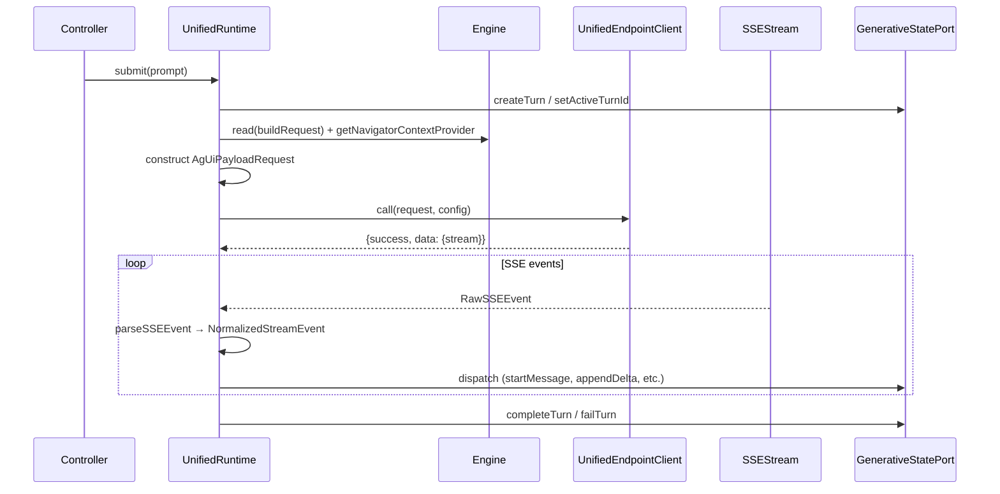
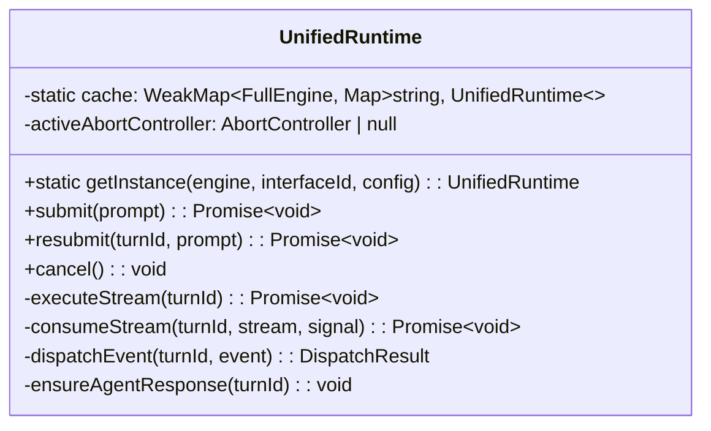
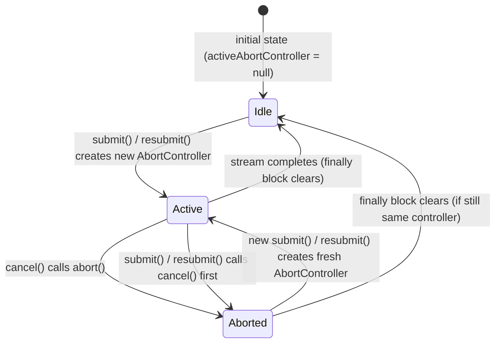

# Design Document: UnifiedRuntime

## Overview

The `UnifiedRuntime` is a stream-processing runtime that sends prompts to the Coveo unified endpoint (v0 AG-UI protocol) and dispatches SSE events to the `GenerativeStatePort`. It mirrors `GenerativeRuntime`'s structural patterns (singleton caching, turn lifecycle, state port dispatch) but operates on a different request envelope (`AgUiPayloadRequest`) and has critical differences in terminal-event semantics — most notably, `RUN_FINISHED` is non-terminal.

The runtime is a thin orchestration layer:
1. Build a request envelope from engine state
2. Send it via the unified endpoint client
3. Consume the SSE stream
4. Dispatch each parsed event to the appropriate state port method

## Architecture



### Singleton Caching



Identical WeakMap + Map pattern as `GenerativeRuntime`. The WeakMap keys on engine (garbage-collected when engine is dropped), and the inner Map keys on `interfaceId`.

## Components and Interfaces

### UnifiedRuntime (class)

**Location:** `packages/thermidor/src/internal/api/unified/unified-runtime.ts`

**Dependencies (runtime):**
- `readEventStream` from `@/src/internal/api/protocol/stream.js`
- `parseSSEEvent` from `@/src/internal/api/protocol/sse-parser.js`
- `createUnifiedEndpointClient` from `./unified-endpoint-client.js`
- `createUnifiedEndpointRequestSelector` from `./unified-request-selector.js`
- `getOrCreateConfigurationSelectors` from `@/src/internal/features/configuration/index.js`
- `generateId` from `@/src/internal/utils/index.js`

**Dependencies (type-only):**
- `NormalizedStreamEvent`, `RawSSEEvent` from `@/src/internal/api/protocol/stream-types.js`
- `FullEngine` from `@/src/internal/engine/index.js`
- `InterfaceHandle` from `@/src/internal/utils/index.js`
- `GenerativeStatePort`, `HydrateSubInterface` from `@/src/internal/api/generative/index.js`
- `AgUiPayloadRequest` from `./unified-endpoint-types.js`

**Hard boundary:** NEVER imports from `@/src/internal/api/conversation/`.

### UnifiedRuntimeConfig (interface)

```typescript
export interface UnifiedRuntimeConfig {
  statePort: GenerativeStatePort;
  hydrateSubInterface: HydrateSubInterface;
  generativeInterface: InterfaceHandle;
  cartInterface: InterfaceHandle;
}
```

Mirrors `GenerativeRuntimeConfig`. The `hydrateSubInterface` is accepted for future Task 4 compatibility but unused in this task.

### Event Dispatch Result

```typescript
interface DispatchResult {
  turnId: string;
  isTerminal: boolean;
}
```

Internal type returned by `dispatchEvent` to signal whether stream consumption should stop.

## Data Models

### Request Envelope Construction

The runtime reads engine state via `createUnifiedEndpointRequestSelector` and constructs an `AgUiPayloadRequest`:

| Field | Source |
|-------|--------|
| `session.threadId` | `conversationSessionId` or `generateId()` |
| `session.clientMessageId` | `generateId()` |
| `session.continuationTokens` | `{}` |
| `messages[0]` | `{id: generateId(), role: 'user', content: prompt}` |
| `agentInput.trackingId` | Engine state |
| `agentInput.language` | Engine state |
| `agentInput.country` | Engine state |
| `agentInput.currency` | Engine state |
| `agentInput.clientId` | Navigator context |
| `agentInput.message` | Current prompt |
| `agentInput.action` | `null` |
| `agentInput.conversationSessionId` | Engine state |
| `agentInput.conversationToken` | Engine state |
| `agentInput.context.view` | Navigator context (`url`, `referrer`) |
| `agentInput.context.user` | Navigator context (`userAgent`) |
| `agentInput.context.cart` | Engine state (cart selector) |
| `agentInput.context.source` | `[]` |
| `agentInput.context.custom` | `{}` |
| `agentInput.pinnedProducts` | `[]` |

### Event Dispatch Table

| Event Type | State Port Call(s) | Terminal? |
|------------|-------------------|-----------|
| `turn_started` | `setConversationSession` | No |
| `TEXT_MESSAGE_START` | `ensureAgentResponse` → `startMessage` | No |
| `TEXT_MESSAGE_CONTENT` | `ensureAgentResponse` → `appendMessageDelta` | No |
| `TEXT_MESSAGE_END` | (no-op) | No |
| `REASONING_MESSAGE_START` | `ensureAgentResponse` → `startReasoning` | No |
| `REASONING_MESSAGE_CONTENT` | `ensureAgentResponse` → `appendReasoningDelta` | No |
| `REASONING_MESSAGE_END` | `endReasoning` | No |
| `TOOL_CALL_START` | `ensureAgentResponse` → `startToolCall` | No |
| `TOOL_CALL_ARGS` | `appendToolCallArgs` | No |
| `TOOL_CALL_END` | (no-op) | No |
| `TOOL_CALL_RESULT` | `completeToolCall` | No |
| `ACTIVITY_SNAPSHOT` | `ensureAgentResponse` → `appendSurface` | No |
| `RUN_STARTED` | (ignored) | No |
| `RUN_FINISHED` | (ignored) | **No** |
| `STATE_SNAPSHOT` | (ignored) | No |
| `CUSTOM` | (ignored) | No |
| `turn_complete` | `setConversationSession` → `completeTurn` | **Yes** |
| `RUN_ERROR` | `failTurn` | **Yes** |
| `error` (gateway) | `setConversationSession` → `failTurn` | **Yes** |
| unknown | (ignored) | No |

### Critical Difference from GenerativeRuntime

`GenerativeRuntime` treats `RUN_FINISHED` as terminal (calls `completeTurn`). `UnifiedRuntime` ignores it because the unified protocol uses a multi-run model where `RUN_FINISHED` signals the end of one agent run within a turn, but the turn itself continues until `turn_complete`.

### Gateway `error` Event Dispatch

The gateway `error` event is distinct from `RUN_ERROR`. It is a gateway-level failure event that carries session data and an error object:

```typescript
case 'error': {
  // Gateway-level error event (distinct from RUN_ERROR)
  // Payload: {conversationSessionId, conversationToken, error: {message?, code?}}
  if (event.conversationSessionId || event.conversationToken) {
    this.statePort.setConversationSession(event.conversationSessionId, event.conversationToken);
  }
  const errorObj = (event as Record<string, unknown>).error;
  const message = (typeof errorObj === 'object' && errorObj !== null && 'message' in errorObj)
    ? String((errorObj as {message: unknown}).message)
    : 'A gateway error occurred.';
  this.statePort.failTurn(turnId, message);
  return {turnId, isTerminal: true};
}
```

## Abort/Cancel Support

The `UnifiedRuntime` supports aborting an in-flight stream via an `AbortController`. The `cancel()` method is the public entry point; `submit()` and `resubmit()` also implicitly cancel any active stream before starting a new one.

### AbortController Lifecycle



### cancel() Method

```typescript
cancel(): void {
  if (this.activeAbortController) {
    this.activeAbortController.abort();
    this.activeAbortController = null;
  }
}
```

When no stream is active (`activeAbortController` is `null`), `cancel()` is a no-op.

### submit() / resubmit() Integration

Both methods call `this.cancel()` as their first action, aborting any previous in-flight stream before starting a new one. This ensures at most one active stream exists at any time.

### executeStream Changes

```typescript
private async executeStream(turnId: string): Promise<void> {
  const abortController = new AbortController();
  this.activeAbortController = abortController;

  try {
    // ... build request ...
    const result = await client.call(request, clientConfig, { signal: abortController.signal });

    if (!result.success) {
      this.statePort.failTurn(turnId, result.error);
      return;
    }

    await this.consumeStream(turnId, result.data.stream, abortController.signal);
  } catch (error) {
    if (isAbortError(error)) {
      this.statePort.failTurn(turnId, 'Cancelled');
      return;
    }
    this.statePort.failTurn(turnId, getErrorMessage(error));
  } finally {
    if (this.activeAbortController === abortController) {
      this.activeAbortController = null;
    }
  }
}
```

The `finally` block only clears `activeAbortController` if it still points to the same controller. This prevents a race where a new `submit()` call has already replaced the controller.

### consumeStream Changes

The `signal` is forwarded to `readEventStream` so that stream reading is also interrupted on abort:

```typescript
private async consumeStream(turnId: string, stream: ReadableStream<Uint8Array>, signal: AbortSignal): Promise<void> {
  let activeTurnId = turnId;
  let terminalEventReceived = false;

  await readEventStream({
    stream,
    signal,
    onEvent: (rawEvent) => { /* ... same ... */ },
    onDone: () => { /* ... same ... */ },
    onError: (error) => {
      if (!terminalEventReceived) {
        if (isAbortError(error)) {
          this.statePort.failTurn(activeTurnId, 'Cancelled');
        } else {
          this.statePort.failTurn(activeTurnId, getErrorMessage(error));
        }
      }
    },
  });
}
```

### isAbortError Utility

```typescript
function isAbortError(error: unknown): boolean {
  return error instanceof Error && error.name === 'AbortError';
}
```

Detects the standard `AbortError` thrown by `fetch` and stream readers when an `AbortSignal` is triggered.

## Error Handling

| Scenario | Behavior |
|----------|----------|
| Unified client returns `{success: false}` | `statePort.failTurn(turnId, error)` |
| Exception during `executeStream` | Caught, `statePort.failTurn(turnId, getErrorMessage(error))` |
| Stream ends without terminal event | `onDone` callback calls `statePort.failTurn(turnId, 'Stream ended without a terminal event.')` |
| `RUN_ERROR` event received | `statePort.failTurn(turnId, event.message \|\| default)` |
| Gateway `error` event received | `setConversationSession` + `statePort.failTurn(turnId, message)` |
| `onError` callback (stream read error) | `statePort.failTurn(turnId, getErrorMessage(error))` if no terminal event yet |
| `cancel()` called during active stream | AbortController aborted, `statePort.failTurn(turnId, 'Cancelled')` |
| AbortError caught in `executeStream` | `statePort.failTurn(turnId, 'Cancelled')` |
| AbortError in `onError` callback | `statePort.failTurn(activeTurnId, 'Cancelled')` if no terminal event yet |
| `cancel()` called with no active stream | No-op (no state port calls) |

The `getErrorMessage` utility handles `Error` instances, plain strings, and unknown values with a descriptive fallback.

## Testing Strategy

### Why Property-Based Testing Does Not Apply

The `UnifiedRuntime` is a state machine with deterministic event → state-port-call mappings. The behavior doesn't vary meaningfully with random inputs — each event type has a fixed dispatch path. The value of testing lies in verifying the correct mapping for each event type and the lifecycle edge cases (terminal events, missing terminal events, error paths). This is best covered by example-based unit tests with mocked dependencies.

### Unit Testing Approach

**Framework:** Vitest

**Mocking strategy:**
- Mock `GenerativeStatePort` — all methods as `vi.fn()`
- Mock `createUnifiedEndpointClient` — return controllable `UnifiedEndpointClientResult`
- Mock `readEventStream` or provide a real `ReadableStream` that emits known SSE sequences
- Mock `engine.read()` and `engine.getNavigatorContextProvider()`

**Test scenarios:**

1. **Text message flow**: submit → TEXT_MESSAGE_START → TEXT_MESSAGE_CONTENT (×N) → TEXT_MESSAGE_END → turn_complete
2. **Reasoning flow**: submit → REASONING_MESSAGE_START → REASONING_MESSAGE_CONTENT → REASONING_MESSAGE_END → turn_complete
3. **Tool call flow**: submit → TOOL_CALL_START → TOOL_CALL_ARGS → TOOL_CALL_END → TOOL_CALL_RESULT → turn_complete
4. **Activity snapshot**: submit → ACTIVITY_SNAPSHOT → turn_complete
5. **RUN_ERROR is terminal**: submit → RUN_ERROR → stream ends (no additional dispatch)
6. **RUN_FINISHED is NOT terminal**: submit → RUN_FINISHED → TEXT_MESSAGE_START → turn_complete (verifies events continue after RUN_FINISHED)
7. **Stream ends without terminal**: submit → TEXT_MESSAGE_CONTENT → stream ends → failTurn called
8. **Client error**: client.call returns `{success: false}` → failTurn called immediately
9. **Exception during executeStream**: engine.read throws → failTurn called
10. **Singleton caching**: same engine+interfaceId → same instance; different → different instance
11. **Resubmit lifecycle**: resubmit clears previous response and resets agent response initialization
12. **Agent response idempotency**: multiple events in same turn → `initAgentResponse` called once
13. **turn_started / turn_complete session updates**: conversation session/token set correctly
14. **Navigator context absent**: `null` values used for view/user fields
15. **Ignored events**: RUN_STARTED, STATE_SNAPSHOT, CUSTOM, unknown types produce no state port calls
16. **cancel() aborts active stream**: cancel() during active stream → AbortController.abort() called → failTurn with 'Cancelled'
17. **cancel() no-op when idle**: cancel() with no active stream → no state port calls, no errors
18. **submit() aborts previous stream**: submit() while stream active → previous stream aborted, new stream starts
19. **resubmit() aborts previous stream**: resubmit() while stream active → previous stream aborted, new stream starts
20. **AbortError from fetch**: client.call throws AbortError → failTurn with 'Cancelled'
21. **AbortError from stream reading**: readEventStream onError receives AbortError → failTurn with 'Cancelled'
22. **activeAbortController cleanup**: after stream completes normally, activeAbortController is null
23. **Gateway error event**: submit → `error` event with message → turn fails with gateway error message, session updated

**File:** `packages/thermidor/src/internal/api/unified/unified-runtime.test.ts`
