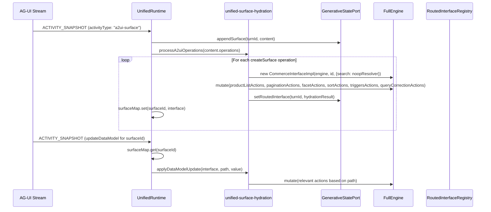

# Design Document: Unified Surface Hydration

## Overview

This feature enhances the `UnifiedRuntime` to hydrate live `CommerceInterface` instances from `ACTIVITY_SNAPSHOT` events when `activityType === "a2ui-surface"`. The unified endpoint streams surface operations (`createSurface`, `updateDataModel`) that contain structured commerce data. Instead of only storing these as opaque surfaces, the runtime now also creates fully functional sub-interfaces with populated state, enabling existing controllers (pagination, facets, sort) to attach and render results.

The approach is a dual-write: every `ACTIVITY_SNAPSHOT` is still stored as an opaque surface for UI rendering, but `a2ui-surface` snapshots additionally trigger hydration logic that creates and populates a `CommerceInterface`.

## Architecture



The runtime maintains a local `Map<string, InterfaceHandle>` (`surfaceMap`) to track hydrated interfaces by `surfaceId`. This allows `updateDataModel` operations to find and update the correct interface without requiring registry lookups by surfaceId.

## Components and Interfaces

### New Module: `unified-surface-hydration.ts`

Located at `packages/thermidor/src/internal/api/unified/unified-surface-hydration.ts`.

Responsible for:
1. Parsing `a2ui-surface` operation arrays
2. Hydrating `CommerceInterface` instances from `createSurface` payloads
3. Applying incremental updates from `updateDataModel` operations

### Types

```typescript
interface A2uiSurfaceContent {
  operations: A2uiOperation[];
}

type A2uiOperation =
  | {createSurface: CreateSurfacePayload}
  | {updateDataModel: UpdateDataModelPayload}
  | {updateComponents: unknown}
  | {actionResponse: unknown};

interface CreateSurfacePayload {
  surfaceId: string;
  catalogId?: string;
  surfaceProperties?: Record<string, unknown>;
  sendDataModel?: boolean;
  components?: unknown[];
  dataModel?: Record<string, unknown>;
}

interface UpdateDataModelPayload {
  surfaceId: string;
  path: string;
  value: unknown;
}
```

### Exported Functions

```typescript
export function hydrateFromCreateSurface(
  engine: FullEngine,
  payload: CreateSurfacePayload
): UnifiedHydrationResult | null;

export function applyDataModelUpdate(
  engine: FullEngine,
  iface: InterfaceHandle,
  path: string,
  value: unknown
): void;

export function isA2uiSurface(event: NormalizedStreamEvent): boolean;

export function extractA2uiOperations(
  content: Record<string, unknown>
): A2uiOperation[];
```

### Implementation Detail: `applyDataModelUpdate`

```typescript
export function applyDataModelUpdate(
  engine: FullEngine,
  iface: InterfaceHandle,
  path: string,
  value: unknown
): void {
  if (path === '/') {
    // Full model replacement — run the complete response handler
    const handleResponse = createCommerceSearchEndpointResponseHandler(iface);
    handleResponse(engine, value as CommerceSearchResponse);
    return;
  }

  // Section-level updates
  switch (path) {
    case '/products':
      // dispatch productListActions.setProductsFromResponse(value)
      break;
    case '/pagination':
      // dispatch pagination actions (totalCount, firstResult, pageSize)
      break;
    case '/facets':
      // dispatch facetActions.updateFromResponse(value)
      break;
    case '/sort':
      // dispatch sortActions.updateFromResponse(value)
      break;
    case '/triggers':
      // dispatch triggersActions.setTriggers(value)
      break;
    case '/queryCorrection':
      // dispatch queryCorrectionActions.setQueryCorrection(value)
      break;
    default:
      break; // Unknown paths (e.g., /responseId) silently ignored
  }
}
```

### Modified: `UnifiedRuntime`

New private fields:
- `surfaceMap: Map<string, InterfaceHandle>` — tracks hydrated surfaces by surfaceId

Modified `ACTIVITY_SNAPSHOT` handler:
```typescript
case 'ACTIVITY_SNAPSHOT': {
  this.ensureAgentResponse(turnId);
  const content = event.content as Record<string, unknown>;
  
  // Always store as opaque surface
  this.statePort.appendSurface(turnId, content);
  
  // If a2ui-surface, also hydrate
  if (event.activityType === 'a2ui-surface' && content.operations) {
    this.processA2uiOperations(turnId, content.operations as A2uiOperation[]);
  }
  
  return {turnId, isTerminal: false};
}
```

New private method:
```typescript
private processA2uiOperations(turnId: string, operations: A2uiOperation[]): void {
  for (const op of operations) {
    if ('createSurface' in op) {
      // Dispose existing interface if surfaceId already exists (re-creation)
      const existingIface = this.surfaceMap.get(op.createSurface.surfaceId);
      if (existingIface) {
        existingIface.dispose();
      }

      const result = hydrateFromCreateSurface(this.engine, op.createSurface);
      if (result) {
        this.surfaceMap.set(result.surfaceId, result.interface);
        this.statePort.setRoutedInterface(turnId, {
          useCase: result.useCase,
          interface: result.interface,
          snapshot: result.snapshot,
          query: result.query,
        });
      }
    } else if ('updateDataModel' in op) {
      const iface = this.surfaceMap.get(op.updateDataModel.surfaceId);
      if (iface) {
        applyDataModelUpdate(
          this.engine, iface, op.updateDataModel.path, op.updateDataModel.value
        );
      }
    }
  }
}
```

### Modified: `RoutedInterfaceEntry`

Add optional `surfaceId` field:
```typescript
export interface RoutedInterfaceEntry {
  useCase: RoutedUseCase;
  interface: UseCaseInterfaceMap[RoutedUseCase];
  snapshot: Record<string, unknown>;
  query: string | undefined;
  surfaceId?: string;
}
```

### Noop Facade Resolver

```typescript
function createNoopSearchFacadeResolver(): FacadeResolverFactory {
  const noopThunk = createNoopThunk('unified-surface-search');
  return (_engine) => (_scope) => noopThunk;
}
```

Uses the existing `createNoopThunk` utility from `@/src/internal/utils/index.js`.

## Data Models

### `UnifiedHydrationResult`

Returned by `hydrateFromCreateSurface`:

```typescript
interface UnifiedHydrationResult {
  surfaceId: string;
  useCase: 'commerceSearch';
  interface: CommerceInterface;
  snapshot: Record<string, unknown>;
  query: undefined;
}
```

The `query` is always `undefined` for surface-based hydration — the query context comes from the conversational prompt, not the surface data.

### Path Mapping for `updateDataModel`

The `path` field in `UpdateDataModelPayload` is a JSON-pointer-like string. The mapping:

| Path | Action |
|------|--------|
| `/` | Full response handler (treats value as complete CommerceSearchResponse) |
| `/products` | `productListActions.setProductsFromResponse(value)` |
| `/pagination` | pagination actions (totalCount, firstResult, pageSize) |
| `/facets` | `facetActions.updateFromResponse(value)` |
| `/sort` | `sortActions.updateFromResponse(value)` |
| `/triggers` | `triggersActions.setTriggers(value)` |
| `/queryCorrection` | `queryCorrectionActions.setQueryCorrection(value)` |

Unknown paths (e.g., `/responseId`) are silently ignored. The `/responseId` path is informational and has no state mapping in the client.

> **Surface Lifecycle Note:** Surfaces are NOT long-lived across turns. Each turn produces its own operations. The `surfaceMap` persists across the runtime's lifetime for within-turn `updateDataModel` targeting, but the server may re-create surfaces with new `createSurface` operations in subsequent turns. The client handles this via the re-creation logic (dispose old, create new).

## Correctness Properties

*A property is a characteristic or behavior that should hold true across all valid executions of a system — essentially, a formal statement about what the system should do. Properties serve as the bridge between human-readable specifications and machine-verifiable correctness guarantees.*

### Property Reflection

After reviewing the prework, several acceptance criteria (1.2–1.7) can be combined into a single comprehensive hydration property since they all test the same operation (hydration) on different fields of the same input. Similarly, 2.2 and 2.3 are subsumed by verifying the full entry structure. 6.1 and 6.2 can be combined into a single "multiple surfaces" property. 7.1 and 7.2 combine into a single re-creation property (dispose + replace is one atomic operation).

### Property 1: Hydration produces correct state from dataModel

*For any* valid `CreateSurfacePayload` with a non-null `dataModel` containing products, pagination, facets, sort, triggers, and optionally queryCorrection, hydrating from that payload SHALL produce a `CommerceInterface` whose state reflects all fields of the input dataModel.

**Validates: Requirements 1.1, 1.2, 1.3, 1.4, 1.5, 1.6, 1.7**

### Property 2: Hydration registration includes surfaceId and correct entry shape

*For any* valid `CreateSurfacePayload` with a non-null `dataModel` and a surfaceId, the resulting `RoutedInterfaceEntry` SHALL have `useCase` set to `"commerceSearch"`, the interface instance, the dataModel as snapshot, and the `surfaceId` from the payload.

**Validates: Requirements 2.2, 2.3**

### Property 3: Dual-write — a2ui-surface always stores opaque surface and hydrates

*For any* `ACTIVITY_SNAPSHOT` event with `activityType === "a2ui-surface"` and valid operations, the runtime SHALL both call `appendSurface` with the full content AND produce hydrated interfaces. For non-a2ui-surface activity types, only `appendSurface` is called.

**Validates: Requirements 4.1, 4.2**

### Property 4: Multiple createSurface operations produce independent interfaces

*For any* `ACTIVITY_SNAPSHOT` containing N `createSurface` operations (N >= 1), the runtime SHALL produce exactly N hydrated `CommerceInterface` instances, each registered with its respective `surfaceId`.

**Validates: Requirements 6.1, 6.2**

### Property 5: updateDataModel applies state changes to existing interfaces

*For any* hydrated interface identified by `surfaceId` and any valid `updateDataModel` operation targeting that surfaceId with a known path, the interface's state SHALL be updated to reflect the new value.

**Validates: Requirements 3.1**

### Property 6: Surface re-creation disposes old interface and registers new one

*For any* surfaceId that already has a hydrated interface in the surface tracking map, receiving a new `createSurface` operation with the same surfaceId SHALL dispose the old interface and replace the entry in the map with the newly created interface.

**Validates: Requirements 7.1, 7.2**

## Error Handling

| Scenario | Behavior |
|----------|----------|
| `createSurface` with no `dataModel` | Return `null`, skip hydration for that operation |
| Re-creation of existing surfaceId | Dispose old interface, create new one |
| `updateDataModel` for unknown `surfaceId` | Silently ignore (no error thrown) |
| `updateDataModel` with unknown `path` (e.g., `/responseId`) | Silently ignore (no state mutation) |
| `updateDataModel` with path `/` | Treated as full model replacement — re-runs complete response handler |
| Non-a2ui-surface `ACTIVITY_SNAPSHOT` | Store as opaque surface only, no hydration attempted |
| Operations array contains `updateComponents` or `actionResponse` | Silently skip (not handled in this task) |

No exceptions are thrown from hydration logic. Failures are silently skipped to maintain stream processing stability.

## Testing Strategy

### Approach

- **Unit tests** (Vitest): Verify specific examples, edge cases, and integration with the runtime dispatch logic using mocked engine/state-port.
- **Property tests** (Vitest + fast-check): Verify universal properties across generated inputs for the hydration logic.

### Unit Tests

1. `createSurface` with valid full dataModel → interface has correct state
2. `createSurface` with missing dataModel → returns null
3. `createSurface` with empty products/facets/triggers arrays → state reflects empty arrays
4. `updateDataModel` with `/products` path → product list updated
5. `updateDataModel` with `/pagination` path → pagination updated
6. `updateDataModel` with unknown path (e.g., `/responseId`) → no-op
7. `updateDataModel` for unknown surfaceId → no-op, no error
8. Non-a2ui-surface ACTIVITY_SNAPSHOT → only appendSurface called
9. Multiple createSurface operations → multiple interfaces registered
10. Noop facade resolver → does nothing on invocation
11. `createSurface` with already-existing surfaceId → disposes old interface and registers new one
12. `updateDataModel` with path `/` → runs full response handler
13. `updateDataModel` with path `/responseId` → silently ignored

### Property Tests

Property-based testing library: **fast-check** (already available in the monorepo).

Each property test runs a minimum of 100 iterations.

- **Property 1**: Generate random `CommerceSearchResponse`-shaped objects, hydrate, verify all state fields match input.
  - Tag: `Feature: unified-surface-hydration, Property 1: Hydration produces correct state from dataModel`
- **Property 2**: Generate random payloads with surfaceIds, verify entry structure.
  - Tag: `Feature: unified-surface-hydration, Property 2: Hydration registration includes surfaceId and correct entry shape`
- **Property 3**: Generate random events with varying activityTypes, verify dual-write vs single-write behavior.
  - Tag: `Feature: unified-surface-hydration, Property 3: Dual-write — a2ui-surface always stores opaque surface and hydrates`
- **Property 4**: Generate random counts (1-5) of createSurface operations, verify N interfaces produced.
  - Tag: `Feature: unified-surface-hydration, Property 4: Multiple createSurface operations produce independent interfaces`
- **Property 5**: Hydrate, then generate random updates to known paths, verify state reflects update.
  - Tag: `Feature: unified-surface-hydration, Property 5: updateDataModel applies state changes to existing interfaces`
- **Property 6**: Generate random surfaceIds, hydrate an interface, then send a new createSurface with the same surfaceId, verify old is disposed and new is registered.
  - Tag: `Feature: unified-surface-hydration, Property 6: Surface re-creation disposes old interface and registers new one`
