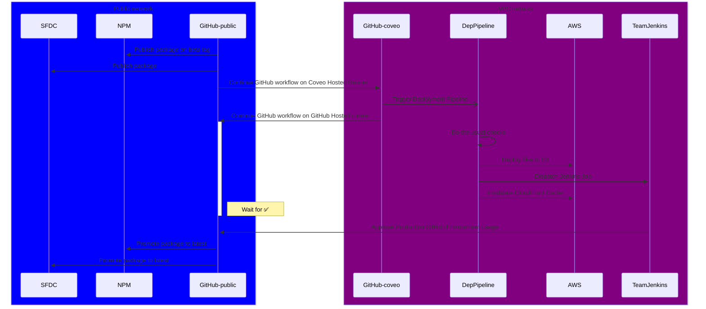

# Release processes

This repository contains two release processes, which are triggered on Git commits:

## 1. The pre-release process

The purpose of the pre-release process is to publish new changes from the main branch as frequently as possible. This has two main benefits:

1. This tests whether we broke some parts of the release process so we don't get surprises when we need a scheduled release.
2. This enables implementers to test a new feature or fix before we trigger a scheduled release.

To achieve its purpose, the pre-release process is executed on every new commit on the main branch. Additionally, pre-releases do not commit anything to the main branch, which allows them to be deployed even if multiple features are merged on the main branch faster than the CI can release them.

## 2. The scheduled release process

The purpose of the scheduled release process is to deploy versions of our packages that we feel confident are safe for implementers to use.

To achieve that purpose, every Wednesday, a scheduled release is triggered, which will request approval to deploy. Additionally, whenever we feel like the version currently on the main branch is safe, we may trigger a scheduled release by triggering the "Create release" workflow.

Whenever a scheduled release is successful, a commit is pushed to the main branch which bumps the version of every publishable package in the repo.

# Versioning & publishing to NPM

Versions for any given commit are determined based on the [conventional commits](https://www.conventionalcommits.org/en/v1.0.0/) specification.

Specifically, a commit will determine its version by looking for the last scheduled release version and bumping it based on how breaking the changes are between then and the current commit. This ensures that implementers can safely update their dependencies on our packages without unexpectedly causing errors.

When triggered, releases processes will execute a series of [Turborepo tasks](https://turbo.build/repo/docs/core-concepts/monorepos/running-tasks). Some tasks are run at the root of the repository, and some will be run on each individual package.

## `release:phase0` (lock the main branch)

This task is only run for the scheduled release.

The purpose of this task is to lock the main branch, preventing users from merging pull requests while the release is in progress.

Specifically, this prevents new fixes or features from getting merged between the current release and the version bump commit we're about to push. If fixes or features were merged before the upcoming version bump, they would not be taken into account when calculating versions for the next releases.

This task accomplishes its purpose by:

1. Committing a `.git-lock` file to the main branch.
2. Updating the repository's settings to enable "Require branches to be up to date before merging" for the main branch.

## `release:phase1`

### Sub-phase 1: Bump package versions

This task is run individually on every package, in topological order (dependencies first, then dependants).

The purpose of this sub-phase is to update the `package.json` file of every package to contain their new version and their new dependencies. This serves multiple purposes:

1. NPM publishing.
   - When publishing packages to NPM, NPM determines the version of the package by looking at its `package.json` file.
2. NPM Workspaces linking.
   - NPM Workspaces creates a [symbolic link](https://en.wikipedia.org/wiki/Symbolic_link) between a package and its dependencies when they are part of the same repository. NPM Workspaces won't link packages if the `version` field of the dependency doesn't match the version specified in the `dependencies` field of the dependant package.
3. Waterfall bumping.
   - Bumping dependencies directly in `package.json` means that packages can determine whether they need to be bumped by just looking at their own `package.json`.

On pre-releases, the first ten digits of the commit hash will be appended to the version like so:

- `1.2.3` -> `1.2.3-pre.abcdef1234`

Additionally, this task will update the `CHANGELOG.md` file of the package to contain the changes that were taken into account when bumping its version.

This task does not make any changes to the `package-lock.json` file at the root of the repository, since doing so would cause [an error with NPM Workspaces](https://github.com/npm/cli/issues/5506).

### Sub-phase 2: build

The purpose of this sub-phase is to re-build a project right after it was bumped and before it gets published. This is needed because many packages contain information about their own version in their compiled code.

## `release:phase2` (bump the root version)

This phase bumps the root package.json version. This is used by the deployment-package `--version` attribute.

## `release:phase3` (publish npm)

This workflow works on the assumption that we can't bump a package's version if any of its dependencies isn't published to NPM. The purpose of this task is to publish packages to NPM before dependant packages bump their versions.

If a package is already published to NPM, this task will exit without error. After a package is published, this task will repeatedly query NPM until it confirms that the package exists in the registry.

## `release:phase4` (commit version bumps)

This task is only run for the scheduled release.

This task will create a new "version bump" commit, which will contain:

- The new `package.json` files.
- The new `CHANGELOG.md` files.
- Git tags for each bumped package version.

This task will also revert the changes from `release:phase0` to allow merging new features and fixes.

# Deploying

> [!NOTE]
> Probably out-of-date

After the release is completed on Git, GitHub and NPM, the release workflow will start a job on a Coveo-Hosted-runners to trigger the deployment pipeline.
From there on, the process then follows this diagram (starting with 'Continue GitHub workflow on Coveo Hosted Runner):

