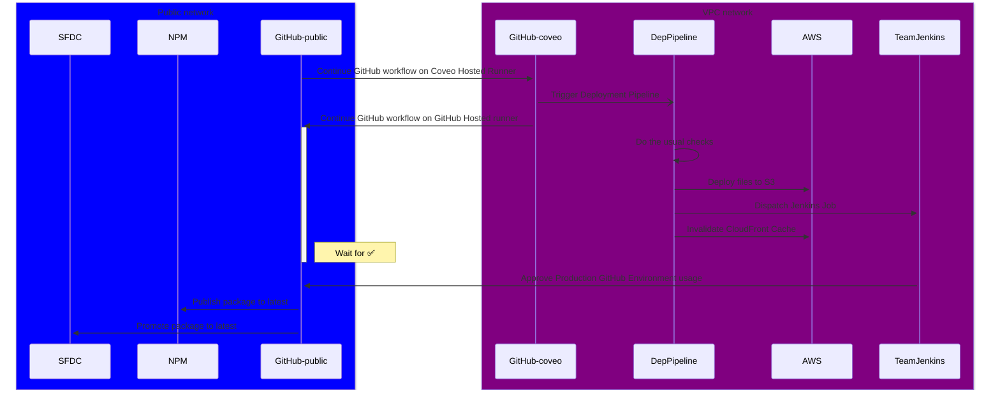

# Release Process

This repository uses [Changesets](https://github.com/changesets/changesets) for versioning and publishing.

## How It Works

On every push to `main`, the [changesets/action](https://github.com/changesets/action) in `.github/workflows/cd.yml` checks for pending changeset files:

1. **If changeset files exist** → The action creates or updates a "Version Packages" PR that bumps versions and updates changelogs.
2. **If no changeset files exist** (i.e., the Version Packages PR was just merged) → The action builds and publishes all bumped packages to npm.

## Release Flow

```
Developer creates PR with code changes + changeset file (pnpm changeset)
  → PR reviewed and merged to main
  → cd.yml triggers: changesets/action detects pending .changeset/*.md files
  → Action creates/updates "Version Packages" PR (bumps versions, updates CHANGELOGs)
  → Team reviews and merges the Version Packages PR
  → cd.yml triggers again: no changesets pending → runs pnpm run release
  → changeset publish: publishes to npm + creates git tags
  → Post-publish jobs: CDN deploy, Quantic SFDX promote, typedoc, docs notify
```

## Post-Publish Pipeline

After a successful publish, the following jobs run (gated on `published == 'true'`):

| Job | Environment | Purpose |
|-----|-------------|---------|
| `cdn-prod` | — | Dispatches CDN deployment to ui-kit-cd |
| `npm-prod` | NPM Production | Publishes packages to npm `@latest` tag |
| `quantic-prod` | Quantic Production | Promotes Salesforce SFDX package |
| `typedoc-headless` | — | Builds and uploads Headless TypeDoc |
| `typedoc-headless-react` | — | Builds and uploads Headless React TypeDoc |
| `docs-prod` | Docs Production | Notifies documentation system |

## Version Packages PR

The "Version Packages" PR is automatically created and maintained by `changesets/action`. It:

- Bumps `version` fields in affected `package.json` files
- Updates `CHANGELOG.md` files with entries from changeset files
- Uses `commitMode: github-api` to create verified (GPG-signed) commits

**Important**: When merging the Version Packages PR, ensure it is **up-to-date with main** and **first in the merge queue** to avoid version conflicts.

## Versioning

Version bumps are determined by changeset files, not commit messages. Each changeset specifies:

- Which packages are affected
- The bump type (`patch`, `minor`, or `major`)
- A human-readable description for the changelog

Internal workspace dependencies are automatically bumped as `patch` when their dependencies change (`updateInternalDependencies: "patch"` in `.changeset/config.json`).

# Deploying

After the release is completed on Git, GitHub and NPM, the release workflow will start a job on a Coveo-Hosted-runners to trigger the deployment pipeline.
From there on, the process then follows this diagram (starting with 'Continue GitHub workflow on Coveo Hosted Runner):


```mermaid
sequenceDiagram
   box blue Public network
   participant SFDC
   participant NPM
   participant GitHub-public
   end
   box purple VPC network
   participant GitHub-coveo
   participant DepPipeline
   participant AWS
   participant TeamJenkins
   end
   GitHub-public->>+GitHub-coveo: Continue GitHub workflow on Coveo Hosted Runner
   GitHub-coveo-)DepPipeline: Trigger Deployment Pipeline
   GitHub-coveo->>+GitHub-public: Continue GitHub workflow on GitHub Hosted runner
   activate GitHub-public
   DepPipeline->>DepPipeline: Do the usual checks
   DepPipeline->>+AWS: Deploy files to S3
   DepPipeline->>+TeamJenkins: Dispatch Jenkins Job
   DepPipeline->>+AWS: Invalidate CloudFront Cache
   Note right of GitHub-public: Wait for ✅
   deactivate GitHub-public
   TeamJenkins->>+GitHub-public: Approve Production GitHub Environment usage
   GitHub-public->>+NPM: Publish package to latest
   GitHub-public->>+SFDC: Promote package to latest
```
