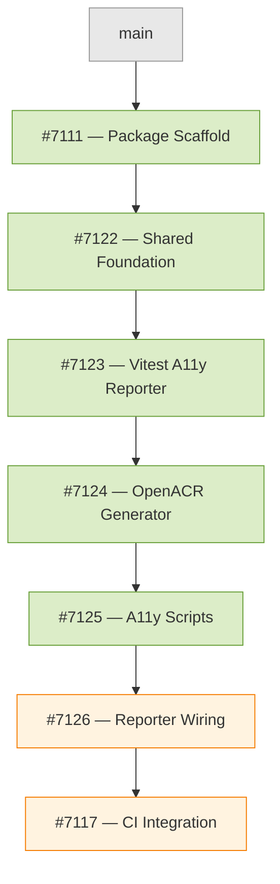

# PR Dependency Graph — `@coveo/atomic-a11y`

This chain of PRs implements the `@coveo/atomic-a11y` package for automated WCAG 2.2 AA accessibility auditing of Atomic components.

## Merge Order

PRs must be reviewed and merged **in order** (top to bottom). Each PR targets the one above it.

## PR Details

| # | PR | Branch | Description |
|---|-----|--------|-------------|
| 1 | [#7111](https://github.com/coveo/ui-kit/pull/7111) | `feat/a11y-package-scaffold` | Package scaffolding: `package.json`, `tsconfig.json`, workspace config |
| 2 | [#7122](https://github.com/coveo/ui-kit/pull/7122) | `feat/a11y-shared-foundation` | Shared types, constants, and utilities used across all modules |
| 3 | [#7123](https://github.com/coveo/ui-kit/pull/7123) | `feat/a11y-reporter` | `VitestA11yReporter` — captures axe-core results from Storybook tests |
| 4 | [#7124](https://github.com/coveo/ui-kit/pull/7124) | `feat/a11y-openacr` | OpenACR report generator — produces VPAT/Section 508 compliance docs |
| 5 | [#7125](https://github.com/coveo/ui-kit/pull/7125) | `feat/a11y-scripts` | CLI scripts: `generate-report`, `generate-openacr`, `ai-wcag-audit` |
| 6 | [#7126](https://github.com/coveo/ui-kit/pull/7126) | `feat/a11y-reporter-wiring` | Wires `VitestA11yReporter` into `packages/atomic` vitest storybook config |
| 7 | [#7117](https://github.com/coveo/ui-kit/pull/7117) | `feat/a11y-ci-integration` | Weekly a11y scan workflow for automated monitoring |
