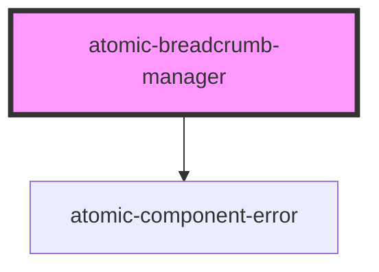

# atomic-breadcrumb-manager

A component that creates breadcrumbs that display the currently active facet values.
<!-- Auto Generated Below -->

## Properties

| Property            | Attribute            | Description                                                             | Type     | Default |
| ------------------- | -------------------- | ----------------------------------------------------------------------- | -------- | ------- |
| `categoryDivider`   | `category-divider`   | Character that divides each path segment in a category facet breadcrumb | `string` | `'/'`   |
| `collapseThreshold` | `collapse-threshold` | Number of breadcrumbs to be shown before collapsing.                    | `number` | `5`     |

## Shadow Parts

| Part                                                               | Description                                         |
| ------------------------------------------------------------------ | --------------------------------------------------- |
| `"breadcrumb"`                                                     | An individual breadcrumb                            |
| `"breadcrumb-button"`                                              | A button element for all types of breadcrumb values |
| `"breadcrumb-clear"`                                               | The clear button for a single breadcrumb value      |
| `"breadcrumb-clear-all"`                                           | The clear all breadcrumbs button                    |
| `"breadcrumb-label"`                                               | The label for the breadcrumb's title                |
| `"breadcrumb-value"`                                               |                                                     |
| `"breadcrumb-value-label"`                                         | The label for a single breadcrumb value             |
| `"breadcrumb-wrapper"`                                             |                                                     |
| `"breadcrumb-wrapper = The wrapper for a single breadcrumb value"` |                                                     |
| `"breadcrumbs"`                                                    | The container for all types of breadcrumbs          |

## CSS Custom Properties

| Name                     | Description                                                |
| ------------------------ | ---------------------------------------------------------- |
| `--max-breadcrumb-width` | Maximum width of a breadcrumb before the text is truncated |

## Dependencies

### Depends on

- [atomic-component-error](../atomic-component-error)

### Graph

----------------------------------------------

*Built with [StencilJS](https://stenciljs.com/)*
