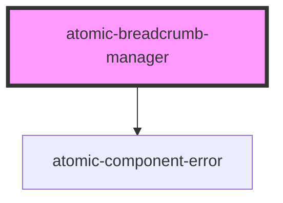

# atomic-breadcrumb-manager

<!-- Auto Generated Below -->

## Properties

| Property            | Attribute            | Description | Type     | Default |
| ------------------- | -------------------- | ----------- | -------- | ------- |
| `categoryDivider`   | `category-divider`   |             | `string` | `'/'`   |
| `collapseThreshold` | `collapse-threshold` |             | `number` | `5`     |

## Shadow Parts

| Part                          | Description                                          |
| ----------------------------- | ---------------------------------------------------- |
| `"breadcrumb-button"`         | Button element for all types of breadcrumb           |
| `"breadcrumb-label"`          | Label for the breadcrumb's title                     |
| `"breadcrumb-value"`          | Breadcrumb list element for all types of breadcrumbs |
| `"breadcrumbs"`               | Container for all types of breadcrumbs               |
| `"category-breadcrumb-value"` | Breadcrumb list element for category breadcrumbs     |

## Dependencies

### Depends on

- [atomic-component-error](../atomic-component-error)

### Graph

----------------------------------------------

*Built with [StencilJS](https://stenciljs.com/)*
