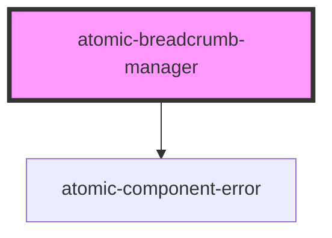

# atomic-breadcrumb-manager

A component that creates breadcrumbs that display the currently active facet values.
<!-- Auto Generated Below -->

## Properties

| Property            | Attribute            | Description                                                             | Type     | Default |
| ------------------- | -------------------- | ----------------------------------------------------------------------- | -------- | ------- |
| `categoryDivider`   | `category-divider`   | Character that divides each path segment in a category facet breadcrumb | `string` | `'/'`   |
| `collapseThreshold` | `collapse-threshold` | Number of breadcrumbs to be shown before collapsing.                    | `number` | `5`     |

## Shadow Parts

| Part                     | Description                                       |
| ------------------------ | ------------------------------------------------- |
| `"breadcrumb"`           | An individual breadcrumb                          |
| `"breadcrumb-clear-all"` | The clear all breadcrumbs button                  |
| `"breadcrumb-label"`     | Label for the breadcrumb's label                  |
| `"breadcrumbs"`          | The list of breadcrumb values following the label |

## Dependencies

### Depends on

- [atomic-component-error](../atomic-component-error)

### Graph

----------------------------------------------

*Built with [StencilJS](https://stenciljs.com/)*
