# atomic-component-error

<!-- Auto Generated Below -->

## Properties

| Property             | Attribute | Description | Type    | Default     |
| -------------------- | --------- | ----------- | ------- | ----------- |
| `error` _(required)_ | --        |             | `Error` | `undefined` |

## Dependencies

### Used by

 - [atomic-category-facet](../atomic-category-facet)
 - [atomic-date-facet](../atomic-date-facet)
 - [atomic-did-you-mean](../atomic-did-you-mean)
 - [atomic-facet](../atomic-facet)
 - [atomic-history](../atomic-history)
 - [atomic-numeric-facet](../atomic-numeric-facet)
 - [atomic-pager](../atomic-pager)
 - [atomic-query-error](../atomic-query-error)
 - [atomic-query-summary](../atomic-query-summary)
 - [atomic-result-list](../atomic-result-list)
 - [atomic-results-per-page](../atomic-results-per-page)
 - [atomic-search-box](../atomic-search-box)
 - [atomic-search-interface](../atomic-search-interface)
 - [atomic-sort-dropdown](../atomic-sort-dropdown)

### Graph

```mermaid
graph TD;
  atomic-category-facet --> atomic-component-error
  atomic-date-facet --> atomic-component-error
  atomic-did-you-mean --> atomic-component-error
  atomic-facet --> atomic-component-error
  atomic-history --> atomic-component-error
  atomic-numeric-facet --> atomic-component-error
  atomic-pager --> atomic-component-error
  atomic-query-error --> atomic-component-error
  atomic-query-summary --> atomic-component-error
  atomic-result-list --> atomic-component-error
  atomic-results-per-page --> atomic-component-error
  atomic-search-box --> atomic-component-error
  atomic-search-interface --> atomic-component-error
  atomic-sort-dropdown --> atomic-component-error
  style atomic-component-error fill:#f9f,stroke:#333,stroke-width:4px
```

----------------------------------------------

*Built with [StencilJS](https://stenciljs.com/)*
