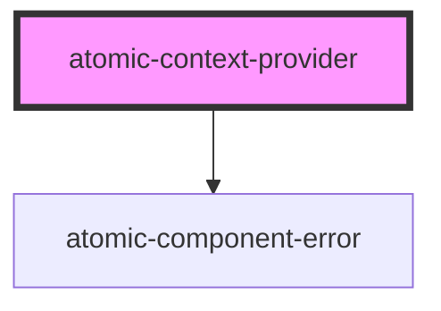

# atomic-context-provider

<!-- Auto Generated Below -->

## Properties

| Property  | Attribute | Description | Type     | Default |
| --------- | --------- | ----------- | -------- | ------- |
| `context` | `context` |             | `string` | `'{}'`  |

## Dependencies

### Depends on

- [atomic-component-error](../atomic-component-error)

### Graph

----------------------------------------------

*Built with [StencilJS](https://stenciljs.com/)*
