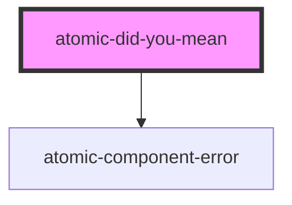

# atomic-did-you-mean

<!-- Auto Generated Below -->

## Shadow Parts

| Part               | Description                                               |
| ------------------ | --------------------------------------------------------- |
| `"auto-corrected"` | The text displayed for the automatically corrected query. |
| `"correction-btn"` | The button used to manually correct a query.              |
| `"highlight"`      | The query highlights.                                     |
| `"no-results"`     | The text displayed when there are no results.             |

## Dependencies

### Depends on

- [atomic-component-error](../atomic-component-error)

### Graph

----------------------------------------------

*Built with [StencilJS](https://stenciljs.com/)*
