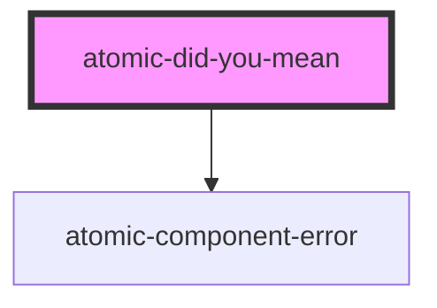

# atomic-did-you-mean

<!-- Auto Generated Below -->

## Dependencies

### Depends on

- [atomic-component-error](../atomic-component-error)

### Graph

---

_Built with [StencilJS](https://stenciljs.com/)_
