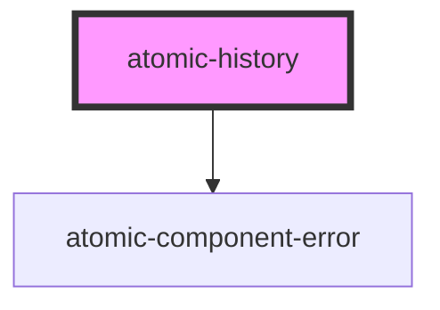

# atomic-history

<!-- Auto Generated Below -->

## Properties

| Property | Attribute | Description | Type                                  | Default     |
| -------- | --------- | ----------- | ------------------------------------- | ----------- |
| `engine` | --        |             | `Engine<SearchAppState> \| undefined` | `undefined` |

## Dependencies

### Depends on

- [atomic-component-error](../atomic-component-error)

### Graph

----------------------------------------------

*Built with [StencilJS](https://stenciljs.com/)*
