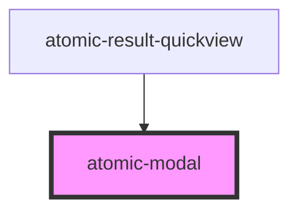

# atomic-modal

<!-- Auto Generated Below -->

## Properties

| Property             | Attribute | Description | Type         | Default     |
| -------------------- | --------- | ----------- | ------------ | ----------- |
| `close` _(required)_ | --        |             | `() => void` | `undefined` |

## Dependencies

### Used by

 - [atomic-result-quickview](../result-template-components/atomic-result-quickview)

### Graph

----------------------------------------------

*Built with [StencilJS](https://stenciljs.com/)*
