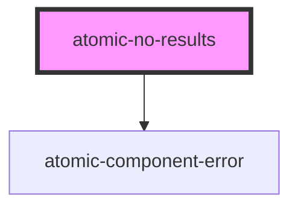

# atomic-no-results

<!-- Auto Generated Below -->

## Properties

| Property                 | Attribute                   | Description                                                          | Type      | Default |
| ------------------------ | --------------------------- | -------------------------------------------------------------------- | --------- | ------- |
| `enableCancelLastAction` | `enable-cancel-last-action` | Whether to display a button which cancels the last available action. | `boolean` | `true`  |
| `enableSearchTips`       | `enable-search-tips`        | Whether to display a list of search tips to the user.                | `boolean` | `true`  |

## Shadow Parts

| Part                  | Description                     |
| --------------------- | ------------------------------- |
| `"cancel-button"`     | The "Cancel last action" button |
| `"tips-list"`         | The tips list                   |
| `"tips-list-element"` | The tips list elements          |
| `"tips-title"`        | The "Search tips" title         |

## Dependencies

### Depends on

- [atomic-component-error](../atomic-component-error)

### Graph

----------------------------------------------

*Built with [StencilJS](https://stenciljs.com/)*
