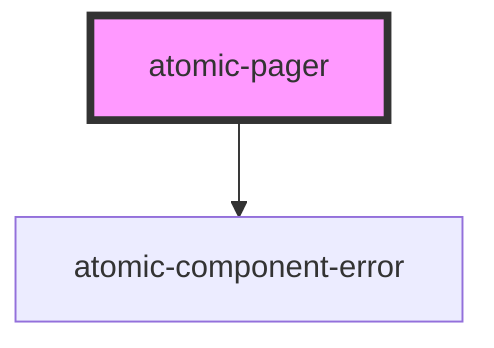

# atomic-pager

<!-- Auto Generated Below -->

## Slots

| Slot            | Description                |
| --------------- | -------------------------- |
| `"back-button"` | Content of the back button |
| `"next-button"` | Content of the next button |

## Shadow Parts

| Part                   | Description            |
| ---------------------- | ---------------------- |
| `"active-page-button"` | The active page button |
| `"back-button"`        | The back button        |
| `"list"`               | The list of buttons    |
| `"next-button"`        | The next button        |
| `"page-button"`        | The page button        |

## CSS Custom Properties

| Name                               | Description             |
| ---------------------------------- | ----------------------- |
| `--atomic-pagination-active-color` | Pagination active color |
| `--atomic-pagination-border-color` | Pagination border color |

## Dependencies

### Depends on

- [atomic-component-error](../atomic-component-error)

### Graph

----------------------------------------------

*Built with [StencilJS](https://stenciljs.com/)*
