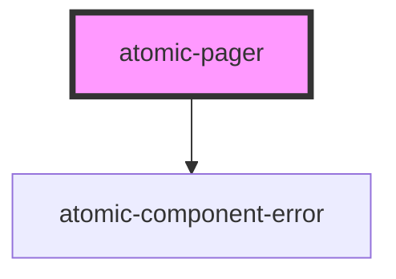

# atomic-pager

<!-- Auto Generated Below -->

## Properties

| Property        | Attribute         | Description                                              | Type     | Default |
| --------------- | ----------------- | -------------------------------------------------------- | -------- | ------- |
| `numberOfPages` | `number-of-pages` | Specifies how many page buttons to display in the pager. | `number` | `5`     |

## Shadow Parts

| Part                   | Description             |
| ---------------------- | ----------------------- |
| `"active-page-button"` | The active page button. |
| `"buttons"`            | The list of buttons.    |
| `"next-button"`        | The next button.        |
| `"page-button"`        | The page button.        |
| `"previous-button"`    | The previous button.    |

## CSS Custom Properties

| Name                                       | Description                                 |
| ------------------------------------------ | ------------------------------------------- |
| `--atomic-pagination-button-border-radius` | The border radius of the pagination button. |
| `--atomic-pagination-button-size`          | The size of the pagination buttons.         |
| `--atomic-pagination-font-size`            | The font size of the pagination button.     |

## Dependencies

### Depends on

- [atomic-component-error](../atomic-component-error)

### Graph

----------------------------------------------

*Built with [StencilJS](https://stenciljs.com/)*
