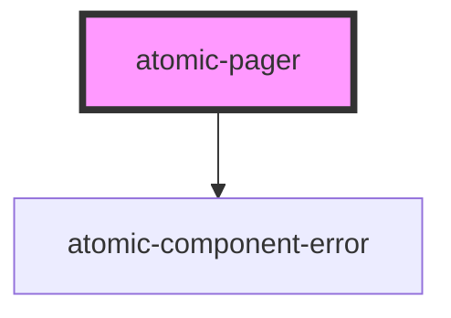

# atomic-pager

<!-- Auto Generated Below -->

## Properties

| Property                  | Attribute                   | Description                                                                                                      | Type      | Default |
| ------------------------- | --------------------------- | ---------------------------------------------------------------------------------------------------------------- | --------- | ------- |
| `enableNavigationButtons` | `enable-navigation-buttons` | Specifies whether the **Previous** and **Next** buttons should appear at each end of the pager when appropriate. | `boolean` | `true`  |
| `numberOfPages`           | `number-of-pages`           | Specifies how many page buttons to display in the pager.                                                         | `number`  | `5`     |

## Shadow Parts

| Part                   | Description            |
| ---------------------- | ---------------------- |
| `"active-page-button"` | The active page button |
| `"buttons"`            | The list of buttons    |
| `"next-button"`        | The next button        |
| `"page-button"`        | The page button        |
| `"previous-button"`    | The previous button    |

## CSS Custom Properties

| Name                                       | Description                            |
| ------------------------------------------ | -------------------------------------- |
| `--atomic-pagination-button-border-radius` | Border radius of the pagination button |
| `--atomic-pagination-button-size`          | Size of the pagination buttons         |
| `--atomic-pagination-font-size`            | Font size of the pagination            |

## Dependencies

### Depends on

- [atomic-component-error](../atomic-component-error)

### Graph

---

_Built with [StencilJS](https://stenciljs.com/)_
