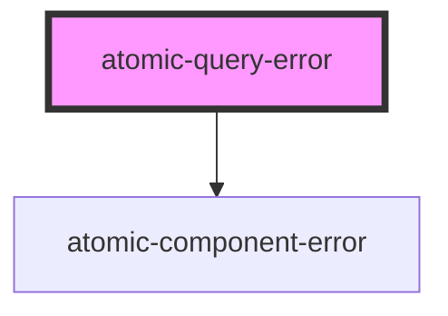

# atomic-query-error

<!-- Auto Generated Below -->

## Shadow Parts

| Part              | Description                                       |
| ----------------- | ------------------------------------------------- |
| `"description"`   | A description of the error.                       |
| `"doc-link"`      | A relevant documentation link.                    |
| `"error-info"`    | The additional error information.                 |
| `"more-info-btn"` | The button allowing to display error information. |
| `"title"`         | The title of the error.                           |

## Dependencies

### Depends on

- [atomic-component-error](../atomic-component-error)

### Graph

----------------------------------------------

*Built with [StencilJS](https://stenciljs.com/)*
