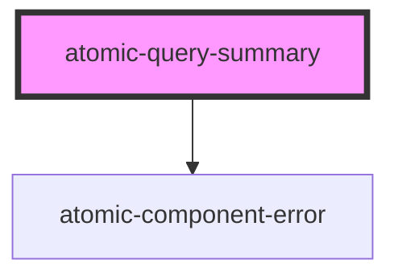

# atomic-query-summary

<!-- Auto Generated Below -->

## Properties

| Property         | Attribute         | Description                                                  | Type      | Default |
| ---------------- | ----------------- | ------------------------------------------------------------ | --------- | ------- |
| `enableDuration` | `enable-duration` | Whether to display the duration of the last query execution. | `boolean` | `true`  |

## Shadow Parts

| Part            | Description                                                                    |
| --------------- | ------------------------------------------------------------------------------ |
| `"container"`   | The container for the whole summary.                                           |
| `"duration"`    | The container for the duration.                                                |
| `"highlight"`   | The summary highlights.                                                        |
| `"no-results"`  | The container for when there are no results.                                   |
| `"placeholder"` | The query summary placeholder used while the search interface is initializing. |
| `"results"`     | The container for the results.                                                 |

## Dependencies

### Depends on

- [atomic-component-error](../atomic-component-error)

### Graph

----------------------------------------------

*Built with [StencilJS](https://stenciljs.com/)*
