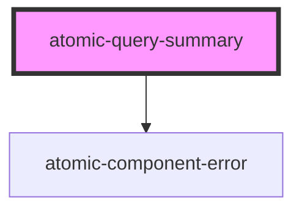

# atomic-query-summary

<!-- Auto Generated Below -->

## Properties

| Property         | Attribute         | Description                                                  | Type      | Default |
| ---------------- | ----------------- | ------------------------------------------------------------ | --------- | ------- |
| `enableDuration` | `enable-duration` | Whether to display the duration of the last query execution. | `boolean` | `true`  |

## Shadow Parts

| Part           | Description                             |
| -------------- | --------------------------------------- |
| `"container"`  | The container of the whole summary      |
| `"duration"`   | The duration container                  |
| `"highlight"`  | The summary highlights                  |
| `"no-results"` | The container when there are no results |
| `"results"`    | The results container                   |

## CSS Custom Properties

| Name                                     | Description            |
| ---------------------------------------- | ---------------------- |
| `--atomic-query-summary-highlight-color` | Color of the highlight |

## Dependencies

### Depends on

- [atomic-component-error](../atomic-component-error)

### Graph

----------------------------------------------

*Built with [StencilJS](https://stenciljs.com/)*
